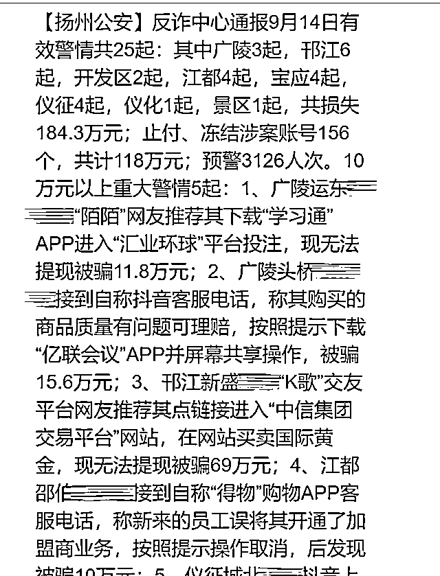
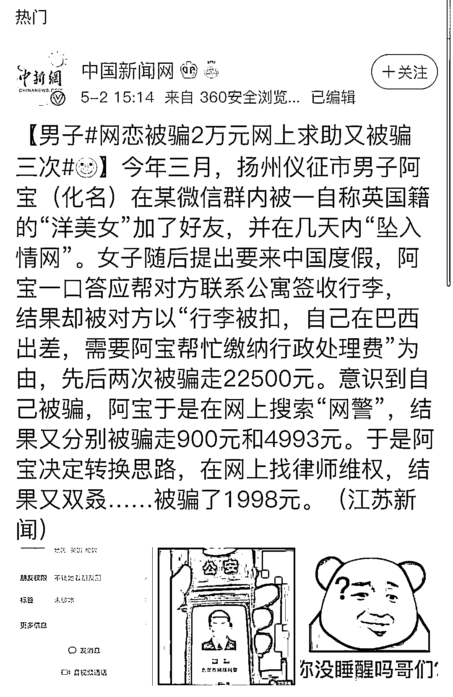

# 5 天 130 起 850 万元！刚刚，警方内部案情通报“泄露”…

> 原文：[`mp.weixin.qq.com/s?__biz=MzIyMDYwMTk0Mw==&mid=2247521069&idx=2&sn=b328de3768e42a86d33077d0e1e1e759&chksm=97cb5815a0bcd10357af5746e86162108b88fa1dd8ea0e72afe3af15b9c469c34002d6e3c771&scene=27#wechat_redirect`](http://mp.weixin.qq.com/s?__biz=MzIyMDYwMTk0Mw==&mid=2247521069&idx=2&sn=b328de3768e42a86d33077d0e1e1e759&chksm=97cb5815a0bcd10357af5746e86162108b88fa1dd8ea0e72afe3af15b9c469c34002d6e3c771&scene=27#wechat_redirect)

5 天 

仅仅 5 天

江苏扬州全市发生电信诈骗案件**130 起**

累计损失**850 万元**……

这不是耸人听闻

而是扬州警方一份内部

案情通报里的**真实数字**

▲▲▲

通过社交软件点进未知博彩网页

**被骗 49 万元** 

▲▲▲

员工按照“老板”要求进行转账

**被骗 48 万元**

▲▲▲

通过网友介绍进行所谓理财投资

**被骗 69 万元**

▲▲▲

网恋对象称生病住院急需用钱

**被骗 20.2 万元**

▲▲▲

通过网友推荐下载 APP 进行刷单

**被骗 25.2 万元**

以上是扬州市反通讯网络诈骗中心民警

“偷偷”发给小编的一组真实数据

**“不光民警要掌握情况，**

**老百姓也要看看！”**

他表示，随着疫情防控形势稳步向好

全市逐步复工复产

近期电诈类警情**同比明显上升**

对他们来说，这不仅是一组研判数据 

更是沉甸甸的压力与责任……

你对**“反诈”**了解多少？

前段时间，民警老陈火了

秦皇岛市的反诈民警陈国平

身着警服、一身正气

在各大视频平台与网络主播连麦

普及反诈知识

剧烈的反差迅速赢得网友的关注与讨论

各种“恶搞”和“二创”也层出不穷

成为一个“现象级”的宣传爆点

是的

近几年警方的各类反诈宣传可谓铺天盖地

上到央媒各大专题报道

下到菜市场的“反诈蛋”“反诈瓜”

所有人都在不遗余力地告诉你

**“不听不信不转账”** 

**“投资理财需谨慎”**

也许你会问：这真的有必要吗？ 

然而事实是

越是苦口婆心绞尽脑汁

越觉得有心无力

每天，依然有许许多多群众

被骗子玩弄于股掌中

经济损失更是不计其数

尽管他们大部分都接受过警方的反诈宣传

但真正进入诈骗分子设置的情境中

还是会“防不胜防”

国家反诈中心 APP： 

就挺委屈的…… 

民警直呼“带不动” 

真实版《每天教你一个上当小技巧》

从之前警情通报的内容我们不难看出 

不管是男人、女人、 

老人、年轻人、 

公司老板、普通学生…… 

**只要你身处现代社会** 

就有可能落入诈骗分子精心设计的陷阱里 

刷单、投资理财、

网恋交友、冒充公检法办案……

他们有无数种方法伸进你的口袋

短短几行字的案情

背后可能就是一个人、一个家庭的灾难 

一些诈骗分子不光盯上你和家人的存款 

还会用各种花言巧语

诱骗你使用各种网贷去借钱 

让你背负上可能**一辈子都还不了的巨额贷款** 

电信诈骗对社会秩序的破坏、对法治社会的践踏

更是无法用金钱衡量 

今年 1 至 5 月

全国破获电信网络诈骗案**11.4 万起**

成功劝阻**771 万名**群众免于受骗

为群众挽回经济损失**991 亿元……**

我们深知

打击电信网络诈骗任重而道远

其实，苦点累点真的不算啥 

警察蜀黍们最希望的

还是老百姓能关注反诈、提高防骗意识

守好自己的钱袋子 

**因为电信诈骗**

**离我们真的很近！**

来源：扬州市公安局、视觉仪征、阻击诈骗

← 向右滑动与灰产圈互动交流 →

