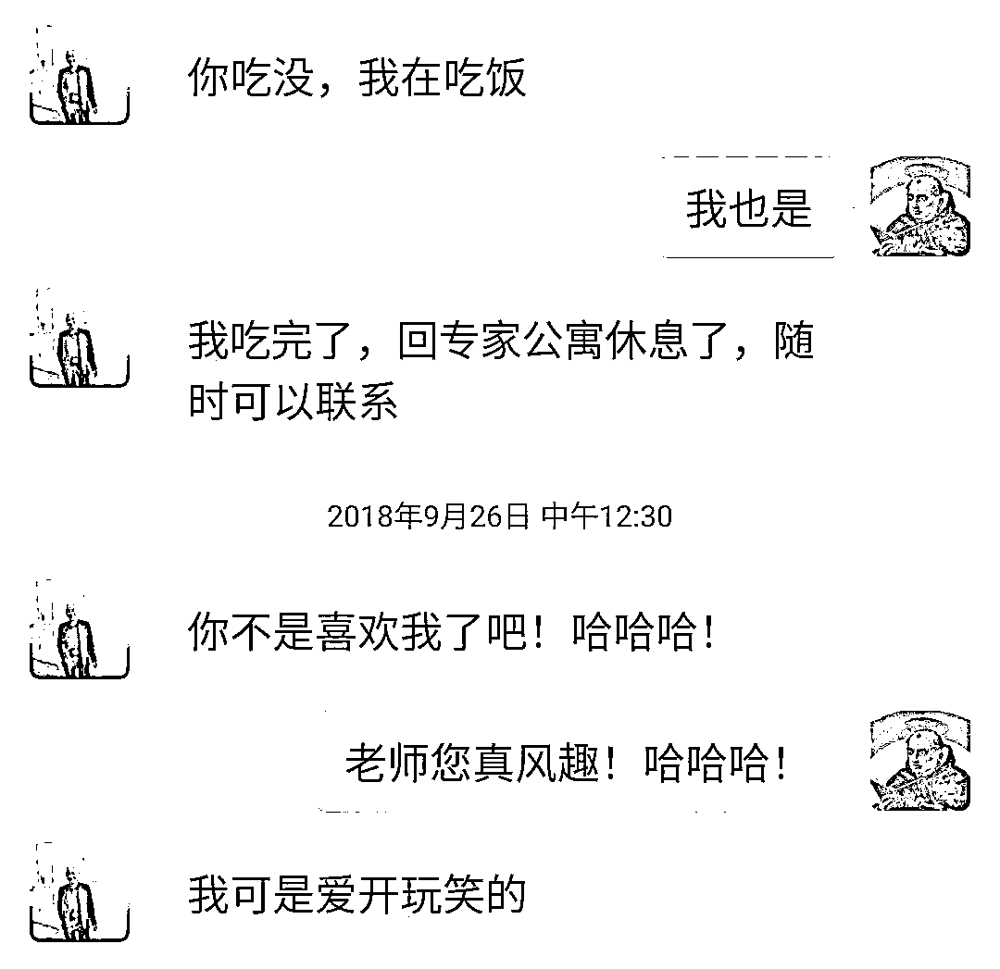

# “教授骚扰猥亵女学生”，开除党籍、解除教职！

> 原文：[`mp.weixin.qq.com/s?__biz=MzIyMDYwMTk0Mw==&mid=2247521069&idx=3&sn=79eea8abd50eaa65c510d15474843c65&chksm=97cb5815a0bcd103a1c67694c193d0b1c4d99cd9602284a1d6b37ea9f6d6f64fa1fd2b2c7717&scene=27#wechat_redirect`](http://mp.weixin.qq.com/s?__biz=MzIyMDYwMTk0Mw==&mid=2247521069&idx=3&sn=79eea8abd50eaa65c510d15474843c65&chksm=97cb5815a0bcd103a1c67694c193d0b1c4d99cd9602284a1d6b37ea9f6d6f64fa1fd2b2c7717&scene=27#wechat_redirect)

## 

**21 日凌晨，@内蒙古财经大学 微博发布“关于乌峰师德失范行为处理的通报”，全文如下：**

****内蒙古财经大学****

****关于乌峰师德失范行为处理的通报****

**2021 年 9 月 17 日晚，网民在自媒体平台反映我校教师骚扰猥亵学生信息。**经查，举报对象系我校教师乌峰，认定其行为严重违反社会公德和师德规范**，造成恶劣社会影响。**

****经研究，决定给予乌峰开除党籍处分，岗位等级由三级教授降为九级科员。撤销其所获荣誉、称号，追回相关奖金，解除教师职务。报请自治区教育主管部门撤销其教师资格。****

**学校决定，立即在全校范围内开展进一步加强师德师风专项教育活动，以案说纪，教育全体教职员工严守师德底线，切实遵守教师职业行为十项准则，努力营造风清气正的育人环境。**

**内蒙古财经大学**

**2021 年 9 月 20 日**

**** 

****此前报道：****

**9 月 17 日，有网友发布了一篇名为《控诉：一位教授的骚扰猥亵实录》的文章声称自己在内蒙古财经大学本科就读期间，被学校马克思主义学院教授乌峰猥亵的经历，并附带多张疑似与“乌峰”的微信聊天截图。**

**根据该网友发布的文章内容，她已于 2021 年本科毕业。2018 年 9 月 26 日，她 18 岁正读大二，因在马克思主义基本原理课堂上，得知教授乌峰将要去意大利出差，而自己正在寻找一个意大利诗人的书籍，便在课后主动添加教授微信，希望他出差时能帮忙捎带回来。**

**然而托人买书一事，成了该网友噩梦的开端。**

**聊天截图显示，两人加微信仅半小时后，微信名“乌峰”便发来一句“你不是喜欢我了吧！哈哈哈！”并称“自己可是爱开玩笑的”。**

****

**网友提供的微信聊天截图**

**该网友称自己对哲学产生了极大兴趣后便向老师请教，希望对方能推荐哲学入门书籍给她，本以为会收到一张书单的她，却被叫到了教授的办公室。但当她第一次来到教授的办公室时，乌教授突然抱住她，手臂环着，开始亲她的脸，紧接着又将额头贴住她的额头，那距离近到鼻子要抵在一起。见当事人露出惶然的神情，教授便毫不遮掩地笑了起来，并说，“你们汉族人就是容易想多。”随后在交谈中，更是表示“世上有不同形式的爱，不能只跟同龄人交往的”。** 

**在多次婉拒乌教授邀请一同用餐的请求后，出于礼貌，该网友还是赴了次约，一同吃饭的还有工大的老师。但就是在这样一个公共场合，乌教授在桌子底下不止地摸、抓她的手。在以宿舍门禁时间快到了为由提出离开后，乌教授甚至提出“来抱一个”的要求。**

**当晚，“乌峰”连发多条消息表达爱意，直言“我爱你‘，我真的爱你’”，并表示，“真想亲嘴，下次见了抱着亲嘴”。**

****

****

**此后，“乌峰”多次发消息表达“想你”，并邀请当事人去他办公室或公寓，“乌峰”在出差期间还多次给她发信息，评论她的长相。尽管自己再三提醒他注意身份，跟他划清界限，但他依旧无止无休。**

****

**文中写道，那个学期结束后，因为“懦弱”，该网友选择了沉默，不想别人拿异样眼光看她。**

**大三下学期时，金融系的当事人想申请复旦哲学系的夏令营，但因为专业原因必须要找到两位能够帮忙写推荐信的教授。在经历了繁复的思想斗争后，她找到乌峰请求帮助，并质问他为何总是“动手动脚”，但乌教授对于之前的恶行全无悔意，相反，指责她想太多，称“我儿子比你年纪还大。现在的学生真是想太多”，自己把学生都是当成女儿来看待，并开始描述其他学生如何答谢他，如何坐在腿上亲他的。**

**最后，该网友表示，虽然如今她已经毕业，但一直觉得蒙受了巨大的耻辱和痛苦。目前，她已将材料整理完毕，并提交给了纪委、党委及区教育厅等相关部门。希望能得到一个妥善的处理结果。**

**公开资料显示，乌峰 1983 年考入内蒙古师范大学政教系，1987 年毕业，获哲学学士学位。同年考取内蒙古师范大学政教系哲学专业硕士学位研究生，1990 年毕业，获哲学硕士学位。2002 年考取中国人民大学哲学院博士研究生，师从著名哲学家萧前教授，专攻马克思主义哲学、生态哲学。**

****

* * *

**来源：新民晚报综合@内蒙古财经大学、红星新闻**

****

**← 向右滑动与灰产圈互动交流 →**

****