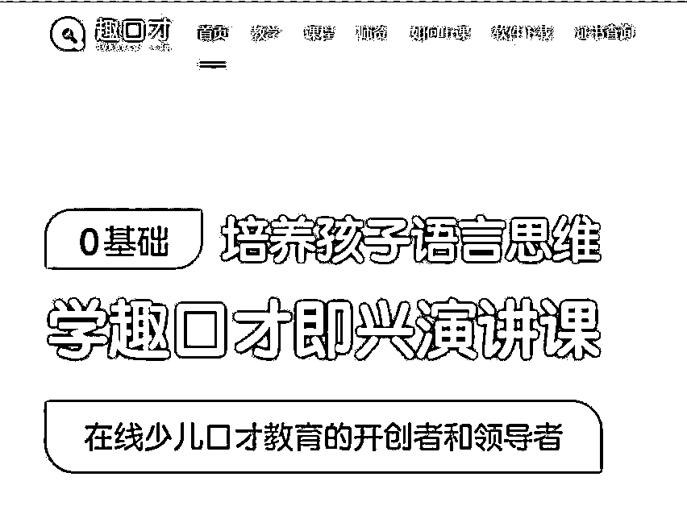
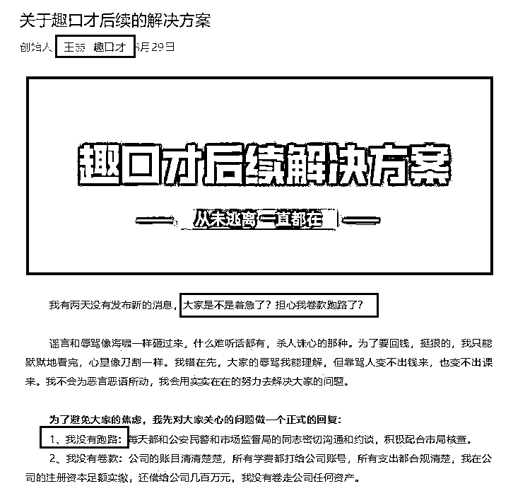

# 创始人提前 3 天写好道歉信，刚交钱，就倒闭！知名培训机构爆雷，家长懵了：这是诈骗！

> 原文：[`mp.weixin.qq.com/s?__biz=MzIyMDYwMTk0Mw==&mid=2247521069&idx=6&sn=5890c9e35cc474b67729cc7c186b3b00&chksm=97cb5815a0bcd103bc83cff5d565423f1615157357864186149a579a8768e706274e092f36f4&scene=27#wechat_redirect`](http://mp.weixin.qq.com/s?__biz=MzIyMDYwMTk0Mw==&mid=2247521069&idx=6&sn=5890c9e35cc474b67729cc7c186b3b00&chksm=97cb5815a0bcd103bc83cff5d565423f1615157357864186149a579a8768e706274e092f36f4&scene=27#wechat_redirect)

究竟是因“双减”倒下的教培机构？还是蓄意诈骗家长的骗子机构？近日，一家名为“趣口才”的在线教育培训机构，在突然宣布破产之后，遭到上千名家长们的声讨。

据媒体报道，目前家长们在网络平台上聚集的维权人数已有 1863 人，涉及金额超 1400 万元人民币。

究竟是什么情况？ 

**涉及金额超 1400 万！**

**“前一天晚上还在上课，****第二天早上收到破产消息”**

**8 月 27 日，趣口才创始人王赫，在公众号上发布《致家长们的一封道歉信》，“趣口才因为我的能力不足经营不善，已经很难继续运转下去，目前资金链断裂无法继续运营。”**

****

**一夜之间宣布破产，不少家长觉得太突然了。**

**有家长表示：8.28 日趣口才公司突然宣布破产，联系不到老师，公司，报警也没有任何回复。前一天晚上还在上课，第二天早上收到一条公司破产消息。一夜之间公司搬空所有电脑，所有东西，我们家长有权利怀疑这是计划好的跑路！”**

****

**据南方财经报道，“目前家长们在网络平台上聚集的维权人数已有 1863 人，涉及金额超 1400 万元人民币。**

****倒闭前一月还以涨价为由****催家长续费****

****值得注意的是，在突然宣布倒闭前的一个多月，趣口才还做了一番“神操作”：显示突然宣布马上要涨价，以即将涨价为由催家长续费。而不少家长因此囤了不少课。****

****据悉，7 月 18 日，趣口才发布涨价通知，称 8 月 1 日起，所有课包价格上涨 20%。“ 因此，很多家长赶在 8 月涨价前购买了课包“囤课”，并惨遭“踢皮球”。****

****据 21 世纪经济报道，来自四川的家长王瑜 7 月 16 日咨询趣口才课程情况，课程顾问以即将涨价为由催促王瑜尽快购课。然而 7 月 19 日购课后，直到 7 月 31 日，王瑜既未收到合同，也拿不到教材，更无法拼团 4 人上课。****

****王瑜要求退款，趣口才班主任称两天内退款完成。两天后，王瑜没有收到退款，得到的回复是“再等 20 天”。王瑜追问原因，班主任不再回复。直到 8 月 27 日得知趣口才倒闭，王瑜的预付款至今仍无法追回。****

****“感觉骗了你的钱还不够，还要继续侮辱你的智商。”家长李山遭遇了和王瑜一样的情况。他 7 月 19 日花费 7680 元购买 80 节课，仅上了两节课，老师和班主任均称已离职，课程无法继续，李山要求退款却被反复拖延。****

****北京市盈科（深圳）律师事务所高级合伙人朱逸聪律师对南方财经全媒体记者表示，教培公司明显不具备合同履行能力，仍向家长售课收取费用，其隐瞒事实真相的欺骗行为，客观上已涉嫌诈骗家长的培训费，主观上具有非法占有培训费的意图，有合同诈骗罪的嫌疑。****

****趣口才爆雷不仅坑了家长，还坑了自家员工。据媒体报道，自 7 月开始，趣口才大部分员工被欠薪，大部分员工 6 月的工资没有发。 ****

******此前称“双减”利好素质教育吸引家长******

******倒闭时却称“双减”吓跑资本******

****王赫在道歉信中，把自己的倒闭归因于“双减”，“终于熬到了 7 月底双减政策发布，对于素质类教育还是允许发展的，但是对于资本层面是无比严厉的，这个政策彻底吓跑了资本市场，我原来幻想的能继续完成的那一轮融资也彻底没戏了”。****

****然而，趣口才在 8 月 12 日时告知家长，素质教育培训并不直接受“双减”影响。“各大机构也纷纷转型素质教育-语言表达，所以请各位家长放心，素质教育未受‘双减’政策影响。”****

********

****因而，有很多家长是抱着“双减”利好素质教育的想法才在 7 月积极报名。 ****

****“趣口才在爆雷前的销售额仍然很高，7 月的销售额有 600 多万。”趣口才前高管赵宇透露，“8 月份在各种混乱状态下，公司卖课收入还将近百万。”****

******创始人****提前 3 天写好道歉信****** 

****王赫的道歉信是在 8 月 27 日发出。在接受媒体采访时， 王赫表示，这封信是当天写，当天发。****

****然而，据南方财经，趣口才前高管赵宇却表示，这封信 3 天前就写好了。****

****在趣口才宣布倒闭当天，赵宇所在的家长微信群就炸了。“家长要退费，怎么办？”赵宇直接问王赫。“你就和他们说等到月末，目前没钱退。后续让他们换课，他们会换的。”王赫回复赵宇。****

****赵宇并未按照王赫的指示做，也不认为 8 月 27 日发布的道歉信如王赫此前接受采访时所称“ 当天写，当天发”。在他看来，“换课，也许是早就准备好的方案”。****

****8 月 26 日，赵宇在业务例会群看到了王赫准备发布的道歉信版本，打开后，里面的编辑日期显示“8 月 24 日”。也就是说，这封道歉信至少在趣口才倒闭的三天前就写好了。****

********

****这下，家长们更是气炸了，认为各种说辞都早准备好了，这就是赤裸裸的诈骗。**** 

********

****** 推出“换课”方案******

******家长不认可******

****王赫打算如何解决问题？9 月 1 日，趣口才推出换课小程序，家长可以在趣口才 APP 登录选择在线兑换课程。****

****家长们对换课方案并不认可，有家长指出，“换课方式、课时内容、授课老师还有机构的联系方式都没有提供给家长，很多课程还需要补交课程费。”“换课页面写着，一旦换课，等于跟趣口才解除合同，趣口才就没有履行合同的义务。换课之后就完全听另一家机构安排，不能退款。”****

********

****不过，王赫在今天还在公众还更新提醒大家，目前处理善后的业务的都是没有薪水的义工，而这些一共预计在一个月之后，就不能有很多的精力来服务家长了**，建议家长们在最近一个月内尽快完成换课和换购的服务，这样可能处理的更好和及时。******

************

****************

**********宣称 3 年****学员超 40 万********** 

********达晨等知名机构投了 3000 万********

******资料显示，成立于 2017 年的趣口才，曾自称国内少儿口才在线教育的开创者，主要为 4-12 岁少儿提供语言思维训练。******

************

******今年 2 月，趣口才还对外宣称获数千万 A 轮融资，3 年营收增长近 20 倍。据“趣口才”公众号发布的数据，截至 2020 年底，趣口才用户数量超过 20 万，学员超 40 万，遍布全国。******

************

******资料显示，趣口才最新的一轮融资在去年底。彼时其宣布完成了由达晨领投的数千万元 A 轮融资。至此，趣口才共有 5 笔融资，投资方包括碳 9 加速器、蓝象资本、黑马基金、诺瓦资本、紫京资本等。******

************

******当时 ,王赫表示，2021 年预计将进一步扩大公司运营规模，准备 2021 年的业务规模在 2020 年的基础上再增加 5 倍，整体营收在 3-5 个亿，并将探索双师课堂、AI 课等课程形式。******

******而在接受每日人物采访时，创始人王赫表示，从创立到最后，总共只融了 3000 万人民币，换成美金只有 500 万美金。 ******

********创始人：没有跑路、没有卷款********

********未来还要继续创业还债********

******虽然深受家长们质疑，但 8 月 29 日，创始人王赫在“趣口才”公众号中称“绝不跑路”。******

************

******此外，在接受每日人物采访时，他表示，未来还会再创业。“只能创业啊。1000 多万的债，难道打工还得起吗？不可能。 ”******

******来源：中国基金报******

************

******← 向右滑动与灰产圈互动交流 →******

************