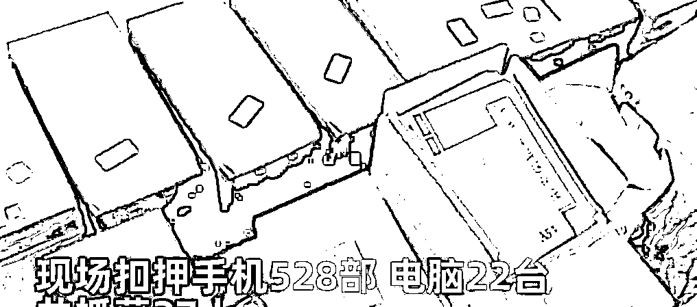
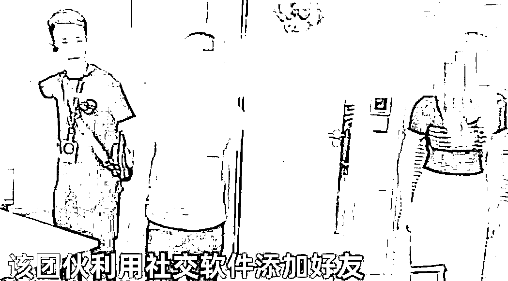
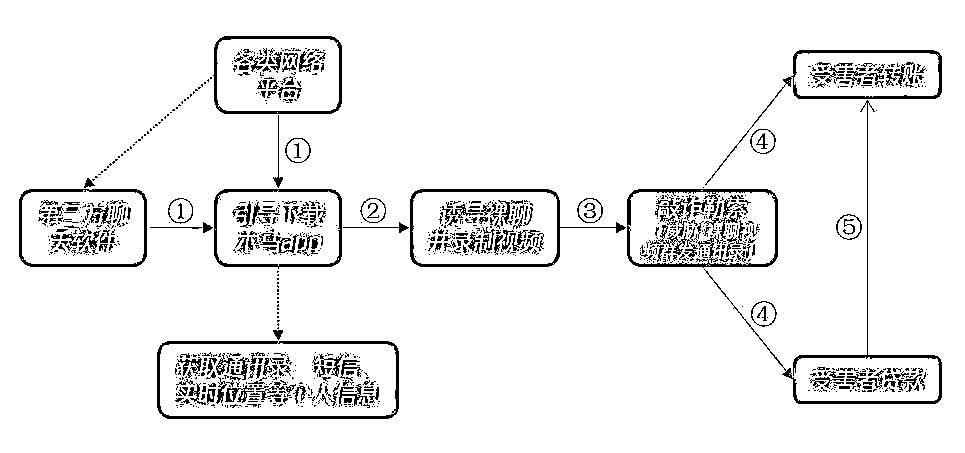
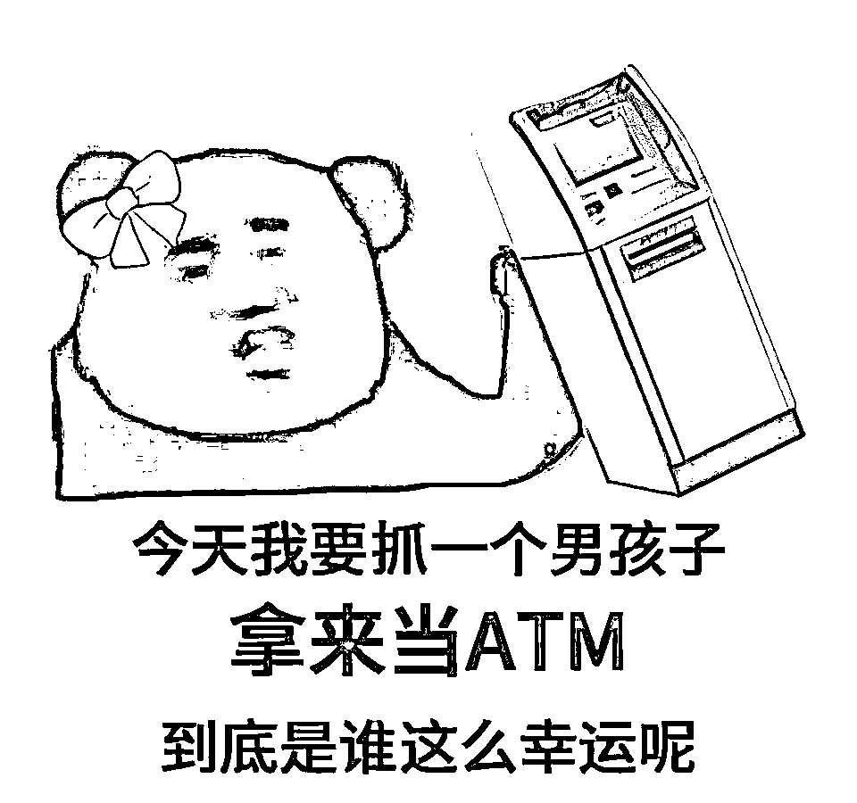
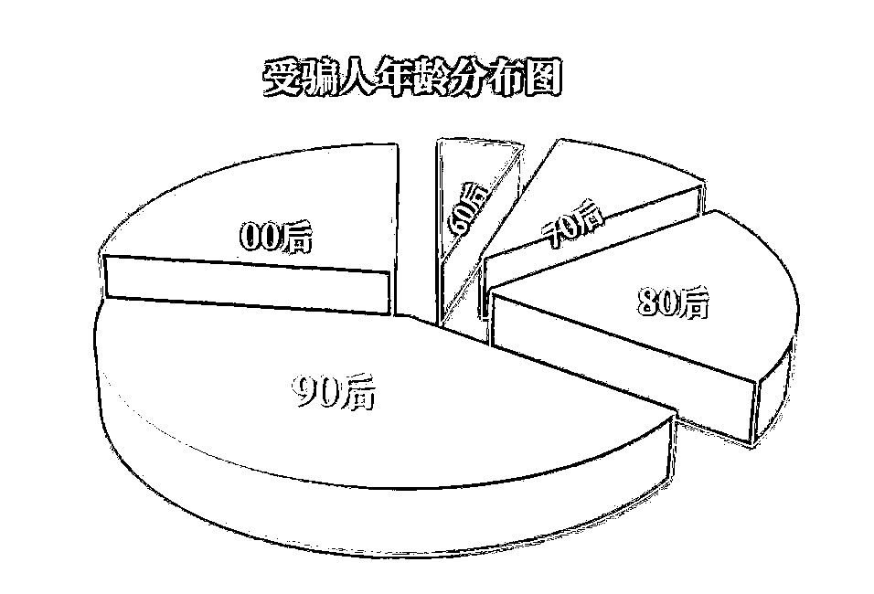
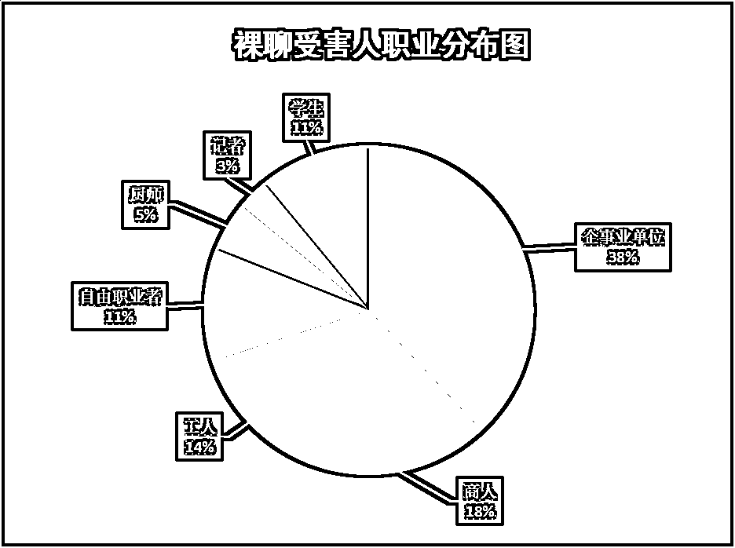

# 诈骗窝点搜出“广东富婆通讯录”，27 人操作 528 部手机进行诈骗

> 原文：[`mp.weixin.qq.com/s?__biz=MzIyMDYwMTk0Mw==&mid=2247521121&idx=1&sn=cd9f8a364073605d05862e798d468b0f&chksm=97cb5859a0bcd14fa8cf6b22488a992c10f1e408a0d932399cfbf699f09d4a5101e917a5a4a4&scene=27#wechat_redirect`](http://mp.weixin.qq.com/s?__biz=MzIyMDYwMTk0Mw==&mid=2247521121&idx=1&sn=cd9f8a364073605d05862e798d468b0f&chksm=97cb5859a0bcd14fa8cf6b22488a992c10f1e408a0d932399cfbf699f09d4a5101e917a5a4a4&scene=27#wechat_redirect)

■近日，常州一男子，和微信上添加的“美女”进行裸聊，结果被骗 50 万元。

……

■广州越秀区一男子遭遇裸聊诈骗，4 分钟的裸聊付出了 16 万元的代价。

……

■浙江一裸聊诈骗窝点搜出“广东富婆通讯录”，27 人操作 528 部手机进行诈骗。

……

6 月 4 日，浙江台州。有人报警称被敲诈勒索，民警迅速出动“一锅端”。据了解，该团伙利用社交软件添加好友，裸聊后进行敲诈勒索。办公室到处都是手机，共扣押手机 528 部，电脑 22 台，共抓获 27 人。**目前，案件正在进一步处理中。据了解这个犯罪团伙大部分为女员工，用来实施美人计。**

在谨防查抄办公室的时候，除了手机和一些女主播之外，还发现了一本奇怪的书，上面写着“广东富婆通讯录”，打开书看里面的内容，都是各公司的营业执照和法人相关信息，包括电话和住址，记录的很详细，这应该是受害者名录，这个团伙就是利用这些信息，来给这些公司的负责人设置陷阱，最后进行诈骗的，在他们的办公电脑内，有一系列的诈骗话术

这些营业执照，还可以给自己公司背书，这个公司从来不以真面目展示给受害者，一旦受害者上钩，就会有女主播专门联系对方，对受害者进行诈骗，目前，这 27 人正在接受审讯调查，而这本广东富婆通讯录，也有很多版本，以前一直以为是网络上的段子，没想到真的存在。

诈骗分子是无孔不入，已经掌握了被害人相关信息，对症下药，请君入瓮。除了诈骗团伙本身作案，背后应该还有一个专门购买、出售相关个人信息的非法利益链条，必须顺藤摸瓜，一网打尽！团伙作案，有计划、有组织，有分工，步步为营，稳扎稳打，被害人不上当都难！

很多网友透露，这些骗子都是选很有实力的企业进行诈骗，每月银行流水过百万以上筛选，肯定是银行内部流出来买卖的，还可以分十万级百万级千万级呢，很多网友还不停地问，麻烦看一下，里面有没有我的名字，如果没有的话，我还得要努力，还有些网友说自己经常接到电话，难道已经进入这个通讯录吗？

现在的骗子，都是很系统的，有通讯录，有专门的话术，还能买到很多个人信息，尤其是很多债券公司，金融公司，就会专门贩卖客户信息，骗子们都是这样买信息然后实施诈骗的，如果没钱，还不会被骗子收录，只是这样的骗子公司一般很隐秘，很难抓到，除非有人举报，一锅端，这样才大快人心

看到上面几则新闻，想必大家都能猜到今天要解答的诈骗案件了。

**没错，就是与“杀猪盘”同属于交友类型的诈骗，“裸聊诈骗”。**

相对于“杀猪盘”骗局的“放长线，钓大鱼”的特征，“裸聊敲诈”的整体节奏更为“短平快”，平均用时不超过 2.5 小时，平均诈骗金额约为 5 万。

正是抓住了受害人的色欲之心和羞于报警的心态，裸聊诈骗屡屡成功，骗子们也越发猖獗，竟然还搭上了 AI 的快车，依靠 AI 换脸术强行敲诈！

江苏常州一 90 后，明知可能遇到了裸聊骗局，但因对骗子们诈骗手段的好奇，只是露了一下脸，就被骗子 AI 换脸技术坑了，做了一段他的“裸聊视频”进行勒索。

**“裸聊”诈骗有什么固定套路呢？**

**1.寻找目标猎物**

不法分子通常顶着美女或帅哥社交账号头像，在社交平台或直播平台添加受害人，并开始一段时间的网聊铺垫。

**2.诱导安装木马软件**

诈骗分子在聊天过程中诱导受害人安装特定 APP 或点击不明链接、二维码，需要输入自己的电话号及验证码，在事主手机中植入木马软件，窃取个人通讯信息。

**3.开启裸聊、录制视频**

对方以事先录好的视频与受害人进行裸聊，并引导受害人拍摄自己，同时进行屏幕录制，留存证据。

**4.手握证据进行敲诈**

掌握受害人通讯录及裸聊的视频后，即露出真正面目，要求受害人向指定账户转账。

**5.无底洞式连环敲诈**

诈骗分子以散布裸聊视频或将视频向受骗者单位举报、转发亲友等事由对受骗者实施威胁，并多次敲诈勒索，有甚者会要求受害人去网贷筹钱。

裸聊诈骗流程图

**谁容易掉入裸聊诈骗的陷阱中？**

据调查显示，从年龄分布来看，裸聊诈骗受害者以 90 后居多，年龄在 20-29 岁的受害者超半，正有向年轻化群体发展的趋势。

从上网习惯来看，经常使用微信“摇一摇”“附近的人”，以及陌陌、探探、Soul、Blued 等交友软件的人，受骗几率更高。

从职业来看，企事业单位用户更容易成为裸聊敲诈的目标对象，在受骗人群中占比高达 38%，可谓工作越体面、损失越大。

**真的有女生愿意和陌生人裸聊吗？**

你看到的“美女”只是犯罪链条中的一个环节，“她”的背后是一个成熟的诈骗“产业链”，具体由“聊天团队”“裸聊团队”“App 开发团队”“敲诈勒索团队”和“转账套现团队”构成，犯罪集团成员之间彼此分工协作，共同实施诈骗。

而你看到的美女，可能只是抠脚大汉在电脑前为你播放的视频。

**遇到裸聊诈骗要不要私了呢？**

通常，对方不会一上来就狮子大开口，吓到你直接报警，他们通常会要求你转一笔承受范围内的钱，并许诺转账后删除视频。

但是谁又会轻易放过到手的肥肉呢？犯罪分子会一直要求你转账，一笔一笔榨干你，甚至还会要求你去网贷。

所以真的遇到裸聊敲诈，不要犹豫，立即报警！

**文明上网千万条，安全第一条**

**男孩子们网上冲浪**

**一定要保护好自己**

来源：小强停车，阻击诈骗

← 向右滑动与灰产圈互动交流 →

