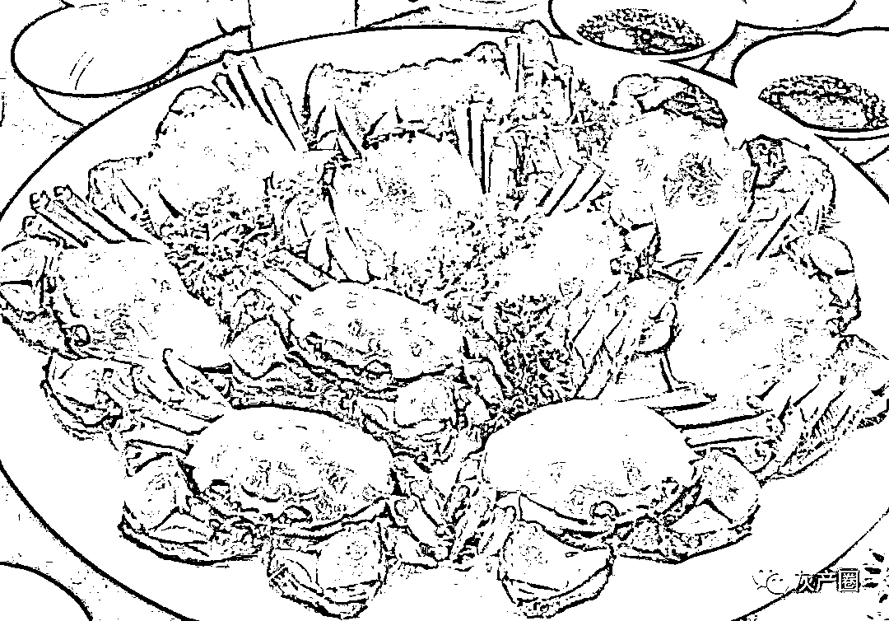
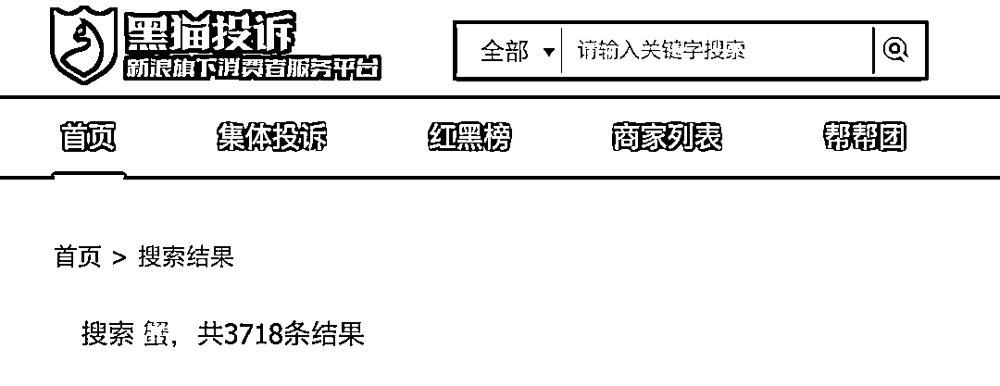
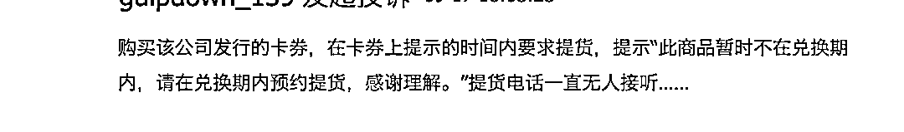

# 一只螃蟹也没卖，每张蟹券净赚 100 元。坑的是普通消费者

> 原文：[`mp.weixin.qq.com/s?__biz=MzIyMDYwMTk0Mw==&mid=2247521121&idx=2&sn=13642b7a55b3a3a371334c77a4666ca7&chksm=97cb5859a0bcd14f57d1650d0ca2f5a8cb82b096e4cc49934e17db49e893dc8dcc8cd473638c&scene=27#wechat_redirect`](http://mp.weixin.qq.com/s?__biz=MzIyMDYwMTk0Mw==&mid=2247521121&idx=2&sn=13642b7a55b3a3a371334c77a4666ca7&chksm=97cb5859a0bcd14f57d1650d0ca2f5a8cb82b096e4cc49934e17db49e893dc8dcc8cd473638c&scene=27#wechat_redirect)

  

该公众号已被封禁

9 月底正是品尝大闸蟹的最佳时期，朋友圈里、电商平台上各种预售的大闸蟹礼品券早已供销两旺。

因为携带或送礼方便，螃蟹随吃随兑，蟹券备受消费者的青睐。可近几年，随着蟹券的泛滥，兑换难、蟹券空转的情况时有发生。

蟹券空转

据媒体报道，**商家印刷面值 500 元**的蟹券，**以 400 元价格卖给营销人员**，**营销人员以 500 元价格对外出售**，但**以 250 元的价格往回收**，**再以 300 元的价格卖给蟹券商家**。**一只螃蟹没有**，**一张蟹券，蟹券商家稳赚 100 元，营销人员也能赚 50 元。**

“要做蟹，先发券”，不少螃蟹生意成为了“**零成本**”买卖。蟹企先卖蟹券，经销商先赊账拿到蟹券，之后经销商在收到客户打款之后再支付蟹款。同时，蟹企因为无法掌握蟹券真实的销售数据，以及消费者拿到蟹券后可能出现并不兑换的情况，**蟹券超发也成了普遍现象**。

此外，因为蟹券既没有市场指导价也没有行业指导价，叠加送礼的需求，让面值高、折扣低的销售模式成为行业惯例。

蟹券问题多多

分析人士称，利用螃蟹券，**商家不用饲养螃蟹就可以赚取大量资金**，从而不再重视产品本身，而**最终买单的只能是普通的消费者**。

在黑猫投诉平台上，截至 9 月 21 日，共有 3718 条有关于螃蟹相关信息。中证君主要看到消费者投诉的三大问题。

**投诉一：无法提货**

**有消费者反映，购买一家螃蟹公司发行的卡券，结果在卡券上提示“此商品暂时不在兑换期内，请在兑换期内预约提货。”而提货电话一直无人接听。**

****

**来源：黑猫投诉平台**

****投诉二：与蟹券注明信息不符****

****有消费者称，蟹券上标注的是公蟹 5 两，母蟹 4 两。结果收到货后是 7 只死蟹，且公蟹不到 3 两，母蟹不到 2 两 。店家拖到节前发货，导致再次买货已来不及 。****

******投诉三：商家跑路******

******还消费者在投平台称，自己在 2020 年 9 月 18 日买的蟹卡，当年说是约满了，三年内有效，今年再约的时候，这个店已经不在了，人工客服也无回应。******

******“一些小品牌蟹券的商家可能今年做大闸蟹生意，明年就改行了，这种消费陷阱实在让人头疼。”杭州一位水产批发市场的总经理表示。******

******监管部门和协会齐发力******************

******今年，苏州市市场监管局就组织和倡导作为会员单位的品牌商家，对自售出之日起 30 日内、未激活提货的一次性兑付蟹卡、蟹券，提供无理由退货承诺服务。这也是国内大闸蟹行业首次将一次性兑付蟹券(卡)纳入无理由退货，具有较强的示范引领作用。****** 

******中消协也在中秋节前发文称，很多消费者反映在购买螃蟹券后，或是面临“一券在手，螃蟹难求”的供需不平衡局面，或是收到的螃蟹缩水严重、缺斤短两。因此，建议消费者擦亮双眼，尽量选择正规线下实体商家或是信誉较高的电商购买大闸蟹。******

******来源：中国证券报****** 

************

******← 向右滑动与灰产圈互动交流 →******

************