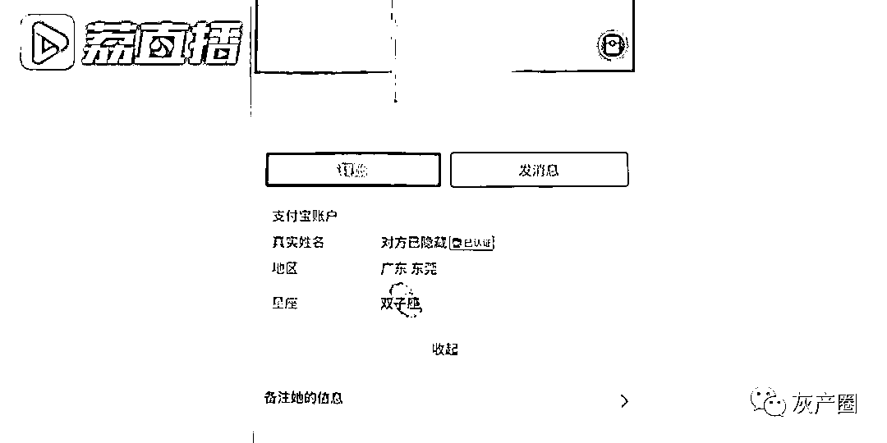
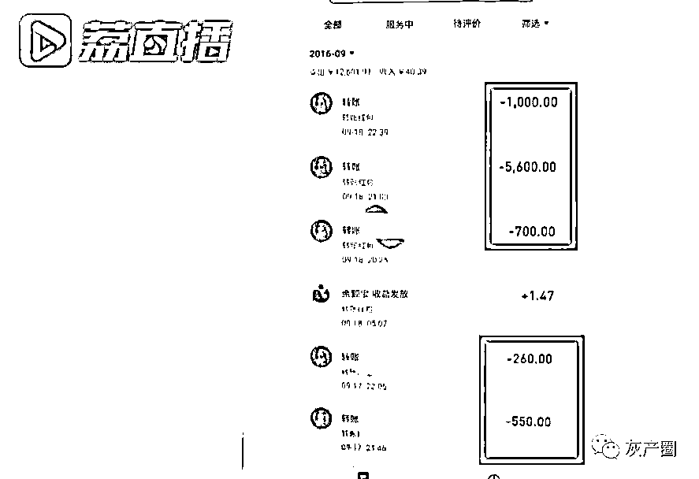

# 5 年前被骗 8000 元，男子如今报警只因为要结婚了手头紧

> 原文：[`mp.weixin.qq.com/s?__biz=MzIyMDYwMTk0Mw==&mid=2247521121&idx=3&sn=c54ce2a12b7ba810751dff7966bc3f8d&chksm=97cb5859a0bcd14f6271b1d82427e7c5b81c8f22414188d0a93ca2e453d7de3e1fa68c809a9a&scene=27#wechat_redirect`](http://mp.weixin.qq.com/s?__biz=MzIyMDYwMTk0Mw==&mid=2247521121&idx=3&sn=c54ce2a12b7ba810751dff7966bc3f8d&chksm=97cb5859a0bcd14f6271b1d82427e7c5b81c8f22414188d0a93ca2e453d7de3e1fa68c809a9a&scene=27#wechat_redirect)

俗话说，网恋需谨慎，有些人可能连面都还没见着，就已经被骗了。近日，南京的李先生来到了派出所报警，向民警讲述了他的被骗经历。9 月 21 日，南京秦淮警方披露了该案的详细信息。

李先生告诉民警，自己被骗是前几年的事情，当初比较年轻，不懂事，也没报警。原来，2016 年 9 月，李先生通过交友软件结识了一名女子，两人当时就添加成为好友，彼此说话也很投机。对方经常向他倾诉自己生活中的不开心，还说妈妈对自己很不好，管得很严。李先生也慢慢对这个女孩产生了同情。

几天后，对方突然称想要来南京找李先生，但无奈身上没有钱买火车票。想着见个面也不是坏事，李先生便通过手机转给对方 350 元车票钱。然而女孩表示买票的钱不够，而且还要在路上买点吃的，于是李先生又转给对方 810 元。

很快，两人的见面提上日程。这天，女孩发来消息称自己已经在路上了，但可能在半路上吃坏了东西，导致现在肚子一直疼，需要乘务员带着她去医院看病，希望李先生可以转她 700 元的医药费。 

听到这一消息，李先生连忙把钱转了过去，让对方先好好治病。没过多久，女孩再次发来消息，说医生诊断是急性阑尾炎，手术费要 5600 元，术后营养针要 1000 元。李先生觉得对方是为了来找自己才生的病，心里很是愧疚，于是二话不说把钱转了过去。

短短 3 天时间，李先生共向对方转账 6 笔，共 8000 多元。李先生说，他一直以来没见过对方真人，只是打过电话听声音觉得对方是女的。手术后，李先生提出想要和女孩视频，看看对方恢复如何。但对方表示自己的手机摄像头坏了不能视频，并劝李先生不要担心，等自己出院后马上就去找他。在一片美好的幻想中，李先生却始终没有等来对方。此后女孩便不再理会李先生，没多久就把他拉黑了。

李先生告诉民警，自己当时太年轻，不知道该怎么处理，直到最近因要结婚了手头比较紧，希望可以把钱追回来，于是来到所里报了警。

目前，南京秦淮警方已经立案调查。警方提醒市民，切勿轻信甜言蜜语或者卖惨博取同情的网恋人设，更不要盲目向陌生人转账汇款！

  来源 ：江苏新闻

← 向右滑动与灰产圈互动交流 →

