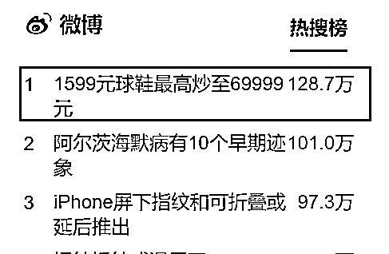

# 球鞋价格被炒至 69999 元？得物：已下架

> 原文：[`mp.weixin.qq.com/s?__biz=MzIyMDYwMTk0Mw==&mid=2247521121&idx=5&sn=8ab3185642fd0de8aaed40c10bb05c44&chksm=97cb5859a0bcd14f18e910a5f10222debd1fe81109b6b0c851d8d10d64ce983e6eb63d2c434f&scene=27#wechat_redirect`](http://mp.weixin.qq.com/s?__biz=MzIyMDYwMTk0Mw==&mid=2247521121&idx=5&sn=8ab3185642fd0de8aaed40c10bb05c44&chksm=97cb5859a0bcd14f18e910a5f10222debd1fe81109b6b0c851d8d10d64ce983e6eb63d2c434f&scene=27#wechat_redirect)

近日，话题**#1599 元球鞋最高炒至 69999 元#**引发关注。  

根据媒体报道，在某交易平台上，刚上市不久的进口球鞋“闪电倒钩”，**原价 1599 元，已经被炒到 2 万元左右，最高甚至达到 69999 元，溢价超过 40 倍！**

****

9 月 21 日晚，得物 App 官方微博发布《关于“AJ1 闪电倒钩三方联名款”价格波动说明》。

**说明中提到，经核查，此次网传倒钩价格 69999 元为某卖家个人所设置出价，且该价格下并无买家成交。****鉴于目前此商品价格仍存在波动，因此平台已做下架处理。**

得物表示，“AJ1 闪电倒钩三方联名款”于今年 7 月上市，上市后受到一定关注和追捧。该款商品由卖家供给出价，因其特定的三方联名稀缺属性存在一定价格波动，少量的实际成交价格受买卖双方供需关系影响。公司关注到在国外多个电商平台的公开数据中，该款商品也存在相同的溢价。因此，得物已于 8 月在该商品页面发布“理性消费提醒”的宣传图。

**1599 元球鞋被爆炒到 69999 元**

****

****据报道，某国际运动品牌的球鞋“闪电倒钩”在国内上市以来，热度一直不减。记者在某潮牌购物平台发现，发售价为 1599 元的球鞋，已经被炒到 2 万元左右，最高甚至达到 69999 元，溢价超过 40 倍！****

****所谓“炒鞋”，就是把一些潮鞋购入后加以囤积，等到价格上涨时再卖出。一些产量少的爆款运动鞋，一转手就能卖高价。****

****不仅是国际品牌，一些国内品牌的鞋也被热“炒”。记者浏览各购物平台发现，一款参考发售价仅 1499 元的明星同款篮球鞋，价格已被“炒”到 48889 元。另一款原价 899 元的篮球鞋，目前的价格为 5999~6999 元，而且断码严重，大部分号码显示无货。****

****而“炒鞋”之风背后则藏着商家的套路。某运动鞋品牌的一名王姓导购表示，许多品牌商都会在发售限量款明星联名高端球鞋时，采取预约排队、抽签购买的方式进行“饥饿营销”，通过增加球鞋稀缺性提升品牌价值。同样有购潮鞋经历的小彭说，有些限量的球鞋，官网上根本不会显示。****

****“专业”的“炒鞋客”也是推高鞋价的帮手。记者了解到，“炒鞋客”通过专业的抢鞋软件，从官方发售的渠道以发售价抢买热门款。他们会在某款鞋处于低价时，在炒鞋平台集中入手大量同款鞋，一旦达到某种数量，便可以左右这款鞋在二级市场的定价。****

****北京京师律师事务所律师熊超认为，球鞋品牌方、“炒鞋客”以及各种二级市场交易 APP 平台，将所谓的潮鞋价格抬到了一个本不该有的天价。有些“炒鞋”行为可能涉嫌违法，要小心风险。根据价格违法行为行政处罚规定，经营者相互串通、操纵市场价格造成商品价格较大幅度上涨的，责令改正，没收违法所得，并处违法所得 5 倍以下的罚款。****

****跟风“炒鞋”小心被“割韭菜”************

****早在 2019 年 10 月，中国人民银行上海分行就曾发布题为《警惕“炒鞋”热潮，切实防范金融风险》的金融简报，明确提出，国内球鞋转卖出现“炒鞋热”，“炒鞋”平台实为击鼓传花式资本游戏，提醒各机构高度关注，采取有效措施切实防范此类风险。****

****简报提到， “炒鞋”交易呈现证券化趋势，日交易量巨大；部分第三方支付机构为“炒鞋”平台提供分期付款等加杠杆服务，杠杆资金入场助长了金融风险；操作黑箱化，平台一旦“跑路”，容易引发群体性事件。****

****随后，nice、毒等球鞋交易平台曾先后多次整改。****

****那么这些炒鞋客是如何拿到限量款的货源呢？一位经营运动鞋品牌集合店的店主曾向媒体透露，一方面，炒鞋客会通过专业的抢鞋软件，从官方发售的渠道以发售价抢买热门款，另一方面，他们也会在某些鞋款处于低价时，在炒鞋平台集中入手大量同款运动鞋，一旦达到某种数量，便可以左右这款鞋在二级市场的定价。他表示，有炒鞋的人可能花费十几万买一批货，就能赚辆好车，但也有的人会随着市场变化亏得血本无归。因此，普通消费者若盲目入场炒鞋，将面临价格波动的高风险。****

****对于专业炒家来说，则可能涉嫌违法。比如几家大的炒鞋商相互串通操纵市场价格，是违反《价格法》的行为；炒鞋涉及的大量资金，可能卷入洗钱等违法犯罪行为。****

****北京互联网法院法官曾介绍，“炒鞋”行为须承担市场风险，这看似是球鞋收藏者之间的个人行为，但大多是有目的的经营活动，实质上是经营者哄抬物价、扰乱市场秩序乃至金融秩序的违法行为，涉嫌违反电子商务法、价格法的有关规定。****

****此外，通常来说，参与“炒鞋”的消费者（投资者）往往是年轻人，收入有限，还有可能借助电商平台的分期付款、网贷等途径借钱投资“炒鞋”。如果市场崩塌，其带来的亏损很有可能远大于投资者的偿债能力，由此可能对消费者本人带来信用风险。****

****来源：人民网、每日经济新闻、工人日报、北京晚报**** 

********

****← 向右滑动与灰产圈互动交流 →****

********