# 诈骗短信大全，收到千万别点击！

> 原文：[`mp.weixin.qq.com/s?__biz=MzIyMDYwMTk0Mw==&mid=2247521121&idx=6&sn=9ce11c5c321447f3d2ba02feea21991a&chksm=97cb5859a0bcd14f15c579aad0789eb93fcc1a5a5fab48981f4bff31e71d9e925ece4f60b95d&scene=27#wechat_redirect`](http://mp.weixin.qq.com/s?__biz=MzIyMDYwMTk0Mw==&mid=2247521121&idx=6&sn=9ce11c5c321447f3d2ba02feea21991a&chksm=97cb5859a0bcd14f15c579aad0789eb93fcc1a5a5fab48981f4bff31e71d9e925ece4f60b95d&scene=27#wechat_redirect)

虚假诈骗短信 

附带链接/联系方式有风险

点击/添加需谨慎

# **01**

点赞刷单类

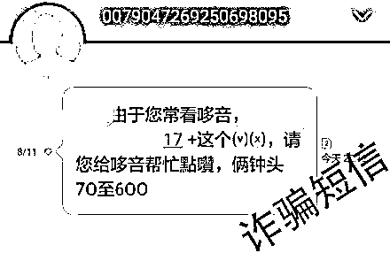

# 02

中奖送礼品

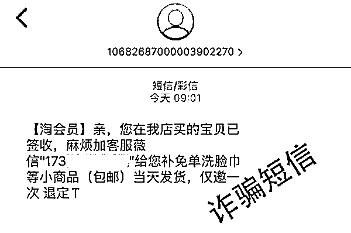

# 03

冒充保险

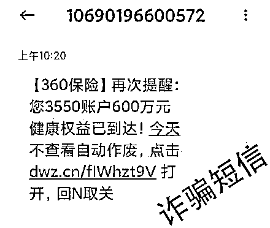

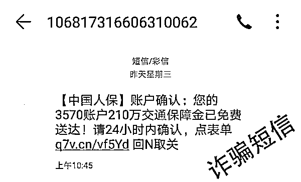

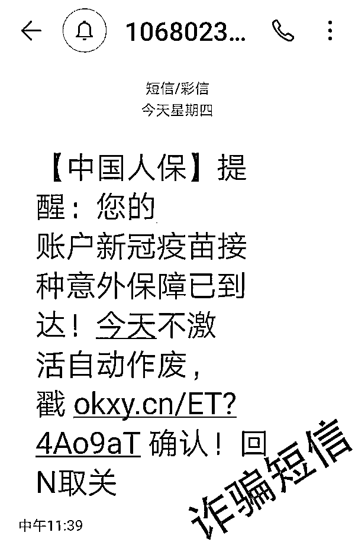

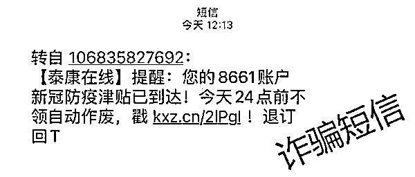

# 04

贷款类

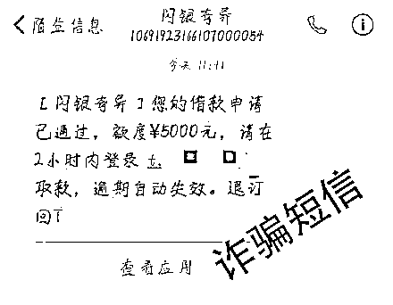

# 05

ETC 通行类

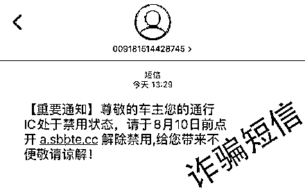

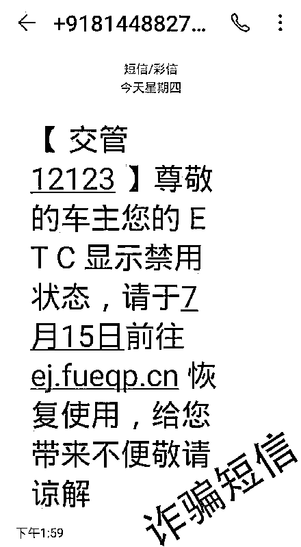

# 06

冒充银行

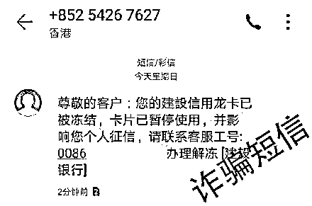

# 07

冒充社保中心

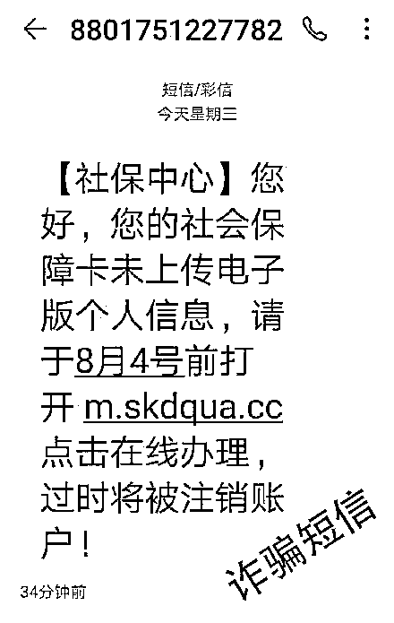

# 08

冒充工商部门

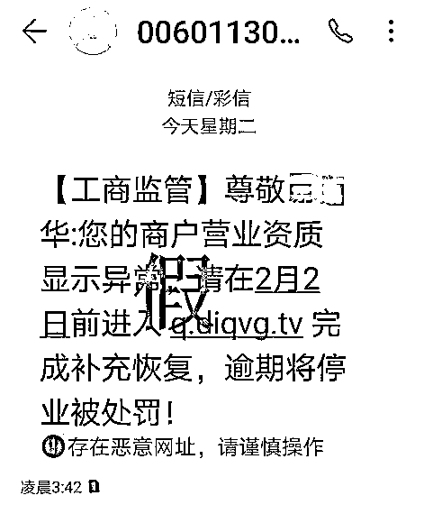

**诈骗短信千千万**

**勿被套路是王道**

诈骗短信通过链接添加联系方式实施诈骗诈骗网站的页面做得十分具有诱导性，一旦点开容易被误导，上当受骗。添加联系方式后也会用各种套路引诱你步入陷阱。所以……**千万别点开链接！！！****千万别添加联系方式！！！**

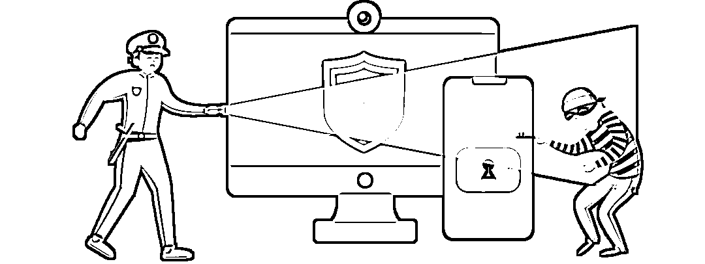

反诈中心提醒

**“钓鱼”短信不要点**

短信中的链接可能含有木马病毒，会自动获取手机最高权限，从而盗刷第三方软件中绑定的银行卡内资金。**切莫随意添加陌生好友**短信中的领取奖品、刷单等信息本身就是虚假的，添加对方的联系方式只会步入诈骗分子的圈套，随后以各种理由让你转账。**网上转账需谨慎**网上自称要转账才能办理的业务，很可能是骗子设下的圈套。涉及重要个人及账户信息多留心。**办理业务请找正规平台**以 ETC 业务为例，大家可以直接到各大银行网点进行办理，有疑问也可以直接向当地银行营业厅咨询。**提高警惕，避免上当受骗！！！**

**防骗牢记 8 个凡是**

1、凡是网上邀你刷单、充值、投注做任务的，都是诈骗！2、凡是说可以为你贷款但说你银行卡号填错交钱解冻或让你交手续费、刷流水等的，都是诈骗！3、凡是在网上加你为好友带你投资理财赚大钱声称高回报高收益、有大师带队、内幕消息的，都是诈骗！4、凡是微信、QQ 上好友自称是你的亲朋、领导向你借钱或让你转账的，都不可信！5、凡是说你网购的商品有质量问题或者包裹丢失，要为你退款理赔的，都是诈骗！6、凡是自称警察或社保中心，说你涉嫌犯罪，要求你配合调查进行资金检查或索要银行卡密码、验证码的，都是诈骗！7、凡是在电话、短信中索要个人信息、银行卡信息和验证码的，都是诈骗！8、凡是陌生链接、二维码，叫您点开查看或者填写个人信息的，都是诈骗！

应对诈骗，一招制敌

**不转账**

擦亮眼，绷根弦，防诈骗，入心间

来源：阻击诈骗，邯郸市反诈中心

← 向右滑动与灰产圈互动交流 →

