# 法院判了！朋友圈骂人，判赔 18800 元

> 原文：[`mp.weixin.qq.com/s?__biz=MzIyMDYwMTk0Mw==&mid=2247521161&idx=1&sn=b78e09d99832006e0c8ec61cb4c299f6&chksm=97cb58b1a0bcd1a733625f515f20a9b0dd91cdcd901865a9317d61f3a95602574b6397ea2c27&scene=27#wechat_redirect`](http://mp.weixin.qq.com/s?__biz=MzIyMDYwMTk0Mw==&mid=2247521161&idx=1&sn=b78e09d99832006e0c8ec61cb4c299f6&chksm=97cb58b1a0bcd1a733625f515f20a9b0dd91cdcd901865a9317d61f3a95602574b6397ea2c27&scene=27#wechat_redirect)

微信 

作为被很多人喜欢的社交工具

其朋友圈功能

也成为人们分享生活点滴的

一个重要平台

平时生活上有什么不顺心的事

或遇到了什么奇葩人

总忍不住在朋友圈抱怨一下

甚至是“口吐芬芳”

但大家也要注意，网络并非法外之地

 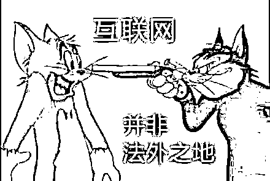

这不 

有人在朋友圈骂人

被起诉到法院了

近日，法院判了

近期，深圳市福田区人民法院判决一起案件，一深圳市民因在朋友圈骂人长达两年，**被判公开赔礼道歉，赔偿 18800 元。**

到底怎么回事？

我们一起来看看

**在朋友圈骂人长达两年**

**深圳一男子被起诉**

据介绍，李某的孩子和孙某的孩子是同班同学，李某和孙某通过家长群结识多年，互相信任。

一日，李某的妻子和孙某萌生了创业的想法，两人一拍即合，决定共同出资成立某管理公司。后该公司遭遇经营风险，李某家庭因此面临重大经济损失，李某和孙某两家关系也破裂了。

为了泄愤，自 2019 年 1 月起，李某相继在自己的微信朋友圈以文字或图片的形式发布大量针对孙某的侮辱性言论。发布朋友圈时，李某的好友人数有 1200 左右。

孙某（下称“原告”）认为，李某（下称“被告”）在朋友圈长时间对自己人身攻击，甚至用侮辱性语言丑化自己，有损自己的名誉和人格尊严，给自己的生活、工作造成严重的负面影响，遂诉至福田法院。

**法院：以书面形式赔礼道歉**

**赔偿 18800 元**

近日

针对这件事，法院判了

福田法院认为——

名誉是对民事主体的品德、声望、才能、信用等的社会评价，民事主体享有名誉权，任何组织或者个人不得以侮辱、诽谤等方式侵害他人的名誉权。行为人以上述方式损害他人名誉并足以使他人的社会评价降低的，属侵害名誉权的行为，应承担侵权责任。

自 2019 年 1 月起，被告在其对外发布的数十条朋友圈中，使用一系列粗俗性语言侮辱原告，构成对原告名誉权的损害，并足以使原告的道德等社会评价降低，法院确认被告侵害原告名誉权。

根据法律规定，人格权受到侵害的，受害人有权请求侵权人停止侵害、消除影响、恢复名誉、赔礼道歉，并可以要求赔偿财产损失和精神损害抚慰金。

庭审时，被告已删除朋友圈中的涉案文字、图片。

对于原告要求被告赔礼道歉的诉求，法院认定于法有据，被告应以书面方式进行赔礼道歉，即在微信朋友圈向原告发表道歉声明。

同时，考虑到被告侵权时使用的文字内容不堪入目且侵权时间跨度长达两年，被告对原告名誉权的侵害必然给原告造成持续性的精神痛苦，法院酌情认定被告应赔偿原告精神损害抚慰金 3000 元。

关于原告请求被告赔偿其为此次诉讼支出的公证费 800 元、律师费 15000 元，法院认为，上述费用系原告为此次诉讼所支出的合理必要费用，且有相应票据予以佐证，符合相关法律规定及《广东省物价局、司法厅律师服务收费管理实施办法》的规定，法院予以支持。

** 综上，福田法院判决 **

**▼**

一、被告应以书面形式向原告赔礼道歉（道歉内容须经过法院审查，并在被告的微信朋友圈向原告发表道歉声明，刊登时间不少于 30 日）；如被告未按本判决指定的期间履行上述指定行为，法院则将本判决的主要内容刊登于深圳地区发行的报刊上，所产生的费用由被告负担；

二、被告应向原告赔偿精神损害抚慰金、公证费、律师费共计 18800 元。

该判决作出后，双方均未上诉，目前，本案已经生效。

**网友看后**

**表示大快人心**

**▼**

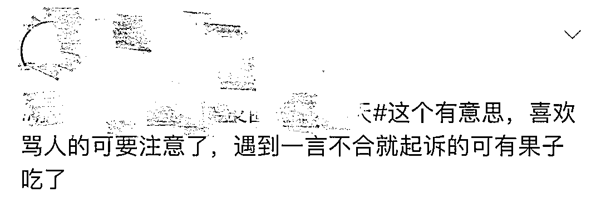

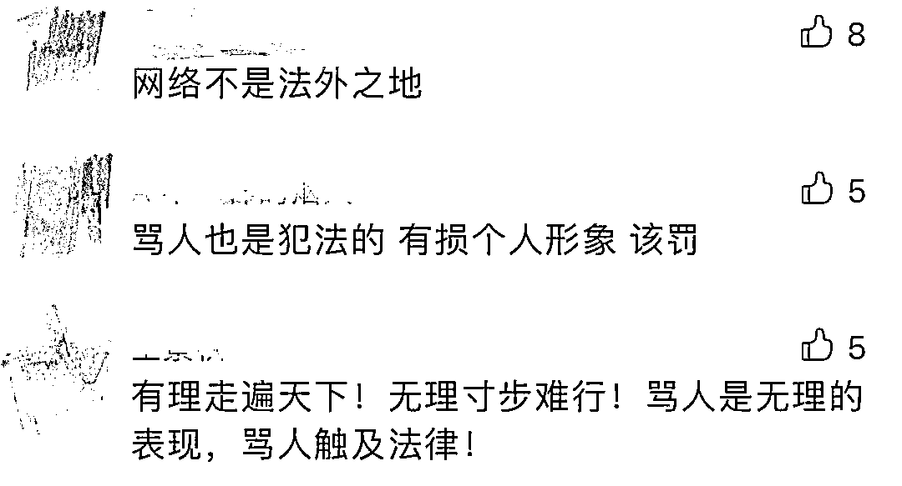

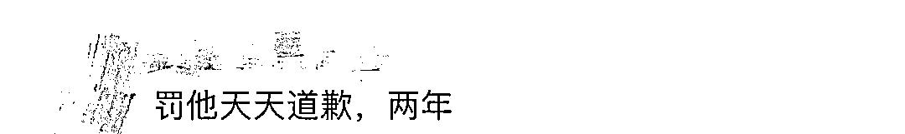

其实

在朋友圈骂人被起诉的事情

此前也发生过

**1**

**男子在朋友圈骂人**

**被判朋友圈道歉 10 天**

据浙江温州市瓯海区人民法院消息，2019 年 6 月，因为业务发展需要，张某将公司的洗车精洗美容业务承包给李某后双方在合作中出现了矛盾，生气的李某在朋友圈，发布了这么一条动态辱骂张某。

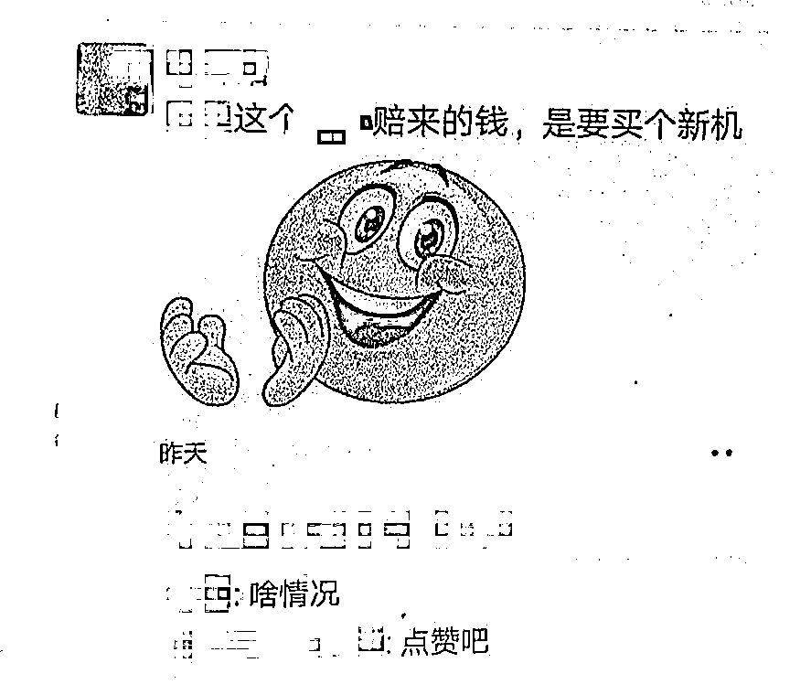（打马赛克部分，带有侮辱性）

张某认为李某的行为有损其名誉和人格尊严，将其起诉，要求其删除发布的侵犯名誉信息，并在朋友圈公开赔礼道歉，赔偿精神损害抚慰金 1 万元。

随后，浙江温州市瓯海区人民法院，判决小李以不屏蔽任何人的方式公开发布微信朋友圈向小张赔礼道歉，道歉内容至少保留十日。

**2**

**男子在朋友圈骂人被罚 1000 元**

据重庆市合川区人民法院消息，柳某与皮某是微信好友，2019 年 1 月 28 日晚，皮某在微信朋友圈中发表言论，称柳某“破坏了别人家庭就该夹起尾巴做人！”“接受了高等教育的人到头来当**等言论，同时配有柳某照片一张。

当天，柳某委托律师向皮某发出律师函，要求皮某删除针对柳某的所有不当言论，并在微信平台公开发布道歉信息。皮某收到律师函后，删除了自己于 1 月 28 日在微信朋友圈发布的内容，但双方就赔礼道歉、赔偿损失等未达成一致意见。因此，柳某诉至合川法院。

随后，法院判决皮某立即删除 1 月 30 日在微信朋友圈中所发布针对柳某的不当言论，并于判决生效后 3 日内赔偿柳某精神损害抚慰金 1000 元，同时在微信朋友圈中发表道歉声明。

如今的朋友圈“身兼数职”

除了是一个社交平台外

还是人们发泄个人情绪的“出气筒”

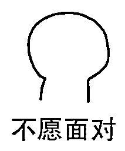

那么朋友圈发布的言论

达到何种程度

构成侵犯名誉权呢？

这些行为

侵犯名誉权

所谓名誉权，是指公民或法人保持并维护自己名誉的权利。

*   侵犯名誉权的行为，客观上存在损害他人名誉的事实，传播损害他人名誉的虚假言辞，并为第三人知悉，包括：

(1)以语言或行动，公然损害他人人格、毁坏他人名誉，比如不当的言词评价、贬低和毁损相对人的人格，但不涉及“事实”的真实性问题;

(2)捏造并散布虚假事实，破坏他人名誉;

(3)故意披露、散布法律所保护的他人私生活信息。

*   其次，从主观过错方面来看，行为人存在实际恶意，并在客观上造成他人的社会评价降低。

*   再者，受害者应为特定的人，不管是行为人指名道姓，还是指桑骂槐，只要在特定的环境和条件下，能够确定被侵害对象，同样构成侵害名誉权。

*   最后，侵权行为给受害人名誉造成严重损害，使得受害人精神和心灵遭受创伤，尤其是公众对其社会评价降低，带来的不良影响。

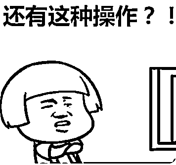

所以即使在朋友圈发布不实消息，哪怕指桑骂槐，若能对应当事人，造成当事人的社会评价降低，依然构成侵犯名誉权，受害人有权诉请法院，责令侵权人停止侵害、恢复名誉、消除影响、赔礼道歉、赔偿损失。

大家要注意

发朋友圈

**还有这些“注意事项”**

**这些内容一定不能发**

**1、谣言**

在不掌握真实情况前，一定不可盲目散布、转发谣言。

对未经核实的信息，不要随意转发，更不要故意“杜撰改编”，否则，将承担相应法律责任。对故意传播、散布谣言信息的，公安机关将依法严惩。

**2、谩骂**

如今，微信朋友圈就像是我们的“日记本”，记录着我们生活中的点点滴滴，越来越多的人会在微信朋友圈上分享开心的事、吐槽不爽的事…….但如果你在微信朋友圈里骂人，那可是会给自己惹来麻烦的。严重时，甚至构成违法行为。

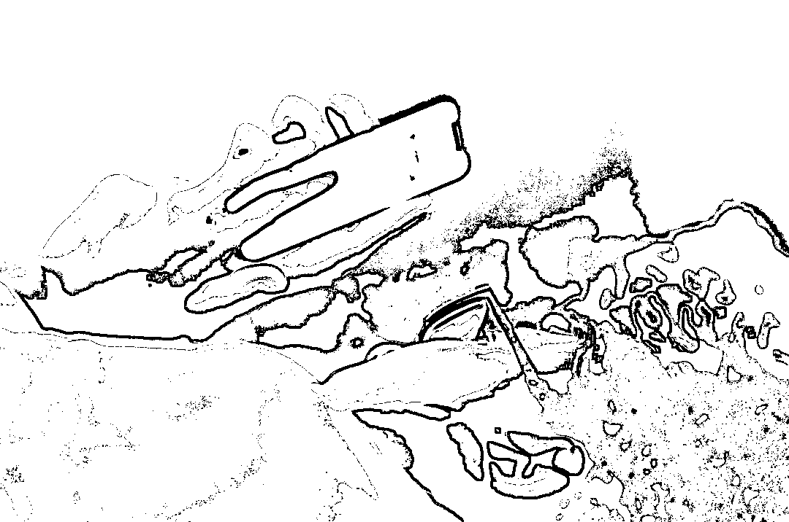

**这些内容慎发**

发朋友圈已成为许多人生活的一部分 

可你知道吗？

一些信息一旦被人利用

后果不堪设想

哪些东西不能轻易晒？

发朋友圈要注意什么？

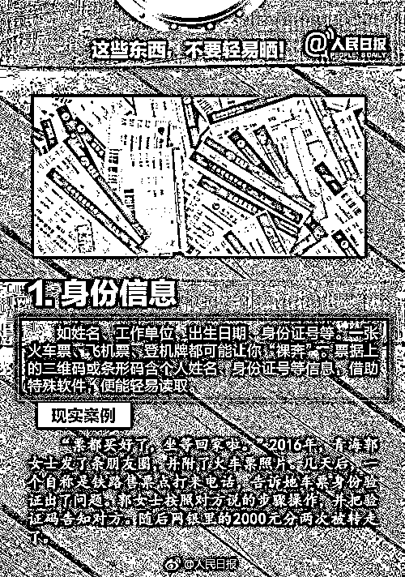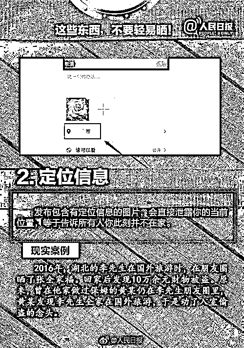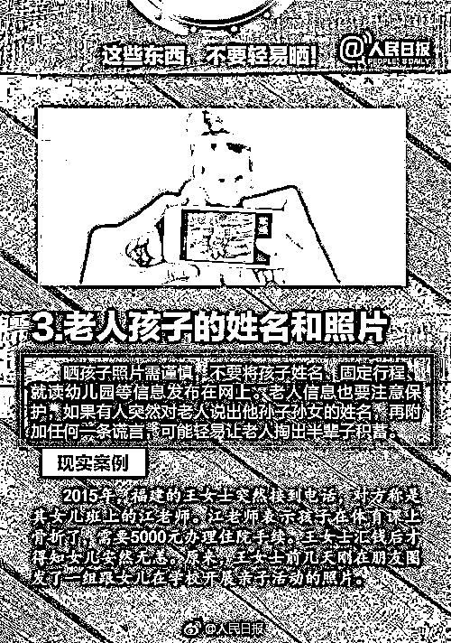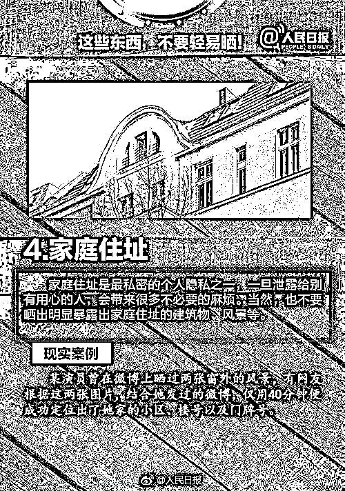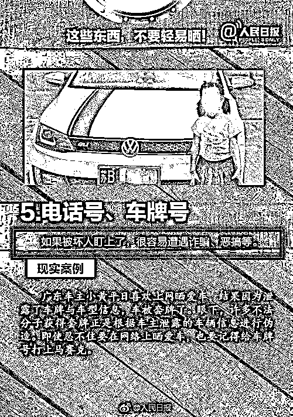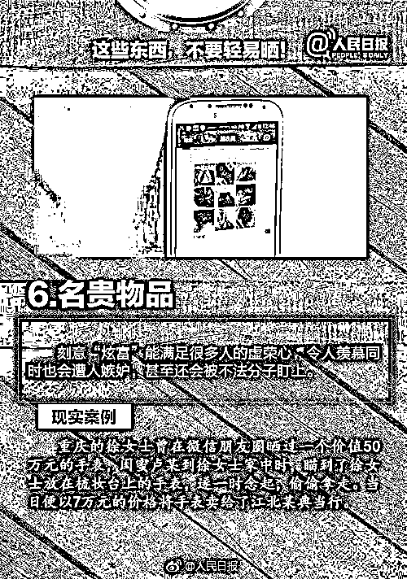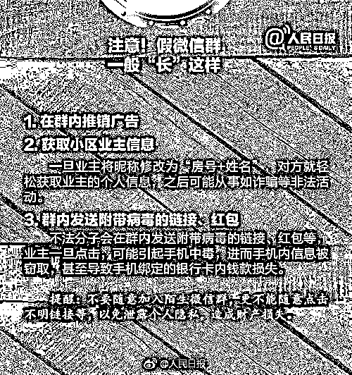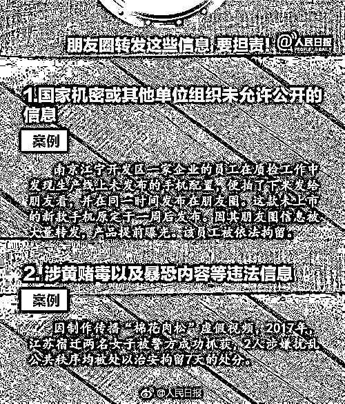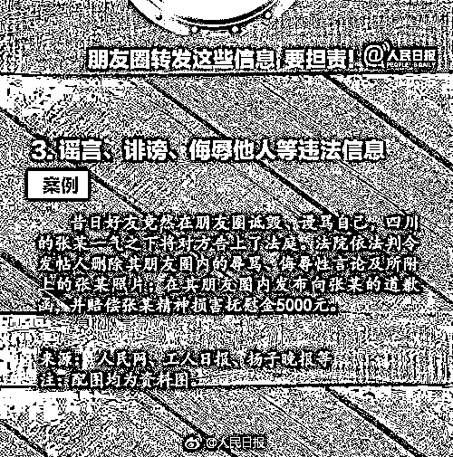

来源：芒果都市，利箭在行动

← 向右滑动与灰产圈互动交流 →

