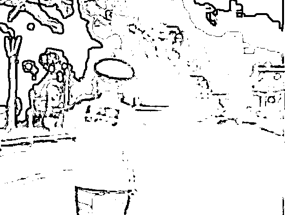
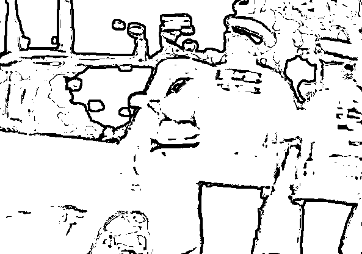
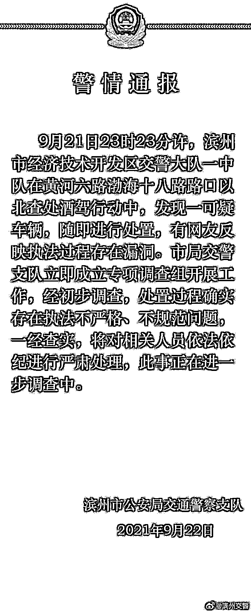

# 交警直播夜查酒驾放行“省公安局人员”？官方通报来了

> 原文：[`mp.weixin.qq.com/s?__biz=MzIyMDYwMTk0Mw==&mid=2247521161&idx=2&sn=6c59ccc88c5fca846837cd0ed602fff6&chksm=97cb58b1a0bcd1a7592e2b33024b15ea8a151a05eac529bd949b056817833a25046b8314ef74&scene=27#wechat_redirect`](http://mp.weixin.qq.com/s?__biz=MzIyMDYwMTk0Mw==&mid=2247521161&idx=2&sn=6c59ccc88c5fca846837cd0ed602fff6&chksm=97cb58b1a0bcd1a7592e2b33024b15ea8a151a05eac529bd949b056817833a25046b8314ef74&scene=27#wechat_redirect)

现在的直播，什么都有

那可真是热闹~

而警察蜀黍们也掌握“流量密码”

**开直播查酒驾**

效果也是杠杠滴！

不过

最近却有交警

疑似在夜查酒驾直播中

**翻车了……**

**把喝酒了的“公安局”人员** 

**给放走了？？**

[`mp.weixin.qq.com/mp/readtemplate?t=pages/video_player_tmpl&action=mpvideo&auto=0&vid=wxv_2058567934452514816`](https://mp.weixin.qq.com/mp/readtemplate?t=pages/video_player_tmpl&action=mpvideo&auto=0&vid=wxv_2058567934452514816)

到底怎么回事？

↓↓↓

昨天（21 日）晚上

山东滨州市经济技术开发区

交警大队一中队

在直播查酒驾行动中

**发现一可疑车辆开着远光灯**

**停在原地**  

这时

几名交警马上跑上前询问

车上一名女子说

“我是咱省公安局的，他喝了点酒开车，我怕出事儿，就换过来了。”

随后在说笑声中

这辆车辆被现场的交警放行

而直播女主持人也说

这是一场**误会**，**“女驾驶员比较紧张”**

这段视频在网络热传后 

很多网友对交警执法提出质疑

今天（22 日）

滨州交警就此事发布警情通报称 

有网友反映执法过程存在漏洞，**经初步调查，处置过程确实存在执法不严格、不规范问题**，一经查实将对相关人员进行严肃处理。

警方通报说了

现场交警在处置过程

确实存在**执法不严格、不规范**问题

相信后续还会有处理结果

不过

公共君还是那句老话

交警查酒驾，真的是为**大家安全**着想

万一要是出什么事

你连后悔药都没有了

**总之，持续关注！**

来源：滨州交警、新京报、北京青年报

← 向右滑动与灰产圈互动交流 →

