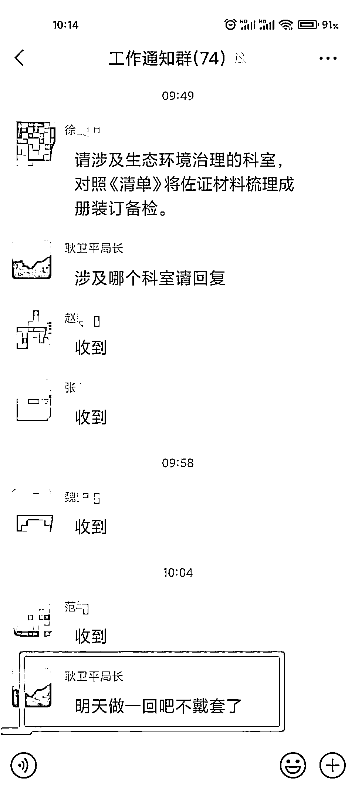

# 一局长在 74 人工作群发情色消息

> 原文：[`mp.weixin.qq.com/s?__biz=MzIyMDYwMTk0Mw==&mid=2247521161&idx=3&sn=ed0b61eec30a7903690170c98be78fe6&chksm=97cb58b1a0bcd1a77cdd30afd77ba7130e00a359d5b8db951697595dc3144df49c15debf1f2a&scene=27#wechat_redirect`](http://mp.weixin.qq.com/s?__biz=MzIyMDYwMTk0Mw==&mid=2247521161&idx=3&sn=ed0b61eec30a7903690170c98be78fe6&chksm=97cb58b1a0bcd1a77cdd30afd77ba7130e00a359d5b8db951697595dc3144df49c15debf1f2a&scene=27#wechat_redirect)

9 月 23 日晚，针对此事，邢台市委书记钱三雄短信回应新京报记者称，将转给市纪委核实。

**9 月 22 日，一微信显示名称为“耿卫平局长”的人在一个 74 人的“工作通知群”中发言说“明天做一回吧不戴套了。”群聊截图在网上流传后引发热议。**

**新京报记者查询发现，耿卫平为邢台市任泽区住建局局长。9 月 23 日，邢台市任泽区住建局办公室一名工作人员证实，该局局长确实叫耿卫平，并且群聊中发言的几名人员也是该局工作人员。任泽区纪委信访办一名工作人员称，今日曾有多人反映此事，如果要举报可以网上投诉。9 月 23 日晚，针对此事，邢台市委书记钱三雄短信回应新京报记者称，将转给市纪委核实。**

****

**▲“耿卫平局长”在“工作通知群”中的发言。网传图片**

**据群名为“工作通知群”的聊天记录显示，该群共 74 人，徐姓工作人员发布了与工作相关的消息：“请涉及生态环境治理的科室，对照《清单》将佐证材料梳理成册装订备检。”随后群名称为“耿卫平局长”的人跟着回应：“涉及哪个科室请回复。”赵姓、张姓、魏姓、范姓 4 名工作人员回复后，“耿卫平局长”紧接着发送消息称：“明天做一回吧不戴套了。”**

**新京报记者查询发现，耿卫平为邢台市任泽区住建局局长。9 月 23 日，新京报记者从邢台市任泽区住建局办公室一名工作人员处核实到，该局局长确实叫耿卫平，并且群聊中发言的几名人员也是该局工作人员。**

**据邢台市任泽区人民政府官网 2021 年 4 月发布的消息显示，耿卫平系该区住建局党组书记、局长，并担任邢台市任泽区保障性安居工程领导小组副组长。**

**据上述网站 9 月 22 日消息，9 月 18 日晚，邢台市任泽区生态治理重点工作推进会议召开，相关区直单位负责人参加会议。**

**9 月 23 日，新京报记者致电任泽区纪委信访办，该办公室工作人员回应称，今日曾有多人反映此事，如果要举报可以网上投诉或发送邮件，记者问询邮箱号码，对方称不清楚，随后挂断电话。**

**9 月 23 日晚间，一名自称是耿卫平局长同事亲戚的中间人给记者打来电话，对截图解释称，“这个传出去的东西，肯定和真实情况有差距。”但对于真实情况如何，对方并未做出回复。**

**新京报记者就此事致电任泽区区长、任泽区区委宣传部门，截至发稿均未获得回应。**

**来源：新京报**

****

**← 向右滑动与灰产圈互动交流 →**

****