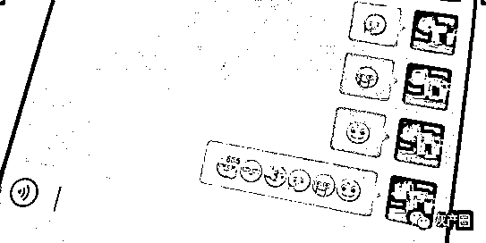

# 你发的这些表情，都可能成为“呈堂证供”

> 原文：[`mp.weixin.qq.com/s?__biz=MzIyMDYwMTk0Mw==&mid=2247521161&idx=4&sn=27b99e776ba52faf87e9af3dbe31ec02&chksm=97cb58b1a0bcd1a7176779e95380f128edb33e7e6113b006d96e61abb52d03fa8105891ab2f6&scene=27#wechat_redirect`](http://mp.weixin.qq.com/s?__biz=MzIyMDYwMTk0Mw==&mid=2247521161&idx=4&sn=27b99e776ba52faf87e9af3dbe31ec02&chksm=97cb58b1a0bcd1a7176779e95380f128edb33e7e6113b006d96e61abb52d03fa8105891ab2f6&scene=27#wechat_redirect)

万万没想到 

你用的表情包

可能作为证据

**在中国裁判文书网上**

**搜索到了多个相关案例**

**涉及借贷款时
**********不能代表明确认可****

**       在一份民间借贷案的判决书中，贷款人张辉锋给借款人闫浩发微信，罗列了后者的借款明细。闫浩则回了一个表情符号“****”[OK]。**

**　　这一表情符号在张辉锋看来意味着认同，但闫浩称：这个“****”不是认可张辉锋的微信内容。**

**　　安徽省太和县人民法院认为：**张辉锋提交的微信记录，没有得到闫浩的明确认可，因而该微信内容不能作为后者尚欠张辉锋相应金额的依据。****

********代表认可****

**        相对于上述判决书中的微信表情，另一些表情的含义显得较为模糊。**

**　　如在一起房屋租赁纠纷案的判决书中，承租方租赁期满后，面对出租方多次提醒、提出加租意愿，既不表示继续承租，也不表示搬离案涉房产，只是回复了一个“太阳”的表情符号。**

**　　在出租方看来，这个“****”[太阳]的表情符号意味着对加租的认可。但承租方却认为，这种认定没有事实和法律依据。**

**　　广东省深圳市中级人民法院最终支持出租方，**认为应当认定承租方同意按照加租后的标准继续承租。**同时，判决承租方承担租赁期满后相应的房屋占有使用费。 **

****

********被用作报账符号****

**      值得注意的是，在一些刑事案件的司法文书中，也出现了表情符号。**

**　　在中国裁判文书网中一份《祝志祥、邓洪伟、彭奋等组织卖淫罪二审刑事裁定书》，其中写道：刘某等人“在卖淫活动后多次向祝志祥的微信号发送微笑等表情符号用于报账”。**

**　　作为研究网络表情的学者，上海财经大学法学院副教授、副院长胡凌在接受记者采访时指出，**就国内的大多数案件而言，网络表情通常只是作为辅助证据出现，并非占决定作用。**不过，鉴于表情符号含义的模糊性，如何解读、认定网络表情的含义，确实已经成为网络时代司法者面临的挑战。**

****微信微博聊天记录可作证据****

**       最高人民法院关于修改《关于民事诉讼证据的若干规定》的决定于 2020 年 5 月 1 日起施行。**

**　　此次修改决定对电子数据范围作出详细规定，同时规定了电子数据审查判断规则，完善了电子数据证据规则体系。**

**　　根据这份修改决定，**电子数据包括网页、博客、微博客等网络平台发布的信息；手机短信、电子邮件、即时通信、通讯群组等网络应用服务的通信信息；用户注册信息、身份认证信息、电子交易记录、通信记录、登录日志等信息；文档、图片、音频、视频、数字证书、计算机程序等电子文件；其他以数字化形式存储、处理、传输的能够证明案件事实的信息。****

**　　修改决定规定，**人民法院对于电子数据的真实性，应当结合电子数据的生成、存储、传输所依赖的计算机系统的硬件、软件环境是否完整、可靠等 7 类因素综合判断。修改决定同时明确规定，电子数据的内容经公证机关公证的，人民法院应当确认其真实性，但有相反证据足以推翻的除外。****

** 来源：法政智库、山东高法、百色中院、利箭在行动**

****

**← 向右滑动与灰产圈互动交流 →**

****