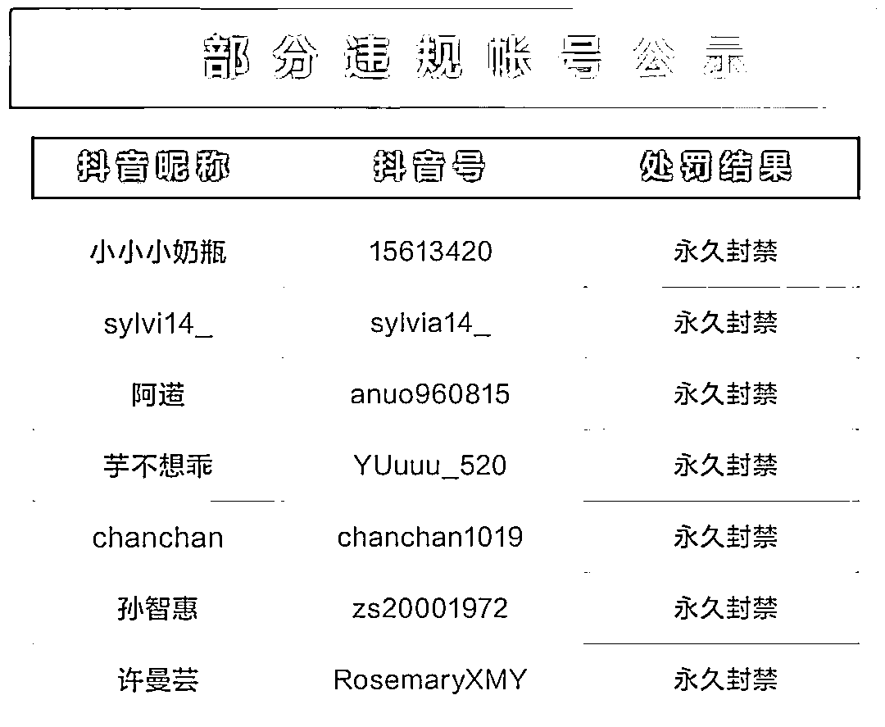
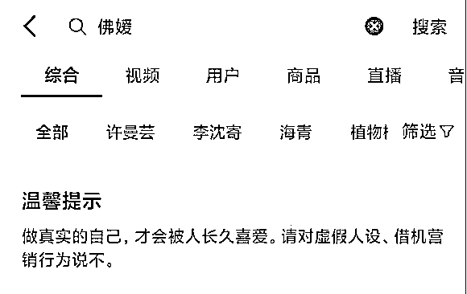
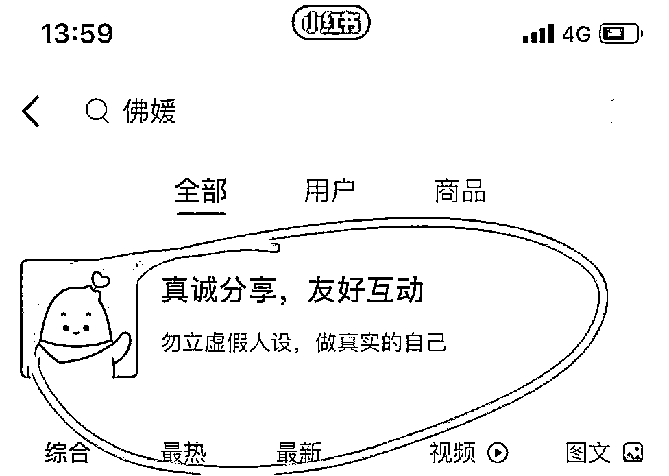
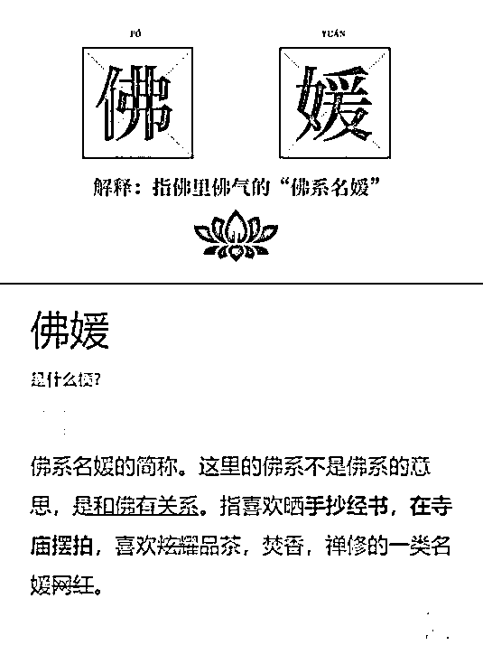
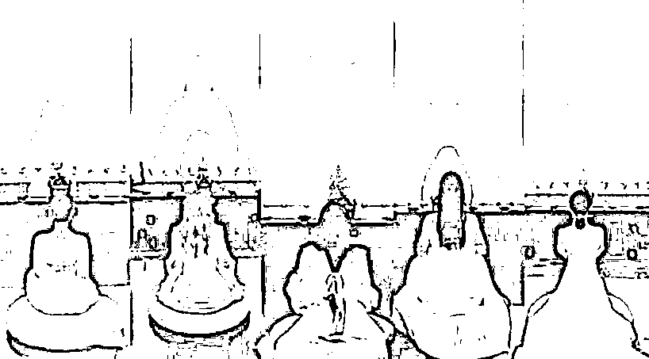
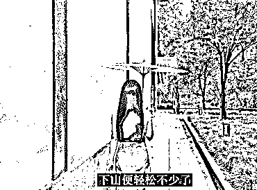
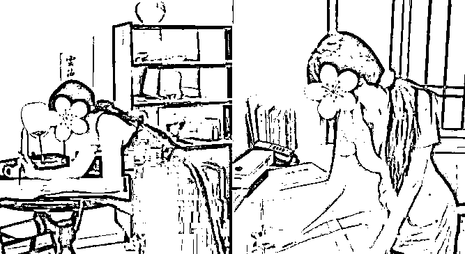
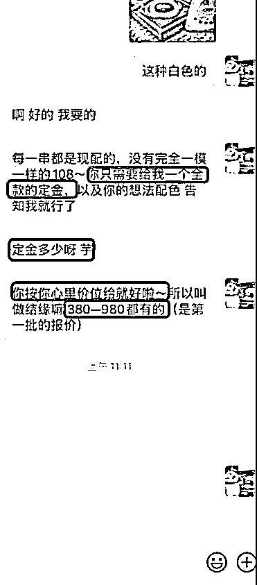
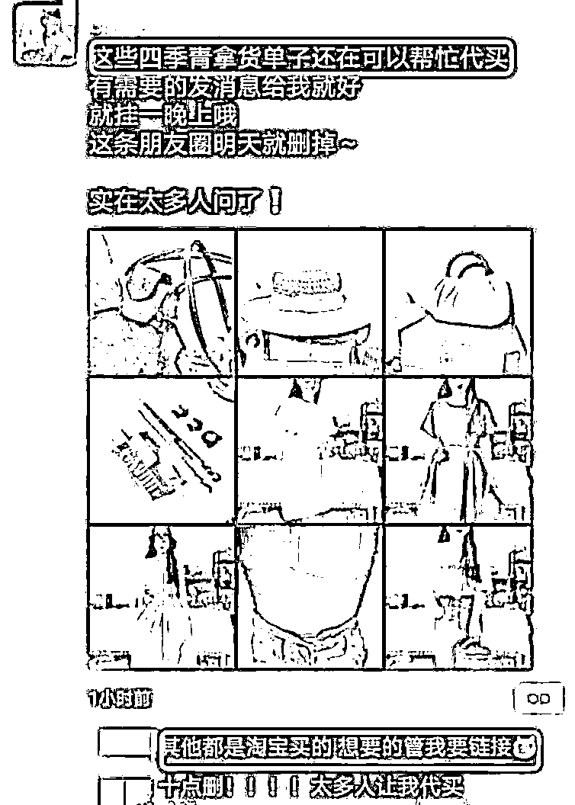

# 7 个“佛媛”账号，永久封禁

> 原文：[`mp.weixin.qq.com/s?__biz=MzIyMDYwMTk0Mw==&mid=2247521161&idx=5&sn=8b6037581b4461c8686b0ee829aa32ec&chksm=97cb58b1a0bcd1a7602b1effa6d2b62c411b88b29af4a535578c909bdd87f8396411d8a49543&scene=27#wechat_redirect`](http://mp.weixin.qq.com/s?__biz=MzIyMDYwMTk0Mw==&mid=2247521161&idx=5&sn=8b6037581b4461c8686b0ee829aa32ec&chksm=97cb58b1a0bcd1a7602b1effa6d2b62c411b88b29af4a535578c909bdd87f8396411d8a49543&scene=27#wechat_redirect)

近日，网红借佛门营销炒作，打造“佛媛”人设一事，引发社会关注。9 月 23 日，抖音、小红书等平台出手，清理、封禁了多个该类型账号。

**抖音**

经过核查，抖音共处罚利用“佛媛”形象营造人设开展虚假营销行为相关账号 48 个，其中永久封禁账号 7 个，同时，清理违规视频 148 条。 

此外，平台在搜索场景针对相关行为上线温馨提示，当用户搜索“佛媛”时，搜索结果页会提示“做真实的自己，才会被人长久喜爱。请对虚假人设、借机营销行为说不”。

**小红书**

小红书第一时间已启动专项检查，清理违规笔记 70 篇，封禁账号 3 个。 

此外，用户在搜索“佛媛”等关键词时，结果页将显示“勿立虚假人设，做真实的自己”的提示。

此前，央视网曾发文批评：**佛媛中一些人是否违法违规，应该引起有关部门的关注。一些自媒体平台，更应该负起主体责任，下架相关产品，减少甚至禁封此类营销账号。**

那么问题来了：

佛媛，是什么？

抄经、拜佛、品茶、吃素……

是佛媛日常（作秀）的标配。

她们把这些行为拍成照片或者录成视频，

发到朋友圈或者上传到视频网站打造人设。

喜欢佛学文化，是个人自由，

但一些佛媛的行为举止愈发出格。

可以看图感受一下。

很多寺院禁止拍摄

她们拍完照片拍视频

抄经礼佛需要庄重诚心

她们摆拍作秀

更甚者 

有的大 V 佛媛打造完人设

粉丝多了后

开始带货割韭菜

售卖相关服饰、串珠、手链、平安锁等

在其他网购平台几十元就能买的平安锁

佛媛在微信上卖上百元

其实

只要不违法违规，

不影响他人的生活，

每个人都可以选择自己的生活方式。

你愿意秀身材、秀包包、秀生活，

那是个人的自由。

但在宗教场所大肆摆拍，

缺乏起码的尊重。

看似与世无争，实则物欲横流，

不仅破坏了宗教场所的严肃气氛，

而且涉嫌违法违规。

我国《宗教事务条例》

第五十三条明文规定，

“禁止以宗教名义进行商业宣传”。

一些佛媛为了卖货，

大肆借佛营销，

丧失底线。 

佛，对她们而言只在人设里、

在流量工具里、在财富密码里，

唯独没在心里。

如此吃相，未免也太难看了。

来源：澎湃新闻综合自@中国新闻网、央视网

← 向右滑动与灰产圈互动交流 →

