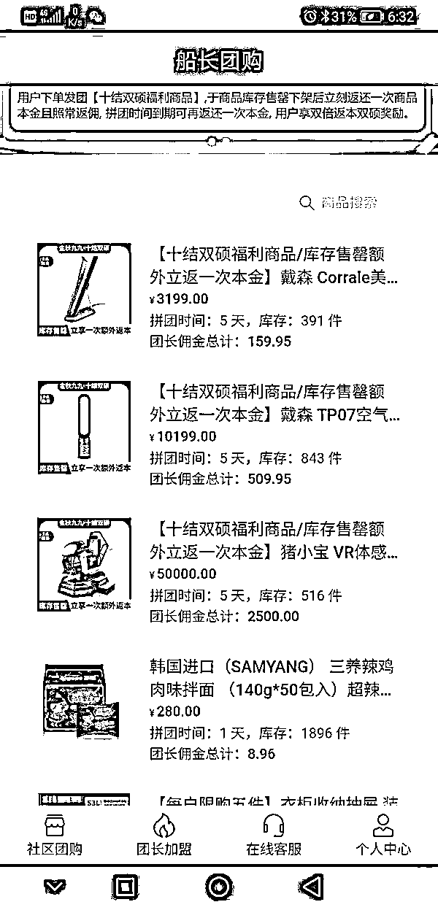
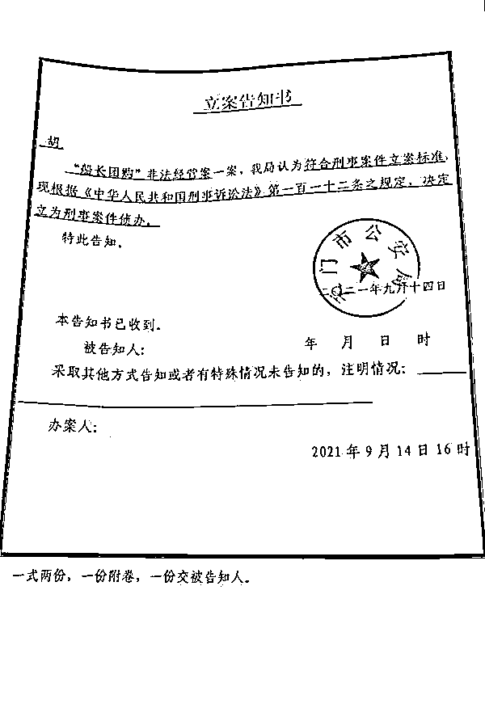
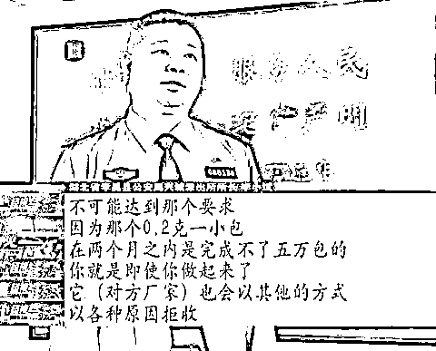

# “当团长轻松赚佣金”的软件突然打不开了！有人被套几十万！

> 原文：[`mp.weixin.qq.com/s?__biz=MzIyMDYwMTk0Mw==&mid=2247521161&idx=7&sn=00789d7977beb3b2854d38a0d97365cc&chksm=97cb58b1a0bcd1a74431a722b3106223e6230c4ce6f6eeda7d1c2b6c8a525d22336b4eddc5f0&scene=27#wechat_redirect`](http://mp.weixin.qq.com/s?__biz=MzIyMDYwMTk0Mw==&mid=2247521161&idx=7&sn=00789d7977beb3b2854d38a0d97365cc&chksm=97cb58b1a0bcd1a74431a722b3106223e6230c4ce6f6eeda7d1c2b6c8a525d22336b4eddc5f0&scene=27#wechat_redirect)

**“用‘船长团购’App，轻轻松松做副业，0 成本月收入可达万元”？**

近日，湖北的胡先生向媒体反映，8 月底，他在网络平台上看到了这条诱人的 App 宣传广告，随后下载使用，不想却遭遇“陷阱”。

胡先生说，从 9 月 9 号晚上开始，这款 App 再也打不开了，胡先生投入的钱也无法兑现，他立即向所在地警方报案。胡先生提供的转账凭证显示，他投入了 58 万元，他称，这些钱都未来得及提现。

湖北天门市公安局 9 月 14 日出具的立案告知书显示，**“船长团购”非法经营案已被立为刑事案件侦办。**

号称“能赚钱的团购 App”突然关闭

胡先生告诉记者，自己 8 月份时从网络上了解到这款名为“船长团购”的应用软件。相关宣传文章称，使用这款软件可以轻松赚钱。

胡先生说，这款软件赚钱的模式是**“当团长，赚佣金”。**点开软件中“团长加盟”模块，就能看到供拼团的商品。商品种类包括火鸡面、小型家电、桌椅板凳等等，价格在几百到千元不等，**越贵的商品可获得的佣金就越多**，从几块到几十块不等。充值并购买商品后即成为“团长”，发起拼团后，平台会自动安排成团。

不同商品的成团周期也不同，价值高的商品成团周期会略长一点，**拼团成功后，系统会将本金和佣金返还，用户可提现。**

胡先生在船长团购上的第一笔“生意”发生在 8 月 21 日，他向记者提供的转账记录显示，他在当日上午充值了 278 元。他回忆，自己充值后，软件给了 28 元的首充奖励，随后他花费 200 余元购买了火鸡面商品，成为了团长，发起了拼团。仅一天时间，他就收到了本金和几块钱的佣金奖励。**尝到甜头后，他加大充值频率和充值金额，购买了越来越多的商品并发起拼团。**

虽说是团购，但胡先生称，**他从没收到过任何商品，他也不清楚平台安排的参团人，是否收到过商品。**

“9 月开始，平台的奖励更大了。”胡先生表示，“什么金秋活动，金九银十宣传了很多”，平台加大了返佣金的力度。9 月 9 日白天，平台又上架了三款商品，价格分别为 3199 元、10199 元和 50000 元。平台宣传信息显示，团长能收到高额佣金和双倍本金。这让胡先生动心，当天他又充值了 8 万余元。

9 月 9 日，平台上线了新产品，宣称可有机会“双倍返本”。受访者供图

**而 9 日晚上，他突然发现，这款 App 再也打不开了。胡先生提供的转账记录显示，他累计向该平台充值了 58 万余元，他称，这些钱未来得及提现。**

在深圳工作的林先生称有和胡先生同样的遭遇，他在 7 月底时开始使用船长 App，同样，靠发起火鸡面拼团赚来了第一笔佣金。随后，他在 8 月份又充值了三笔，累计两千余元，用来购买商品发起拼团，也都分别成功领到了本金和佣金，并顺利提现。这让他对平台十分信任，9 月份，看到平台发起的福利活动后，他加大了投入，从 9 月 2 号到 9 月 9 号期间，累计充值了一万余元，而后平台关闭，投入的资金石沉大海。

9 月 15 日、16 日，记者多次拨打船长团购客服电话，均提示人工坐席繁忙，无人接听。

天门警方出具的立案告知书。受访者供图 

该 APP 冒用其他公司名义与受害者“签合同”

发现疑似被骗后，胡先生立即向所在地区警方报案。湖北天门市公安局 9 月 14 日出具的立案告知书显示，“船长团购”非法经营案已被警方立为刑事案件侦办。深圳工作的林先生告诉记者，他也已经向所在地派出所报案。

记者注意到，胡先生和林先生提供的平台转账记录显示，**收款人均为个人账户而非公户，且收款人经常变化。**胡先生称，此事涉及多名用户，他们建的群中，曾有用户就收款账户问题询问在线客服，截图显示，在线客服对此解释称，是“为确保用户资金安全，避免资金池沉淀，平台收款账户为三方监管银行指定的个人监管账户，平台不得使用公司账户给用户充值”。对于佣金的来源，客服则解释称，佣金仅是发起拼团商品订单总售出商品利润的一小部分。

此外值得注意的是，每完成一笔交易，平台都会生成一份电子合同。上面写明了产品名称、所购商品金额、参与人姓名和身份证号等信息。并约定了佣金率及到期日，还款方式为每日复利返佣，到期返本。

合同落款处甲方为购买人，乙方为浙江问见电子商务有限公司。并由丙方中国投融资担保股份有限公司担保。然而，记者查询中国投融资担保股份有限公司官网发现，**该公司早在 8 月时就曾发布了声明，称其从未与“浙江问见电子商务有限公司”、“船长团购”等任何下单返佣平台开展过任何合作或者签署过任何合同及协议书，上述电子合同冒用其公司名义，伪造其公司印章。**

全国企业信息公示系统显示，浙江问见电子商务有限公司成立于 2018 年 3 月，注册资本 1000 万人民币，法定代表人乐凯华，注册地位于浙江省舟山市普陀区。记者联系到了浙江问见电子商务有限公司所在的浙江舟山市普陀区军创园一周姓负责人，其透露，**浙江问见电子商务有限公司也是被冒名，公司已经报警。**

反诈民警：类似骗局不少见，请投资者提高警惕

长沙市反诈中心民警赵照向记者谈了他的看法，他介绍，该骗局类似早些年的“买手机看广告”类的非法传销、集资平台，受害人听信平台宣传，以为买一台手机，每天躺在家里看看新闻，点点广告就能获取高额广告收益分成，早期尝到平台给的一些甜头后，为了赚取更多佣金分成和收益，拉拢亲友加入平台，投入重金投资，最后平台一夜之间人去楼空，投资人损失惨重。

赵照说，随着近两年移动互联网的飞速发展，这类平台又披上了“在家赚”“兼职刷单”“会员电商””“数字货币手机挖矿”等各类概念外衣，以高额利润回报为诱饵，融合非法集资、非法传销、刷单诈骗等多种犯罪手法，疯狂收割投资者和加盟者的资金。

“投资需谨慎，投资者切忌相信网络上各种新概念的高额投资回报承诺，到非正规平台进行资金交易和投资。“赵照提醒。

**新闻链接** 

**警惕！这类“赚钱副业”都是骗局！** 

“简单手工活在家做，两个月就能赚到 50000 元”

“您在 XX 平台购物信誉良好，刷单就能无本挣大钱”

“全国急招优惠券运营，官方扶持带你稳赚 300 元/天”

…… 

**别信！这些都是套路！套路！** 

**警惕新型电信诈骗！**

**案例一：在家动手就能赚钱？骗局！**

家住湖北孝昌的居民刘某是一名家庭主妇，在一次手机上网的过程中，她无意中看到了一则有关艾草包加工的广告：“提供机器和原料，在家加工分装，每袋 9 分钱工钱，月入轻松过万”。

刘某加了“厂家”微信，一步步陷入骗局。对方先让她交了 300 元“诚意费”，给她寄去了原材料，接下来让她再交 3000 元“约束费”，并称完成了任务就可以退回 3000 元。 

而当刘某开始了加工一段时间，渐渐意识到有些不对：当她把加工好的产品寄回给厂家后，厂家就会以这样那样的理由拒绝收货，3000 元的“约束金”和自己的工钱根本要不回来。于是，刘某选择报警求助。

当地警方调查发现：这个诈骗团伙正是利用受害人企图用小成本博取大收益的心理，一步步骗取了受害人的信任，将其引入早已布置好的陷阱。诈骗分子提出的所谓高价回收加工产品其实只是引诱受害人上钩的诱饵而已。而受害人永远不会想到的是，他们按要求辛苦加工两个月的劳动成果，诈骗团伙收到后就搁置一旁，甚至瞧都不会瞧上一眼，又何谈用 50000 元人民币来回收呢？

2021 年 3 月，湖北孝昌警方破获了这起新型的电信诈骗案件，本案中诈骗团伙在短短 40 天时间里，诈骗了多名受害人 72 万余元。

**案例二：优惠券刷单稳赚 300 元/天？**

“家中创业，稳赚 300 元/天……”“全国急招优惠券运营，官方扶持带你稳赚 300 元/天。”家住江苏盐城市阜宁县的张女士在一个招聘 App 上看到这样一则兼职招聘信息。抱着“看一看”的心态，张女士添加了广告末端的优惠券咨询师“张老师”的微信。

“3 天不到赚了 678 元”“上月收入 7108 元”“半年时间已过 5 万元”……一个多月时间里，张女士每天关注着“张老师”发出的“收益图”，她慢慢放松了警惕。于是，她主动联系“张老师”要做推广，很快支付了 2888 元，用于 App 与网络商城的“搭建费”。

几日后，并未实现“日进斗金”的张女士，又向“张老师”讨教赚钱“经验”。“张老师”则向她推荐了一位“金牌顾问”，对方建议张女士开通 VIP，官方“机器人”可以在微信群里定向“吸粉”。“金牌顾问”还称，“机器人”在托管状态下还能提供“刷单”服务，坐收佣金。

张女士信以为真，再次转给对方 4000 元用于开通 VIP。之后两个月，她发现“机器人”并没有提供托管服务，“金牌顾问”也无法联系。2020 年 3 月，张女士向当地公安局报案求助。

警方提醒：“‘搭建费’实际上是兼职‘刷单’类诈骗中缴纳保证金、入会费的变种，都是骗人的把戏。想兼职应聘，千万不能有‘贪图便宜’‘轻松赚大钱’的心理，足不出户、点点鼠标就能获取丰厚回报，这些都是骗子抛出的‘空中楼阁’。”

**千万记住了！**

**天上不会掉馅饼！** 

**一切“刷单、轻松赚大钱”的都可能是诈骗！**

**警惕！警惕！再警惕！**

来源：广州日报综合澎湃新闻、湖北经视、盐城晚报、利箭在行动

← 向右滑动与灰产圈互动交流 →

