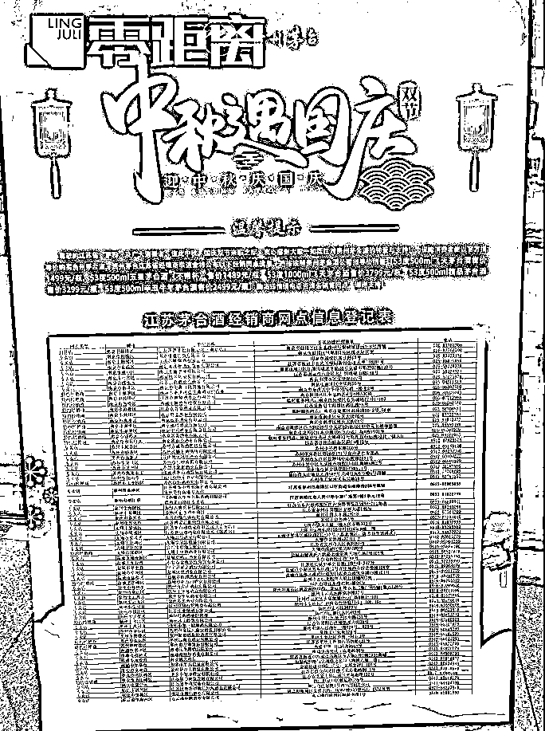
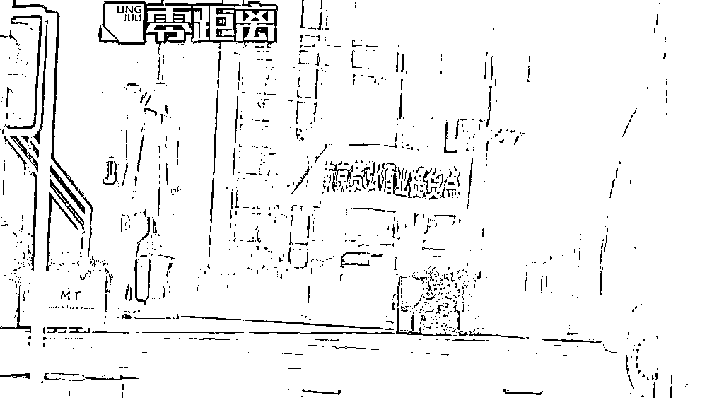
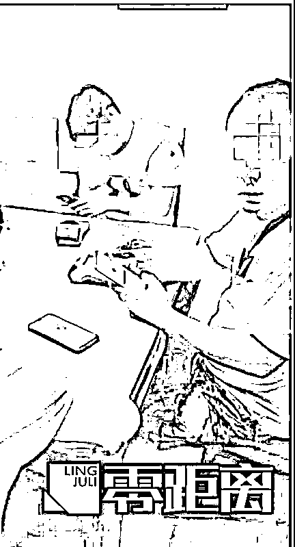
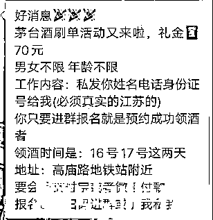
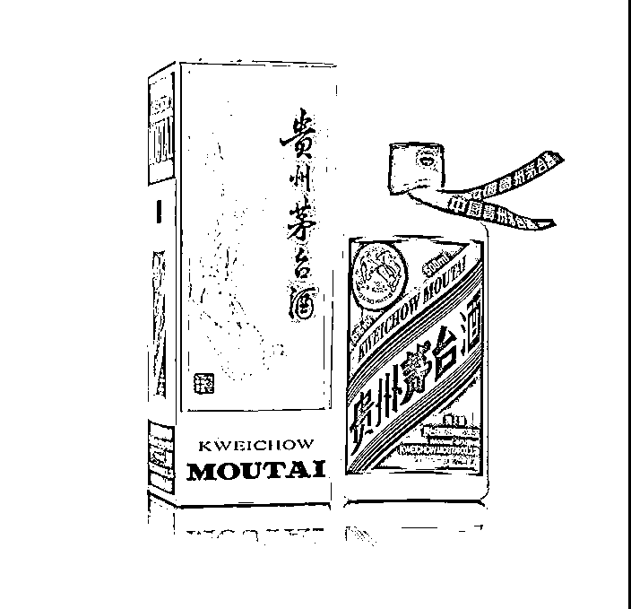

# 揭秘灰色“产业链”：原价茅台酒究竟去了哪？

> 原文：[`mp.weixin.qq.com/s?__biz=MzIyMDYwMTk0Mw==&mid=2247521224&idx=3&sn=11be23dc20bfab0e55e828d35015c188&chksm=97cb58f0a0bcd1e6995fcaaad712e01d719d81e34aebb51e8b28bef326538601e8b513e61043&scene=27#wechat_redirect`](http://mp.weixin.qq.com/s?__biz=MzIyMDYwMTk0Mw==&mid=2247521224&idx=3&sn=11be23dc20bfab0e55e828d35015c188&chksm=97cb58f0a0bcd1e6995fcaaad712e01d719d81e34aebb51e8b28bef326538601e8b513e61043&scene=27#wechat_redirect)

## 

在刚刚过去的中秋

南京市面上原价 1499 元的

53 度 500 毫升飞天茅台

竟然被炒到 3000 多元一瓶

成箱的单瓶价格甚至突破 4200 元

茅台江苏省经销商联谊会

在中秋节前夕

公布了省内 68 家茅台酒经销商网点信息

消费者可以进行预约购买

南京的李先生

通过电话预约购买原价 1499 元的飞天茅台

收到提货短信：

“请本人凭此短信息并携带身份证原件

到南京市建邺区 XX 路 XX 号

提 53 度 500 毫升飞天茅台酒”

短信发送方为——贵弘酒业

按照规定的时间和要求赶到提货现场

工作人员却以短信息发错为由

拒绝给货

[`mp.weixin.qq.com/mp/readtemplate?t=pages/video_player_tmpl&action=mpvideo&auto=0&vid=wxv_2061223667535052803`](https://mp.weixin.qq.com/mp/readtemplate?t=pages/video_player_tmpl&action=mpvideo&auto=0&vid=wxv_2061223667535052803)

**通过微信群发布刷单消息**

**登记江苏省内的真实姓名、电话、身份证号码**

**进群报名就可以预约“领酒”**

**按照发布的领酒地点到店排队刷单**

视频中李先生看到的“黄牛头子”

会在门口给排队的叔叔、阿姨们转账

每次转两瓶茅台酒的钱

核对个人信息后

进门上楼，刷卡“领酒”

**但他们也仅仅是刷卡**

**“领酒”却是不存在的**

据一位刷过卡的老人透露

先前一位支付宝账号为“根根”的人

先向老人的支付宝转帐 5996 元

紧接着

老人要把这笔钱原封不动地转到

“南京贵弘酒业有限公司”的账户上

“工作”完成后

晚上就能领取 70 块钱的“工资”

据了解

贵弘酒业是贵州茅台酒的特约经销商

也组织了这次的中秋节实名预约买酒活动

**“黄牛”和经销商串通**

**两边加价，抬高产品价格**

近年来炒作、囤积、倒卖茅台酒的案例不断发生

茅台集团也通过

节假日前加大供应

回收茅台酒外包装纸盒

实名制预约买酒等方法来应对

但“炒酒”的热度依旧不减

根据《民法典》规定

**作为代理人如果和相对人恶意串通**

**损害被代理人的合法权益**

**无论是代理人本身**

**还是“乌泱泱”的黄牛**

**都需要承担连带责任**

囤积居奇变相导致茅台酒的价格上涨

扰乱市场的秩序

也违反相关行政法规

来源：荔枝新闻、南京零距离、央视新闻

← 向右滑动与灰产圈互动交流 →

