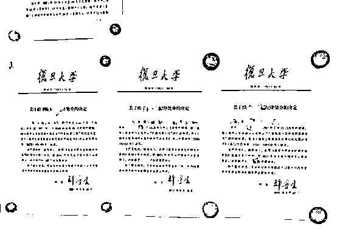
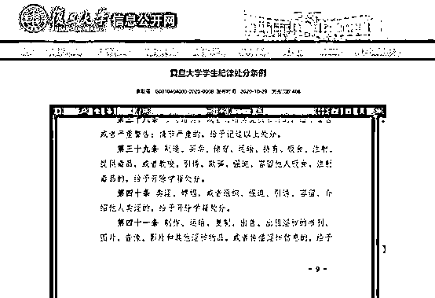
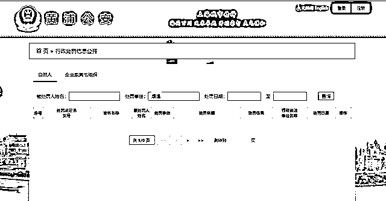
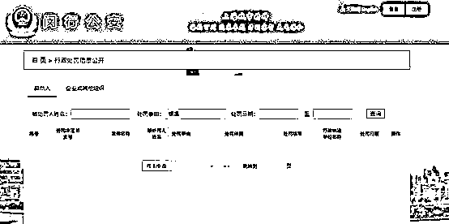
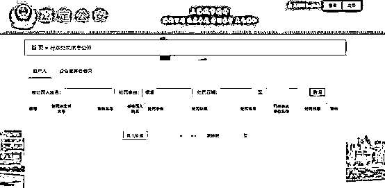
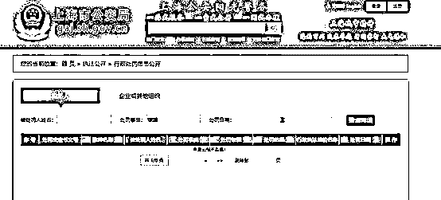

# 复旦 3 名学生因嫖娼开除被实名公示？

> 原文：[`mp.weixin.qq.com/s?__biz=MzIyMDYwMTk0Mw==&mid=2247521224&idx=4&sn=de5ffb2984c8bae083c906c63f6156af&chksm=97cb58f0a0bcd1e67f8ce6015479fbed6f6d76fd25cdb569d706fbdff634de352c7ce02a48cb&scene=27#wechat_redirect`](http://mp.weixin.qq.com/s?__biz=MzIyMDYwMTk0Mw==&mid=2247521224&idx=4&sn=de5ffb2984c8bae083c906c63f6156af&chksm=97cb58f0a0bcd1e67f8ce6015479fbed6f6d76fd25cdb569d706fbdff634de352c7ce02a48cb&scene=27#wechat_redirect)

近日，三张网传复旦大学对该校两名硕士研究生和一名博士研究生因嫖娼给予开除学籍处分的“纪律处分决定书”引发关注。 

[`v.qq.com/iframe/preview.html?width=500&height=375&auto=0&vid=b3278ufptmh`](https://v.qq.com/iframe/preview.html?width=500&height=375&auto=0&vid=b3278ufptmh)

三张“纪律处分决定书”显示，该校学生陈某某、李某某、葛某某，分别于去年 9 月 26 日、9 月 7 日和今年 1 月 13 日在校外嫖娼，陈某某被上海市公安局黄浦分局处以“行政拘留三日”的行政处罚，李某某被闵行分局处以“行政拘留十日”的行政处罚，葛某某被嘉定分局处以“行政拘留十日并处罚款伍仟元”的行政处罚。其中陈某某为博士研究生，李某某、葛某某为硕士研究生。

潇湘晨报记者注意到，处分决定中详细公开了三人的姓名、学号、学员信息等。

该处分决定显示，经 2021 年 9 月 6 日校长办公室会议审议，决定给予三人开除学籍处分。落款有校长许宁生签名，日期为 2021 年 9 月 18 日。

潇湘晨报（报料微信：xxcbbaoliao）记者联系复旦大学新闻办公室，一工作人员回复事件还在了解中，如有进展会发布公告。

复旦大学信息公开网于 2020 年 10 月 29 日发布的《复旦大学学生纪律处分条例》第四十条显示，卖淫、嫖娼，或者组织、强迫、引诱、容留、介绍他人卖淫的，给予开除学籍处分。

潇湘晨报记者查询公开信息发现，前述博士研究生陈某某的学院专业信息与处分决定内容相符。

9 月 24 日，复旦大学方针对复旦 3 名学生因嫖娼开除被实名公示一事向红星新闻记者回应称，处理决定是由学校保卫处做出，由校长办公会议审议通过。且处罚公示的范围只是校内，并没有刊发在网络上，“可以起到警示其他学生的作用”。

关于三人是否因嫖娼被公安机关行政处罚，潇湘晨报（报料微信：xxcbbaoliao）记者分别在上海市公安局黄浦分局、闵行分局、嘉定分局官网的行政处罚信息公开处进行查询。上述三人姓名，均未查到相关处罚决定书。

此外，记者以“嫖娼”为处罚事由在上述官网及上海市公安局官网进行查询，也未查到与嫖娼有关的行政处罚决定被公开。

**律师说法：**

**实名公示行为涉嫌泄露个人隐私**

有网友质疑，学校在因嫖娼给予的处罚决定中公开学生个人信息是否合适？

湖南睿邦律师事务所执行主任刘明表示，从目前的网传信息看，如果属实，学校将学生的真实姓名、学号、学院等个人信息全部公开的行为不妥。刘明认为，即使有相关校纪校规内容支撑，但学校公开涉及个人隐私的行政处罚信息没有法律依据，该行为涉嫌侵犯了学生个人隐私，学生有权利提起诉讼。

此外刘明表示，法律没有明确规定执法部门可以完全公开涉嫌违法犯罪人员的个人信息，在司法实践中，执法部门通常会将被行政处罚人员的决定书，通报给家属或工作单位，尤其是卖淫嫖娼等涉及个人隐私、名誉的违法行为，公开相关信息时会更加谨慎。“三名学生的相关处罚决定书，如果在公安局官方网站上都没有公开，可见上海公安也是考虑到了这一点的。”

来源 ：潇湘晨报综合红星新闻

← 向右滑动与灰产圈互动交流 →

