# 这篇文章，完全讲透了“刷单”的背后陷阱与认知误区！

> 原文：[`mp.weixin.qq.com/s?__biz=MzIyMDYwMTk0Mw==&mid=2247521224&idx=7&sn=4fa9fe20562d918fd425e3c1ba92d362&chksm=97cb58f0a0bcd1e60de5e0cfa5f7f5a772fc7a6bbda48ff998af692ddc4beaac24e65ea7aa87&scene=27#wechat_redirect`](http://mp.weixin.qq.com/s?__biz=MzIyMDYwMTk0Mw==&mid=2247521224&idx=7&sn=4fa9fe20562d918fd425e3c1ba92d362&chksm=97cb58f0a0bcd1e60de5e0cfa5f7f5a772fc7a6bbda48ff998af692ddc4beaac24e65ea7aa87&scene=27#wechat_redirect)

　　“只需 100-500 本金，刷流水拿返现，十分钟见收益，随结随走”、“兼职刷单，动动手指，月入过万不是梦”……这样的广告在互联网上并不少见，“高佣金”、“高回报”的背后不仅隐藏着诈骗陷阱，还有可能直接触及法律高压线令人身陷囹圄。苏州警方以案说法，揭秘“刷单”背后的黑灰产业链。

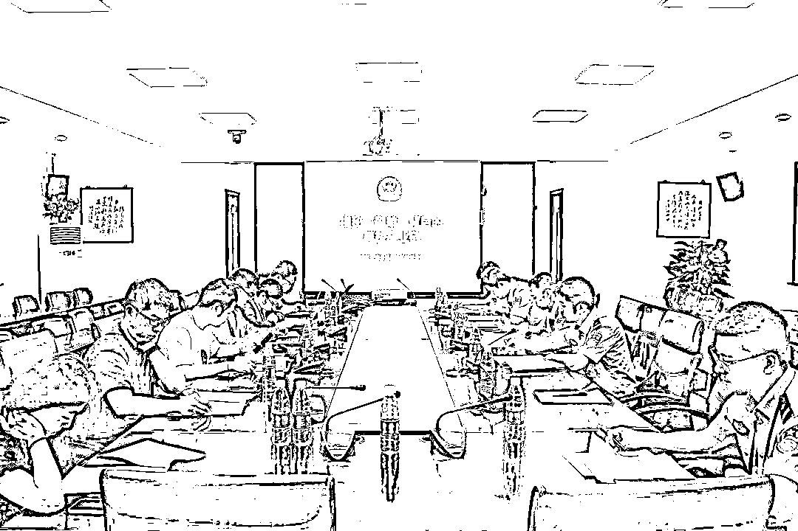**“刷单”的****幕后是“收赃”犯罪团伙 **

2021 年 5 月底，苏州市公安局园区分局接到市民徐女士报警，称参与网络刷单、损失近 4.7 万元。

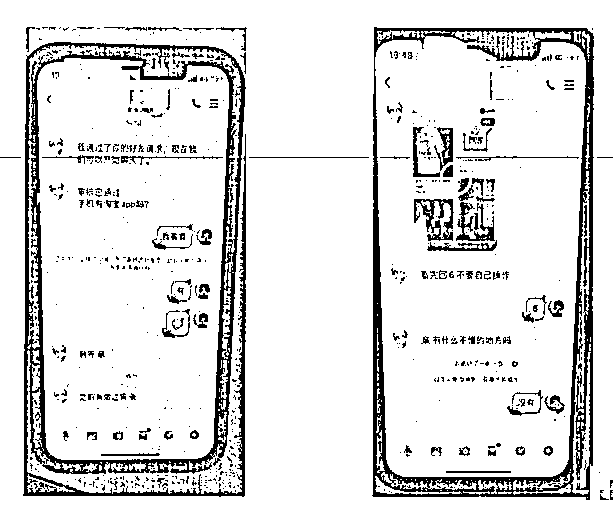**１**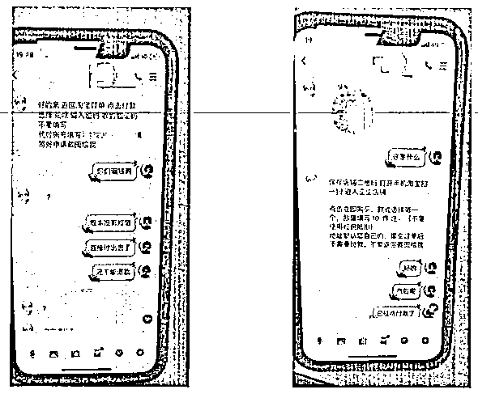**２**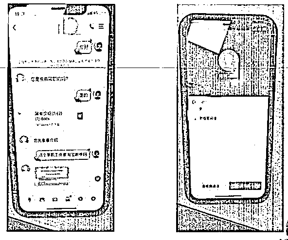**３**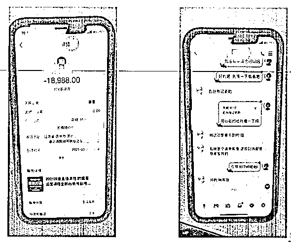**４**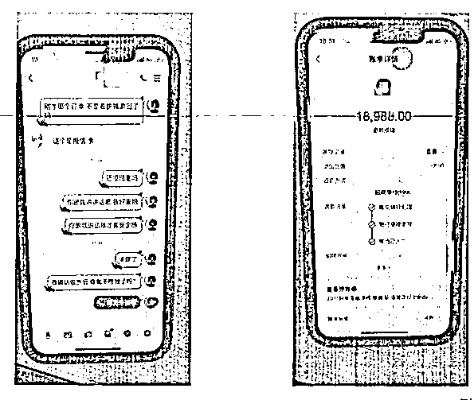**５**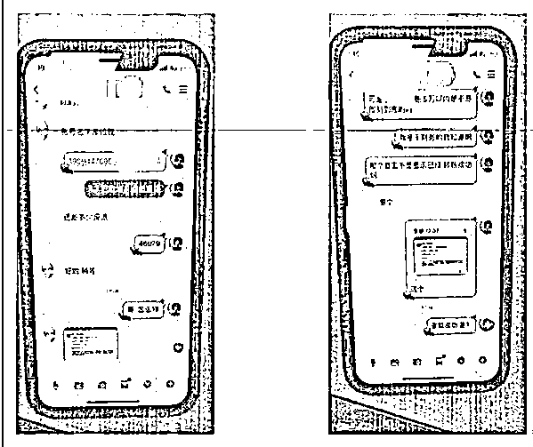**６**

　　最开始，徐女士接到一通陌生来电，**对方声称正在招聘“刷单”兼职**，徐女士正巧想赚些零花钱，便抱着试试看的心态，添加了对方为 QQ 好友，在对方指导下开始尝试刷单。起初徐女士也担心转了账对方会跑路，但在**“官方平台”“正规网购”“专业售后”等话术**忽悠下，第一单就转账了 18988 元。第二单价值更高，转账金额 49979 元。徐女士打了退堂鼓，**申请全额退款**，对方当即退回了 18988 元。这下，徐女士疑心全消，按照对方要求刷了第二单。但这一次，徐女士仅仅争取到 3000 元退款，就再也无法联系上对方。徐女士意识到被骗，慌忙报警求助。

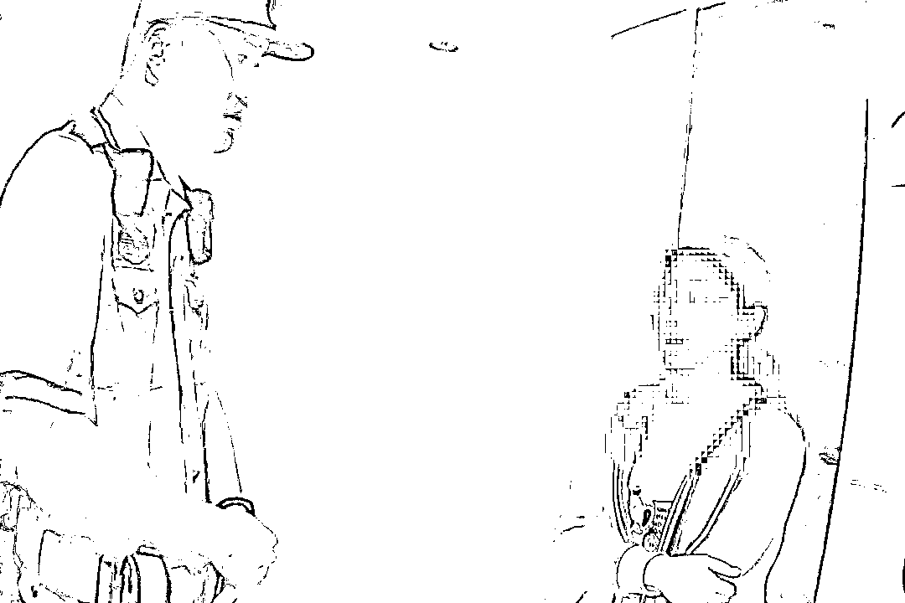

　　接到报警后，警方立即开展侦查工作，从涉案资金流向入手，排摸出了接收徐女士转账的多个银行账户及其持有人，锁定了位于福建的方某、周某、谢某等七名嫌疑人。经进一步侦查，民警发现，方某等人的银行账户**流水频繁**、**过于活跃**，极有可能是**专门为诈骗犯罪团伙“收赃”**。经粗略估计，涉案金额已经超过了 125 万。

　　警方于 6 月中旬前往福建组织抓捕行动。方某等七人有四处窝点，民警兵分多路同时收网，一举将犯罪团伙拿下。在审查中，方某等人的神秘“上家”岳某浮出水面，民警成功在其住所将其抓获。至此，该犯罪团伙成员全部归案，8 名嫌疑人一并被押解回苏。

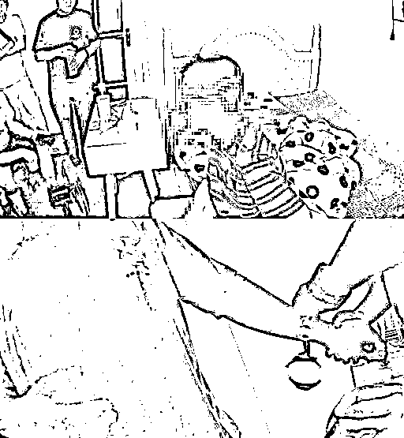

　　经审查，岳某勾结境外犯罪团伙，专门负责**把诈骗等违法犯罪所得的“黑钱”分流至多个账户转手套现**，再以虚拟货币跨境兑换的方式转回境外犯罪团伙，从中赚取佣金。岳某不想自身暴露，便拉拢他人，拉起了方某、周某、谢某等七人组成的小团伙。岳某深居幕后，把收到的“赃款”分转至七人账户，再安排七人分头从柜面或 ATM 机取现，交还给他来兑换虚拟货币，所得“佣金”由岳某依据所谓的“贡献程度”进行二次分配。

　　岳某等人深知所收钱款涉嫌违法犯罪，但在利益面前却不收手，最终沦落成为违法犯罪帮凶。目前，案件正在进一步工作中。

** 苏州首例“网络水军”非法经营案宣判 **

网红产品的热销，既需要超高人气，也需要好评如潮。不法分子将此视为赚钱的“好机会”，有的通过“兼职刷单”伪造销量甚至直接以此名头行骗，有的则盯着刷好评“大捞一把”。**苏州市公安局姑苏分局侦破苏州首例“网络水军”非法经营案，打掉一个“刷好评”的犯罪团伙。** 

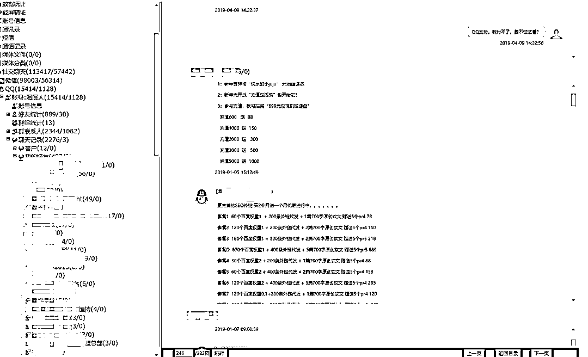

　　网警部门在日常巡查中发现一家公司在多个微信群内打出了“有偿删帖服务”的广告。**根据相关司法解释，该行为已经涉嫌非法经营。**经进一步工作，一个以郁某、迮某、陈某为主的犯罪团伙浮出水面。

　　通过对几名嫌疑人之间信息往来的梳理，“刷好评”的犯罪脉络也逐渐清晰。民警发现，郁某、迮某分别在苏州、杭州注册了空壳网络科技公司并担任法人，声称承接“SEO 优化服务”，即网络灌水刷好评进行正面推广，实则**暗中收集负面评论并有偿删除**。警方先后奔赴杭州、宁波等地将嫌疑人郁某、迮某、陈某抓获，同时查扣封存涉案手机 7 部、电脑 4 台、合同 11 份。被抓获时，嫌疑人郁某仍在微信中和朋友吹嘘“靠刷好评大发横财”、“生活花天酒地”，不想等待他的是恢恢法网。

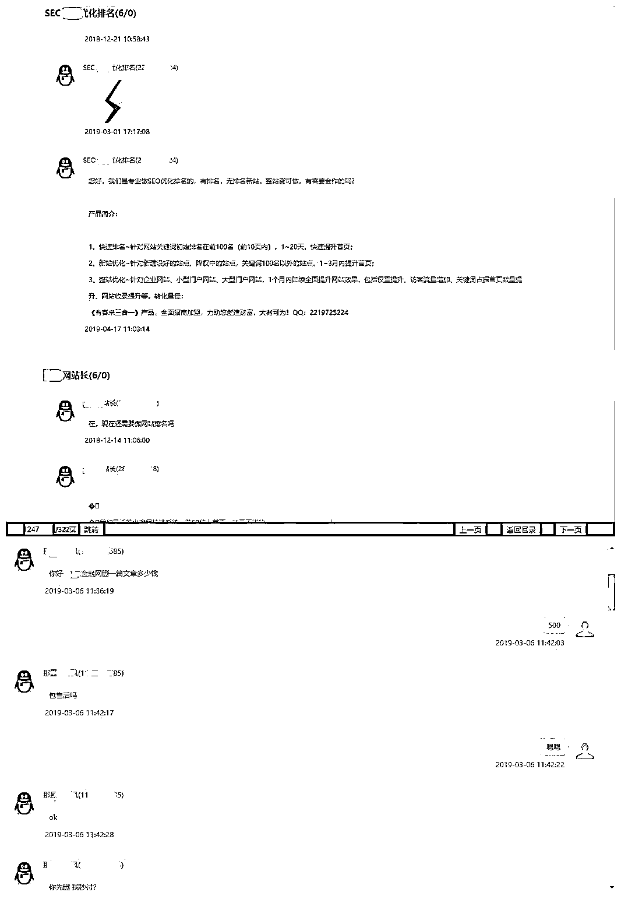

　　警方迅速恢复了嫌疑人删除的聊天记录与电脑数据，在如山铁证面前，郁某、迮某、陈某最终认罪伏法。

　　经审查，郁某、迮某是表亲关系，原本就是“网络水军”，也就是俗称的“五毛党”，刷一条好评、发一条帖子，赚钱又慢又辛苦，二人渐渐萌生出“自立门户”的想法，先后成立了各自的网络公司，并拉上朋友陈某一起入伙。迮某公司下设了一个网站，专门收集并发布金融投资等企业的负面评论。被“点名”的企业难免紧张，主动联系网站想问个明白。沟通过程中，迮某会抛出“有偿删帖、正面刷评”的话题，对方一旦接受，迮某会立刻通知郁某。郁某顺理成章以自己公司的名义与企业签署“SEO 优化服务协议”，随后将具体工作交给陈某。陈某按照协议约定，使用技术手段**删除或屏蔽负面评论**，并**雇佣“水军”撰写帖文“刷好评”**。这样的“SEO 优化服务协议”包年付费，根据协议内容价格在 10 万元至 30 余万元不等。截至被抓获，郁某、迮某、陈某已借此手段非法获利达 65 万余元。

　　今年，苏州市中级法院对该起案件作出终审裁定，以非法经营罪依法判处郁某、迮某、陈某有期徒刑并处罚金；对郁某、迮某名下科技公司也作出了罚金并没收违法所得的判决。

**背后陷阱**

刷单诈骗中，骗子为了博取受害人信任，通常在线上展示各种虚假的企业营业执照、注册文件等，来营造合法经营的假象，加之极具诱惑性的招聘广告、“客服”话术周旋等，一步步诱骗求职者进入骗局。 

**　　“刷单”诈骗主要有两种套路：**

　　1.诈骗分子**利用小额刷单任务**，**赢得**受害人的**信任**，随后，逐渐**加大刷单金额及数量**，利用“卡单”、“系统故障”或者“刷满 3 单之后结算”等理由，来诱使受害人继续转账、循环反复；

　　2.受害人被要求**安装“刷单”软件**，该软件实为经过**伪装的病毒程序**，暗中**获取**受害人**银行账户****信息**、**拦截验证码短信**，将受害人名下存款悄悄转走。

　　随着互联网的发展，“刷单”已经从最初的电子商务平台虚假交易不断延伸。比如，上述案例中提到的“刷好评”，通过刻意人为组织“网络水军”控制评论导向，甚至颠倒是非黑白、左右网友消费意向。类似的还有“刷榜”，即通过非常规技术手段，使 APP 的下载量在短时间内激增，从而提高在应用商店内的榜单排名。但**不论哪种“刷单”，其背后都是违法犯罪的深渊**。

**认识误区**

组织网络“刷评”行为，可能被认定为**非法经营罪**；通过网络刷单发布虚假广告，可能被认定为**虚假广告罪**；对竞争对手进行反向网络刷单，给其造成严重损失，可能构成**破坏生产经营罪**；通过网络刷单的方式虚增推广量，骗取推广费用，可能构成**合****同诈骗罪**；明知他人通过网络刷单的方式实施诈骗，仍为其提供帮助，可能构成**非法利用信息网络罪**；利用系统漏洞或错误，自买自卖进行网络刷单，用以套取平台钱款，可能构成**盗窃罪**。

总而言之，当收到兼职刷单的信息时，无论真假都不要参与——**真刷单涉嫌违法、假刷单就是诈骗、组织刷单直接触及法律高压线**。一旦陷入其中，要么就成为诈骗分子的猎物，要么成为违法犯罪链条上的一环，蒙受经济损失的同时，也会给个人、家庭、社会带来严重影响甚至是危害。

**警方提醒**

“刷单”背后是陷阱，兼职务必通过官方正规渠道求职，认真了解招聘单位相关情况，**切勿轻信网络求职、私信推送和营销广告，不抱侥幸心理、不贪蝇头小利，看到“高收入”、“低风险”、“轻松赚钱”等字眼务必要提高警惕**。在网络交友过程中，市民朋友们注意要**保护****信息安全****，陌生好友****谨慎添加****、转账交易****提前核实****，并做到陌生链接****不点击****、来源不明二维码****不扫描****、可疑 APP****不下载****不安装****、删除聊天转账记录等要求****不理会**。一旦发现被骗，应第一时间保存相关证据并报警求助。

同时，**提醒广大经营者，务必要严守法律法规，做****到诚信为本****、****合法经营**，任何走捷径的生财之道背后必定会付出更为惨痛的代价。

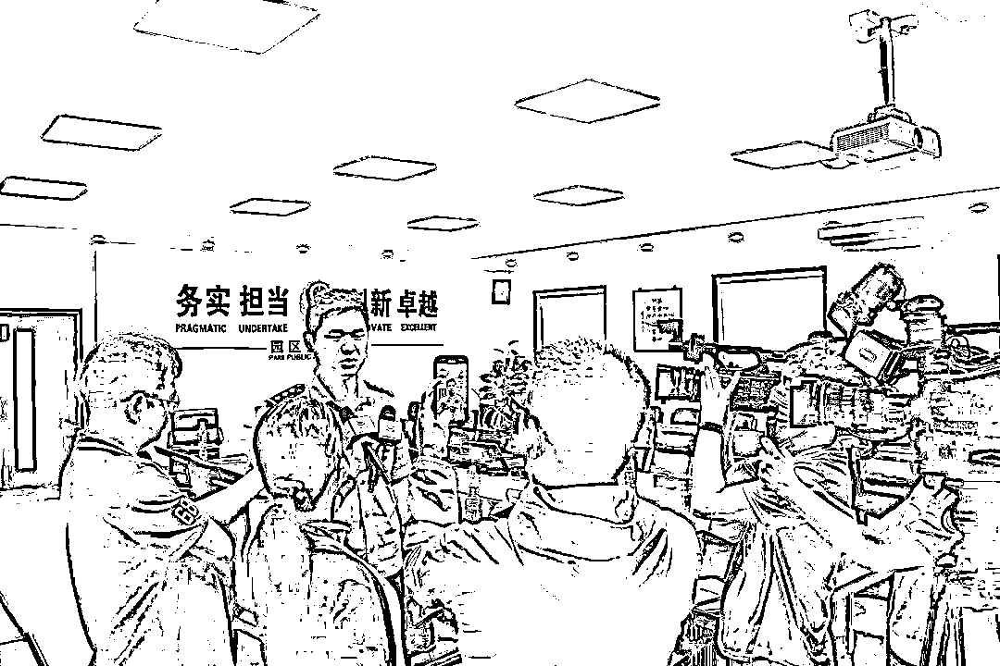

**法条链接**

**　　新修订的《反不正当竞争法》对网络刷单进行了明确规定。**根据我国**《反不正当竞争法》第八条**规定，经营者不得对其商品的性能、功能、质量、销售状况、用户评价、曾获荣誉等作虚假或者引人误解的商业宣传，欺骗、误导消费者。经营者不得通过组织虚假交易等方式，帮助其他经营者进行虚假或者引人误解的商业宣传。以及第二十条规定，经营者违反本法第八条规定对其商品作虚假或者引人误解的商业宣传，或者通过组织虚假交易等方式帮助其他经营者进行虚假或者引人误解的商业宣传的，由监督检查部门责令停止违法行为，处二十万元以上一百万元以下的罚款；情节严重的，处一百万元以上二百万元以下的罚款，可以吊销营业执照。

**　　根据有关司法解释，从事“刷单”牟利，还可能涉嫌非法经营罪。**根据**《最高人民法院最高人民检察院关于办理利用信息网络实施诽谤等刑事案件适用法律若干问题的解释》****第七条第一款**相关规定：违反国家规定，以营利为目的，通过信息网络有偿提供删除信息服务，或者明知是虚假信息，通过信息网络有偿提供发布信息等服务，扰乱市场秩序，个人非法经营数额在五万元以上，或者违法所得数额在二万元以上的，单位非法经营数额在十五万元以上，或者违法所得数额在五万元以上的，属于非法经营行为“情节严重”，依照刑法相关规定以非法经营罪定罪处罚。

**　　《全国人民代表大会常务委员会关于维护互联网安全的决定》第三条第（一）项**规定，为了维护社会主义市场经济秩序和社会管理秩序，利用互联网对商品、服务作虚假宣传，构成犯罪的，依照刑法有关规定追究刑事责任。

来源：苏州公安微警务，阻击诈骗

← 向右滑动与灰产圈互动交流 →

