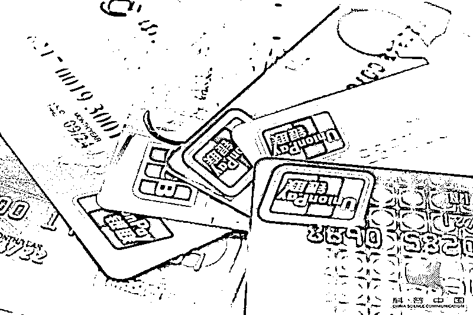
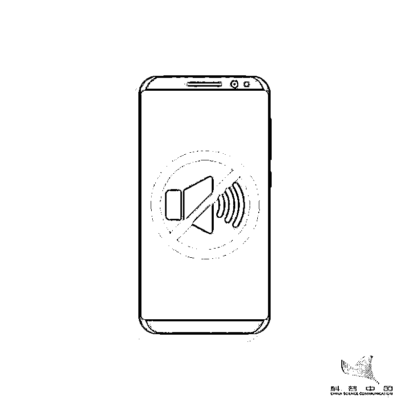

# 手机变静音，千万要小心！

> 原文：[`mp.weixin.qq.com/s?__biz=MzIyMDYwMTk0Mw==&mid=2247521224&idx=8&sn=207b5d4bd0eb12d938f313e824b9a853&chksm=97cb58f0a0bcd1e6396c3b5b55eb4620a3ab6ac62d10716c067d4e8710734e47a610a52c0dc6&scene=27#wechat_redirect`](http://mp.weixin.qq.com/s?__biz=MzIyMDYwMTk0Mw==&mid=2247521224&idx=8&sn=207b5d4bd0eb12d938f313e824b9a853&chksm=97cb58f0a0bcd1e6396c3b5b55eb4620a3ab6ac62d10716c067d4e8710734e47a610a52c0dc6&scene=27#wechat_redirect)

人在医院治疗

银行卡随身携带

**但卡内钱莫名其妙地被人转走 1.4 万元**

**手机突然变静音**

**银行卡被盗刷**

武汉的许女士突然发现手机突然变成静音，原本以为是手机故障，没有在意。结果到下午再看手机时，发现与银行卡关联的支付宝内有 14 笔支出，共计上万元！

调查后发现，一共被转走 14 笔，从 100 元到 9000 多元不等。其中，支付宝消费 2395.49 元，北京帮付通科技有限公司支出 500 元，拉卡拉支付有限公司支出 9893.83 元，支付宝账户支出 1100 元，14 笔合计支付 13889.32 元。

但是许女士一天都在病房内，根本没有出过医院。同时，手机和卡都放在身边，没有人拿过，也没丢失过。联想到手机突然变成静音，而且自己怎么也调不过来，许女士怀疑是被人用木马病毒程序将手机控制，然后将钱转走。

***1***

**短信诈骗层出不穷**

**男子点开短信链接手机变静音 **

**银行卡被盗刷万元**

沈阳的智先生收到老友发来的信息，便顺手点击了短信上的网页，点开之后，并没有什么内容，但收到两条信息，一个是“激活成功”;一个是“软件安装完毕”。见手机也没有什么异常，智先生也没在意。

没想到第二天早上智先生醒来后，翻看手机有 10 余个未接来电，随后看到有 60 余条短信提醒。**原来手机变成了静音模式，自己的两张银行卡被盗刷 1 万余元。**

**银行卡在身上** 

**5 万存款只剩下 300 多元** 

广州的吴先生收到了一条陌生号码发来的短信。短信上写着自己的名字，吴先生以为是某个没存号码的朋友发来的，就点击了短信中的链接。

由于手机并未出现什么异常，吴先生便没太在意。可一个星期之后，银行突然发来一条消费短信，原本存有 5 万多块钱的一张银行卡，余额竟然只剩下 300 多块钱了。

吴先生把手机拿到客服检查，**被告知他的手机中了木马病毒，在一个星期内丧失了接收短信的功能，**一个星期后木马病毒失效，短信功能才恢复。

***2***

**揭秘：骗子如何将钱转走**

验证码是金融机构在用户进行诸如修改密码、转账等操作时，向用户预留手机号码中发送的一次性密码，没有验证码无法进行操作。而要想获取验证码，**犯罪分子最常用的手段就是向目标手机发送木马病毒。**

**植入木马**

骗子广发打折优惠、假扮熟人等短信，链接网址植入木马病毒

↓↓

**运行病毒**

受害人点击后，木马就在手机运行

↓↓

**监控手机**

骗子随时掌握受害人在手机操作过的银行卡信息

↓↓

**盗取信息**

骗子盗取银行卡号，开通快捷支付，截获验证码

↓↓

**刷走钱财**

骗子操纵开通手机理财服务，把钱从银行卡转走

***3***

**防范：陌生号码的短信不点**

骗子一般在手机短信木马病毒链接前加上一句话，诱导你点开网址链接，诸如“聚餐照片”、“老同学照片”等等，都是以“熟人”为切入点，还有就是以各种折扣优惠信息为诱饵，让接收方在不知不觉中随手点开病毒链接，植入了木马病毒。

而这种恶意程序，会优先运行，能盗取手机上一切跟账号、密码有关的资料，因此，只要是接收到类似短信，切记不点、不点，要马上删除。

如果不小心点了，要紧急挂失手机上涉及到财产的账户，确保账户安全后，再将手机拿到维修点重新安装系统。

**赶紧提醒家里人！**

来源：科普中国、腾讯安全战略研究、深圳市反电信网络诈骗中心

← 向右滑动与灰产圈互动交流 →

