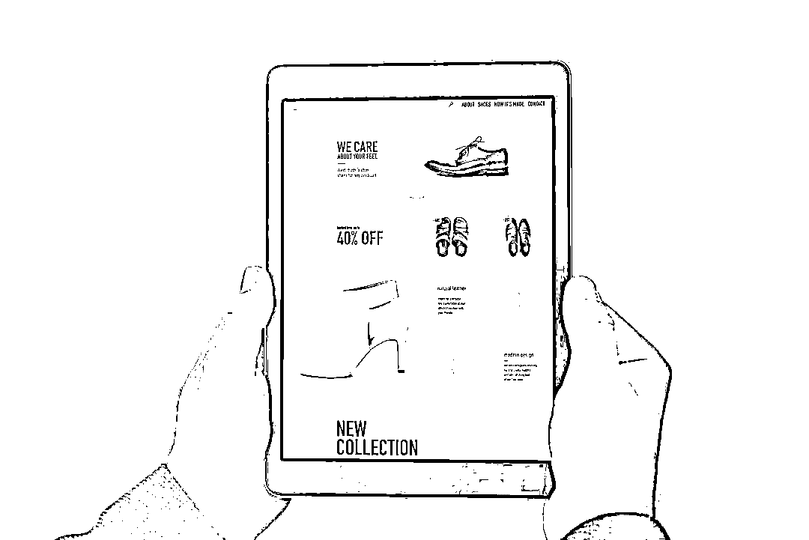
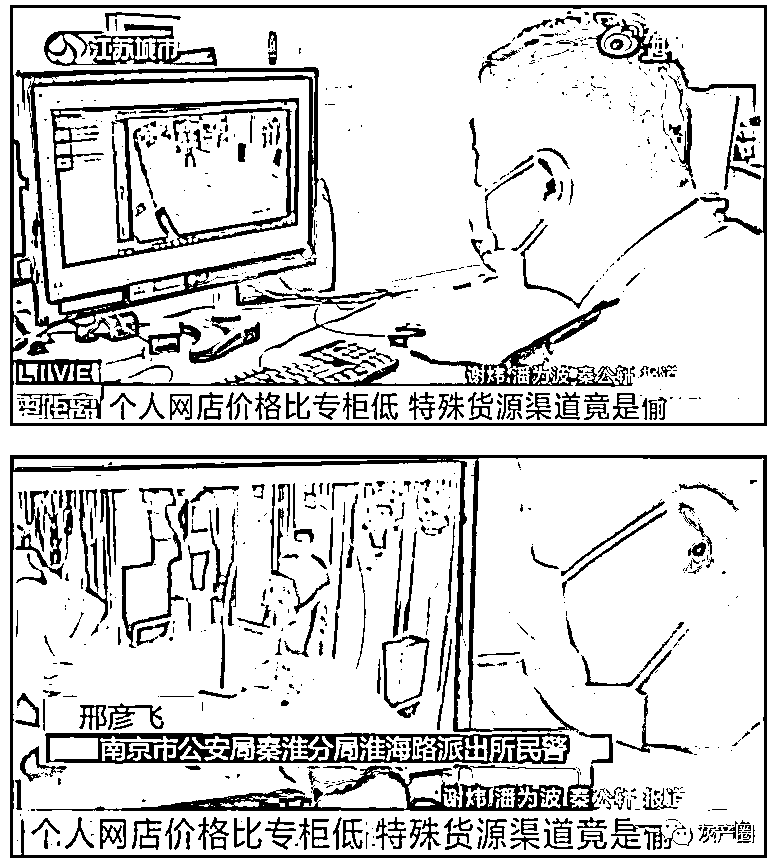
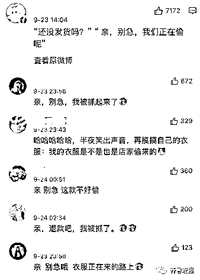
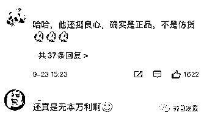
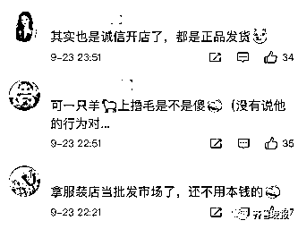
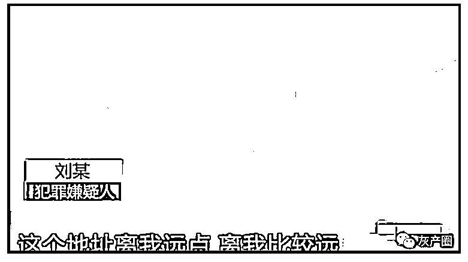
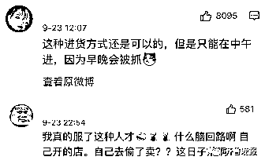

# “亲，别急，我们正在偷呢！”男子开网店，按顾客订单偷衣服

> 原文：[`mp.weixin.qq.com/s?__biz=MzIyMDYwMTk0Mw==&mid=2247521273&idx=1&sn=633445b967e6b303d1bbf6b2c2eaebc3&chksm=97cb58c1a0bcd1d78cf646828a4679604b8c67dbc933e52e8b3257007fe09cc239f0b6c6b7dd&scene=27#wechat_redirect`](http://mp.weixin.qq.com/s?__biz=MzIyMDYwMTk0Mw==&mid=2247521273&idx=1&sn=633445b967e6b303d1bbf6b2c2eaebc3&chksm=97cb58c1a0bcd1d78cf646828a4679604b8c67dbc933e52e8b3257007fe09cc239f0b6c6b7dd&scene=27#wechat_redirect)

网购的便捷不言而喻

但产品的质量参差不齐

于是不少人喜欢

认牌子、买正品

但网店里卖的

低于官方价格的“正品”

来源真的靠谱吗？

（图源：视觉中国）

这不，9 月 23 日

南京秦淮警方通报一起盗窃案

**嫌疑人开的网店里****热销的衣服**

**竟都是他从****实体店内偷来的！**

↓↓↓

近日，南京淮海路派出所接到辖区内一家品牌服装店店长报警求助，称其店内大量男裤被盗，需要民警进行处理。

报警人韦先生告诉民警，是该品牌另一家门店的店长先发现店内有裤子被偷了，询问他的店有没有这种情况。韦先生赶紧对门店裤子的库存进行了盘点，结果发现少了不少男裤。

随后，韦先生调取了店内监控查看

发现有一名男子十分可疑

他每次离开门店时

看起来衣服里都塞得鼓鼓的

经店铺初步统计

**门店内少了四五十条裤子**

**包含了多种款式和型号**

**价值 12000 余元**

根据韦先生提供的店内监控等线索，淮海路派出所民警立即展开了侦查工作，很快确认了嫌疑人刘某的身份，并将其抓获。

网友热议：亲别急，我们正在偷呢

****

****

据刘某交代

一次他偶然偷了一条该品牌的裤子

于是抱着试一试的心态

将裤子挂出比官方低一些的价格

在网上试卖

结果发现很快就卖出了

后来，他又偷了几次

发现销路很好

于是干脆开了一家网店

将男裤图片发在网店内

再根据顾客需求的订单实施盗窃

通常刘某会将裤子都

穿在身上

或者塞进自己衣服里带离门店

之后

将盗窃的衣物交给老乡徐某

由对方负责

快递发给各地的买家

赚来的钱财两人再进行分赃

目前，刘某因涉嫌盗窃已被秦淮警方依法刑事拘留，徐某因涉嫌盗窃被采取刑事强制措施，2 人均已到案。案件还在进一步侦办之中。

**网友：年底快到了，奇葩新闻又开始了** 

****

****

来源 ：潇湘晨报、齐鲁晚报、扬子晚报、江苏新闻、新浪微博 

← 向右滑动与灰产圈互动交流 →

