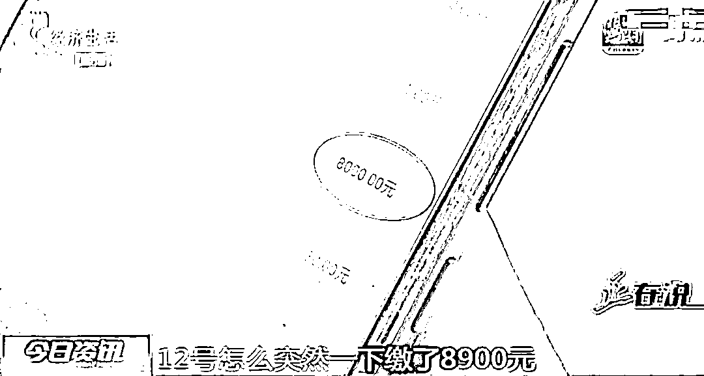

# 男子花光 9 万多积蓄充话费，竟是为了在群里攀比话费余额！

> 原文：[`mp.weixin.qq.com/s?__biz=MzIyMDYwMTk0Mw==&mid=2247521273&idx=3&sn=3d3f0c04f2e6d99bfc1b0067d43d3aa1&chksm=97cb58c1a0bcd1d7724ae80ad9844e834eb4b53999751a062f8154e460ecaa3d75471665510f&scene=27#wechat_redirect`](http://mp.weixin.qq.com/s?__biz=MzIyMDYwMTk0Mw==&mid=2247521273&idx=3&sn=3d3f0c04f2e6d99bfc1b0067d43d3aa1&chksm=97cb58c1a0bcd1d7724ae80ad9844e834eb4b53999751a062f8154e460ecaa3d75471665510f&scene=27#wechat_redirect)

“都给我出来，谁敢跟我比比谁的话费多！” 

“先充个 500，看看能不能当第一。”

“我充 2000 元，第一必须是我的。”

“这帮笨蛋，还真充钱，我修个图，余额 20000 元。”

情景演绎的这一幕并非虚构，而是真实发生的。据河北广播电视台报道，河北省邯郸市民李先生，加入了一个聊天群，在这个群聊里，大家都在晒话费余额的截图，互相攀比谁的话费多，李先生也加入其中，到后面就控制不住了。

[`v.qq.com/iframe/preview.html?width=500&height=375&auto=0&vid=x32786rvbqa`](https://v.qq.com/iframe/preview.html?width=500&height=375&auto=0&vid=x32786rvbqa)

**比拼上劲儿，“怒”充话费九万多**

李先生：“从 7 月 6 号开始充钱，一开始是一两百的缴，后来越攀比越多，12 号一下缴费 8900 元，往后都是大额缴费。”

李先生：“之后我又把买的基金全部赎回来了，7 月 14 号又充了两笔 8900。被人盖过了好几天，缴 200 元不行了。”

李先生是一名架子工，为了能在攀比过程中始终保持第一名，只要有人发出来的话费截图余额超过自己，他就把打工所挣到的钱缴话费。

李先生：“存了 92000 多元话费，就是攀比，最后也没比过人家。”

记者：“你图个啥？”

李先生：“当时主要是在群里攀比，好胜心上来了，就比谁充得多。”

记者：“那你有没有想过别人可能是修个图，实际没有充那么多？”

李先生：“当时也考虑过，但这个发、那个发，当时也上头了，他发我也发，他充我也充。”

按照李先生所说，他们这个群只是攀比谁的话费余额多，并不存在刷单或者其他目的，而他也把这两年打工挣的钱全部充了话费。

李先生：“冷静了好几天才反应过来。”

记者：“充到第一名有什么好处吗？”

李先生：“没啥好处，现在想想啥好处都没有。（钱）全部存进去了。”

记者：“现在你看到这个（余额）79 元不难过吗？后悔吗？”

李先生：“后悔，这不想办法把钱要回来吗。”

**肠子悔青想退话费，却遭遇一波三折？**

事后，后悔不已的李先生想把话费余额提现，谁知充值时方便快捷，想取出来就没那么容易了。

李先生：“后来我头脑冷静下来后，我给客服打电话，问一下我这个话费怎么办，他说你只有注销了号码，这个话费才能退给你。

李先生按照客服所说，通过手机客户端申请了号码注销，在实名认证后填写了话费返还的银行卡号。

李先生：“注销完成后，提示说是 8 月 20 号前把剩余的话费打到银行卡上。”

到了约定期限，李先生并没有拿回自己的话费余额，他只能再到营业厅咨询。

李先生：“他说你这个不行，你这个得去永年区的反诈中心开证明去。”

根据营业厅工作人员提供的文件，营业厅要求李先生到附近的反诈中心核查，并书面出具核查结果，才能履行退款手续。

记者：“你这个涉案了吗？”

李先生：“没有，我这个没有涉案。他让我去开这个证明，人家说根本就没有这种证明。”

那么，李先生的话费余额到底该怎么返还呢？记者和李先生一起找到了当地运营商工作人员。

**结局：公安机关将对话费查证后处理**

中国联通邯郸分公司工作人员：“这个不是咱这（不给他退），这是反诈中心的通知，是下给我们的函，是要公安机关给他出具证明之后，我们才能走（退费）申请。”

中国联通邯郸分公司工作人员告诉记者，他们在提交李先生的退费申请时，公安机关检测到李先生的话费余额太大，为了防止出现电信诈骗的情况，要求李先生到公安机关配合调查，并开具相关证明。随后，记者也向公安机关证实了这一说法。

记者：“刚刚我们跟永年区反诈中心以及邯郸市反诈中心了解到，目前公安机关正在对李先生九万余元话费余额的来源进行查证，待查证之后再进行下一步的处理。

**网友热议：**

**卡可以传给孙子了**

来源：潇湘晨报

← 向右滑动与灰产圈互动交流 →

