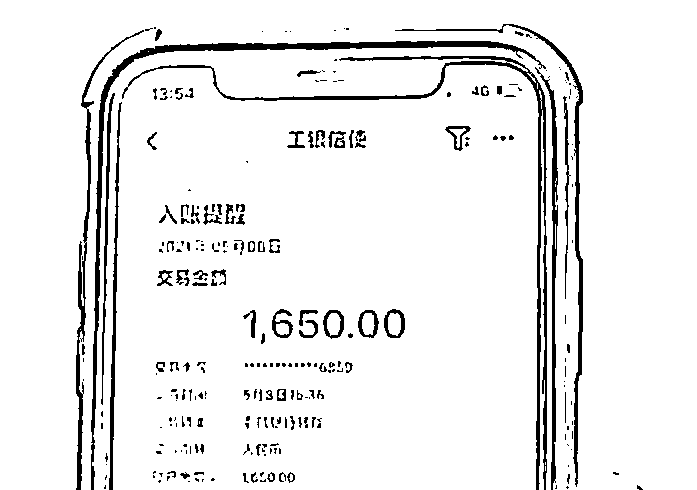

# 银行卡莫名收到一笔钱，对方说转错？千万别自行转回去！

> 原文：[`mp.weixin.qq.com/s?__biz=MzIyMDYwMTk0Mw==&mid=2247521273&idx=4&sn=f64741a17f0ea5af205b87c8701bf865&chksm=97cb58c1a0bcd1d7df7dee6ba53899ee8891a22e5026b6fcd1d49a0c735cd553835f280ceb71&scene=27#wechat_redirect`](http://mp.weixin.qq.com/s?__biz=MzIyMDYwMTk0Mw==&mid=2247521273&idx=4&sn=f64741a17f0ea5af205b87c8701bf865&chksm=97cb58c1a0bcd1d7df7dee6ba53899ee8891a22e5026b6fcd1d49a0c735cd553835f280ceb71&scene=27#wechat_redirect)

如果有一天

**你的银行卡里突然收到一笔钱**

而此时

**转账人告诉你是转错了**

这时候你会怎么做？

相信大多数人

都会直接给对方转回去

争做拾金不昧的好市民

但是，要提醒各位

有关转账问题

不管转进还是转出都要

**慎重考虑**

**因为，有新骗局出现了！**

**银行卡里多出一笔钱**

**大学生好心“归还”**

去年底的某一天

**正在读大学的小刘突然收到短信通知**

**有一笔 6000 元的银行入账**

但亲戚朋友也都说不是自己转的

正当小刘为这来路不明的 6000 元

感到疑惑时

**手机就收到了一位“大姐”发来的短信**

**对方表示自己转错账了**

这笔钱是她好不容易凑齐

给儿子交学费用的

因为不熟悉操作才错转给小刘

随后大姐表示

**“能不能把钱还给我？”**

于是，热心的小刘按照“大姐”的指示

把银行卡上的 6000 元

转回到“原主”的账户

**本以为是一次好人好事**

**谁知道，这事并没有结束**

**小刘居然因此背上了一笔债务？！**

**半个月后，骗子“套路”曝光！**

半个月后

**小刘接到一个陌生男子的电话**

该男子称

小刘在他们的网站上借了钱

约定期限是 15 天

本金 6000 元，月利率 2%

现在到期了

**要求小刘还款本金一共 6060 元**

这下小刘懵了

**自己从来没有申请过网络贷款**

小刘立刻报了警

警方调取了小刘的银行卡资金明细

发现那天给小刘打 6000 元的

是一个公司账户

而调取网贷公司的情况发现

**事发半个月前**

**确实有人利用小刘的身份资料**

**和证件照片**

**申请了贷款**

**至此，骗子的套路**

**才真正浮出水面**

　　**◆ 骗子通过非法手段获取了受害人的信息。****　　◆ 利用受害人的名义在贷款公司贷款。****　　◆ 骗子利用一般人的侥幸心理以及疏忽大意的心态，编造转账错误的理由，再让受害人将那笔钱转到自己提供的账号上。**

对于网贷

很多人心里已经有所防备

然而万万没想到的是

**好心助人**

**却莫名背上了“被贷款”的债务**

**还要小心这些网络“陷阱”**

天上掉馅饼的事情

有时候并不一定是好事

**对意外飞来的横财**

**一定要保持高度警惕**

**同时保护好个人信息安全**

一旦发现此类事情

要通过正规的途径处理

骗子除了会盗取个人信息

**实施“转错账”诈骗外**

还会利用大家的好奇心

设下种种网贷陷阱

**案例**

　　今年 5 月 8 日，山东青岛市民小李的银行卡里突然多出一笔 1650 元的款项。

　　随后还收到一条短信：“请立即处理款项，否则后果自负！”

　　半小时后，对方打来电话，并威胁小李在约定期限内还款 3000 元。

　　更奇怪的是，每次小李点击“立即还款”，显示的收款账户都不一样，而且都是个人账户。

　　面对如此高额的贷款利息，小李果断报警求助。这究竟是什么情况呢？原来都是小李好奇心惹的祸当天，正在用手机刷短视频小李被一个“测试信用额度”的信息吸引了想测试一下自己信用额度的小李**随手点击并下载了一个网贷 App****之后还输入了****个人身份证、银行卡等信息**

**警方提醒**

　　1.如遇类似银行账户突然多出一笔钱，对方要求退还的情况，一定要冷静！**不要自己操作，直接向银行说明情况或直接报警。**　　2.在日常生活中，大家一定要注意保护个人信息，避免个人信息泄露，以免被不法分子利用个人信息进行非法活动。　　3.**遇到被诈骗的情况，请保留完整的电子证据**（如聊天记录、短信、银行账号等），并拨打反诈专线 96110 咨询。

**总之，凡事留多个心眼**

**遇到疑惑不要怕麻烦**

**一定要向多方求证**

**必要时拨打 110 报警**

来源：广州日报、江苏新闻、辽沈晚报、齐鲁晚报

← 向右滑动与灰产圈互动交流 →

