# 爱美的你，小心这个陷阱！记者探访：有人从未见到钱，却还债 3 年？！

> 原文：[`mp.weixin.qq.com/s?__biz=MzIyMDYwMTk0Mw==&mid=2247521273&idx=5&sn=f354a701b676d59f0998cb8f36e89743&chksm=97cb58c1a0bcd1d7eba1ea2046a02045b90a53ae941eb9dc64be50e8a3e5093793d83e61b6f2&scene=27#wechat_redirect`](http://mp.weixin.qq.com/s?__biz=MzIyMDYwMTk0Mw==&mid=2247521273&idx=5&sn=f354a701b676d59f0998cb8f36e89743&chksm=97cb58c1a0bcd1d7eba1ea2046a02045b90a53ae941eb9dc64be50e8a3e5093793d83e61b6f2&scene=27#wechat_redirect)

国际机构沙利文数据显示，截至目前，我国医美用户规模已超 1800 万人。随着用户规模的扩大，医美界的消费金融随之兴起，“医美贷”“医美分期”蓬勃发展的同时也滋生了行业乱象。 

消费者遭遇“医美套路” 被骗贷款投诉难

[`mp.weixin.qq.com/mp/readtemplate?t=pages/video_player_tmpl&action=mpvideo&auto=0&vid=wxv_2062906288249831425`](https://mp.weixin.qq.com/mp/readtemplate?t=pages/video_player_tmpl&action=mpvideo&auto=0&vid=wxv_2062906288249831425)

△央视财经《经济信息联播》栏目视频

 今年 8 月，刚刚大学毕业的黄女士被路边发广告的医美机构工作人员忽悠进店，稀里糊涂地就做了一个价值 412 元的嫩肤护理项目，结果做完后整张脸都破皮红肿，把黄女士吓坏了。

紧接着，一名所谓的主任医师以黄女士皮肤情况过于严重，不进一步修复会发炎恶化为名，向黄女士推销起了**金额高达 11640 元的修复套餐**。但是这对于刚毕业还没有找到工作、没有经济来源的黄女士来说是无法承受的。

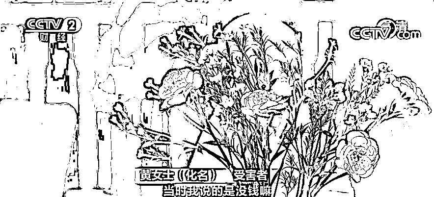

黄女士缺钱，拒绝更贵的项目，可是医美机构的几个工作人员却围着她一直不停给她洗脑，**让她办理贷款，甚至自作主张给黄女士下载贷款软件**。

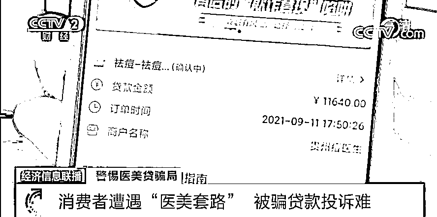

在工作人员的代操作下，**黄女士稀里糊涂贷款了一万多元**，但是办完贷款的第二天，黄女士意识到自己可能上当受骗了，想回去办退款，店家的态度立马变了样。

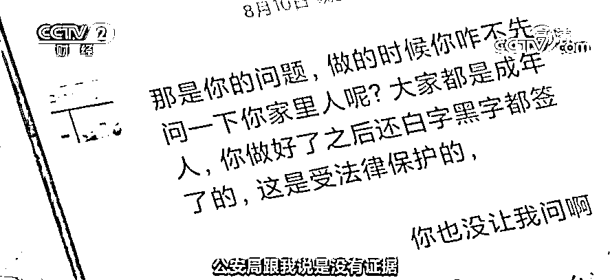

投诉无门的黄女士不敢把真实情况告诉家人，只能靠临时打工，东拼西凑每月还款近 700 元。 

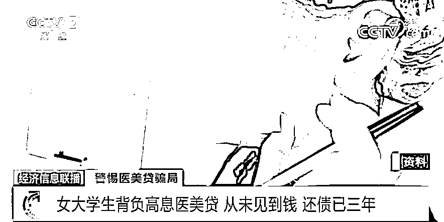

类似的情节也在武汉周女士的身上发生过，还是大学生的周女士，没有任何还款能力，却在当地医美机构工作人员的诱导下办理了一万多元的高息贷款。而贷款一办下来，**周女士还没见到钱，就被全部转到了医美账户上**。

**受害者 周女士：**就这样直接刷出去了，**我自己这三年来都一直在还贷款、还利息，利息将近有五千了。**

**记者探访：部分医美机构借高价套餐诱导用户贷款******

**黄女士和周女士在美容机构的遭遇会是个例吗？记者走访了多家医美机构进行调查，发现大部分医美机构都存在诱骗顾客进行分期贷款的情况。 **

 **[`mp.weixin.qq.com/mp/readtemplate?t=pages/video_player_tmpl&action=mpvideo&auto=0&vid=wxv_2062909628627091457`](https://mp.weixin.qq.com/mp/readtemplate?t=pages/video_player_tmpl&action=mpvideo&auto=0&vid=wxv_2062909628627091457)** 

**△央视财经《经济信息联播》栏目视频**

**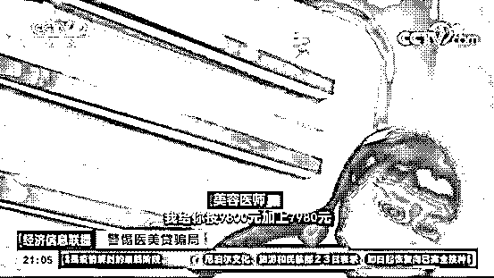**

**记者以消费者身份来到北京市丰台区的一家医美机构，所谓的美容医师要求先给记者做一个皮肤检测，对照着检测显示屏一边检测一边描述说，记者皮肤问题非常严重，紧接着，美容医师便向记者推荐了店内最贵的价值一万多元的护理套餐。**

**由于产品价格太高，记者表示要放弃做医美项目时，医师则立即向记者推荐起了贷款。当记者表明自己刚毕业，没有工作与任何收入，**医美机构工作人员立即声称贷款审核并不严格，不需要担保即可贷款**。**

**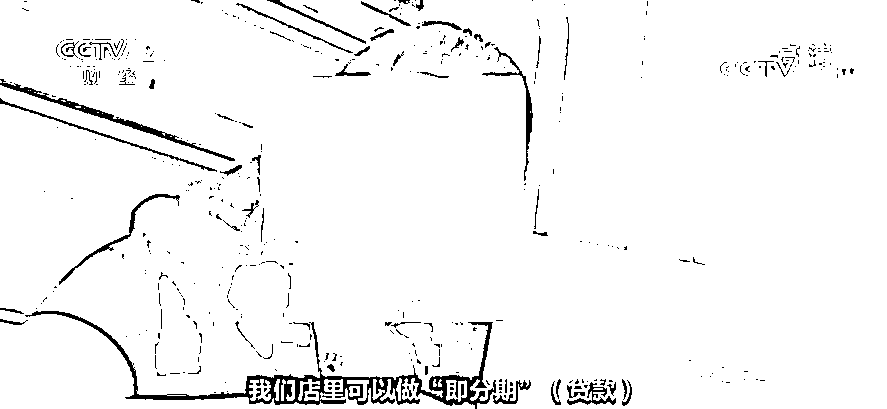**

**记者在北京又走访了 7、8 家医美机构后发现，**大部分医美机构都与贷款机构合作，贷款利率都在 30%以上，远高于一般银行的消费贷款利率**。**

**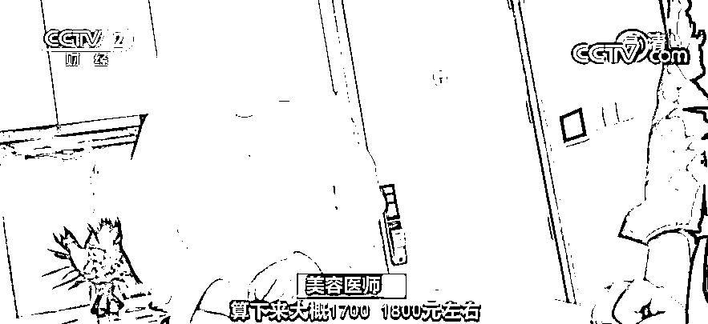**

****美容医师：**利息分期付款，算下来 1700、1800 元左右。1800 元乘以 24 约 43000 元，原先是 26800 元，**这就相当于是 60%的利息**。**

****事实上，**客户所贷款项并不是直接打给顾客，而是直接打给医美机构**。****

****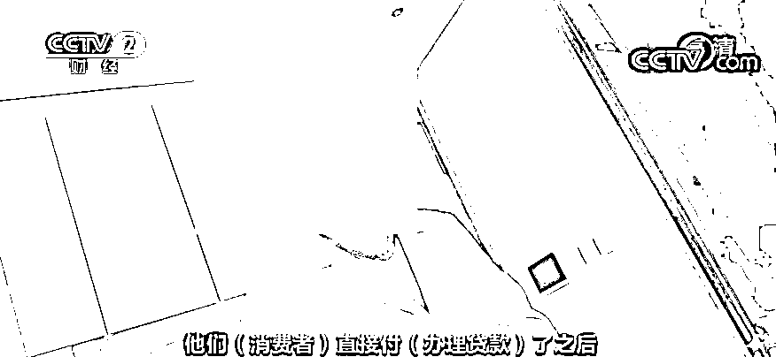****

****近年来，医疗美容纠纷呈现明显上升趋势。根据《北京朝阳区人民法院医疗美容纠纷案件民事审判白皮书》（2016 年度-2020 年度），**北京朝阳区法院受理的医美纠纷案件数占同期医疗纠纷案件数比例在过去 5 年间从 10.8%上升至 27.0%。******

****年化利率超 30% 部分医美贷利率偏高畸高************

****记者在调查中发现，很多消费者认为“医美贷”动辄 30%以上的贷款利率过高，但是目前监管机构对于此类贷款的利率是否有相关规定？这些“医美贷”究竟是否合法合规？****

 ****[`mp.weixin.qq.com/mp/readtemplate?t=pages/video_player_tmpl&action=mpvideo&auto=0&vid=wxv_2062914352386473989`](https://mp.weixin.qq.com/mp/readtemplate?t=pages/video_player_tmpl&action=mpvideo&auto=0&vid=wxv_2062914352386473989)**** 

****△央视财经《经济信息联播》栏目视频****

****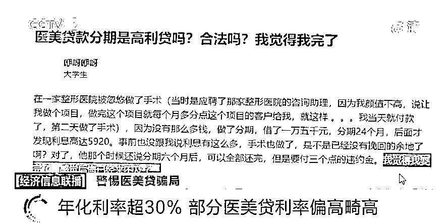****

****记者在网络上搜索“医美贷”，发现很多消费者都在网上询问“医美贷”利率过高是否属于高利贷，还有消费者因为利率过高，发出“后悔已经来不及了”的感慨。****

****专家表示，目前我国对于借贷利率有两种管制方式，对于金融机构借贷利率法律法规并没有明确限制，因此理论上没有明确的利率上限；对于民间借贷利率，根据最高法出台的最新司法解释，司法保护上限是央行发布的一年期贷款市场报价利率（LPR）的四倍，目前是年化不能超过 15.4%。**但是目前“医美贷”利率的确存在偏高、畸高，有些甚至超过了年化利率 30%**，此外还有名目繁多的各种费用。**** 

****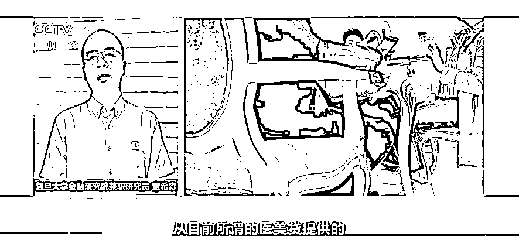****

******复旦大学金融研究院兼职研究员 董希淼：**从目前所谓的“医美贷”提供的这些信贷服务来看，无论是在披露实际贷款主体以及以明显的方式展示年化利率等方面，这些“医美贷”相关产品大多数不符合央行的相关规定。**** 

****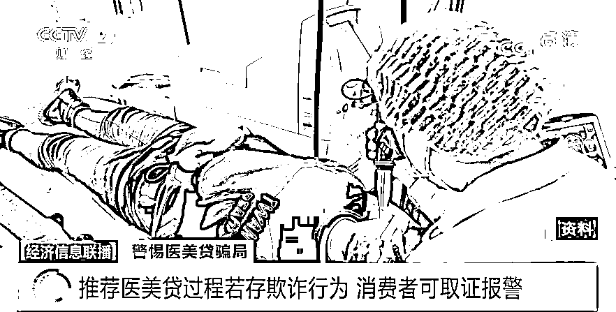****

****对于“医美贷”是否合法，**律师表示，法律上并不禁止“医美贷”，也不禁止医美从业人员向消费者推荐医美分期付款或者贷款。具体要看在推荐的过程中，是否在方法和手段上存在违法问题。******

****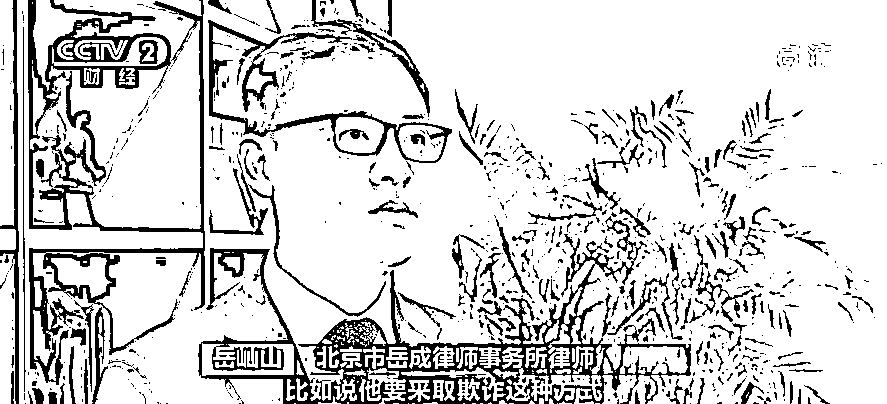****

******北京市岳成律师事务所律师 岳屾山：**比如他如果采取欺诈的方式，进行诱导或是欺骗让你来完成贷款，可能是违背了你真实意思表示的一种民事行为，这个时候是可以申请撤销的。另外，如果在整个介绍的过程中，包括医美项目、贷款本身，存在着一些隐瞒或是不真实的信息披露，那可能也是属于一种欺诈的行为。**** 

 ****律师表示，出现上述情况消费者可以主张自己权益，或向相关的部门进行报告，但诱骗贷款存在取证困难的问题，**消费者应提高警惕，事先录音录像保存证据方便事后维权**。律师还提醒消费者应合理消费，量入为出，避免因无法还款导致进入失信名单。****

****来源：央视财经****

********

****← 向右滑动与灰产圈互动交流 →****

********