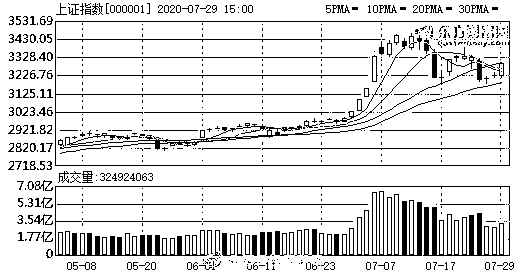

# “荐股群”骗局：48 人群 47 个托

> 原文：[`mp.weixin.qq.com/s?__biz=MzIyMDYwMTk0Mw==&mid=2247521273&idx=6&sn=2a62717005d905441c768aff0eb716d9&chksm=97cb58c1a0bcd1d748cafe6ef0efc2b8eb23e6936393e78a2a620ab2bfffd380de478858ebf1&scene=27#wechat_redirect`](http://mp.weixin.qq.com/s?__biz=MzIyMDYwMTk0Mw==&mid=2247521273&idx=6&sn=2a62717005d905441c768aff0eb716d9&chksm=97cb58c1a0bcd1d748cafe6ef0efc2b8eb23e6936393e78a2a620ab2bfffd380de478858ebf1&scene=27#wechat_redirect)

**来给大家简单说说“荐股群”的骗局吧**，不懂股票的也可以看哦，骗局本质上都是差不多的套路。 

首先，“荐股群”可以简单理解为推荐你买啥股票的群。 

**一般群内都会有一位“大师”**，这位大师懂行情，还知道内幕，只要跟着他买股票就能赚钱的人。 

荐股群就打着“大师”的招牌，吸引想买股票的人，觉得大师厉害的粉丝，但是现在网络这么发达，**怎么会有人傻到”大师“说买啥就买啥呢？**

这就得先从如何让你加进荐股群开始谈起了。

一般加进荐股群的多数是对股票不怎么了解的小白，他们揣着钱，初入股票市场，却不知道该买哪股合适，又害怕随便买会赔钱。 

于是便去各种网站，App 里学习股票知识。骗子正是抓住小白想学股票知识，开始办”大师“网络直播课，整理股票必学资料等等，吸引小白关注。

这种网络直播课和学习资料都是免费的，但他们会通过直播分析行情、定期发放福利、入会辅导投资等等吸引人加入到专属的群，实质上都是荐股群。

一但进了群，噩梦便开始了。

**40 人的荐股群能做到 39 个都是骗子……只为骗你一个人的钱……** 

群里的“大师”、“助理”以及各位“粉丝学员”全部都是诈骗团伙操控的帐号，等投资者一进群，就开始他们的表演。

首先，“大师”会在群里给出他看好的股票名称和代码，声称这些股票有翻倍、暴涨的潜力，然后建议群员可以购买。

而此时，群里的“粉丝”也会第一时间发言，说些认同的话，再踊跃跟投，一副大师说怎么做就怎么做的忠实粉丝。

每天都会看到“大师”和“粉丝”的表演，一边借“粉丝”的追捧神化“大师”的业务能力，一边用粉丝跟风行为诱导群内成员从众跟投。

不仅如此，诈骗团伙还会安排“粉丝”在群里分享各自的收益情况、向老师请教后续操作，不要小看日常的股票交流，其实是诈骗团伙准备的慢性“麻醉剂”。

**诈骗团伙通过制造多赚少赔的假象，误导投资者形成一种总会赚点的观念。**每天看群内各种成功案例，10 万成本一天赚 5000，投资者警惕性也会下降，开始产生跟投的念头，甚至跟投后亏损了也觉得是正常现象，不如“再搏一次”，一次全部赚回来，却不知会越赔越多~

事实上，未经中国证监会许可，任何机构和个人均不得从事各种形式证券、期货投资咨询业务。

而荐股群里的“大师”虽自称“首席分析师”，**很多却没有相关从业资格，有的只是懂点股市的门外汉。**

他们收取高额的会员费、服务费，给出的建议却不具备参考价值，更有甚者，通过诱骗大批散户接盘的方式向庄家换取佣金，不仅导致投资者产生巨大损失，还在一定程度上破坏市场秩序。

此外，一些诈骗团伙还会冒充正规投资公司，提供虚假投资平台诱骗投资者注资。后续通过在后台实时操纵行情、伪造交易记录等手法欺诈用户大量资金。

而无论何种形式，通过荐股群买入的股票多会赔钱，投进去的钱要么被套牢，要么几乎全赔光。

骗子就是利用部分人的专业知识匮乏和想赚大钱的心理打造骗局，大家看到荐股群之类的，一定要警惕！

来源：武汉市反诈中心，阻击诈骗

← 向右滑动与灰产圈互动交流 →

