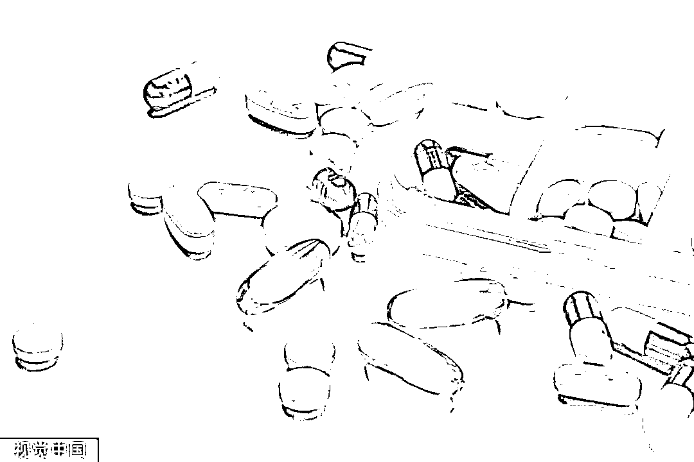

# 你在网上买到的安眠药，可能是毒品！

> 原文：[`mp.weixin.qq.com/s?__biz=MzIyMDYwMTk0Mw==&mid=2247521312&idx=4&sn=0c2991c2ee74ba586befdd78e2c4a5ff&chksm=97cb5f18a0bcd60e7f97cc4aab9bda5982f293eecabc39784bcd7977b4504c6af7f3e97adb9b&scene=27#wechat_redirect`](http://mp.weixin.qq.com/s?__biz=MzIyMDYwMTk0Mw==&mid=2247521312&idx=4&sn=0c2991c2ee74ba586befdd78e2c4a5ff&chksm=97cb5f18a0bcd60e7f97cc4aab9bda5982f293eecabc39784bcd7977b4504c6af7f3e97adb9b&scene=27#wechat_redirect)

“ 

作为镇静安眠药，三唑仑、地西泮用于治疗失眠、焦虑，但其实很多管制类精神药品，滥用后可能成为毒品。**目前国家规定的相关药品一共 430 多种，其中有精神抑制类、麻醉类等，必须由医生根据患者病情开具处方才能购买。**

**近日，有媒体报道，在二手网络交易平台上，有人以“卖助眠药”为名，销售管制类精神药品，一些号称能搞到助眠药物的药贩子声称有相关药物，加微信就能购买。** 

****

****

****那么，此类药品真的能轻易买到吗？买卖、持有这类药物达到一定数量，要承担怎样的法律责任？****

****乱象：二手交易平台销售处方“安眠药”，售价上涨十多倍****

**在二手交易平台，有的卖家以“助眠神器”为名，销售国家管制的一类精神药品“三唑仑”以及其他类别的管制精神药品。**

**还有的卖家在失眠相关论坛专门贴出自己的微信，称想要快速治疗失眠，可以私聊联系。**

****

**双方取得联系后，卖家会发来一个二手交易平台上的商品，往往是普通商品链接，但售价却是三唑仑、地西泮等药物的十多倍。**

**购买后，卖家会通过快递邮寄药品。**

****

**镇静安眠药可用于治疗失眠、焦虑，但其实很多管制类精神药品，滥用后也可以成为毒品。**

****目前国家规定的相关药品一共 430 多种，其中有精神抑制类、麻醉类等，必须由医生根据患者病情开具处方才能购买。****

****专家：地西泮等一旦滥用会成瘾，****医生考取处方资格才能开药****

**专家告诉记者，**地西泮就是常见的“安定”，小剂量使用有镇静的作用，中剂量使用有催眠的作用，但如果大剂量使用就有麻醉的作用，容易依赖和成瘾，非医疗目的使用可被当成毒品。****

****

**专家表示，现在网络上购买管制类精神药物的，一般有两种人：**

*   **一种是为了过量服用，把它当做“毒品”使用，这也是打击的重点；**

*   **另一类人，虽然出现了精神上的焦虑症状，但苦于社会传统对“精神疾病”的担心，不去看医生，自行买药服用，这也非常危险。**

**“医生必须考取这一类药品的处方资格才可以开药，而且对于医生开多大的量有严格限制。有些人有精神相关的疾病，但是不愿意去精神科就诊。**其实，精神类的疾病就是心理上的感冒，药物一定要在专业人士的指导下使用，因为它们风险太高，我们才有管控。**”**

****

**然而，二手交易平台上仍然能够买到此类药品。**

**对此，一家二手交易平台表示，管制类药物都属于违规违禁品，平台有禁止发布的限制措施。同时用户也可以通过平台举报，平台会及时核实、下架，并对违规账号进行封禁等处理。**

**此外，平台会不断更新词库等加大对商品变形词的甄别，并已和相关执法部门建立联动机制共同打击网络黑产。**

****

****律师：贩卖精神管制类药品也可能被认定为贩毒并追究刑责****

**记者梳理发现，2019 年 8 月至今年 8 月，两年间共有 231 起涉及走私、贩卖常见一、二类精神药品的刑事案件宣判。**

****其中违法者多通过互联网社区推销，利用二手平台进行支付，通过物流快递完成交易，形成一个完整“网上黑市”交易链条。****

****

**山东济南历下区警方就在走访中发现，辖区内一家医院开具了比往常多 3 至 4 倍的精神类药品，这些药品都被一个团伙卖到了外地，供瘾君子吸食。**

**历下公安分局禁毒大队民警介绍说：“一个犯罪嫌疑人一天上六七个科室，甚至还会换别的医院，装病长期开药。**嫌疑人在网上把药贩卖给瘾君子，药价翻了 4 到 5 倍，赚取差价，这就是贩毒的行为。**”**

****

**律师介绍，**国****家****禁毒办专门有对管制类精神药品、麻醉药品依赖性折算表。****

**湖南一被告人罗某某贩卖 4 支 140 毫克地西泮，盈利 48 元，根据《非法药物折算表》等于 0.000014 克海洛因，其因贩卖毒品罪被法院判处有期徒刑 7 个月，并处罚金 3000 元。**

****

**走私、贩卖、运输毒品，无论数量多少都应当追究刑事责任。**

**而精神类管制药品和麻醉药品可作为毒品予以认定，以药品的名义贩卖毒品，采用隐蔽手段或明显违背合法物品惯常交接方式的，也极易认定为贩卖毒品。如果购买人以上述方式购买，同理会认定为非法持有毒品罪。**

**来源：央视网**

****

**← 向右滑动与灰产圈互动交流 →**

****