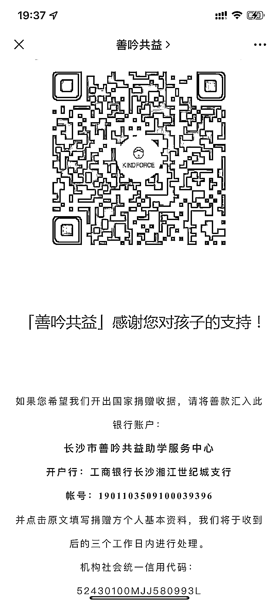
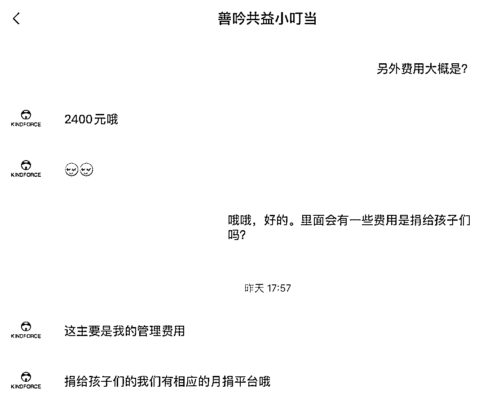

# 举报龙晶睛善吟共益及计育韬名下三家公司涉嫌非法公开募捐、虚假募捐

> 原文：[`mp.weixin.qq.com/s?__biz=MzIyMDYwMTk0Mw==&mid=2247521362&idx=1&sn=5b1313654df7040af2da626d0d96b44a&chksm=97cb5f6aa0bcd67c1fd4bd37fcf7b5f2d6a599edb2967dd8e6fd9d2efec14ed5c473ea5a6ffe&scene=27#wechat_redirect`](http://mp.weixin.qq.com/s?__biz=MzIyMDYwMTk0Mw==&mid=2247521362&idx=1&sn=5b1313654df7040af2da626d0d96b44a&chksm=97cb5f6aa0bcd67c1fd4bd37fcf7b5f2d6a599edb2967dd8e6fd9d2efec14ed5c473ea5a6ffe&scene=27#wechat_redirect)

**背景介绍：**

长沙市善吟共益助学服务中心及其创始人龙晶睛近期得到大量官方媒体的正面报道，北京小黄人科技有限公司（下称我公司）及公司部分个人也对该项目进行了捐赠，随后看到了大量网友、媒体的质疑。

因此我们进行了深入了解，确实**发现了较多疑点，甚至怀疑「善吟共益」、龙晶睛及其关联单位可能涉嫌违法，因此正式向有关部门实名举报。**

* * *

以下举报发生时间为 9 月 24 日。

**举报理由一**

**「善吟共益」不具备公募资格却在长期公开募捐**

**事实 1：**官网公布银行账号及二维码进行公开募捐。

**事实 2：**官网公布收入总金额 193.5 万。

**事实 3：**公众号公布银行账号及二维码。

来源公众号：善吟共益

公众号 id：kindforce

文章标题：《体验达人招募令|嗨，有个觉想请你睡一下》

时间：2018 年 10 月 13 日

文章链接：[`mp.weixin.qq.com/s/3pJqApXVaOTWD1_2IAra9w`](https://mp.weixin.qq.com/s?__biz=MzU4NzY5NTMyNg==&mid=2247483807&idx=1&sn=2f582404725c2a40dbada5e6e77a3dcb&scene=21#wechat_redirect)

来源公众号：善吟共益

公众号 id：kindforce

文章标题：《贫困山区学生| 一对一资助 （项目介绍）》

时间：2019 年 8 月 30 日

文章链接：[`mp.weixin.qq.com/s/ZpTkXKqLXgg5-_EFN8OP1A`](https://mp.weixin.qq.com/s?__biz=MzU4NzY5NTMyNg==&mid=2247484763&idx=1&sn=6a6cbfd2511588d7527264648f0bf8ac&scene=21#wechat_redirect)

因此可以认定，**「善吟共益」从 2018 年成立至今三年多，一直在从事公开募捐活动。**根据民政部全国慈善信息公开平台“慈善中国”（https://cszg.mca.gov.cn）查询，**「善吟共益」未取得公开募捐资格，但长期在其网站上公布银行账号及收款二维码，涉嫌违法。**中华人民共和国民政部 2019 年 04 月 19 日发布《民政部关于不具有公开募捐资格的组织或者个人不得开展公开募捐活动的提示》 中提到：

> 如果属于公开募捐活动的，应当按照法律要求具备公开募捐资格以后才能继续进行，否则属于违法行为。网页链接：http://www.gov.cn/xinwen/2019-04/19/content_5384442.htm

中华人民共和国民政部 2021 年 03 月 29 日发布《关于防范非法社会组织以公益慈善名义行骗敛财的提示》中提到：

> 根据《中华人民共和国慈善法》等法律规定，登记或者认定为慈善组织且取得公开募捐资格的社会组织以及依法可以开展公开募捐活动的其他组织，才能开展公开募捐活动。其他组织或者个人不得开展公开募捐活动。网页链接：http://www.mca.gov.cn/article/xw/mzyw/202103/20210300032822.shtml

《中华人民共和国慈善法》第一百零一条

> 开展募捐活动有下列情形之一的，由民政部门予以警告、责令停止募捐活动；对违法募集的财产，责令退还捐赠人；难以退还的，由民政部门予以收缴，转给其他慈善组织用于慈善目的；对有关组织或者个人处二万元以上二十万元以下罚款：（一）不具有公开募捐资格的组织或者个人开展公开募捐的；（二）通过虚构事实等方式欺骗、诱导募捐对象实施捐赠的；（三）向单位或者个人摊派或者变相摊派的；（四）妨碍公共秩序、企业生产经营或者居民生活的。

根据民政部及《中华人民共和国慈善法》第一百零一条，**长沙市「善吟共益」助学服务中涉嫌违法开展公开募捐时间已长达三年，违法募捐金额达 193 万余元。**
希望有关部门进行调查核实处理并予以公示。以上信息已向湖南省公安厅、湖南省民政局、长沙市民政局进行举报。我们已经看到长沙民政局回复的信息，但未解答我们所有疑问，本文结尾我们继续追加一些问题。

**举报理由二**

**「善吟共益」未按要求公示信息**

根据《中华人民共和国慈善法》第七十二条：

> 慈善组织应当向社会公开组织章程和决策、执行、监督机构成员信息以及国务院民政部门要求公开的其他信息。上述信息有重大变更的，慈善组织应当及时向社会公开。
> 
> 慈善组织应当每年向社会公开其年度工作报告和财务会计报告。具有公开募捐资格的慈善组织的财务会计报告须经审计。

中华人民共和国民政部 2018 年 08 月 07 日发布《慈善组织信息公开办法》 中提到：

> 慈善组织应当依法履行信息公开义务，信息公开应当真实、完整、及时。慈善组织应当建立信息公开制度，明确信息公开的范围、方式和责任。慈善组织应当对信息的真实性负责，不得有虚假记载、误导性陈述或者重大遗漏，不得以新闻发布、广告推广等形式代替应当履行的信息公开义务。 
> 
> 网页链接：http://www.mca.gov.cn/article/gk/fg/shflhcssy/201808/20180800010515.shtml

**长沙市善吟共益助学服务中心网站上未公布其组织章程，也未公布 2018-2019 年财务信息及审计报告，2020 年财务审计报告为 2021 年 9 月 16 日公布。**

其官网所公示信息也存在很大可疑。2021 年 9 月 15 日截图显示输送课时**12025**节课，收入总计**193.5**万元，但 2021 年 9 月 26 日输送课时变为了**12677**节课，收入总计变为了**190.3**万元，收入不增反减 3.2 万，并且数据更新日期一直显示为 2021 年 8 月 31 日。

另外，在 2018 年江苏卫视的一档电视节目中，显示龙晶睛“组织**近****8000**人赴山区支教”，而 2019 年人民网报道龙晶睛“累计招募志愿者**超过 1500**人”（链接：https://baijiahao.baidu.com/sid=1669717812849966016&wfr=spider&for=pc），2020 年湖南省红网微博报道龙晶睛他们“一共号召了 1500 名志愿者”，现在 2021 年官网公示**1506 人**。

从 18 年到 19 年，志愿者总数骤减近 6500 人，从 19 年到 21 年两年间志愿者总数却增加≤6 人。如果连人数这么容易统计的数据都出错的话，很难让人相信其他数据的真实性。

希望有关部门进行调查核实处理并予以公示。

以上信息已向湖南省民政局、长沙市民政局进行举报。

**举报理由三**

**「善吟共益」涉嫌进行虚假公益活动**

根据我们了解，2021 年「善吟共益」平均每个月要安排超过 2 次支教活动（http://www.kindforce.org/dqzjbm），单次收取支教队员 2000-5000 元不等，没有专业背景要求，付款就可以参加，每次支教活动中仅有 2 天从事“教学”活动，剩余时间为采风、农村生活体验或者旅游。

所有支教上课时间均发生在周六周日以及如国庆 10 月 2-6 日的法定假期。

而且每年有十多次的“支教”目的地为凤凰县两林乡板井小学，这样的支教行为是否为当地教育局了解并支持？板井小学根据网上公开报道总计约 26 名学生，每次支教要去 20-38 名不等的“支教老师”，且法定假期里是否所有学生都要参与配合“支教”？当地学生能否得到充分的休息，是否会对学生的生活产生影响？

例如以下公开报道的文章中显示：总计有 7 名老师同时在讲台上，这样的行为是否是真的教学行为？令人怀疑。

且支教不需要有任何专业背景，基本给钱就能去，每个人需要自费 2000-5000 元去支教，而且**所有的费用都不包括捐赠给当地孩子任何物品，也不包括捐款，如果想捐赠的的话需要去他们的月捐平台去操作，所有收取的费用都归「善吟共益」平台支配，为管理费用。**

「善吟共益」以上行为涉嫌违反《中华人民共和国慈善法》第三十三条：**禁止任何组织或者个人假借慈善名义或者假冒慈善组织开展募捐活动，骗取财产。**

希望有关部门进行调查核实处理并予以公示。

以上信息已向湖南省公安厅、湖南省民政局、长沙市民政局进行举报。

**举报理由四**

**涉嫌与上海衬线文化传播有限公司联合非法公开募捐**

来源公众号：JZCreative

公众号 id：jzcs0320

文章标题：《新媒体人！和我们一起去支教！》

发布时间：2021 年 4 月 28 日

文章链接：[`mp.weixin.qq.com/s/QBWEYC-axjCFkIUzgBOHGg`](https://mp.weixin.qq.com/s?__biz=MzU3MDIyODE4NQ==&mid=2247506236&idx=1&sn=594ab1d05d959140c713edb628b871d4&scene=21#wechat_redirect)

链接二维码：

活动名义是第一期新媒体人爱心暑托班：

发起方为：E2 编辑器（网站链接为：https://e2.cool/，备案信息为：计育韬）JZCreative（公司主体为：上海衬线文化传播有限公司）、404 艺术（公司主体为：上海四零四艺术文化发展有限公司）、以及衬线（公司主体为：上海衬线文化传播有限公司）、谘诹（公司主体为：上海谘诹信息技术有限公司）

以上公司主体股东结构如下，实际控制人均为计育韬。

https://e2.cool/，备案信息为：计育韬

上海衬线文化传播有限公司，公司法人：计育韬，持股比例 80%

上海谘诹信息技术有限公司，公司法人：计育韬，持股比例 50%

上海四零四艺术文化发展有限公司，股东：计育韬，持股比例 40%

而且计育韬名下上海衬线文化传播有限公司为龙晶睛名下湖南省善吟创益文化传播有限公司的股东，持股比例为 10%，计育韬为湖南省善吟创益文化传播有限公司的经理。

经民政部中国社会组织政务服务平台（网址：https://www.chinanpo.gov.cn/）查询，**计育韬名下三家公司均为“非法社会组织”**（根据民政部定义：非法社会组织是未经民政部门登记，擅自以社会组织名义进行活动的组织，不具备公开募捐资格。）

文章中介绍：

> 本次助学的统一项目善款设定为 ¥5000，款项将统一由民非资质「善吟共益」管理，接受社会监督。善款将首先用于本次项目执行中期的公益行动开支。

注意文章当中，他们将收费定义为“善款”，费用的管理单位为「善吟共益」，文章中反复提到这次是“公益支教”行动，因此可以认定，**计育韬及名下三家公司与「善吟共益」以公益支教的名义公开接收捐款，属于违法开展公开募捐行为，已涉嫌违反《中华人民共和国慈善法》。**  

另外根据文章中公布的行程安排，该活动总共持续 5 天，其中第 1 天接风，第 4 天欢送赶赴旅游景点凤凰古镇，第 5 天自由活动，中间只有两天会给孩子们“上课”，但也不忘安排一次非遗采风和农耕体验活动。其中上课安排为约 20 人总共上 7 节课，且上课时间为周六和周日，需要牺牲当地小学生们的休息时间。

中华人民共和国民政部 2021 年 03 月 29 日发布《关于防范非法社会组织以公益慈善名义行骗敛财的提示》中提到：

> 根据《中华人民共和国慈善法》等法律规定，登记或者认定为慈善组织且取得公开募捐资格的社会组织以及依法可以开展公开募捐活动的其他组织，才能开展公开募捐活动。其他组织或者个人不得开展公开募捐活动。
> 
> 非法社会组织无论是在公共场所设置募捐箱，通过广播、电视、报刊、互联网等媒体发布募捐信息，还是举办“义演”、“义赛”、“义卖”、“义展”、“义拍”、“慈善晚会”等，所开展的任何形式的公开募捐活动均属违法。
> 
> 网页链接：http://www.mca.gov.cn/article/xw/mzyw/202103/20210300032822.shtml

由于上海衬线文化传播有限公司发起的此次募捐活动收费为 5000 元/人，而由「善吟共益」独立发起的募捐活动通常收费为 2000-3000 元，其中**差额的部分怀疑为上海衬线文化传播有限公司所收取，涉嫌以公益慈善名义行骗敛财。**

▲JZ 多媒体方案微博截图，现已删除

计育韬、上海衬线文化传播有限公司、上海谘诹信息技术有限公司、上海四零四艺术文化发展有限公司等单位均参与其中。

希望有关部门进行调查核实处理并予以公示。

以上信息已向湖南省民政局、长沙市民政局、上海市民政局、上海市公安局进行举报。

长沙市民政局、上海市公安局金山分局正在调查处理。

北京小黄人科技有限公司

2021 年 9 月 24 日

*还有其他资料我们将择时公开。

* * *

**【9 月 26 日补充信息】**我们注意到日前长沙民政局以及龙晶睛通过微博回应的内容，这些回答没有完全解答我们的疑问，我们继续提问：***1\.*** 龙晶睛说：**没有认真核对稿件，组织帮扶 24 所学校，并非我本人去了这么多。**请问：媒体在报道你十年支教、24 所小学的时候，当时怎么不澄清一下，距离当时媒体报道已经 20 天了，你有无数次机会澄清的。***2\.*** **机构刚成立时不了解相关法律把二维码挂到了官网。**请问：你可是有 10 年公益经验的老手了，还有专业的公益团队，甚至龙晶睛本人还有助理，说你们全部都不了解相关法律实在说不通。就算刚开始不懂，直到今年 9 月 16 号才下线，中间三年时间都没有机会搞懂？善吟共益不光是挂了二维码在官网，还在官网以及公众号里放了收款银行账号，注意，你还没有公募资格，这是涉嫌违法的。***3\.*** **5000 元的新媒体主题支教本意是想通过合伙人的影响力号召更多人关注山区教育现状，但欠缺考虑。**请问：5000 元的定价依据是什么，你平时的支教收费是在 2200-2800 之间，多出来的是给计育韬和他们公司的分成还是销售奖励，或者是什么，麻烦解释一下。***4\.*** **民非运营的面向大众支教的项目费用一分都没入公司的账，且每年接受审计，官网可查。**请问：抱歉，官网上公布的并没有明细，都是分类账目。我们公司和同事作为你们的捐赠人，麻烦公布一下详细的捐赠清单吧，哪部分是短期支教的收入和对应的开支，需要能精准到人的。如果需要，我们可以寄送公函要求你公开。***5\.*** **网传“商业、赚钱”利用公益敛财其实并不存在，因为机构是非营利的。**请问：“善吟共益”是非营利的不假，但是“善吟创益”是营利机构，你们明确写了“志愿者服务证书申请国外大学可加分”，有多少“支教老师”是冲这个报的名？善吟创益股东当中还有一家主打留学中介咨询的企业，有没有利益输送 ？

***6\.*** **我们又不专业没资格证**请问：你明知你们没有相关资格证，还敢招募没有任何经验背景的人去教学。长沙民政局回复链接：http://mzj.changsha.gov.cn/zmhd/xjgs/zwxx_xl.html?metadataId=65020172&siteId=143 链接二维码： 

根据长沙民政局的回复，说是经过调查，参加支教旅行人员只参与音体、素质类课程。但是，根据极目新闻采访的一位曾参与善吟共益短期支教的摄影师发出来的课程表里显示，你们在周六周日还在给孩子们上语文、英语等课程，请问作何解释？

还有几个关键问题你并没有回答：***1\.*** 你没有公募资格 ，为何三年来一直在进行公开募捐？***2\.*** 所有短期支教的报名费是进的“善吟共益”的账，还是“善吟创益”的账？***3\.*** 你们客服人员说报名费都是你们收的管理费，如果要捐款捐物还要单独捐赠，你们又自相矛盾了。***4\.*** 你们资助的小学一年要分别接待多少次“支教团”？***5\.*** 所有的短期支教教学活动都集中在周六周日和国庆假期，学生们如何保证充足的休息？麻烦请不吝回复一下。

北京小黄人科技有限公司

2021 年 9 月 26 日

* * *

**【拓展阅读】**

***1\.*** 龙晶睛谈慈善婊

[`mp.weixin.qq.com/mp/readtemplate?t=pages/video_player_tmpl&action=mpvideo&auto=0&vid=wxv_2064656280509579266`](https://mp.weixin.qq.com/mp/readtemplate?t=pages/video_player_tmpl&action=mpvideo&auto=0&vid=wxv_2064656280509579266)

***2\.*** 封面独家｜美女海归支教实为网红打卡？本人回应 同行称短期支教对孩子影响不好

报道链接：https://baijiahao.baidu.com/s?id=1711939537204609918&wfr=spider&for=pc

链接二维码：

节选如下：

**我们一直抵制短期支教，对农村孩子的伤害很大**

封面新闻记者采访了长沙另一支教单位——天使支教负责人李磊，天使支教从事支教事业 15 年，对方表示知道龙晶睛，也知道善吟共益。但对于寒暑假短期支教以及大学生支教，他直言：“抛开通过支教赚钱来说，毕竟这个是没有任何证据的，我们一直是抵制短期支教。因为短期支教对农村的孩子造成的伤害是很大的。正常的教学是有一定周期的，你去了一个星期或者半个月一个月，你能给他们教些什么呢？我承认，短期支教对大学生的成长是有帮助的，但不能为了大学生的成长去伤害小朋友的成长。”

李磊认为：“现在教育理念有习惯养成，课堂教学也是有规律性。短期支教严格意义上不叫支教，我们一直反对暑期短期支教，首先从学生的角度，学生需要有休息的时间。很多大学生来找我们的时候，我们也跟他们的建议不要做暑假短期支教，如果非要去做的话，可以去做夏令营，组织小朋友一起玩，不要上课。长期支教，全部都是由我们给志愿者提供生活补助，包括一个多月的系统培训，培训通过了才能去支教。这也是另一方面我们反对大学生暑期支教的原因，因为这个大学生他自己还是个未成年人，一般是大一学生，自己还算不上真正合格的成年人，他们能带给农村的这些学生有价值的东西其实是不多的，如果做得不好的话会带过去大量的破坏。我们这么多年一直是在很多公开的场合都是反对大学生暑期支教。”

至于大学生短期支教给孩子们带来的破坏，李磊直言不讳地指出：“比如有的大学生在自己的生活习惯还没有养成足够好的时候，到农村给学生的示范作用肯定是很不好的。每年都有很多高中生希望做短期，甚至有些在国外的家长打电话过来希望我们提供一段时间支教，我们都拒绝了。支教的价值在于可以让参与者得到一定的体验，但是对于农村的孩子的伤害太大。你正常做长期支教，半年时间仅仅是学生和老师之间相互熟悉，比如熟悉孩子的家庭情况、个性，学生熟悉老师的教学风格啊，还有半年的时间就是真正就可以发挥作用。就一年还勉强过得去，一两个星期那样的支教有什么意义，真的没有任何意义。”

李磊表示自己也看到了关于龙晶睛的新闻，他认为很大一个问题就是：“每年都在换学校，如果你非要去支教的话，短期的一年也行，你必须固定一个学校，这样的话和学生还是稳定的。结束以后可以跟学生网上联系、邮件来往、书信来往啊，下学期我寒暑假我又来陪你们，这样人的感情也是稳定的，我遇到很多做短期支教的团队，他们自己也说了，只能做打一枪换一个地方，是因为你把这个地方做坏了，只能再换一个地方做。我曾经跟一些做支教老师说，支教做完之后，你们最好私下找村民问问对你们的评价。”

谈到村民们的评价，李磊说：“因为我们听到太多的对暑期支教老师挺无可奈何的声音，甚至有一些本地老师也说，如果不是冲着他们带过来的一些物资，根本不接受他们。这些人会给学生捐赠一些东西，或者发放一些补助，本地老师出于孩子会有所获得的情况下，才同意对方来做暑期支教。”李磊说，“我们甚至听到有身边的有些村民说：‘看这帮大学生又来把我们的小孩当玩具了’，他们就直截了当这样说的。”

最后，李磊表示：“现在大学生的普遍生活习惯不好，能给农村学生带来什么？有的打扮得花枝招展，到农村去，带着学生跳各种各样潮流的舞蹈，对才七八岁的那些小朋友能带来什么好的价值？在他们三观还没有树立好的时候，怎么去给农村的小朋友去当老师？！我们一直鄙视这种短期支教。”对李磊而言，天使支教对志愿者的选拔也是极其严格，“时长肯定是一年以上，还有一个基本考核的要求：包括心理分析，对教育的认识，对农村的这些认识，能达到我们的要求，还要交 500 元的保证金，到岗两个月之后再退还。

“不能因为说你最近比较空想去支教就去了，不想去了就走了。如果没通过培训倒没什么，就怕通过了培训，在支教的地方呆了一个星期了后突然提出‘这不是我想要的’，就退出了，这一退出重新去调整老师是很难的，对一个班的教学是很大的影响，所以就通过保证金的形式，先把这类人筛选出来。”李磊说。

来源：小黄人科技

← 向右滑动与灰产圈互动交流 →

