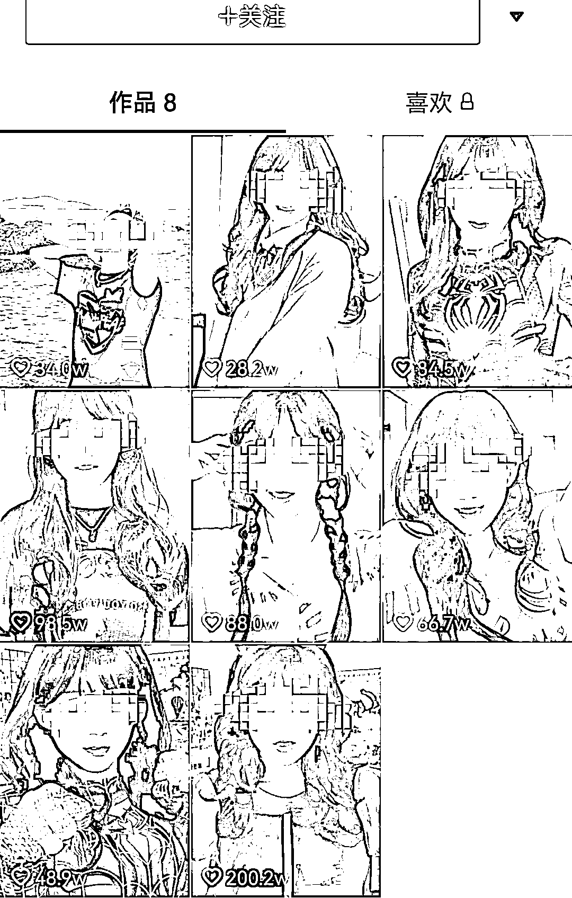
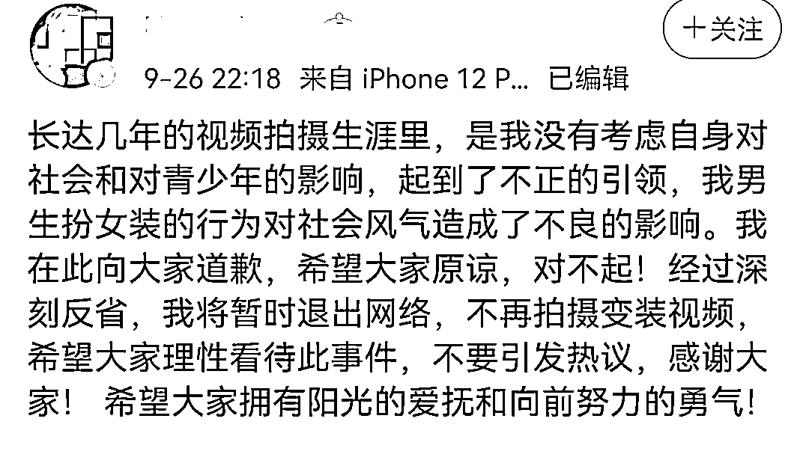

# 永久封禁！网红男博主道歉：以后不变了

> 原文：[`mp.weixin.qq.com/s?__biz=MzIyMDYwMTk0Mw==&mid=2247521362&idx=2&sn=2997fb03b2b9523c0a979acd853d8ece&chksm=97cb5f6aa0bcd67c159703669e77cd9b9b0289d50d347d7e645ea673ad5c22a91c271bb4a0bf&scene=27#wechat_redirect`](http://mp.weixin.qq.com/s?__biz=MzIyMDYwMTk0Mw==&mid=2247521362&idx=2&sn=2997fb03b2b9523c0a979acd853d8ece&chksm=97cb5f6aa0bcd67c159703669e77cd9b9b0289d50d347d7e645ea673ad5c22a91c271bb4a0bf&scene=27#wechat_redirect)

靠扮女装吸粉 200 多万的网红男博主“康雅雅”，因涉嫌低俗视频被平台永久封禁了。

本人发文道歉并退网：**是我没有考虑自身对社会和对青少年的影响。**

9 月 26 日，以“白雪公主变装”出圈的网红博主“康雅雅”晒出一张违规处罚通知单，称自己的抖音账号视频已被永久封禁。

据“处罚通知”显示，永久封禁的原因是“康雅雅”的视频内容涉嫌低俗。

昨晚，小编查看“康雅雅”的抖音账号，账号显示，该博主有 270 多万粉丝，账号仍在运行，但此前作品已不可见。 

不过，今天小编再次打开该账号时，发现有部分视频又处于可见状态。

而“康雅雅”则在 9 月 26 日晚上发文道歉：“**是我没有考虑自身对社会和对青少年的影响，**起到了不正的引领，我男生扮女装的行为对社会风气造成了不良的影响。我在此向大家道歉，希望大家原谅，对不起！”

“康雅雅”还称**将暂时退出网络，不再拍摄变装视频。**

从网上流传的“康雅雅”往期作品中可以看出，变装后的他跟女生无异，甚至比女孩子还娇媚可爱。

变装前

变装后

对于这类视频，有人觉得挺好玩，不过也有人担心，时间长了，小朋友看到以后，会不会误解？

所以“康雅雅”账号视频被永久封禁一事引发了热议。

有网友觉得就是扮个女装而已，还好吧，永久封禁有点过了。

也有不少网友拍手称快：哗众取宠，封得好，一点也不冤枉。 

“康雅雅”视频被封禁到底冤不冤，交给你们去评判。

小编要说的是，近年来为赚取流量，毫无底线造作的博主层出不穷。

前段时间，吃播男博主”风小逸”吃桃子事件闹得沸沸扬扬，风小逸从穿着打扮、行为举止、说话语气都极度女性化，最终遭网友举报后封号。

# 而坐拥 1200 多万粉丝的主播“铁山靠”则因长期用地方方言骂人吸引流量，最终被抖音永久封禁了。

9 月 2 日，在某短视频平台拥有 700 万粉丝的网络红人“郭老师”被平台永久封禁，同时，其自制短视频在各社交网络集体下架。

这位郭老师过去曾被视为“土味网红”代表。2018 年，她在多个短视频平台开设直播账号，因自创的“郭言郭语”受到部分网友追捧。

9 月 2 日，国家广播电视总局网站发布《关于进一步加强文艺节目及其人员管理的通知》，提出坚决抵制低俗“网红”、无底线审丑等泛娱乐化倾向。同日，文旅部发布《网络表演经纪机构管理办法》，提出要加强对经纪机构的管理，**约束表演者行为，坚持正确的价值导向，治理娱乐圈乱象。**

**不知从何时起，审丑在网上成了一股潮流，一些网民对于畸形低俗的东西颇有兴致，面对批评也总认为不过娱乐消遣而已，没必要上纲上线。一些另类网红恰是抓住了这种猎奇、窥私的心理，靠大肆炫丑来吸睛圈粉。**

**炫丑令人作呕，炒丑、审丑亦是病态，切不可放任自流，由他们搞得网络空间乌烟瘴气。倘若靠放屁啃脚、撒泼打滚就能名利双收，对社会价值观也无疑是一种冲击与扭曲。**

**来源：新闻晨报**

****

**← 向右滑动与灰产圈互动交流 →**

****