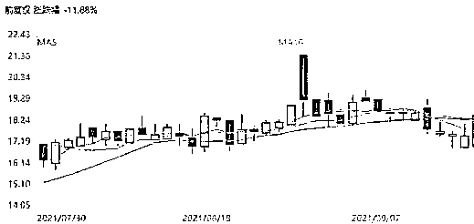

# 邪典设计，江南布衣，约谈下架，退货处理

> 原文：[`mp.weixin.qq.com/s?__biz=MzIyMDYwMTk0Mw==&mid=2247521362&idx=3&sn=67ea21a0c6123be9d8c848d7636d6a1e&chksm=97cb5f6aa0bcd67c5a0664ba88f670ca102a4d3a45b2d9e64f24d1d64f599e77f776fa84b17a&scene=27#wechat_redirect`](http://mp.weixin.qq.com/s?__biz=MzIyMDYwMTk0Mw==&mid=2247521362&idx=3&sn=67ea21a0c6123be9d8c848d7636d6a1e&chksm=97cb5f6aa0bcd67c5a0664ba88f670ca102a4d3a45b2d9e64f24d1d64f599e77f776fa84b17a&scene=27#wechat_redirect)

该公众号已被封禁

近日，“江南布衣童装现不当图案”事件持续发酵，不少媒体与网友扒出其童装产品设计中存在涉及“宣扬暴力”、“软色情”等不适合儿童的图案和文字。

对此，杭州西湖区通报称，西湖区相关部门已约谈该企业，责成其立即下架涉事童装及同类型款式服装，同时成立调查组对该事件进行调查。

江南布衣被约谈

 9 月 26 日晚，杭州西湖区人民政府新闻办公室官方微博 @西湖发布 通报，近日发现，有网民投诉江南布衣服饰有限公司生产童装印有不当图案。对此，**西湖区相关部门已约谈该企业，责成企业立即下架涉事童装以及同类型款式服装，对已售涉事童装作无理由退货处理。**同时，成立由区市场监管局等部门和属地街道组成的调查组，对该事件进行调查，并将依据调查结果依法依规进行处理。 

江南布衣童装现不当图案

近日，有网友在江南布衣旗下童装“jnby by JNBY”产品衬衣上发现了“Welcome to the hell”（欢迎来到地狱）、“Let me touch you”（让我摸摸你）等英文字样，并配有撒旦、骷髅头、地狱等不适合儿童的文字、图案内容，引发争议。

网友在社交平台上发布的江南布衣旗下童装品牌产品图案。

对此，“jnby by JNBY”官微在 23 日发表致消费者的一封信。文中称，已第一时间全面下架所涉商品系列，撤销相关宣发物料，并成立专项小组启动自查。同时公司已开放消费者退货渠道，已购相关下架商品的消费者可以去原购买渠道进行退货。同时，这封致歉声明也用了更多篇幅“介绍了”jnby by JNBY 品牌理念，称是**借助艺术的设计手法，创造更多童趣。**

不过，这一声明并没有平息网友的愤怒，在该声明的评论中，网友反而认为江南布衣方面态度傲慢，“把无知当个性”。

事实上，自 9 月 22 日晚到 9 月 23 日官博回应之前，近一天的时间中，社交网络平台上已经展开了一场围绕“jnby by JNBY”设计风格的“讨伐”。多位消费者晒出了自己购买的童装照片，其中可以看到衣服的繁复印花中包含了钉锤、车裂、骷髅、断头等不当“邪典”元素；有网友放大图片表示，在部分较大的图案设计上，也存在着“破烂的兔子”、“插满箭的小人”、“胸前怪手”等怪异的表达，令众多消费者直呼是“阴间设计”。

被指不妥的印花和原作：某款羽绒服上下坠和拿枪的漫画小人原型，则出自美国现代多格漫画之父 Winsor McCay 的《小尼莫梦乡历险记》，“jnby by JNBY”却被指仅截取了其中某些具有争议的部分。

服装图案中，还有另一个极具争议的“下体”图案纹样被网友指出，图案或来源于名画《人间乐园》，画作带有强烈的宗教主题和对世人肉体享乐的劝诫意味，因此也被消费者质疑，“截取部分放在童装中并不合适”。

有网友称，很难认同声明中的所谓“个别产品”有问题，不当图案并不是今年才出现的问题，为何江南布衣迟迟没有动作，直到上了热搜，希望监管部门能介入对其进行调查。

问题产品 5 年前就存在

事实上，根据江南布衣 2016 年发布的招股书，其产品在推出市场前 9 个月就开始进行规划。而根据网友的反馈，**问题图片一事自 2017 年就已经存在，但直到 5 年后江南布衣才在舆论的压力下，出面致歉和下架商品。**有众多网友指出，这不仅是公司设计师们的“锅”，也是公司本身有问题。但巧合的是，公司的创始人之一，也是大股东的李琳正是负责公司的设计创意。

江南布衣这个上世纪 90 年代创立于杭州的本土服装品牌，曾被认为是杭派女装的代表之一，创立之初曾以“中国风”服饰出名。后来，江南布衣还扩展俄罗斯、日本等海外市场，成为拥有男装(速写)、女装(JNBY、LESS)、童装（jnby by JNBY、蓬马)等的国际化服装品牌。

老板娘把控产品设计

天眼查显示，“江南布衣（JNBY）”成立于 1994 年，是杭州江南布衣服饰旗下著名本土设计师女装品牌。“jnby by JNBY”是杭州江南布衣公司于 2011 年春季正式推出的童装品牌，被称为“小江南布衣”。该公司是由李琳和吴健夫妇创立。李琳是该公司大股东，也是公司法人、执行董事。**李琳则负责公司服装业务的设计与创新，把控产品整体走向。**

据媒体报道，江南布衣 2016 年的招股书显示，**李琳和吴健夫妇国籍已非中国**，而是圣克里斯多福及尼维斯籍。百度百科显示，圣基茨和尼维斯（The Federation of Saint Kitts and Nevis），位于东加勒比海背风群岛北部，现为英联邦成员国之一。面积仅 267 平方公里，2020 年全国人口约 5.7 万。

江南布衣股价暴跌 20%

而截至 9 月 24 日港股收盘，江南布衣股价暴跌 13.21%，报 14.98 港元/股，总市值仅存 77.7 亿港元，相比于事件大肆传播前的 18.5 港元收盘价，跌去近 20%。截至 2021 年 6 月，实控人李琳和吴健夫妇共持江南布衣 61.47%股份，持股身家为 48 亿港元，约合 40 亿人民币，如今一日蒸发 6 亿元。

来源：北京日报、@西湖发布、北京头条客户端、澎湃新闻、光明网等

← 向右滑动与灰产圈互动交流 →

