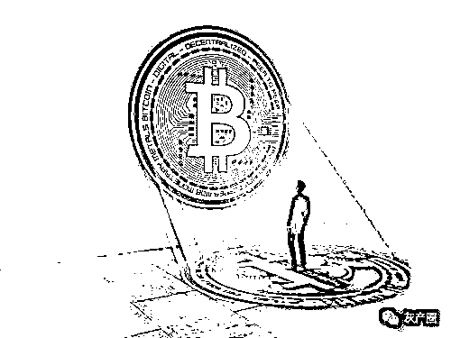
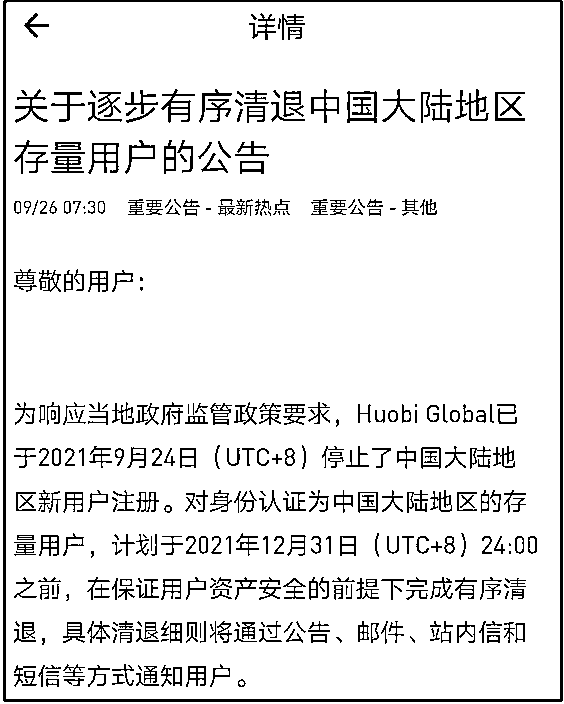
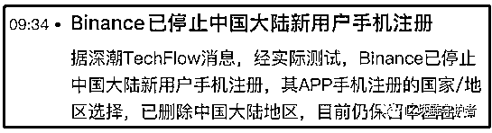
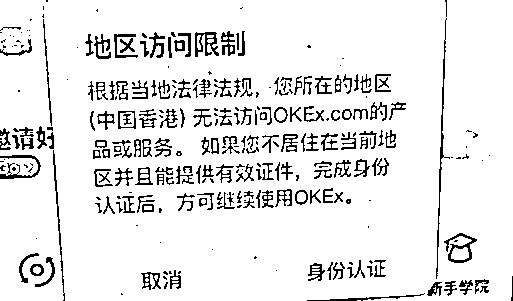

# 币圈彻底玩完！国内玩家再也不能炒币了！所有在中国买卖虚拟币都是违法行为！

> 原文：[`mp.weixin.qq.com/s?__biz=MzIyMDYwMTk0Mw==&mid=2247521362&idx=5&sn=3602fbc1e698fefda688a53e4afba7ad&chksm=97cb5f6aa0bcd67cb4f6107357e2d4eaf564d6069961ddb33e13a69e83f817af8df24668f3da&scene=27#wechat_redirect`](http://mp.weixin.qq.com/s?__biz=MzIyMDYwMTk0Mw==&mid=2247521362&idx=5&sn=3602fbc1e698fefda688a53e4afba7ad&chksm=97cb5f6aa0bcd67cb4f6107357e2d4eaf564d6069961ddb33e13a69e83f817af8df24668f3da&scene=27#wechat_redirect)

多部门整治虚拟货币再升级。9 月 24 日，人民银行等 10 部门发布《关于进一步防范和处置虚拟货币交易炒作风险的通知》。通知称，近期，虚拟货币交易炒作活动抬头，扰乱经济金融秩序，滋生赌博、非法集资、诈骗、传销、洗钱等违法犯罪活动，严重危害人民群众财产安全。

通知明确，虚拟货币兑换、作为中央对手方买卖虚拟货币等虚拟货币相关业务全部属于非法金融活动，一律严格禁止，坚决依法取缔。

同一天，国家发展改革委等多部门发布《关于整治虚拟货币“挖矿”活动的通知》，要求按照“严密监测、严防风险、严禁增量、妥处存量”的总体思路，加强虚拟货币“挖矿”活动上下游全产业链监管，严禁新增虚拟货币“挖矿”项目，加快存量项目有序退出。

在人民银行和发改委的两条通告发布之后，火币于今天下午发布了公告：将停止大陆新用户的注册，并且会对大陆身份认证的存量用户进行清退，期限在 2021 年 12 月 31 日之前。

也就是说，明年之后，所有火币国内注册的用户都无法在继续登录。

还可以说，明年国内再无火币。 

无独有偶，币安今天上午也发布了公告，“停止大陆地区新用户注册”。

接下来还用想吗？肯定是 OK 了。 

截止发稿前，前方传来消息：OK 香港地区已经无法登陆。

OK 之后呢？抹茶，满币，中币，比特儿等等一系列交易所都将面临同样的命运。

体格不硬的甚至都有可能直接关停。 

因为这些交易所有一个共同的特征：CEO 是国人，大部分是国内起家的，必须遵守国家的法律。 

以上总结为一句话：所有的中心化交易所将全部不再为国内用户服务。

**币圈算是彻底凉凉了，更准确的说，中国的币圈凉了，国内韭菜的生存环境基本没了！！！**

***定性为非法金融活动***

人民银行有关负责人表示，为建立常态化工作机制，始终保持对虚拟货币交易炒作活动的高压打击态势，人民银行等部门结合新的风险形势，在总结前期工作经验的基础上，起草了通知。

“我国对虚拟货币的监管政策是明确的、一贯的。”上述负责人表示，通知再次强调具有非货币当局发行、使用加密技术、分布式账户或类似技术、以数字化形式存在等特点的虚拟货币，如比特币、以太币等，包括泰达币等所谓稳定币，均不具有与法定货币等同的法律地位，不能作为货币在市场上流通。

通知明确指出，虚拟货币兑换、作为中央对手方买卖虚拟货币、为虚拟货币交易提供撮合服务、代币发行融资以及虚拟货币衍生品交易等虚拟货币相关业务全部属于非法金融活动，一律严格禁止，坚决依法取缔；境外虚拟货币交易所通过互联网向我国境内居民提供服务同样属于非法金融活动。

***切断支付渠道***

在具体措施上，通知提出，建立部门协同、央地联动的常态化工作机制；加强对虚拟货币交易炒作风险的监测预警；构建多维度、多层次的虚拟货币交易炒作风险防范和处置体系。

其中，“多维度、多层次”的防范和处置体系指的是，金融管理部门、网信部门、电信主管部门、公安部门、市场监管部门密切协作，从切断支付渠道、依法处置相关网站和移动应用程序、加强相关市场主体登记和广告管理、依法打击相关非法金融活动等违法犯罪行为等方面综合施策，有关行业协会加强会员管理和政策宣传，全方位防范和处置虚拟货币交易炒作风险。

通知提出，金融机构和非银行支付机构不得为虚拟货币相关业务活动提供账户开立、资金划转和清算结算等服务；互联网企业不得为虚拟货币相关业务活动提供网络经营场所、商业展示、营销宣传、付费导流等服务。

***“挖矿”被列入淘汰类产业***

与此同时，为有效防范处置虚拟货币“挖矿”活动盲目无序发展带来的风险隐患，深入推进节能减排，助力如期实现碳达峰、碳中和目标，国家发展改革委等部门发布《关于整治虚拟货币“挖矿”活动的通知》。

该通知显示，按照“严密监测、严防风险、严禁增量、妥处存量”的总体思路，加强虚拟货币“挖矿”活动上下游全产业链监管，严禁新增虚拟货币“挖矿”项目，加快存量项目有序退出。

为严禁新增项目投资建设，该通知强调称，强化新增虚拟货币“挖矿”项目能耗双控约束；将虚拟货币“挖矿”活动列为淘汰类产业；严禁以数据中心名义开展虚拟货币“挖矿”活动；加强数据中心类企业信用监管；严格限制虚拟货币“挖矿”企业用电报装和用能；严禁对新建虚拟货币“挖矿”项目提供财税金融支持。

为加快存量项目有序退出，该通知提出，依法查处违法违规供电行为；实行差别电价；不允许虚拟货币“挖矿”项目参与电力市场；停止对虚拟货币“挖矿”项目的一切财税支持；停止对虚拟货币“挖矿”项目提供金融服务；按照《产业结构调整指导目录》规定限期淘汰，对不按期淘汰的企业，要依据国家有关法律法规责令其停产或予以关闭。

来源：中国证券网

← 向右滑动与灰产圈互动交流 →

