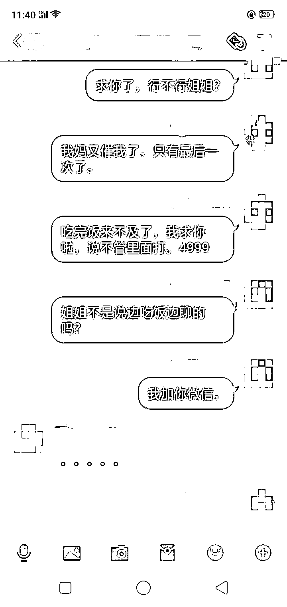
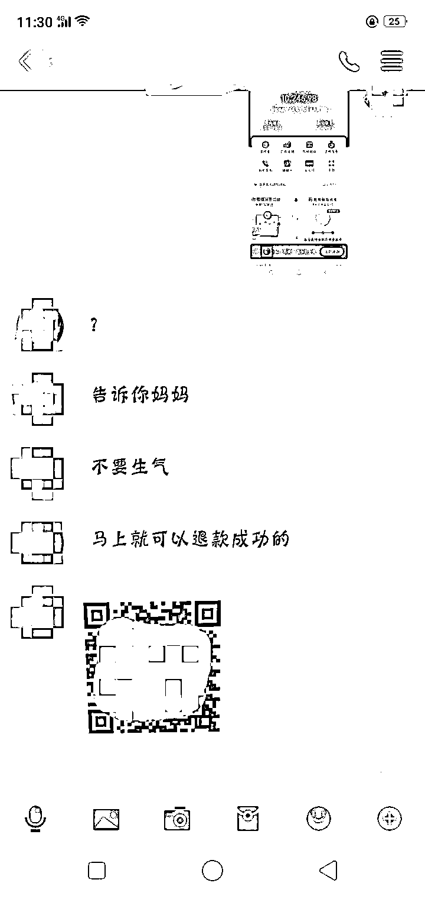
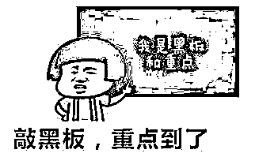
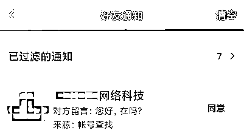
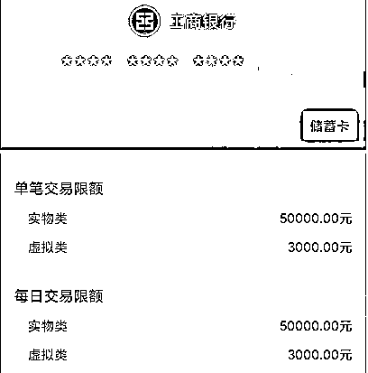

# 女儿玩游戏被骗，母亲为其出头，结果被骗得更惨……

> 原文：[`mp.weixin.qq.com/s?__biz=MzIyMDYwMTk0Mw==&mid=2247521362&idx=6&sn=3a750c698db50811b9213a598ecd3b43&chksm=97cb5f6aa0bcd67c6d41b85b60efb915e726240e6307b0bf6563d5578d564b20fb5e88d8103d&scene=27#wechat_redirect`](http://mp.weixin.qq.com/s?__biz=MzIyMDYwMTk0Mw==&mid=2247521362&idx=6&sn=3a750c698db50811b9213a598ecd3b43&chksm=97cb5f6aa0bcd67c6d41b85b60efb915e726240e6307b0bf6563d5578d564b20fb5e88d8103d&scene=27#wechat_redirect)

近日

家住南海松岗的小怡（化名）

因玩网络游戏被骗 5000 元

但万万没想到

小怡妈妈为女儿出面 

竟又被骗 6000 元……

**这里面到底是什么套路？**

**一起来看看：**

前段时间，小怡通过网络游戏结识了一名网友。9 月 11 日，网友以介绍更多“队友”组队为由，将小怡拉入某游戏 QQ 群。而后，**小怡在群里看见有“队友”发布可以免费领取一部手机的**“内部消息”**。**

9 月 15 日，小怡放学回到家中，想起之前的“内部消息”，便在 QQ 群中表达了自己想要申请手机的想法；数分钟后，小怡收到了一条“手机派送专员”的 QQ 好友申请。通过申请后，**“派送专员”向小怡发送了一条操作视频，并叫小怡跟着视频完成手机申请。**

但是小怡发现，跟着视频操作到最后阶段，并无法顺利申请到手机，而是出现了一个支付界面，于是向“派送专员”表达了心中的困惑。“亲，这只是正常的预定手续，后面会有‘退款专员’将款项还给你的。**”**在“派送专员”的哄骗下，小怡通过支付宝向对方转账 2995 元。****不久，“退款专员”如约添加小怡为好友，并发来“退款二维码”，声称只要扫二维码操作就可以将之前的 2995 元退回来，**然而，小怡操作后却再次向对方转账了 1999 元。****第二天晚上，见退款无果的小怡无奈只能将整件事情向妈妈和盘托出，并希望由家长出面申请退款。** 

**之后，小怡妈妈在和“退款专员”沟通中，**因急于拿到退款，又在对方的引导下扫描一未知二维码并开启了人脸识别功能**，最终被对方**分 6 次又骗取了 6000 元。****

9 月 17 日中午，意识到上当受骗的小怡一家前往松岗派出所报案。小怡父亲告诉民警，**因暑假期间小怡需要上网课，便给她买了手机，还绑定了其妈妈的支付宝账号并告知其支付密码，叫她自行购买课程，**平日里自己只是担心孩子沉迷游戏，根本没想到她会落入诈骗陷阱。

很多家长都以为 

网络诈骗离自己很远

就算骗子找上门 

自己也能快速识别

但，骗子哪怕骗不了你 

也可能会骗到你的孩子

**如果不及时给孩子普及反诈知识
那很可能给家里带来巨额损失**

公安提醒广大家长朋友

要做好以下几点：

1

教育孩子提高防骗意识，不点击短信链接，不加陌生好友，不信中奖、兼职赚外快、超低价等小广告，谨防诈骗。

2

做好手机支付账号安全管理，不让孩子知道家长手机支付密码，杜绝孩子私自使用家长手机进行支付操作。更不要轻易设置免密支付，以免其受骗后大额转账汇款。同时也要关注孩子自己的微信账号、支付宝账号的余额。

3

关注孩子上网情况，经常对孩子上网课使用的电脑、iPad、手机等电子产品进行检查，不明链接或二维码下载的 APP 一律予以卸载。

4 

教育孩子多与老师、家长沟通交流，遇到自己无法辨别的事情，或者受到侵害后，要第一时间告诉老师、家长，及时报警求助。

来源：南海公安、佛山日报、阻击诈骗

← 向右滑动与灰产圈互动交流 →

