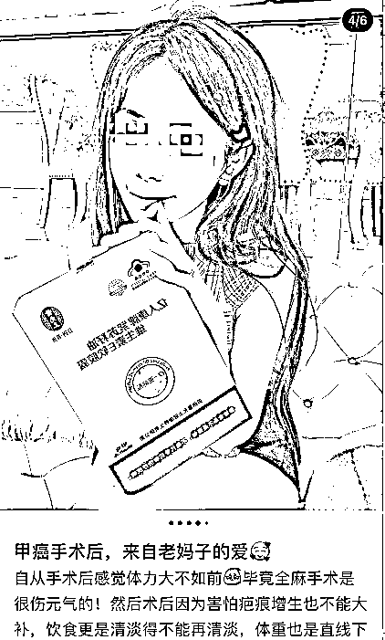

# “佛媛”后再现“病媛”：身患重病，带妆住院

> 原文：[`mp.weixin.qq.com/s?__biz=MzIyMDYwMTk0Mw==&mid=2247521393&idx=1&sn=4568f2ba6e30bd5d94ae2e8bd5511e39&chksm=97cb5f49a0bcd65f962aeaf04478703020b8c7a0b03663db3e8f5e97829115be2b34eb47706a&scene=27#wechat_redirect`](http://mp.weixin.qq.com/s?__biz=MzIyMDYwMTk0Mw==&mid=2247521393&idx=1&sn=4568f2ba6e30bd5d94ae2e8bd5511e39&chksm=97cb5f49a0bcd65f962aeaf04478703020b8c7a0b03663db3e8f5e97829115be2b34eb47706a&scene=27#wechat_redirect)

继“佛媛”之后，网上还出现了一批“病媛”：总是在社交平台上，声称自己患甲状腺癌、甲状腺结节、乳腺癌、抑郁症。

  

[此前报道👉《7 个“佛媛”账号，永久封禁》](http://mp.weixin.qq.com/s?__biz=MzIyMDYwMTk0Mw==&mid=2247521161&idx=5&sn=8b6037581b4461c8686b0ee829aa32ec&chksm=97cb58b1a0bcd1a7602b1effa6d2b62c411b88b29af4a535578c909bdd87f8396411d8a49543&scene=21#wechat_redirect) 

记者发现，“病媛”们会先发一些配着自己带妆的精致住院图片的文字，介绍自己患有某种疾病；再过几天又称“已经痊愈”，开始分享自己的术后恢复心得。在此过程中，病媛会向网友们介绍疤痕修复贴、保健品等产品，并称自己亲自使用过，效果很好。 

记者在某红书上发现，网红们穿着病号服，化着精致的妆容，神色甜美在医院的病床上躺着。下方的介绍则声称，自己患癌症、抑郁症等疾病。 

在某书上，一位网红称，自己做了甲状腺手术，切除了脖子上的肿块，术后脖子上有明显伤疤。之后，这名网红向网友分享了自己的祛疤经验，并推荐某品牌的疤痕贴、手术贴和疤痕凝胶。并称，坚持使用可像她一样，使疤痕消失。 

记者点开上述网红的主页后发现，此前，该网红还分享过自己剖腹产后去除疤痕的经验，介绍的也是上述品牌的产品。

还有一位“网红”称，自己先做了乳腺结节手术，之后又做了甲状腺癌手术。之后，分享了自己术后恢复期，服用的某保健产品，并在介绍中称，“该产品可有效抗癌”。 

记者注意到，在这些网红的“生病住院期间”，不少留言的网友向罹患疾病的网红表达了同情，并祝愿其尽早康复。

针对上述现象，北京市某三甲医院的医生告诉记者，一般情况下，患者在公立医院住院是不让带复杂化妆品的，最多就是洗面奶或者肥皂。 

“医学是一门神圣的学科，医院是救死扶伤的场所。这些人为了博关注、引流、涨粉、带货，声称自己身患重病，在医院里化妆摆拍，既是对医学、医院的亵渎，更是对承受病痛折磨患者们的不尊重。向消费者或病友们推荐某些未经权威机构认证过的产品，更是涉嫌虚假宣传。”上述医生表示。

来源：健康时报，澎湃新闻

← 向右滑动与灰产圈互动交流 →

