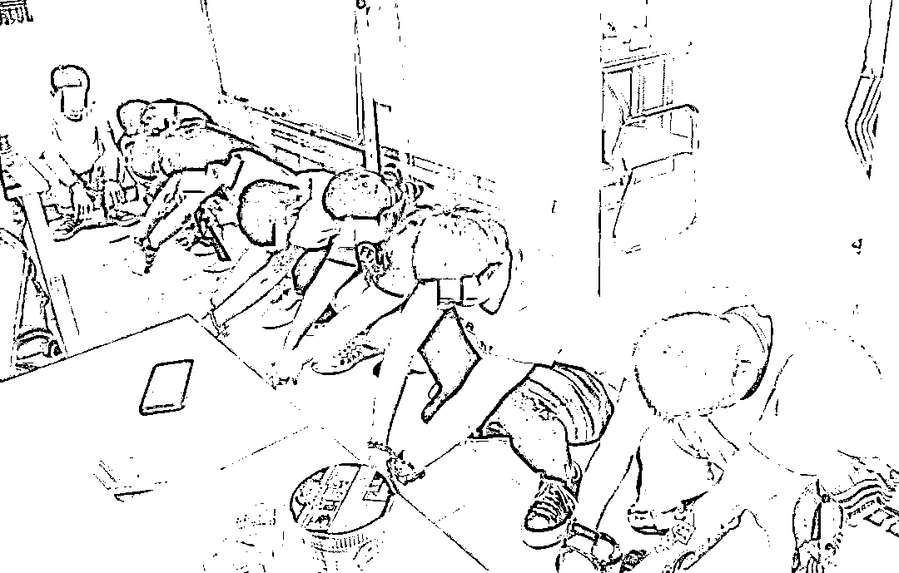

# 经常接到陌生人来电是为什么呢？2200 多万人的信息被打包叫卖

> 原文：[`mp.weixin.qq.com/s?__biz=MzIyMDYwMTk0Mw==&mid=2247521393&idx=3&sn=538ef05dac82f15eca8412809b963dfa&chksm=97cb5f49a0bcd65fe97c9ee30d7f4f7de53fdbde2705951288884fd00c7223a35d5c3ef2cc4e&scene=27#wechat_redirect`](http://mp.weixin.qq.com/s?__biz=MzIyMDYwMTk0Mw==&mid=2247521393&idx=3&sn=538ef05dac82f15eca8412809b963dfa&chksm=97cb5f49a0bcd65fe97c9ee30d7f4f7de53fdbde2705951288884fd00c7223a35d5c3ef2cc4e&scene=27#wechat_redirect)

通过各种非法渠道

收集公民个人信息

再登录“**暗网**”

利用 TG（俗称“飞机”）等聊天软件

在群组内**叫卖各种“黑料”**

买主有房产中介、保险推销

房屋装修等从业人员……

**一条隐秘的“茶马古道”**

“出售电话号码、保险资料，车辆信息等各种料……有需要可合作。”

今年 5 月份，椒江警方在工作中发现有人在暗网“茶马古道”网站里，贩卖椒江籍公民个人信息。

叫卖者是个人还是团伙？为何能掌握这么多人的信息？

因案件被侵犯对象广，嫌疑人不用常规社交工具和银行卡走账，而是用更为隐蔽的社交软件，侦查难度较大。椒江警方在上级部门支持下，依据线索开展专案侦查。

 “**就像在商场一样，只要买家肯付钱，想要的信息类型都有……**”办案民警介绍说。

随着调查深入，“茶马古道”里叫卖“料”背后的人，逐渐进入警方视野。

**“回马枪”+13 天的蹲守**

犯罪嫌疑人作案时使用虚拟货币交易，警方通过大数据分析，锁定了黑龙江人周某、佟某有重大作案嫌疑。

6 月 10 日，警方组织警力直扑黑龙江哈尔滨某小区，准备一举摧毁这个隐藏已久的窝点。不料犯罪嫌疑人十分狡猾，似乎嗅到危险的信号，人去楼空。

不过，侦查人员在现场扣押的涉案物品中发现大量公民个人信息及作案证据。

警方在后续侦查中发现，李某有重大作案嫌疑，李某的老婆马某负责财务管理等，抓捕刻不容缓。

7 月 9 日，侦查人员再次赶赴哈尔滨，连续通过蹲点守候 13 天，终将马某抓获。

马某落网后，侦查人员乘胜追击，将犯罪嫌疑人周某、佟某等 3 人抓获，查获各类公民个人信息 770 余万条。李某见大势已去，向警方投案。

**南下东莞 抓“王老板”**

随着侦查的深入，警方发现李某还有“上家”王某，窝点在广东深圳。

8 月 20 日，警方马不停蹄南下深圳，摸清了王某窝点的准确位置。

由于团伙人员都是同一村人，且集中居住、办公。侦查人员分析了现场情况，觉得抓捕条件复杂，困难大、时间紧，需要大量警力增援。

接到报告后，椒江警方连夜组织警力、安排车辆，赶赴深圳增援。第二天中午展开收网行动，抓获 9 名涉案人员，查获电脑、手机 20 余台、各类公民个人信息 1500 余万条。

**这架“飞机”里挤了上万人**

该案历经数月侦查，警方将 13 名犯罪嫌疑人全部抓获，彻底铲除了这条收集、贩卖公民个人信息的犯罪链。

据王某交代，他以前从业中介，收入也不高，一直希望能找一份轻松赚钱的行当。发现贩卖公民个人信息与其他商品不同，可以重复贩卖，利用到房产、保险、炒股等多个行业。招了本村人做业务员，联系广告、销售信息，按 20%提成，**每月工资高达 18000 元，用于联系业务的“飞机”聊天群，竟有上万人**！

办案人员介绍，犯罪嫌疑人把公民个人信息称为“料”。这些跟每个人都息息相关的“料”被贩卖后，不仅干扰公民的日常生活，还严重威胁到个人安全。**不法分子可根据这些信息编造家人车祸、生病等各种虚假内容，也可诱导被害人“投资理财”，实施电信诈骗，欺骗性和危害性极强**。

来源：台州公安，利箭在出击 

← 向右滑动与灰产圈互动交流 →

