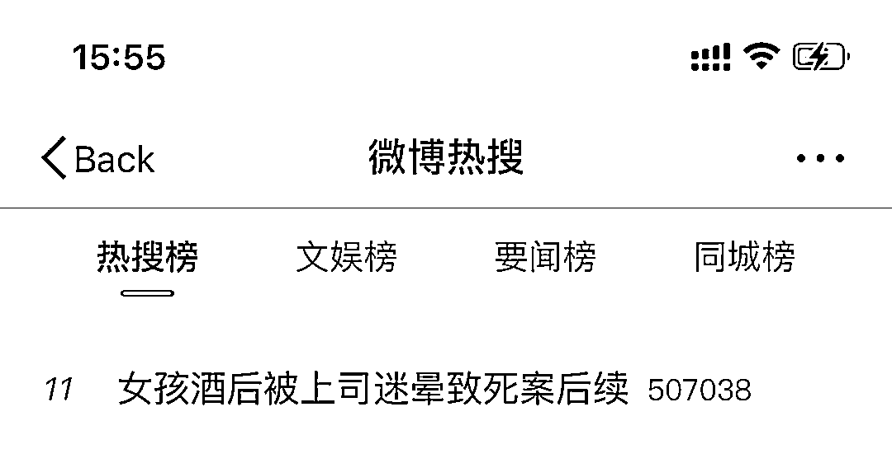
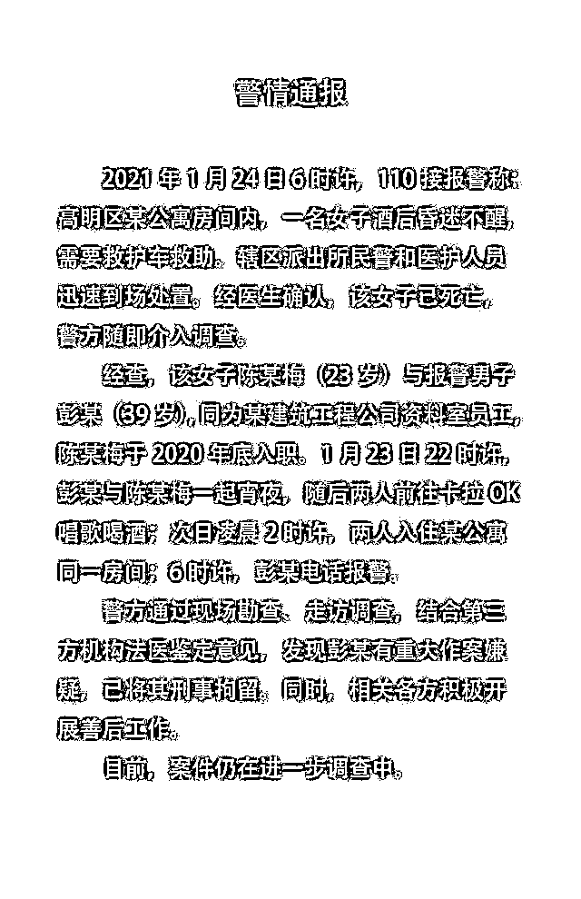
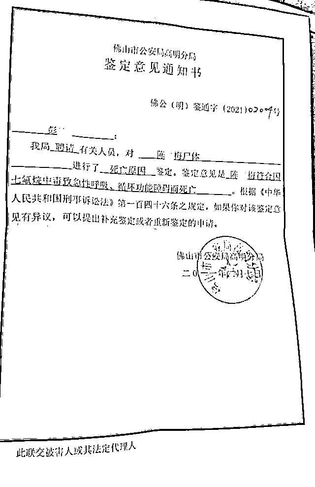

# 女员工酒后被上司开房迷晕致死，嫌犯带情趣用品赴约，太恐怖啦！

> 原文：[`mp.weixin.qq.com/s?__biz=MzIyMDYwMTk0Mw==&mid=2247521426&idx=1&sn=6af593ef93eb4073d110e565f18f47be&chksm=97cb5faaa0bcd6bcfc6abc5d9133c26a302a6af384ebeebc626b0999eb537d97fa2b81f0a564&scene=27#wechat_redirect`](http://mp.weixin.qq.com/s?__biz=MzIyMDYwMTk0Mw==&mid=2247521426&idx=1&sn=6af593ef93eb4073d110e565f18f47be&chksm=97cb5faaa0bcd6bcfc6abc5d9133c26a302a6af384ebeebc626b0999eb537d97fa2b81f0a564&scene=27#wechat_redirect)

昨天一条微博热搜

“**女孩酒后被上司迷晕致死案后续**”

引起热议

这到底是是怎么回事

宁宁来为大家梳理一下 

事情的始末

**1 月 23 日**

彭某得知同事被害人陈某梅失恋，**认为有机会与其发生性关系**，于是邀请陈某梅一起宵夜，并**携带七氟烷和情趣用品赴约**。

**1 月 24 日凌晨 2 点**

二人饮啤酒后于次日凌晨 2 时许一同入住佛山市高明区荷城街道一家酒店。

期间， **彭某趁陈某梅入睡之机，将七氟烷倒在纸巾上放置于陈某梅鼻子下方使其吸入，****致陈某梅昏迷后实施奸淫行为**，彭某因无法勃起而未能得逞。

**1 月 24 日 5 点**

5 时许，彭某发现陈某梅昏迷不醒，**因惧怕事情败露而出门将七氟烷瓶子和情趣用品丢弃**。随后返回住宿房间内。

**1 月 24 日 6 点**

6 时许，**彭某报警慌称陈某梅醉酒不醒**。医护人员到场后证实陈某梅已死亡。

**2 月 8 日**

家属从警方拿到的尸检报告显示，陈某梅因**七氟烷（注：七氟烷系麻醉药品）中毒致急性呼吸、循环功能障碍而死亡。**

**2 月 9 日下午**

佛山市公安局高明分局对外通报称，39 岁的男子**彭某有重大作案嫌疑，已被警方刑拘。**

**9 月 26 日**

从陈某梅的家属处了解到，日前，家属已接到电话通知，此案将于 10 月 14 日在佛山中院开庭审理。

**入职不到一个月，就出事了**

23 岁的陈某梅是广东茂名市化州人，出生于一个贫困家庭，其母亲天生聋哑，而父亲也是残疾人，其眼部有残疾。陈某梅和哥哥靠外公外婆、舅舅等亲属救济生活、读书。

2020 年 6 月，陈某梅拿到大专的毕业证书；2020 年 12 月 27 日，陈某梅入职梅州市某建筑工程有限公司，工作地点在佛山市高明区。然而，工作不到 1 个月，陈某梅就出事了。

▲佛山高明警方之前发布的警方通报

▲尸检报告

尸检报告显示，陈某梅因七氟烷中毒致急性呼吸、循环功能障碍而死亡。**趁女孩入睡让其吸入七氟烷导致其死亡。**

经法医学鉴定，**陈某梅符合因七氟烷中毒致急性呼吸、循环功能障碍而死亡**。

陈某梅的亲属表示，**案发第二天，彭某曾向他们表示，其和陈某梅发生了性关系，且是双方自愿的。然而，彭某被警方刑拘后，他一直坚称，和陈某梅“没有成功发生性行为”。**

事后，陈某梅的家属和梅州市某建筑工程有限公司达成了和解。莫先生表示，案发至今，彭某的家属及其律师没有联系过他们。

据莫先生介绍，目前，陈某梅的父母已提起附带民事诉讼，向彭某索赔死亡赔偿金、丧葬费、精神损害抚慰金等共计 1909971 元。

近两年

女性醉酒遇害的新闻层出不穷

作为女生

除了在外要好好保护自己之外

**也要学会拒绝**

**非必要应酬能不参与就不参与**

**饮酒之后要找亲近的人来接送！**

也劝告**某些心怀不轨**的人

只要犯罪，法律不会轻饶任何一个人！

不要毁了自己！

来源：澎湃新闻、反欺诈金钟罩、阻击诈骗

← 向右滑动与灰产圈互动交流 →

