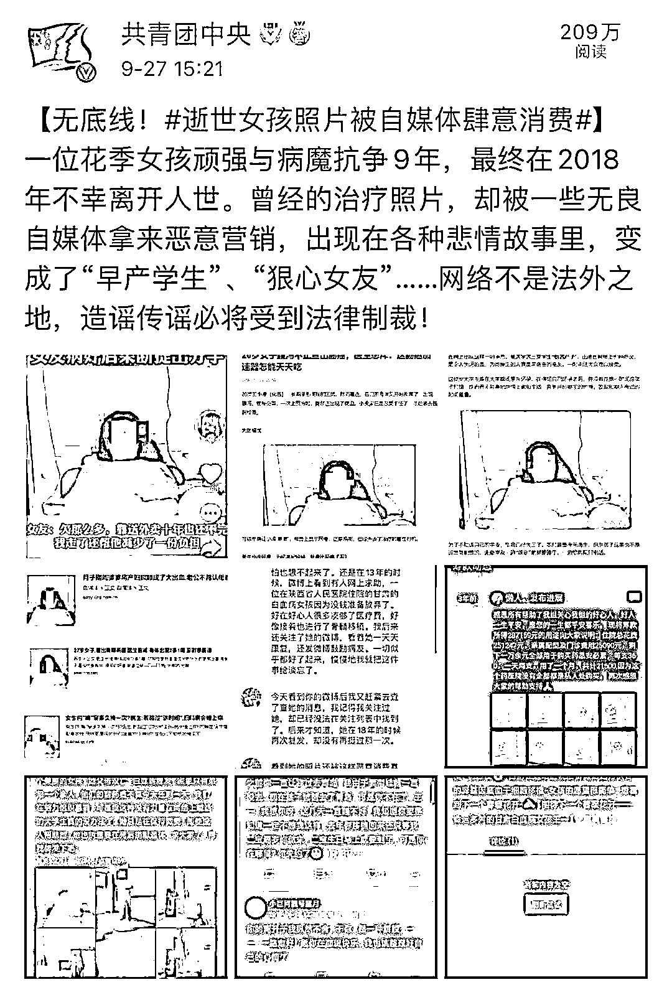
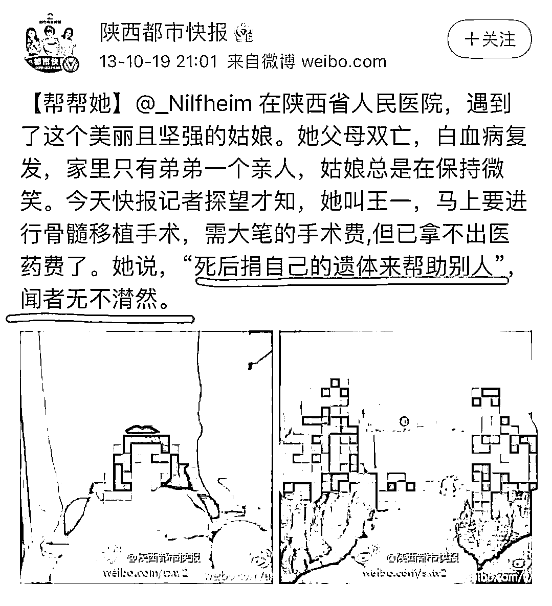
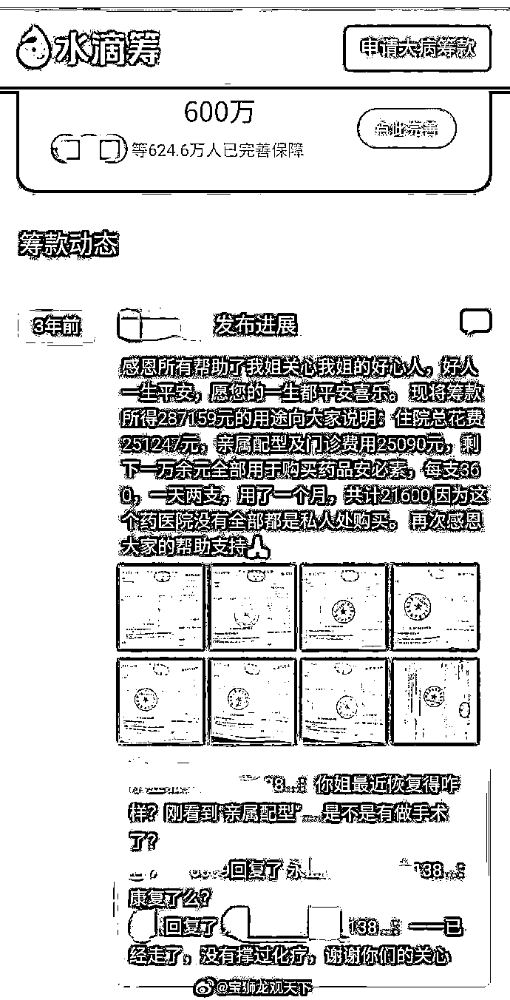
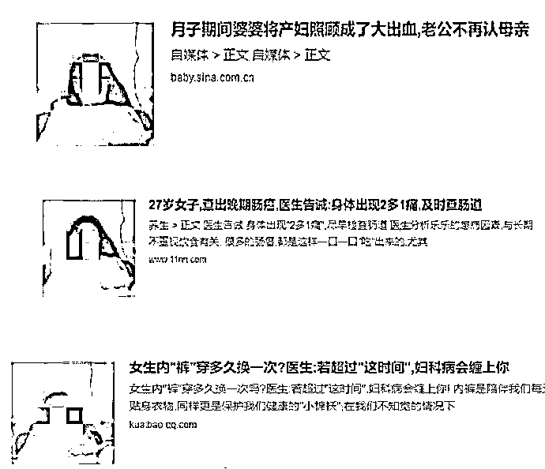
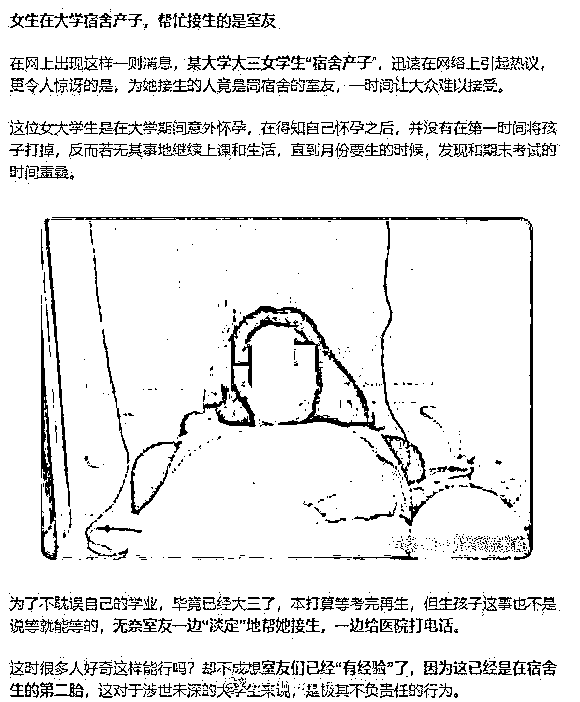
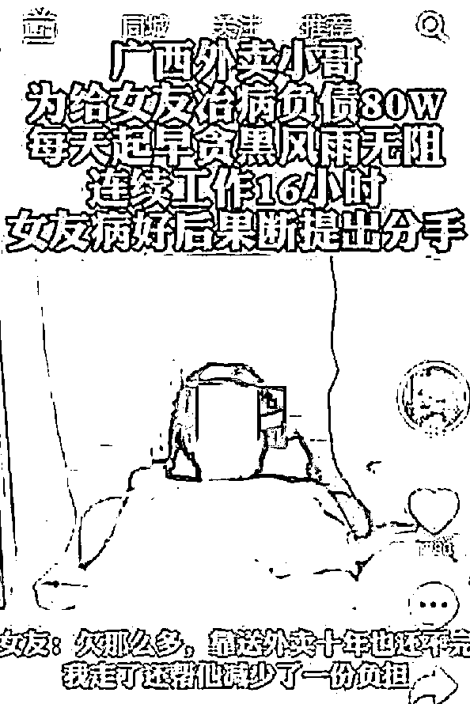
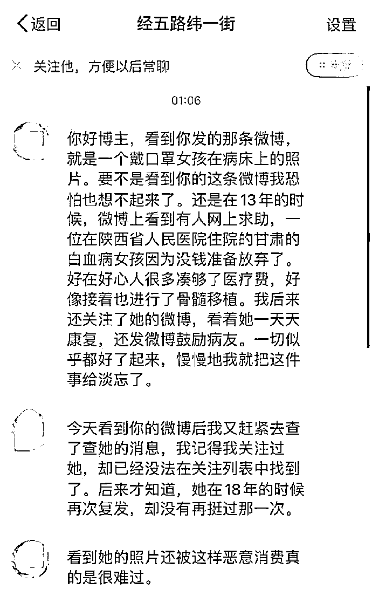
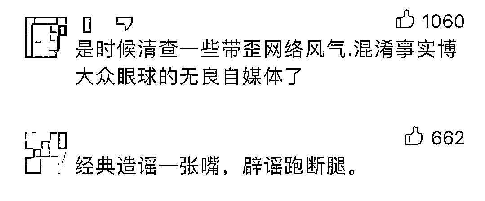
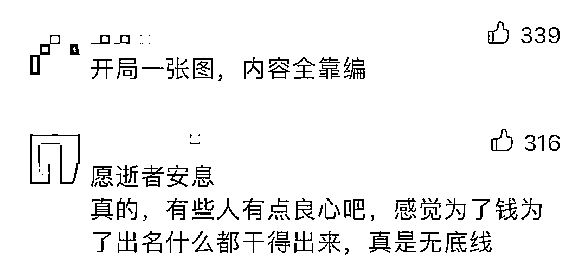
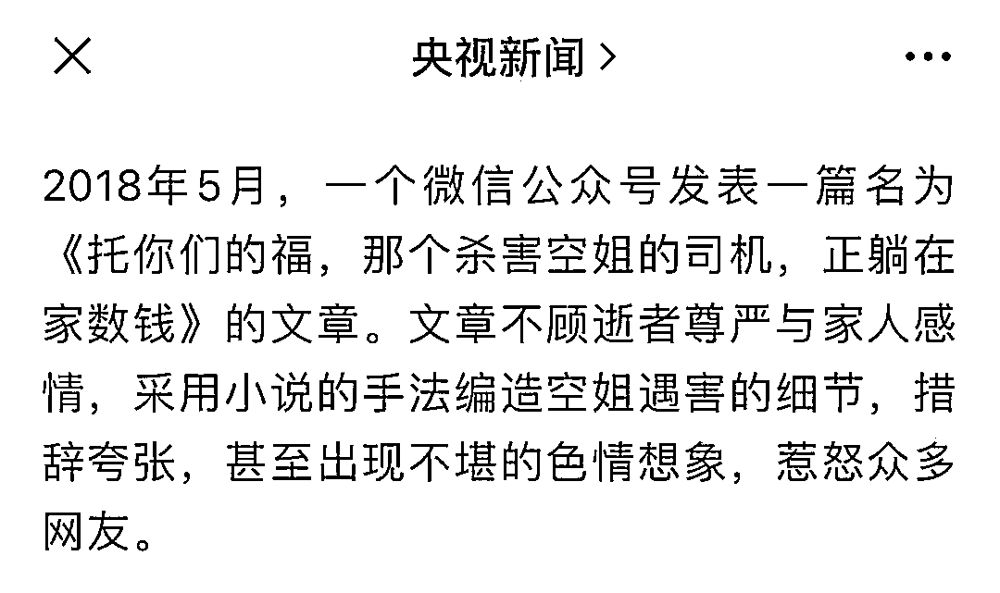

# 离世多年的重症女孩又曝“早产”？网友怒斥：太无底线

> 原文：[`mp.weixin.qq.com/s?__biz=MzIyMDYwMTk0Mw==&mid=2247521426&idx=2&sn=8025ada0deead4ccb264ce78cbfeabff&chksm=97cb5faaa0bcd6bc12426fdaa406b1927a66039ecd51639e8642b7c0a709ee1ca78dfd4b31b2&scene=27#wechat_redirect`](http://mp.weixin.qq.com/s?__biz=MzIyMDYwMTk0Mw==&mid=2247521426&idx=2&sn=8025ada0deead4ccb264ce78cbfeabff&chksm=97cb5faaa0bcd6bc12426fdaa406b1927a66039ecd51639e8642b7c0a709ee1ca78dfd4b31b2&scene=27#wechat_redirect)

近日，

网友曝光的一组截图，

引发热议。 

据了解，图中的女孩**顽强与病魔抗争 9 年，**最终在**2018 年不幸离开人世。**

但曾经的治疗照片，却被一些**无良自媒体拿来恶意营销。**

在各种悲情故事里，她变成了**“早产学生”、“狠心女友”......**

看到这些，**网友怒斥：良心不会痛吗？**

此前，焦点访谈曾聚焦过自媒体乱象，其中就讲述了一个“造谣侮辱逝者”的案例。

今年 1 月出台的《互联网用户公众账号信息服务管理规定》提到，公众账号生产运营者不得有的行为包括：

> 操纵利用多个平台账号，**批量发布雷同低质信息内容，**生成虚假流量数据，制造虚假舆论热点；
> 
> 编造虚假信息，伪造原创属性，标注不实信息来源，**歪曲事实真相，**误导社会公众等。

@央视新闻 称，虽然自媒体时代，信息发布的门槛降低了，但这并不意味着可以为所欲为，不讲规则。**互联网不是法外之地！**

**来源 ：中国青年报、@共青团中央**

****

**← 向右滑动与灰产圈互动交流 →**

****