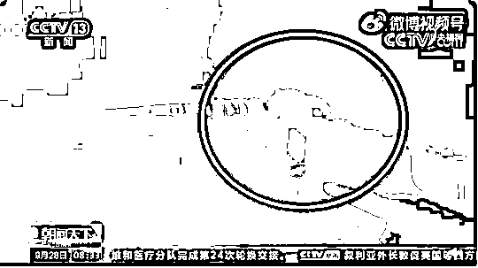
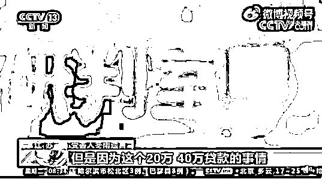
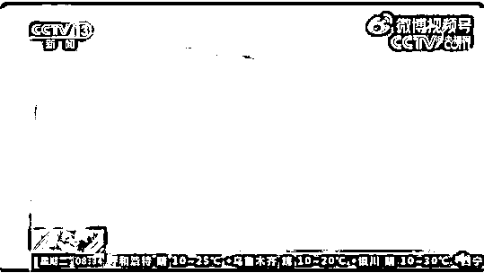
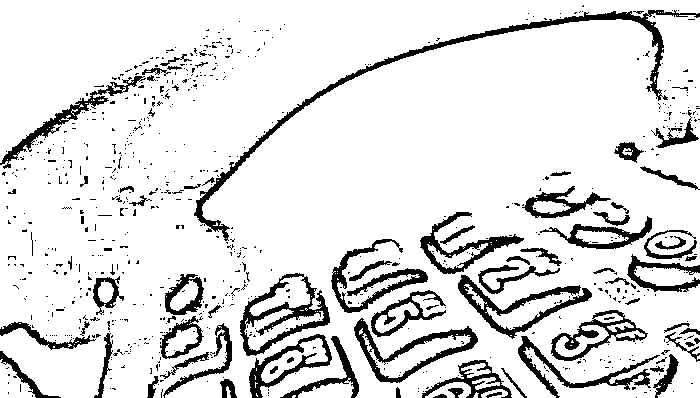

# 痛惜！女孩创业资金被骗，留下遗书结束生命

> 原文：[`mp.weixin.qq.com/s?__biz=MzIyMDYwMTk0Mw==&mid=2247521426&idx=3&sn=cfaf2bd112944eb09ff35600a06964e5&chksm=97cb5faaa0bcd6bca12744d7304eb0f3f8c79435fee0958689350e65c5f5828e992d18a701dc&scene=27#wechat_redirect`](http://mp.weixin.qq.com/s?__biz=MzIyMDYwMTk0Mw==&mid=2247521426&idx=3&sn=cfaf2bd112944eb09ff35600a06964e5&chksm=97cb5faaa0bcd6bca12744d7304eb0f3f8c79435fee0958689350e65c5f5828e992d18a701dc&scene=27#wechat_redirect)

2021 年 3 月 8 号

晚上十点

一段行车记录仪拍下的画面 

成了 24 岁的女孩冬雨

留给世界最后的影像 

[`mp.weixin.qq.com/mp/readtemplate?t=pages/video_player_tmpl&action=mpvideo&auto=0&vid=wxv_2068892656935501826`](https://mp.weixin.qq.com/mp/readtemplate?t=pages/video_player_tmpl&action=mpvideo&auto=0&vid=wxv_2068892656935501826)

当日晚上冬雨打车到桥附近一辆路过的汽车拍下了她在桥边行走的画面

第二天她的遗体被打捞上来经法医鉴定 冬雨身上的伤符合自杀坠落过程中造成的伤害

很快

警方就在她的遗物中

发现了重要线索

**冬雨留下的遗书和录制的视频**

**详细地描述了自己遭遇**

**电信网络诈骗的过程**

这个刚刚走出大学校园正筹措资金准备自主创业的女孩 因为遭遇了贷款诈骗 原本即将开启的奋斗人生 戛然而止虽然被骗的钱财已经追回但冬雨的生命却无法重来

五年前

被南京邮电大学录取的 18 岁女孩玉玉

接到诈骗电话

将 9900 元学费转入对方账号

得知被骗后昏厥

抢救无效后离世

四年前

即将就读大学的女孩淑妍

也遭遇了电信诈骗

被骗取学费和生活费 9800 元后

她跳海自杀死亡

电信诈骗作案手段愈趋高明**不光是涉世未深的年轻人** **名牌大学老师及知名艺人**也都是电信诈骗的受害者电信诈骗的日常化、专业化不仅给人们造成钱财上的损失还挑战着社会信任的底线疏离着人与人之间的相互认同

不义之财如此易取

电信诈骗分子屡屡得手

悲剧屡屡发生

如何彻底铲除诈骗的土壤构建诚信社会 

依旧是一道亟待解决的难题

来源：央视网综合人民日报、人民网

← 向右滑动与灰产圈互动交流 →

