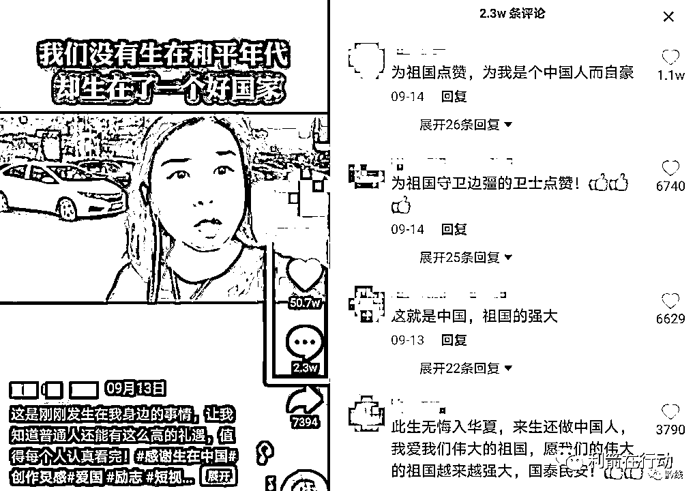

# 无耻！亵渎！主播将爱国变成买卖收割流量！团中央痛批

> 原文：[`mp.weixin.qq.com/s?__biz=MzIyMDYwMTk0Mw==&mid=2247521478&idx=2&sn=cdd4f5c6691671fc18a88359316d6761&chksm=97cb5ffea0bcd6e8d92db30b15a44281e5a4c2a8f2b26825d204d4ca38e699bedf848dd3693f&scene=27#wechat_redirect`](http://mp.weixin.qq.com/s?__biz=MzIyMDYwMTk0Mw==&mid=2247521478&idx=2&sn=cdd4f5c6691671fc18a88359316d6761&chksm=97cb5ffea0bcd6e8d92db30b15a44281e5a4c2a8f2b26825d204d4ca38e699bedf848dd3693f&scene=27#wechat_redirect)

“我们没有生在和平年代，而是生在了一个好的国家。”

乍看之下，这句话极具爱国情感，颇为感染人。然而，这句话近日却成批成量地出现在短视频平台，一大批短视频博主发布了以此为标题的“爱国短视频”，这些视频风格一致，故事雷同，甚至连文案台词都不带改的……

打着“爱国”的旗号骗流量，此事招致众多网友的反感。共青团中央批评道，**爱国不是生意，更不是流量，不应成为某些心术不端者的谋利工具**。

据环球时报，目前，**这些所谓的“爱国短视频”目前均已下架删除**。

网上出现大量“同款”“爱国”视频

最近，网络上出现了一些宣扬爱国主义的视频，视频主播讲述着自己在中国边疆地区被边防特警官兵保护的感人故事，**而这些故事出现了惊人的****相似**。

无一例外，这些视频均以“我们没有生在和平年代，而是生在一个好国家”为统一文案。故事都讲述自己在海边/江边架起支架用手机拍摄视频，身后 50 米左右停着一辆边防特警车。

边防武警官兵为了保护人民的安全，站成人墙面对境外方向，把人民挡在身后。

想起阿富汗人民正处于水深火热之中，**主播自豪于祖国国泰民安，并向观众索要点赞**，“点个赞吧，让更多的人去感受一下”。

**有的视频主播称自己位于中朝边境鸭绿江旁，有的甚至位于根本不存在的“中日边境”**。

对此，有不少网友表示，“已经看了好几个一模一样文案的视频，背下来不容易，还要声情并茂。”

这些视频，有的获得了 50 多万的点赞量，不少网友被故事感动，留下数万条留言。

共青团中央：无耻！亵渎！

对此，共青团中央表示，为了博取眼球，视频主播编造着“爱国流量故事”，把爱国变成一场廉价的买卖，**消费人们的爱国情怀，令人不耻**。

这种冠冕堂皇打着“爱国”的旗号，实则收割人们情感赚取流量的做法，**无疑是对爱国情感的亵渎**。

说白了，**这就是一种“低级红”**。把赞美建立在伪造证据的基础上，造出一些让自己热血沸腾的“正能量谣言”，我们多强大，敌人多弱智。我们的强大，有很多信息可支撑，不需要虚构假新闻。这个信息开放的时代，造假的成本越来越高了，很容易就被人挑出毛病，谎言很容易就戳穿了，被打脸后一地鸡毛。

**爱国不是生意，更不是流量**，爱国是人民最质朴、最淡然、最没有利益纠葛的情感释放，不应成为某些心术不端者的谋利工具。一个剧本，一个故事，不同的人表演，**“爱国生意”当休矣**。

来源：每日经济新闻、环球时报、共青团中央、利箭在行动

← 向右滑动与灰产圈互动交流 →

