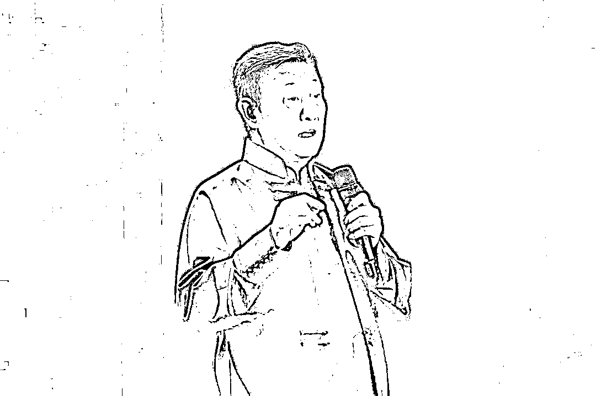
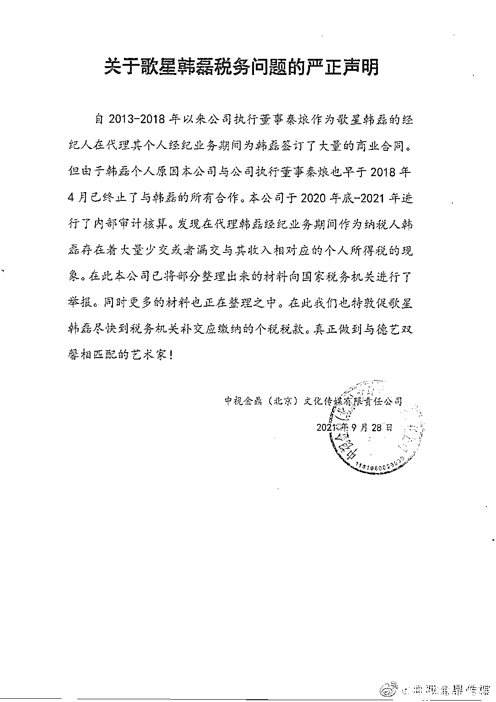
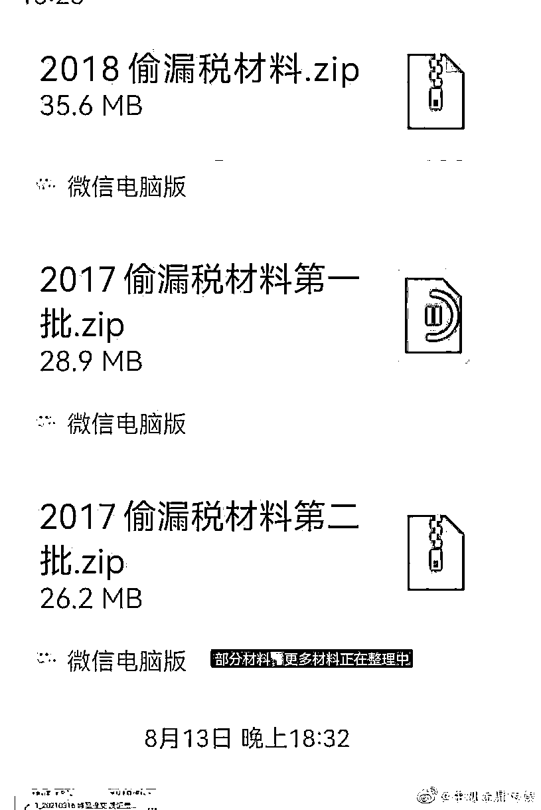
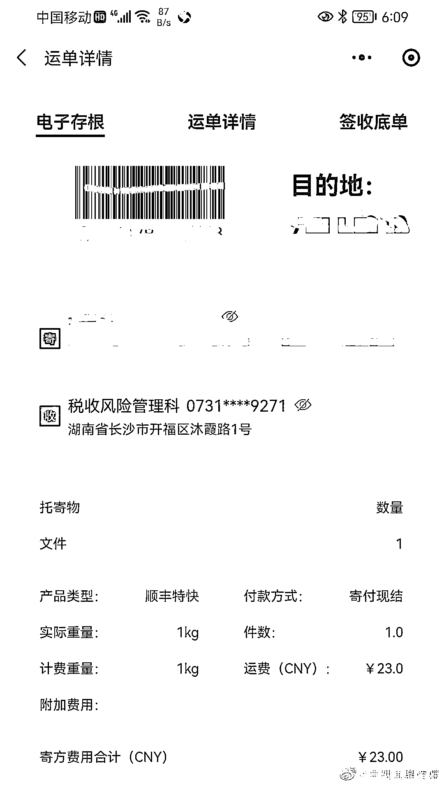

# 歌手韩磊被举报！

> 原文：[`mp.weixin.qq.com/s?__biz=MzIyMDYwMTk0Mw==&mid=2247521478&idx=4&sn=20b258d69aa0a825b853d770c9361538&chksm=97cb5ffea0bcd6e8b04f2d219b108b1382752f1c01a18478e6e814d6d8d201e0d834c17e2b2f&scene=27#wechat_redirect`](http://mp.weixin.qq.com/s?__biz=MzIyMDYwMTk0Mw==&mid=2247521478&idx=4&sn=20b258d69aa0a825b853d770c9361538&chksm=97cb5ffea0bcd6e8b04f2d219b108b1382752f1c01a18478e6e814d6d8d201e0d834c17e2b2f&scene=27#wechat_redirect)

演唱《走四方》、《向天再借五百年》的老牌歌手韩磊也“翻车”了？

9 月 28 日，微博认证为“中视金鼎（北京）传媒有限责任公司”的官微@中视金鼎传媒**发布关于歌星韩磊税务问题的严正声明。**

声明称，自 2013-2018 年以来公司执行董事秦烺作为歌星韩磊的经纪人在代理其个人经纪业务期间为韩磊签订了大量的商业合同。但由于韩磊个人原因该公司与公司执行董事秦烺也早于 2018 年 4 月已终止了与韩磊的所有合作。

中视金鼎（北京）传媒有限责任公司公司于 2020 年底-2021 年进行了内部审计核算。发现在代理韩磊经纪业务期间，**作为纳税人韩磊存在着大量少交或者漏交与其收入相对应的个人所得税的现象。**

目前，该公司已将部分整理出来的材料向国家税务机关进行了举报。同时更多的材料也正在整理之中。

**中视金鼎（北京）传媒有限责任公司敦促歌星韩磊尽快到税务机关补交应缴纳的个税税款。**真正做到与德艺双馨相匹配的艺术家！

**目前，韩磊尚未对此事作出回应。**

消息显示，“中视金鼎”是“韩磊等娱乐圈内人士”投资的文化传媒公司。

据天眼查 app 显示，中视金鼎文化传媒公司成立于 2011 年，注册资本 500 万元，旗下股东为秦烺、付凤和韩钢，其中，持股比例 54%的秦烺目前仍为“中视金鼎传媒”的实际控制人和最终受益人。

来源：浙江在线，巴蜀反诈

← 向右滑动与灰产圈互动交流 →

