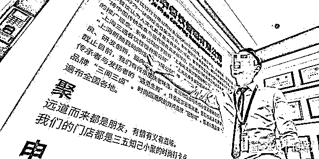
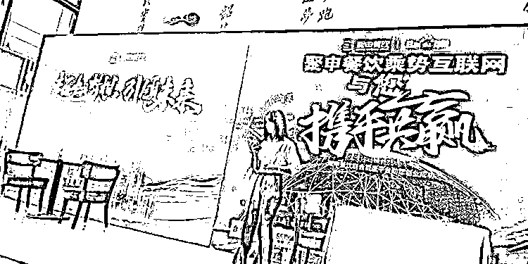
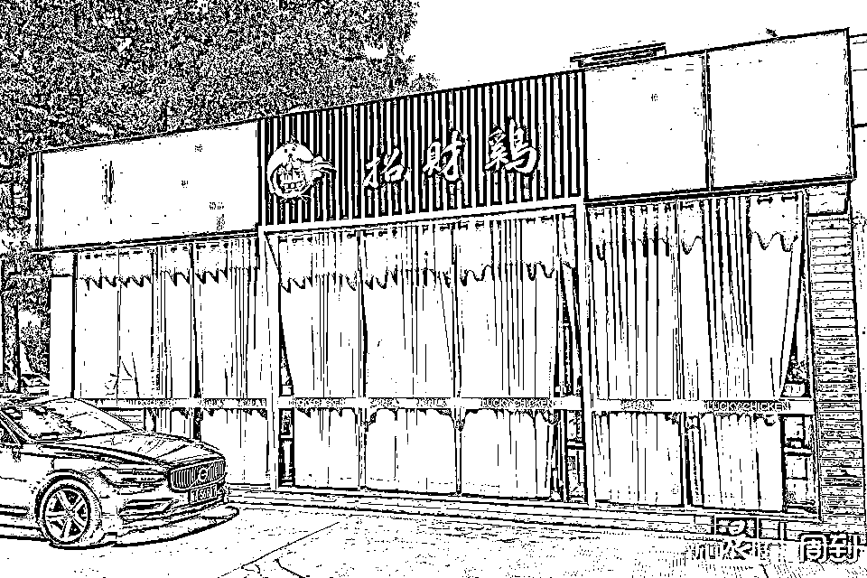
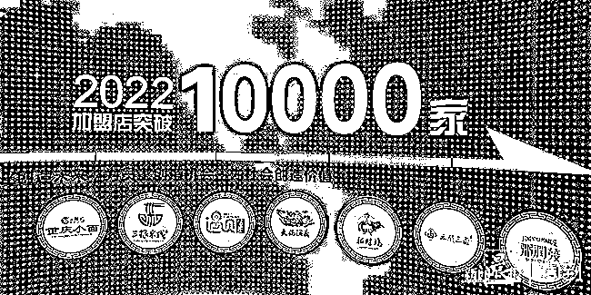
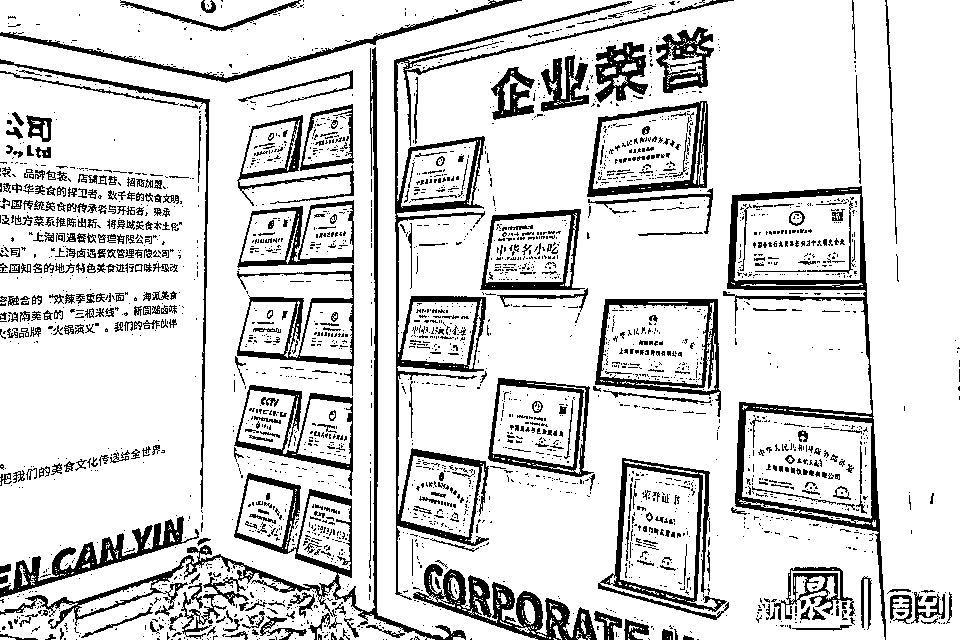
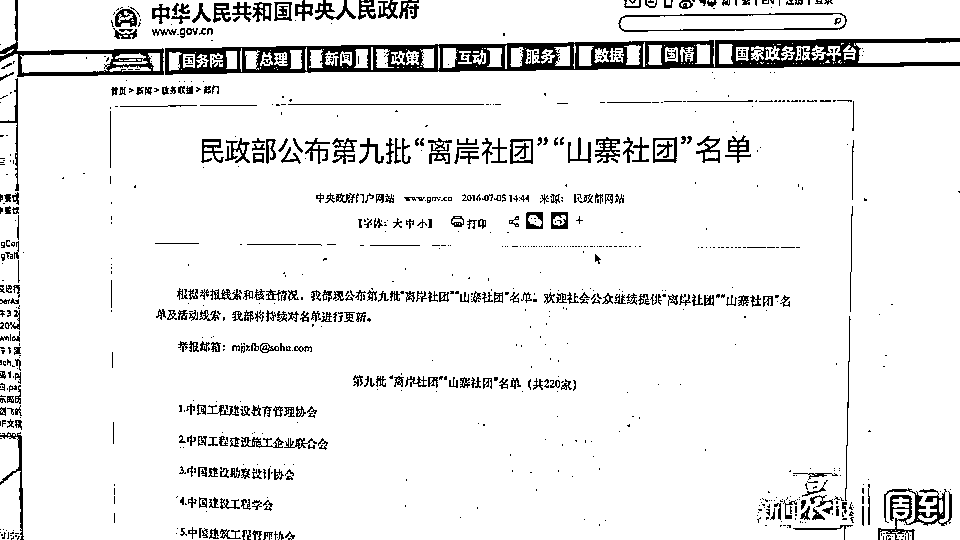
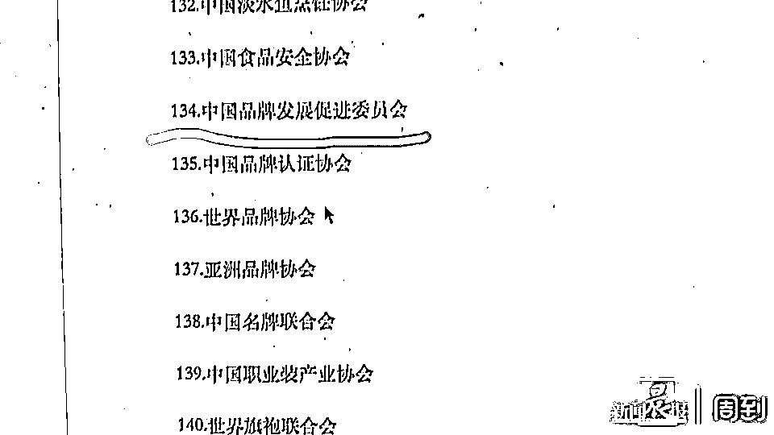
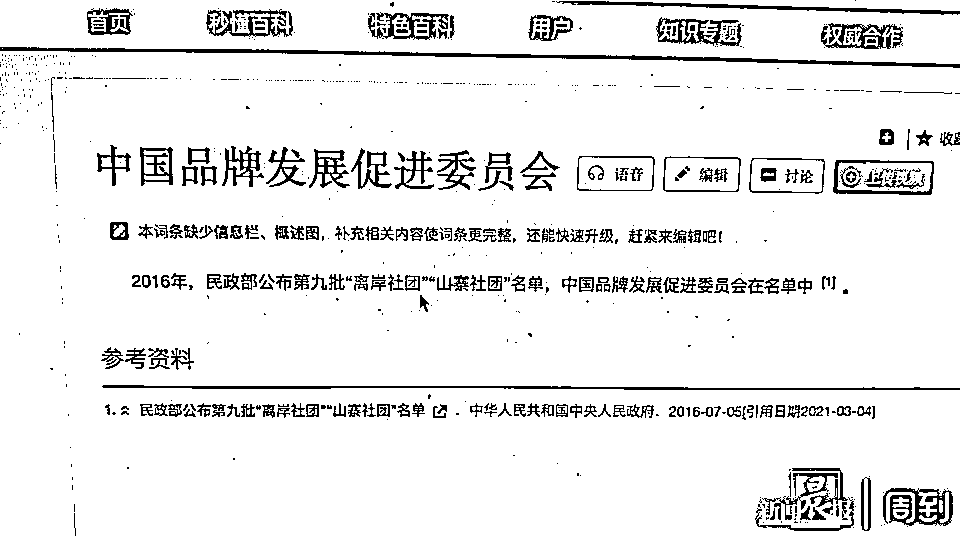
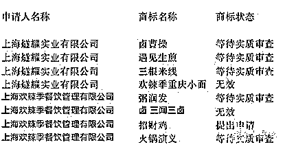
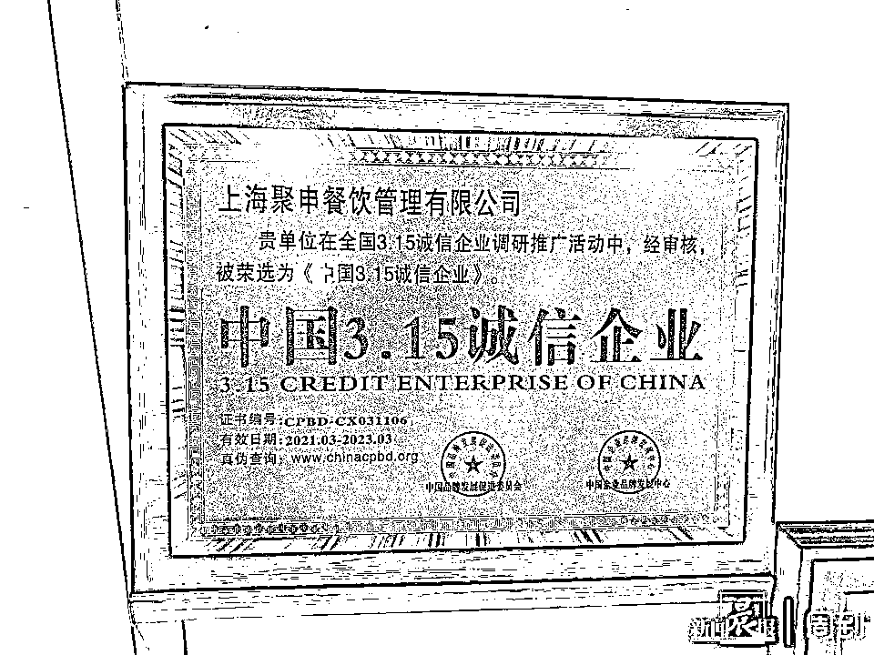

# 满墙荣誉证，竟是从山寨组织买的

> 原文：[`mp.weixin.qq.com/s?__biz=MzIyMDYwMTk0Mw==&mid=2247521478&idx=5&sn=74ffff7216393e4942154ac1d0f23b05&chksm=97cb5ffea0bcd6e85513b596a6614a3630d62b84219bc7537c576f2281268dfb8c9e9384e8a1&scene=27#wechat_redirect`](http://mp.weixin.qq.com/s?__biz=MzIyMDYwMTk0Mw==&mid=2247521478&idx=5&sn=74ffff7216393e4942154ac1d0f23b05&chksm=97cb5ffea0bcd6e85513b596a6614a3630d62b84219bc7537c576f2281268dfb8c9e9384e8a1&scene=27#wechat_redirect)

没有注册商标，没有特许经营备案，不满足“两店一年”，上海市宝山区聚申餐饮管理有限公司却“生产”了 7 个餐饮品牌，面向全国招商加盟。 

在此过程中，某些搜索平台大量出现“小杨生煎”、“正新鸡排”、“紫燕百味鸡”等品牌的加盟广告，套取咨询者的个人信息，并被聚申餐饮以竞价排名的方式获取。

记者暗访时看到，这家公司位于宝山区一个创业园区内。展板墙上的品牌名称多达 7 个，分别是“欢辣季重庆小面”“三根米线”、“遇见生煎”、“火锅演义”、“招财鸡”、“三闻三卤”以及“粥润发”。而墙上贴金的荣誉匾牌竟然是民政部认定的“离岸社团”和“山寨组织”发的。

[`mp.weixin.qq.com/mp/readtemplate?t=pages/video_player_tmpl&action=mpvideo&auto=0&vid=wxv_2069083230791614465`](https://mp.weixin.qq.com/mp/readtemplate?t=pages/video_player_tmpl&action=mpvideo&auto=0&vid=wxv_2069083230791614465)

视频：宝山一公司凭借买的荣誉证书到处兜售“自创品牌”

投入 25 万元，半年后关门止损

去年 2 月，颜先生想开一家小吃店。因为过桥米线比较有名，店面也多，颜先生就在网上搜索“过桥米线加盟”，并在第一条广告后留下了自己的联系方式。不料，来电话的人却向他推销“三根米线”。

颜先生接到来电时第一反应是，他并没有联系过“三根米线”。但对方解释说，过桥米线牌子响，名声在外，加盟费很高，不适合颜先生，于是才给推荐了“三根米线”。说价格较低，服务好，米线的口味不输过桥米线。公司还有很多优惠政策，等等。

颜先生就乘飞机来到上海，参观考察“三根米线”公司总部。

> **“我们考察的是米线项目。在他们的实操间，各种口味的米线都上了，还有饮料、生煎包、卤菜，上了满满一桌子，吃着吃着，就分辨不清了。”**

吃人嘴软，拿人手短。颜先生随后便被领去洽谈签约。业务员对颜先生说，现在签合同，可以优惠两万元，并赠送各类厨房用具，还列出了清单，密密麻麻一大堆东西，价值几万元。

之后，业务员向颜先生介绍了公司的扶持政策，称前期选址和后期经营都由公司安排专人负责带店，会帮助加盟商走向正轨。

后来，颜先生又被要求缴纳费用参加公司培训、购买公司材料等，前前后后一共投入了 25 万元，2020 年 6 月，他终于在绵阳开了一家名叫“三根米线”的小吃店。

由于门店市口不好，前期成本又高，很快，小吃店就难以为继。后期他希望得到公司的帮助，摆脱经营困境，便在群里向公司求助，可是以前勤快麻利的销售人员早已不见了踪影，留言消息也没人回。

小吃店实在撑不下去了，颜先生只得把门店转让，自己到工地打工还债。

记者看到，颜先生合同上，甲方为“上海燧耀实业有限公司”。天眼查提供的信息显示，该公司的法人还有另一家公司，“上海欢辣季”餐饮管理有限公司。聚申餐饮在展示厅里介绍，上海欢辣季餐饮管理有限公司系其旗下公司，而“三根米线”品牌也在其展示墙上。

2018 年，上海燧耀实业有限公司曾因发布虚假广告被宝山区市场监管局处罚。

搜餐饮加盟，信息都被该公司获取

从 9 月 14 日开始，记者先后在某网站上搜索“小杨生煎加盟”、“正新鸡排加盟”以及“百味紫燕鸡加盟”等，并留下了不同的联系电话。

页面跳出的广告，格式几乎是一样的。只要你注目两三秒钟，页面上就开始出现弹窗信息，例如：“在上海加盟生煎包，无需经验，总部全程扶持。”

机器人也会向记者发问：您是想咨询小杨生煎加盟多少钱问题吗？留下姓名、电话、微信号，即可免费领取创业细节资料，可以帮助您降低开店成本。

留下联系方式后，通常 5 分钟内就会有人打电话过来。那边“小杨生煎”的客服一接通电话，就告诉记者，小杨生煎目前不开放加盟！

> **客服：**你可以在小杨生煎的公众号上咨询，他们会告诉你，这个项目主要是做直营。如果说做加盟的话，全部都是诈骗信息。
> 
> **记者：**那刚才网站给我们的是诈骗信息吧？
> 
> **客服：**不是的。如果你想在上海做这个生煎加盟的话，我们这个全球加盟网可以帮你推荐一些靠谱的做得好的品牌。
> 
> **记者**：那我刚刚搜的小杨生煎的网站怎么到了你们这里？
> 
> **客服：**就是因为他们加盟不了，我们才会给你打电话，如果你想做加盟我可以帮你推荐一些在加盟网上排名靠前的网站。

由于记者表示只跟小杨生煎的人接触，这位全球加盟网的客服就没跟记者继续交流下去。但是随后几天里，记者分别接到一男一女两个陌生人的电话，都向记者推荐“遇见生煎”。

报名后要求缴纳 200 元“席位费”

记者在“正新鸡排”的加盟广告里留下联系方式后，很快就接到聚申餐饮业务员樊某的电话。他照例先指出记者不适合做正新鸡排的加盟，然后推荐“招财鸡”。樊某说，9 月 15 日他们正好和宝山区政府联合举办一场创业峰会，因为他们是区政府扶持的企业，在全国公开招募 50 家形象样板店。

> **“首先你要拿到这五十家样板店的名额，我们才能扶持你。”**

樊某说，他们有一个总监是大娘水饺创始人，也会来会上介绍经验。由于他们这里是政府的产业园，区政府会给加盟者补贴两万元。

记者后来向宝山区相关部门核实，此事为子虚乌有。

为了突出参加这个会的实惠，樊某又给记者发来一份优惠清单：加盟费现金立减 20000 元(原价 6.98 万，现只需 4.98 万)；赠送价值 30000～50000 元开店厨房必备设备；赠送价值 8800 元装修开业大礼包；赠送公司旗下任意项目一个（检察官茶饮 三闻三卤 三根米线 遇见生煎 重庆小面 粥润发）。

樊先生给记者发了个链接，填写参会回执。打开页面，跳出央视台标，下面一行字：央视上线品牌教您创业，创业样板店扶持名额限时开放 50 名。

回执填完不久，记者接到通知：报名成功，排在第 49 名，如果不尽快缴纳 200 元“席位费”，名额就会随时被取消！

记者表示，这笔钱收得不合理。樊某信誓旦旦地说，你到前台签到时，就可以退还。如果不交钱，就没有“试吃”这个环节。

> “您到了也就是刘姥姥逛大观园，只能看不能试吃的，因为我没有试吃单，200 块就是您考察项目的意向，如果您到了前台没有退给您，你可以直接闹，然后扭头就走，不然您来了，可能接待事宜都安排不了，我不只你一个客户考察的，我也不希望给您的考察带来不愉快，200 块很多吗？”

由于记者拒绝缴纳“席位费”，樊某不耐烦了，当晚 7 点，拒绝了记者第二天的预约。

暗访：满墙荣誉证都是从山寨组织买的

记者再次更换手机号码，填写加盟“过桥米线”信息，再次跟聚申餐饮的业务员约上。9 月 23 日上午，记者一行来到聚申餐饮暗访。

该公司在一个创业园区内，看上去规模很大。走进展示厅，正面 LED 幕墙上，一行醒目的个大字，表明他们的目标：2022 年全球加盟门店突破 10000 家。这行字下面一溜排开他们的 7 个品牌：炸鸡、米线、卤味、粥类、火锅、生煎、面条。

另一面墙上则密密麻麻地挂满了各类奖牌和证书，总共 20 面。从这些匾牌可知，他们的 7 个品牌几乎都在商务部“备案”了。但是这些匾牌中间，并没有特许经营许可的信息。记者向业务员提出查看特许经营许可证件，对方没有提供。

记者又问他们有没有两家直营店且经营一年以上了？该业务员表示他不知道记者从那里听来这些奇怪的言论？他们这里没有“两店一年”的说法。

记者注意到，这满墙的证书，都是由中国品牌发展促进委员会和中国企业品牌发展中心颁发的。

随后，记者在中华人民共和国中央人民政府网站上查询到，中国品牌发展促进委员会早在 2016 年，就被民政部列入第九批“离岸社团”和“山寨社团”名单。

在另一个网站上，记者看到，只要花 3800 元，就能买一个证书。证书的种类繁多，可以自己挑选和定制，其中就包括聚申餐饮墙上的山寨证书。

业务员告诉记者，为了确保加盟者开的店能够早日走上正轨并实现盈利，在开店之初，公司会持股 60%，为加盟者托底。后面慢慢放手，持股比例逐渐减少。其余优惠政策，则跟该公司业务员在微信里跟记者沟通时说的一致。

不过，当记者亮明身份，希望向对方了解：没有注册商标，如何开展特许经营业务？不符合“两店一年”规定，如何开展特许经营业务？该公司一位朱姓负责人拍摄完记者的证件后，表示“没什么好谈的”。

7 个品牌都没有完成商标注册

记者在国家商标局的网站上查询了解到，聚申餐饮兜售加盟的 7 个品牌，都没有注册商标，按照《商标法》，这些商标均不易受国家相关法律的保护。

《商业特许经营管理条例》第三条规定：本条例所称商业特许经营（以下简称  特许经营），是指拥有注册商标、企业标志、专利、专有技术等经营资源的企业（以下称特许人），以合同形式将其拥有的经营资源许可其他经营者（以下称被特许人）使用，被特许人按照合同约定在统一的经营模式下开展经营，并向特许人支付特许经营费用的经营活动。第七条规定：特许人从事特许经营活动应当拥有成熟的经营模式，并具备为被特许人持续提供经营指导、技术支持和业务培训等服务的能力。特许人从事特许经营活动应当拥有至少 2 个直营店，并且经营时间超过 1 年。

知情人士：他们通过竞价排名获取信息

据熟悉聚申餐饮的沈先生告诉记者，这家公司是通过竞价排名获取咨询者信息的。

沈先生说，聚申餐饮有一个专门的数据采集部门，他们通过竞价排名的方式，从各种平台获取信息。拥有咨询者的信息后，数据采集部门就会根据关键词，分配给不同的部门去跟进，比如卤味、生煎、炸鸡等，都有对应的业务员。

记者：你们的广告平台不审查吗？

沈先生：没那么严。广告又不是平台替我们做，我们自己有一个团队，要做什么内容，贴上去就行了。

沈先生说，给咨询人打第一个电话非常重要：“一开始就要给对方洗脑。比如你咨询小杨生煎，我们就会跟你说，这个品牌我们暂停加盟了，或者说，这个品牌只做直营，所以，必须给你介绍其他周边品牌。或者问你在哪个区域开，然后我这里假装查询一下，告诉你，很抱歉，你那个区域已经饱和了，或者已经有代理了，根据规定，我们不能再开放这个区域给你。但是你可以在这个区域经营我们的合作品牌。或者，我给你报一个非常高的价格，超出你预算的好几倍，让你没法接受。这时候我们就向你推荐我们的技术合作品牌。品牌不一样，但是技术是一样的。说我们跟你要的品牌是同一个技术团队做的，口味都是一样的。其实一点关系没有。”

沈先生说，只要人家来跟他谈，他就有挣钱的希望。于是他们虚构各种优惠政策，让你觉得捡个便宜。

对于很多加盟者关心店铺选址问题，沈先生说，这么没有技术含量，你也能做。能到选址这一步，都是交了定金的，希望早点把店开起来。

> **“你想想，下去选址，也就两天三天，你真想要了解这个铺子的数据，比如每天的人流量啊、周边的商圈环境啊，旁边相关店铺的流水业绩，两三天根本调查不过来。”**

沈先生还介绍，这家公司热衷于搞餐饮“峰会”。每到开会的日子，公司就会通过微信群等联系方式，要求员工互相客串角色，以此营造现场相当火爆的氛围。

来源 ：周到上海 APP，利箭在行动

← 向右滑动与灰产圈互动交流 →

