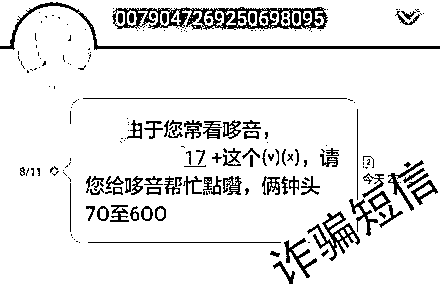
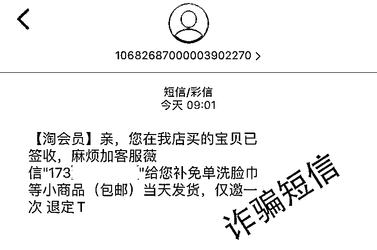

# 这个骗局环环相扣：做返利任务被骗后又因网贷被骗！

> 原文：[`mp.weixin.qq.com/s?__biz=MzIyMDYwMTk0Mw==&mid=2247521478&idx=6&sn=ed59c841d57515176e1ccec3cec24a13&chksm=97cb5ffea0bcd6e84a2a05db726bc550fbc2430bc1a96c712394a0c896f7ed3af5670f545fa5&scene=27#wechat_redirect`](http://mp.weixin.qq.com/s?__biz=MzIyMDYwMTk0Mw==&mid=2247521478&idx=6&sn=ed59c841d57515176e1ccec3cec24a13&chksm=97cb5ffea0bcd6e84a2a05db726bc550fbc2430bc1a96c712394a0c896f7ed3af5670f545fa5&scene=27#wechat_redirect)

**连环诈骗第一环始发➪兼职诈骗**

轵城镇的刘女士在刷微信的时候，发现不知道什么时候被拉进了一个微信兼职群，里面有人发布“招募抖音点赞员，关注公众号、给抖音点赞，日单现结，每天挣 100-200 元。”

按照网友留下的联系信息，刘女士开始和“客服谈如何做单。客服先让刘女士做一个小单子—关注指定的公众号，截屏下来，刘女士立即收到了 3 元红包。

**这钱也太好赚了，只需要花上几分钟。**

这让刘女士对客服的信任度一下子提高了很多。接着刘女士又做了几单。随后，客服告诉她，这样每天接不了多少单，让她下载一个“益善”APP，在平台上投注押大小，预付越多返现越多，并发了一个下载链接给她。刘女士下载了 APP 并注册，然后开始充值押大小。

**刘女士心想，反正也不需要交会费，只需按提示，简单操作。**

刚开始刘女士还算比较谨慎，充的都是小额度，平台很快就把钱和佣金返给了她。接着平台又继续推送更大的垫付单，垫付金额一次比一次大，佣金也承诺会给的越来越高。

她非常兴奋，胆子越来越大。最后平台把 2000 多元、5000 多元等单子推给了她，她本来很纠结，但耐不住佣金诱惑。然后按照客服的要求给对方给的银行卡上转账。在完成订单后，照理说一小时内，平台应将款项与佣金一起返回。

后来她发现佣金一直没有返，提现也提现不出来，于是就问客服务为什么还没返。客服表示，刘女士在操作时部分单子超时、需要完成多重单……等等，拒绝返还本金佣金。刘女士无奈，又充值了几笔钱，到最后实在没钱了，便再次联系客服寻找解决办法。

**连环诈骗第二环来了➪贷款诈骗**

这时，派单客服给刘女士发了一个添加蚂蚁金融客服微信，其添加后对方让其下载“京东白条”软件。刘女士申请注册后去提现时，平台显示其的银行卡填写错误，贷款被冻结。客服要求支付 5000 元解冻费和 6000 元刷流水，刘女士给对方转账后，对方以其他理由要求其继续转钱，刘女士这才醒悟过来，自己被骗了，钱没了，于是选择了报警。

**刘女士前脚兼职被骗，后脚又被同一伙人诱导贷款被骗，千万不要被骗子牵着鼻子走，馅饼不会掉，**万事需理智**！‍**

**兼职诈骗广告有孔就入，同样的骗局****又有人上当**

罗先生在抖音上收到一条兼职私信，其扫码进入该微信群后，群主发布“关注公众号返佣金”的任务，并要求下载“新蛋国际”APP，后开始接单，关注微信公众号做任务。罗先生做了几笔之后，觉得操作很简单，打算继续做下去。按照对方要求。罗先生需要升级到高级群，接更大的单子，会返更多的佣金。罗先生陆续充值 6 万元后发现提现不出来，期间对方以“补单、没有提现名额、操作失误、支付救援金”等理由拒绝给其返还，最终意识到被诈骗。

李女士在网上找手工活加工的兼职时，搜到一个兼职手工活网页，添加对方后，对方让其做抖音点赞、刷单等任务。按照要求拍下商品给对方银行卡转钱，对方会将本金和佣金返还，李女士陆续转账 4 万元后发现被骗。

**我们不禁要问，为啥总有人上当？**

原因有二：

一、个人认知水平太低，容易被诱惑到未知领域。

二、贪欲，贪欲是人的本性，别人以小利诱使自己上当，盲目地只看见天上的馅饼，不见地上的陷阱。每一次掉坑，除了怪骗子太精明，要多反省自己为何上当受骗，吸取教训吧。就像刘女士一样，想想一天电脑上操作几下就可以日进千元？

兼职返利诈骗“三部曲”

骗子通过微信群、QQ 群、短信、抖音等各种途径发布做任务兼职广告吸引人群，前期以抖音点赞、关注公众号、垫付下单等返利小任务为诱饵获取信任，随后要求受害人下载聊天、博彩等虚假软件做大额充值、押注、抢单、代还信用卡等多重任务（即给骗子提供的银行卡转账），受害人连续充值多笔后无法提现，骗子再以操作失误、卡单、多重单等为由要求继续转账，进而实施诈骗。

其实抖音点赞、关注公众号也好，或者是明天骗子又换了其他的诈骗手法，但是换汤不换药啊，他的核心在刷单，抖音点赞都是他的外衣，披着抖音点赞的刷单诈骗啊！‍

来源：洛阳市反诈骗中心

← 向右滑动与灰产圈互动交流 →

