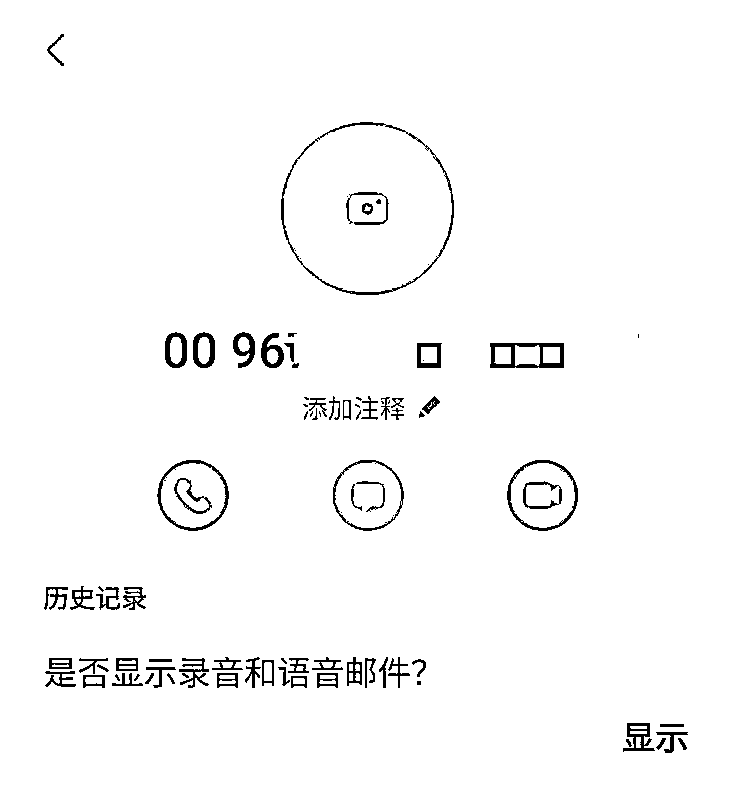

# @所有人，接到“00”或“+”开头电话的立即挂掉

> 原文：[`mp.weixin.qq.com/s?__biz=MzIyMDYwMTk0Mw==&mid=2247521478&idx=7&sn=d3f3cc33e5e1419f06d4e9194fd01da3&chksm=97cb5ffea0bcd6e8492074dd84ce7d77d88124448bde328c47c462f79027d4716933786b1c08&scene=27#wechat_redirect`](http://mp.weixin.qq.com/s?__biz=MzIyMDYwMTk0Mw==&mid=2247521478&idx=7&sn=d3f3cc33e5e1419f06d4e9194fd01da3&chksm=97cb5ffea0bcd6e8492074dd84ce7d77d88124448bde328c47c462f79027d4716933786b1c08&scene=27#wechat_redirect)

“喂，请问是 XX 女士/XX 先生吗？”

**“你涉嫌一起刑事案件”**

“你立即到公安局来拿一份调查材料”

“地址是 xx 区 xx 路 xx 号”

......

你是否接到过类似这样的电话？

**号码还是以“00”或“+”开头**

**或许还没来得及细看号码**

听到这番对话

你就已经开始慌了

9 月 4 日，张某在家中接到一个“00+”开头自称是电信中心的电话，对方称有人拿张某的身份证信息在武汉办理了一张电话卡，涉及到一起电信诈骗案件，需要让张某本人到武汉洪山公安分局配合调查。

后对方转接了一个自称是武汉洪山公安分局的民警刘警官的电话，并在电话里以配合调查的名义询问了张某的身份证号码、银行卡号等个人信息。期间，对方还将张某拉到一个 QQ 群中，在群里向张某出示了警官证照片、配合案件调查通知书、逮捕令。随后，张某和对方开通了某视频手机会议，并开启屏幕共享功能。

对方称经过查询，**张某名下有 17 张银行卡均参与了“洗黑钱”和电信诈骗案件**，对方便以要证明张某清白为由，诱导张某在某团、某呗、某借条上贷款，并提现到自己常用的银行卡上，之后何某发现银行卡里的钱在自己没有任何操作的情况下被转走，才发现被骗，遂报警，**共计损失 40790 元。**

该案可以看出张某首先是接到了**一个“00+”开头自称是电信中心的电话**，那么这个号码有何特殊性呢？

**警方通过对当前高发诈骗案件进行分析，****接近 3 成的诈骗分子首先会通过打电话先获取受害人的信任，而这些电话里，大部分来自境外。**

那怎样判断

电话或短信是否来自境外呢

根据工信部有关规定

境外电话进入我国通信网络时

必须在主叫号码前往添加国际长途字冠“00”

且严禁在传送过程中删除该字冠

因此

大家在生活中接到电话是“00”

**（部分手机会在号码显示时会将“00”翻译为“+”）**

无论对方在电话中

自称是国内任何政府部门

或者企业的工作人员

都不要轻信

因为这个电话

极有可能是骗子打给你的

**一定要提高警惕**

**否则可能遭受财产损失**

注意！ **警方提示** 

1、凡是“00+”开头的电话号码或是归属地为境外的电话都是诈骗电话，不要轻易相信；

2、公安机关是不会通过电话、网络视频、微信语音等做笔录的，也不会通过互联网发送“通缉令”、“逮捕令”、“配合案件调查通知书”等文件，逮捕证、传票和涉案信息均是无法通过互联网查询的。

3、凡通过电话、QQ、微信等社交软件要求你对自己的存款进行银行转账汇款的，或者声称对资金进行审查的请一概不要相信，以防上当受骗。

4、如遇到类似电话，自己实在分不清真假，**请直接到附近派出所或拨打全国反诈热线 96110 核实情况。**

5、**请广大群众尽快安装“国家反诈中心”App。**

来源：昆明市反电信诈骗中心，阻击诈骗

← 向右滑动与灰产圈互动交流 →

