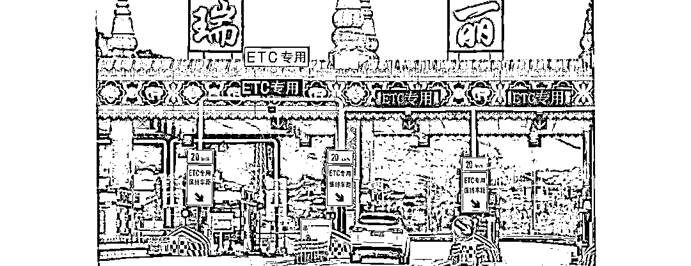

# 瑞丽：上万人等待入境自首

> 原文：[`mp.weixin.qq.com/s?__biz=MzIyMDYwMTk0Mw==&mid=2247521540&idx=4&sn=fa82340c2d534c7ca4aa9f14dceebfd5&chksm=97cb5e3ca0bcd72a48f679c0df6776fa7733e9b79dc531bf2757469cbcf607ce7866114d0db0&scene=27#wechat_redirect`](http://mp.weixin.qq.com/s?__biz=MzIyMDYwMTk0Mw==&mid=2247521540&idx=4&sn=fa82340c2d534c7ca4aa9f14dceebfd5&chksm=97cb5e3ca0bcd72a48f679c0df6776fa7733e9b79dc531bf2757469cbcf607ce7866114d0db0&scene=27#wechat_redirect)

近日，有网友在人民网“地方领导留言板”咨询离开云南瑞丽的政策时，瑞丽市新冠肺炎疫情防控工作指挥部透露了近期境外自首人员入境压力增大的情况。 

9 月 29 日，瑞丽市新冠肺炎疫情防指从本次疫情特征和外防输入难度两方面回应前述网友称：“虽然疫情得到控制，但疫情防控仍然处于最危险、最艰难的时刻，外防输入的压力前所未有，疫情输入风险与日俱增。”

澎湃新闻注意到，在外防输入方面，前述回应中提到，在全国各地发布滞留缅北人员劝返公告后，大量境外自首人员选择从瑞丽入境，尚有上万人等待入境。目前，境外输入病例和本土病例双重叠加，瑞丽医疗救治资源难以满足实际需求。

疫情防控仍形势复杂严峻，离瑞人员需 48 时内 2 次核酸

9 月 13 日，一名网友在“地方领导留言板”称，在瑞人员需要符合因公、因病、因丧、因学四种情况方可申请离瑞。若不符合又确需离开瑞的，需自费隔离 7 天及三次核酸检测。其称自己是一名背贷款失业 5 个多月的人，家人生活需要保障，但又不符合离瑞条件且享受不了补助，很多本地失业者也被卡在前述 4 种情况，希望当地放开离瑞政策。 

9 月 29 日，瑞丽市新冠肺炎疫情防控工作指挥部回应称，因该市特殊地理位置，近期部分社区、抵边村寨仍有零星散发病例，疫情防控仍形势复杂严峻。为加强疫情防控工作，严防疫情传播，经市疫情防控指挥部研究决定，自 2021 年 9 月 4 日起调整人员离瑞有关政策，可结合实际情况，选择办理离瑞方式。

澎湃新闻注意到，瑞丽市新冠肺炎疫情防控工作指挥部自 9 月 4 日起调整的离瑞有关政策通知称，一是本地户籍人员、外地户籍人员、持护照外籍等人员严格执行因公、因病、因丧、因学四种情形离瑞政策。离瑞人员继续向网格员申请，提供相关证明材料，48 小时内 2 次核酸检测（间隔 24 小时，第二次双采双检）阴性报告，经网格责任单位初审，所在社区、村或者乡镇审批同意后离瑞。离瑞前不得前往人员密集场所、并注意个人防护。

二是不具备上述四种离瑞情况但又确需离瑞的，可以向网格员申请，经所在社区、村或者乡镇同意后，选择到疫情防控指定隔离点（或酒店）自费隔离 7 天，第 1、4、7 天开展核酸检测（第三次双采双检，检测费用自理），连续 3 次检测结果阴性后，按有关规定出具《解除隔离通知书》后直接离瑞，不得再返回居所、市区。若瑞丽无法提供指定隔离场所（酒店）的，指挥部帮助协调州内其他县市隔离场所（或酒店）进行指定隔离。

三是抵边村寨、社区人员原则上不离瑞。确有特殊情况需离瑞的，按上述第二条规定，隔离 14 天后离瑞。

此外，前述回应称，本次疫情与“3·29”疫情相比有几个明显的不同：一是所有病例均为德尔塔毒株感染，具有传染性强、传播快的特点，在姐告这个不足 2 平方公里的范围内，短时间内就出现 74 例病例；二是绝大多数患者在检出阳性时，没有任何症状或症状极轻，难以察觉；三是病毒载量显著增加；四是病例高度集中在边境一线和外籍人员集聚区。

最后，该回应提示，如生活困难确实困难，可向辖区网格员和所在社区（村）提出困难申请，或直接拨打民政救助电话：0692-4100107。

全国多地发布劝返公告，大量境外自首人员等待入境

“虽然疫情得到控制，但疫情防控仍然处于最危险、最艰难的时刻，外防输入的压力前所未有，疫情输入风险与日俱增。”

瑞丽市新冠肺炎疫情防控工作指挥部回应还称，随着缅甸局势持续动荡，疫情不断恶化，战情、警情、疫情叠加，加之全国各地发布滞留缅北人员劝返公告后，导致大量境外自首人员基本上选择从瑞丽自首入境，尚有上万人等待入境，致使瑞丽超负荷接收境外自首人员。

公开资料显示，瑞丽市地处云南省西部，西北、西南、东南三面与缅甸山水相连，村寨相望。

澎湃新闻注意到，全国多地曾发布“拟注销户籍”类劝返公告。公告的内容主要为劝返偷越中缅边境、滞留缅北从事电信网络诈骗等违法犯罪活动人员。

澎湃新闻此前报道，6 月 1 日，湖北天门市干驿镇党委微信公众号“干驿之路”发布了一则《关于依法注销第一批失踪人员（疑似偷越中缅边境违法犯罪人员）户籍的公告》，落款为干驿镇打击治理新型网络电信诈骗犯罪指挥部。公告列举了 33 名疑似偷越中缅边境违法犯罪人员的姓名、身份证号及户籍地址，并强调，凡是 2021 年 6 月 15 日前主动联系报备后入境回国的，视为自首，并依法从轻、减轻处罚。否则，一律视情依法提请宣告失踪、死亡直至注销户籍，并实施一系列的联合惩戒措施 。

此后，广西宾阳县公安局 6 月 3 日也发公告列举了 57 人的名单，敦促滞留境外违法犯罪人员投案自首。江西瑞昌市打击治理新型网络电信诈骗犯罪指挥部 6 月 4 日公告列举了 10 名滞留缅北人员户籍信息，敦促其投案自首。上述公告均表示，拟对拒不回国的滞留缅北人员户籍依法按程序进行注销。

除此之外，江西修水、鄱阳、余干，湖南宁远，河南洛阳等多地也陆续发布类似公告。

10 月 1 日，云南省卫健委发布消息称，9 月 30 日 0 时至 24 时，该省新增境外输入新冠肺炎确诊病例 9 例、无症状感染者 1 例。这 9 例确诊病例均为非法出境自缅甸到边境投案自首人员。

在瑞丽市新冠肺炎疫情防控工作指挥部回应也提到，大量境外自首人员基本上选择从瑞丽自首入境，尚有上万人等待入境，导致瑞丽集中隔离管理的压力越来越大，病例输入的数量越来越多，导致本土感染的风险越来越高。随之而来导致瑞丽境外输入病例和本土病例双重叠加，目前，医疗救治资源难以满足实际需求。

来源：澎湃新闻、观察者网

← 向右滑动与灰产圈互动交流 →

