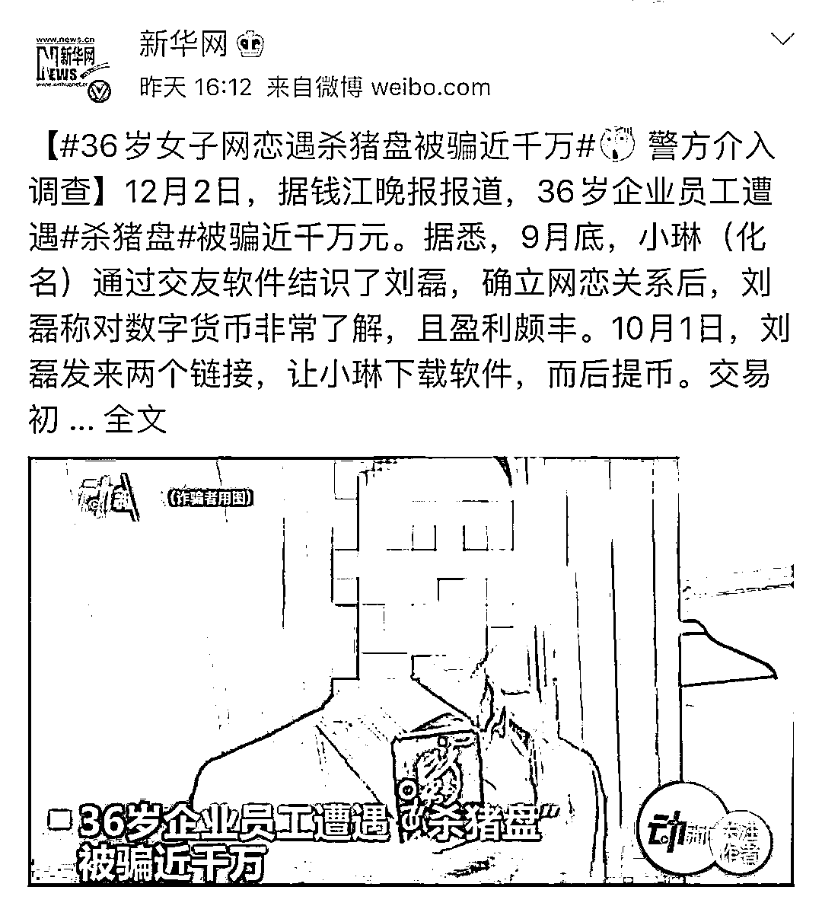

# “杀猪盘” ——孤独男女的爱和哀愁

> 原文：[`mp.weixin.qq.com/s?__biz=MzIyMDYwMTk0Mw==&mid=2247521589&idx=1&sn=6fd50579ac59d81fa894d7261f025538&chksm=97cb5e0da0bcd71b8a6d1a513fb83b93ed422a2c62d03ca1355f12ef30aeca92532fc7548d92&scene=27#wechat_redirect`](http://mp.weixin.qq.com/s?__biz=MzIyMDYwMTk0Mw==&mid=2247521589&idx=1&sn=6fd50579ac59d81fa894d7261f025538&chksm=97cb5e0da0bcd71b8a6d1a513fb83b93ed422a2c62d03ca1355f12ef30aeca92532fc7548d92&scene=27#wechat_redirect)

【一】

不知道为什么“杀猪盘”这个事，

最近又在网上引起热议。

警察叔叔在各大社交网站的平台，苦口婆心地做科普，规劝大家不要误入爱情的屠宰场。

说起来，这都不算是个新鲜事了。很早以前知音故事会这类八卦杂志，也是连篇累牍的撰写着各种打着感情牌骗人钱财的都市故事。后来互联网兴起，传统诈骗变成了网络诈骗，但是套路还是老样子，只是骗子的嘘寒问暖从打电话变成了发邮件再变成了 QQ 微信畅聊。**变的只是联络方式，不变的依然是情感诈骗。****注——**情感诈骗是指打着感情牌诈骗钱财。最终目的是钱，不是色。而诈骗情感，则是假借感情之名达到满足性欲之实。骗感情这事，没有法律支持所以打渣男是道德领域的问题，骗钱才是法律问题。但是当我梳理这些当代情感诈骗案例的时候，真的是被震惊到了——以前我以为只是有钱的富婆，高级白领，私营业主，才能成为情感诈骗的专门对象。没想到，现如今，**最最普通的草根阶层，甚至是一穷二白的打工人，都能成为“杀猪盘”里的猪。**因为现在的网络贷款太普及了，太随便了，一个人只要有身份证，就可以随随便便贷个几十万，**“杀猪盘”诈光打工人的血汗钱，还要他们背上几十万甚至几百万的网贷，这些人的余生，全部被榨干。**比“杀猪盘”更可怕的是，“猪”太多了。简直是取之不尽用之不竭，这也是杀猪盘屡次被曝光，又屡次再度复兴重燃的原因。受害者简直多得数不胜数，在杀猪盘的报道下面，好多苦主，看得触目惊心。“杀猪盘”现在从原来的小范围、定点狩猎，专门针对有钱有产的人，变成了一种天罗地网式的无差别搜刮剥削和抢劫。**而女孩子因为更渴望情感，因此更容易落入陷阱，输掉未来。**【二】杀猪盘，在外国的叫法是 Romance Scam，爱情骗局。实际上是骗子在网上借着谈恋爱靠近受害者，在达成恋爱关系之后，再露出真面目，让受害者掏出钱财，心甘情愿地为恋人付出所有。“Romance Scam，爱情骗局”这种称呼，至少还包裹在一层粉色的纱罩里。“杀猪盘”这种称呼则更直白，冷血，还夹杂着对受害者的羞辱。“**猪”指代的是空虚寂寞冷的单身人士，就是受害者，****建立一段恋爱关系被称为“养猪”。****养猪当然是为了“杀猪”，即诈骗。****“杀猪盘”最大的特点就是放长线“养猪”，养得越久，杀得越狠。**这种诈骗现在已经非常规整，有清晰的流程和套路。 大家一起来仔细看看，至少下次流程万一走到你身边，可以提个醒。**这是一个完整且成熟的套路，骗子几乎做好了一切的准备，几乎就是将 PUA、网贷、诈骗结合到了极致。**用造假包装过的人设，一整个专业团队一起分析受害者的弱点，在设好的局里，用温柔和打压中让受害者深陷其中、无法自拔。而在这个时候，受害者已经极为信任这个诈骗犯。再通过一些手段，暗示受害者可以投资，或者通过赌博网站的漏洞赚钱，为两人的未来赢得物质基础。看看，多么缜密的流程。几百个人的谋略对付一个情感有漏洞的人。谁能逃脱得了？？ 所以我们不要再次羞辱受害者，似乎他们真的只是因为“蠢”“贪婪”才活该成为人家盘里的猪。这样缜密的团队和流程，这样的铺天盖地撒网，真的非常厉害和可怕。我就算此刻键盘打得噼里啪啦响，也不敢百分之百肯定，自己就一定不会上当。没有遇见，有时候只能说声幸运。“杀猪盘”的受害者，很多也对这个称号非常忌讳，提起来就感觉伤口被再次撒盐。杀猪盘的很多作案团队都在国外，一般来说会在越南、菲律宾等国家，跨境追捕极为困难，即使报警，受害者也往往无法追回损失。而背负了网贷的人，是要用余生去还那些巨额贷款的。【三】**其实杀猪盘的流程一直到养猪的步骤完结。****都没有任何破绽。**受害者基本都是处于空窗期的青年男女。他们会被诱惑，**有一个关键因素是：情感空虚。**在流动的城市，背井离乡的年轻人，不但背负着生活压力，还有各种精神压力，包括到了适婚年纪，家里的各种催婚，自己独自在异乡的孤独，尤其是生病需要陪伴和照顾的脆弱时候，越是这样却又越难在现实世界建立稳固的情感关系。想要的爱情，友情在现实世界几乎没有，更何况很多人亲情不是太远就是太淡，**在虚拟的互联网寄托这份沉重的期盼，难免被骗子趁虚而入。**一个事业有成，且温暖美好的人向这样的人群靠近时，试问谁有力气推开呢？赵静其实是个非常独立有主见的女孩，她一意孤行来北京，从服务业干起，辛辛苦苦存了 15 万，然后遇见一个有房有车有品的男人，在网上向她示好。赵静并不蠢，觉得你这么好，为什么要在网上找女朋友？男人说，因为我学历不太高，所以在现实世界不太抢手，还遭受感情创伤，所以只好在网上碰碰运气。赵静学历也不高，立刻产生了同仇敌忾的亲近感。 男人一直跟她保持淡淡的朋友关系，对她没有任何要求。只是分享下彼此的生活，谈谈自己的近况。时间一长，赵静充满防备的内心开始放松。这是一个极致的故事，也是一个平凡的故事。在腾讯一档谈话节目《和陌生人说话》中，这位在杀猪盘中受害者，凭一己之力抓住骗子的故事，在互联网上一度掀起了一点涟漪。赵静在外漂泊的孤寂，对感情的渴求，遭遇欺骗时的屈辱和无力，能激起每一个当代“社畜”的感同身受。而她通过一己之力反杀骗子的机智、果决和坚韧，又让我们感受到了一点力量。**这不只是关于杀猪盘的科普，更是自我救赎的案例。****她想通过这种反杀，拯救自己下坠的生活，挽救自己受害者的屈辱感。**但是无论如何，她的十五万没有追回来。**杀猪盘到了最后投资一步为什么也会屡屡得手呢？**因为当骗子不动声色的引导受害者开始拿钱的时候，经过长期的人设铺垫和情感交流，她们也很难进行防备。给自己人设是金融人的骗子，会告诉受害者：“发现了投资风口。”给自己人设是程序员的骗子，会告诉受害者：“发现了博彩后台 bug。” 这些人告诉受害者自己已经赚了多少，希望受害者也为了两人的未来一起努力。如果说赵静只是位普通北漂，身上的漏洞比较多，那么白雪则是位高学历的金融从业者，34 岁未婚年薪 70 万，大龄剩女的标签是她唯一的漏洞，迫切需要用一个匹配的男友证明自己的完美。婚恋网上她认识了大卫陈，这位男士自称 42 岁，离异无孩，名校海龟，也从事金融，每每两人聊起这个话题，对方毫无破绽。春去春又回，大卫陈又换了保时捷，因为最近找到了风口。不用多说，白雪信任这位情郎的远见，自然愿意一起登上风口起飞。然后心甘情愿进入了杀猪盘。**自始至终，她没有对任何人提到自己亏掉的全部积蓄，因为那是她的尊严底线。**有情感专家支招，在婚恋交友过程中，多问一个为什么？为什么条件这么好的人，会爱上我这么普通的人？但是事实上，骗子人设也是专门针对杀猪盘客户来设置匹配的。赵静把骗子约出来后，发现号称身高 180 有颜有品的男友，只是个 170 的小镇杀马特。她说，在现实中我绝对看不上他。这句话，其实也非常有意思，我忍不住反思了一下。也许我们看得上的，都是我们配不上的人。白雪则自始至终没有见过那位大卫陈。但是后来，她发现他给她的照片是一位新加坡的华裔网红医生的图片。【四】当杀猪盘骗局席卷重来时，我们很多人都容易掉进这种陷阱里。据说，现在的“猪”也不仅仅只是单身男女，还有结了婚不幸福的男女，还有同性恋人群，还有离婚失婚的人群。老年人如果能网贷，大概也不是只被假“靳东”骗骗流量。情感的缺失和渴求，确实是现代人最大的问题。 一方面渴望跟人建立亲密关系，一方面却又因为种种缘由无法建立，最终想在虚拟的世界寻求真实，无疑缘木求鱼。我们更应该学会如何跟现实世界熟悉的人建立亲密联系，而不是在网上去渴求一个量身打造的完美对象。 尤其是女人，很多在重男轻女家庭长大，或者是情感上缺失，心里一片贫瘠，面对爱情容易飞蛾扑火。**杀猪盘里面的女人，读起来都让人感到有些难受。****像警察说的，那些男人骗去的都是女人的血泪。**据说，杀猪盘还有赶尽杀绝的，等你发现上当了，去网上寻求帮助时，你还要小心再被杀一次——会有同样受害者朝你靠近，先诉说经历换来同病相怜的信任，然后告诉你，自己是如何找人帮忙把被骗的钱给弄回来的。**很多受害者急病乱投医，马上就相信了，于是开始落入另一个圈套。**…… 可怕吧？怎么就没人管管啊！但是等我看完多数资料时，才发现，露出互联网的只是冰山一角。根据《南风窗》去年关于杀猪盘的深度报道中描述——“杀猪盘”在 2018 年以来兴起于东南亚，但它却不是个舶来品，从诈骗集团首脑、中层再到底层“业务员”，以及最终的受害者环节，整个“杀猪盘”里，全是中国人。中国禁止网络彩票投注后，大批诈骗分子转移到了菲律宾、柬埔寨、泰国、马来西亚等允许线上赌博的国家，他们打着高薪的幌子，向国内招聘大量年轻的 IT 技术人员和客服人员等。“去了之后，第一时间扣押你的护照，简单培训，送上工位，成为最底层的诈骗分子。”东南亚“杀猪盘”的真实面目远未曝光，其中有多少大集团，不得而知。 由警方指导的公众号“终结诈骗”披露，在一次警方内部的交流会上，多名专家对藏匿在东南亚搞诈骗及配套服务的人数进行评估，有的说有 10 万人，有的说有 20 万人，但综合多方面信息看，应至少有 30 万人。**这种跨国作案的隐秘化、集团化、专业化，让破案难上加难。**不管怎样，如果你读了这篇文章，依然懵懵懂懂的面对互联网的陷阱没有一丝防备，那就真的令人无语了。我们不但要学习在现实世界如何建立亲密关系，我们还需要学习法律和经济来武装自己的头脑，最最重要的是要学会跟自己对话，跟自己建立正向联系，不否定自己，肯定自我的价值。**永远放弃想要依赖爱情婚姻救赎自己的念头！**

来源：盛开朵朵,阻击诈骗

← 向右滑动与灰产圈互动交流 →

