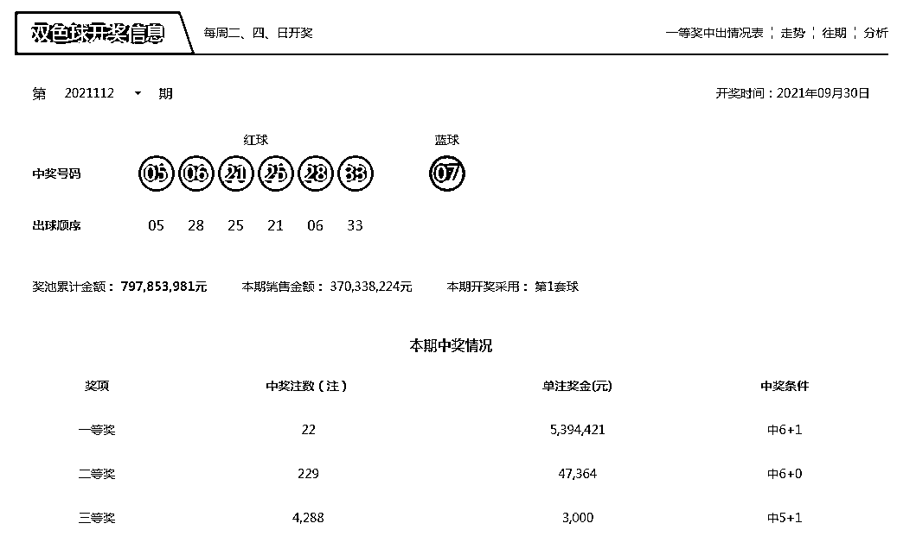
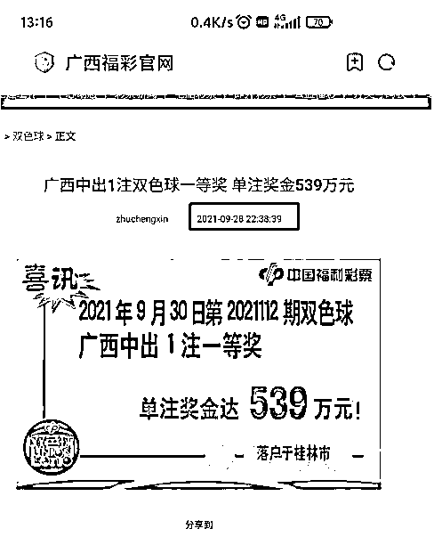
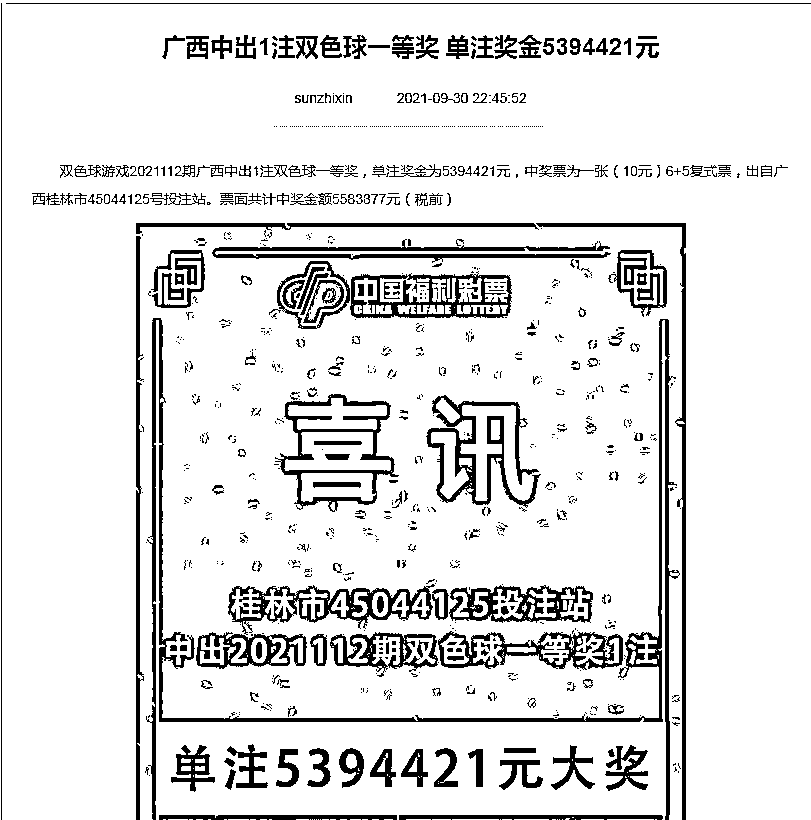
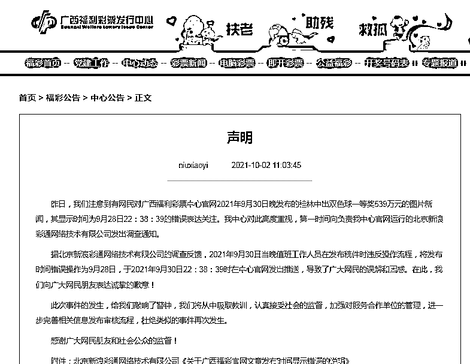
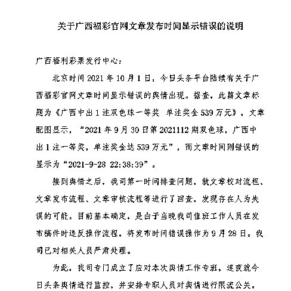
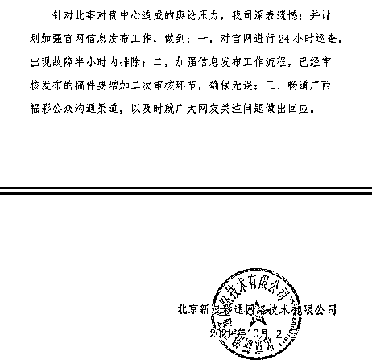
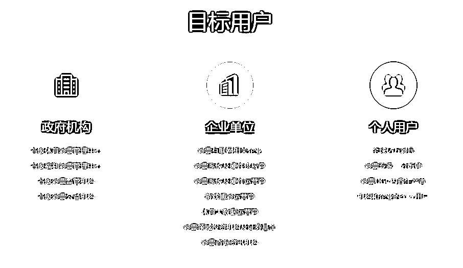
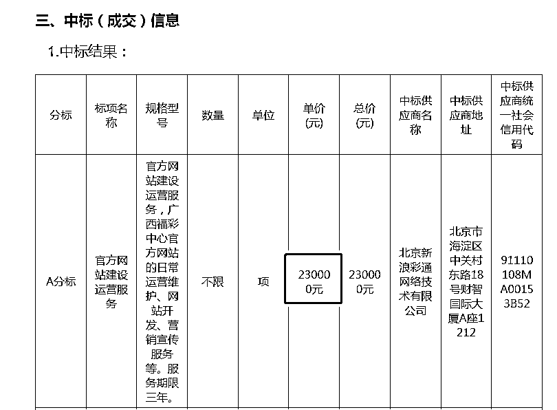

# 539 万元的中奖消息提前两天发出？网友：冠军被内定？广西福彩：系误操作

> 原文：[`mp.weixin.qq.com/s?__biz=MzIyMDYwMTk0Mw==&mid=2247521589&idx=2&sn=2853e5c4f83bd3c774e1448dfee72aea&chksm=97cb5e0da0bcd71b8b7a4b1b27c26d5a8b491512a162e71a6b2fffbcd8e6105c0e298efbebf1&scene=27#wechat_redirect`](http://mp.weixin.qq.com/s?__biz=MzIyMDYwMTk0Mw==&mid=2247521589&idx=2&sn=2853e5c4f83bd3c774e1448dfee72aea&chksm=97cb5e0da0bcd71b8b7a4b1b27c26d5a8b491512a162e71a6b2fffbcd8e6105c0e298efbebf1&scene=27#wechat_redirect)

国庆假期，彩票也休市，但是关于彩票的新闻却没有休息。过去两天，一则“广西福彩提前 2 天发布双色球一等奖”的消息传得沸沸扬扬。 

**广西福彩中心道歉：系外包方出错******

****中国福彩双色球第 21112 期的开奖时间为本周四，即 9 月 30 日。这一期双色球一等奖全国开出了共 22 注，单注奖金约 539 万元，其中广西命中了一注。然而，就是广西的这一注，引发了网友们的高度关注。****

********

 ****有网友发现，广西福彩官网竟然在 9 月 28 日这天，就已经把中“一等奖”的信息给公布了出来！这种提前公布中奖信息的操作，让人不得不怀疑，难道广西福彩中心能够未卜先知？

目前，该中奖文章的发布时间已经修改成了 9 月 30 日。

该事，经网友曝光后，引发了网友们的高度关注。有网友调侃：员工要放假，所以提前把中奖通知发了。

不过，调侃归调侃，网友们希望广西福彩能够站出来给广大彩民朋友们一个交代。

10 月 2 日，广西福利彩票发行中心网站发布声明称，该中心注意到有网民对广西福利彩票中心官网 2021 年 9 月 30 日晚发布的桂林中出双色球一等奖 539 万元的图片新闻，其显示时间为 9 月 28 日 22：38：39 的错误表达关注。该中心对此高度重视，第一时间向负责该中心官网运行的北京新浪彩通网络技术有限公司（下称北京新浪彩通）发出调查通知。

据北京新浪彩通公司的调查反馈，2021 年 9 月 30 日当晚值班工作人员在发布稿件时违反操作流程，将发布时间错误操作为 9 月 28 日，于 2021 年 9 月 30 日 22：38：39 时在中心官网发出推送，导致了广大网民的误解和困惑。在此，广西福利彩票发行中心向广大网民朋友表达诚挚的歉意！

广西福利彩票发行中心表示：“此次事件的发生，给我们敲响了警钟，我们将从中吸取教训，认真接受社会的监督，加强对服务合作单位的管理，进一步完善相关信息发布审核流程，杜绝类似的事件再次发生。感谢广大网民朋友和社会公众的监督！”

2 日，北京新浪彩通也发布了一份《关于广西福彩官网文章发布时间显示错误的说明》。该说明中称，接到舆情之后，该公司第一时间排查问题，就文章校对流程、文章发布流程、文章审核流程等进行了回查，发现存在人为失误的可能。“目前基本确定，是由于当晚我司值班工作人员在发布稿件时违反操作流程，将发布时间错误操作为 9 月 28 日。我司已对相关人员严肃处理。”

北京新浪彩通还表示，公司为此专门成立了应对本次舆情工作专班，连夜就舆情进行监控，并安排专职人员对舆情进行限流公关。“针对此事对贵中心造成的舆论压力，我司深表遗憾；并计划加强官网信息发布工作，做到：一，对官网进行 24 小时巡查，出现故障半小时内排除；二，加强信息发布工作流程，已经审核发布的稿件要增加二次审核环节，确保无误；三、畅通广西福彩公众沟通渠道，以及时就广大网友关注问题做出回应。”

**广西福彩网站建设运营中标金额：23 万******

****北京新浪彩通官网显示，该公司是新浪集团集聚旗下众多优质平台资源及人才等资源，鼎力打造的一家聚焦于开拓彩票全产业链业务的创新型科技企业。彩通致力于服务彩票机构、行业公司、从业者及亿万彩民。****

****从简介可以看出，各级彩票管理中心是北京新浪彩通的主要客户之一，该公司通过背靠新浪集团的技术和内容优势，为各级彩票管理中心输出包括网站建设、微博微信运营等在内的彩票领域综合服务。****

********

****图片来源：新浪彩通官网**** 

****每经小编查询发现，根据发布在广西政府采购网上的一则中标公告，2020 年 7 月 24 日，北京新浪彩通中标广西福利彩票发行中心官网官微自媒体平台运营项目。****

****该项目分成了两个分标，包括官方网站建设运营服务以及官方微信公众号运营服务，其中前者中标金额为 23 万元，服务期限三年；后者金额为 47 万元，服务期限也是三年。****

****官方网站建设运营服务具体包括广西福彩中心官方网站的日常运营维护、网站开发、营销宣传服务等。****

********

 ****据广西财政厅发布的数据显示，2021 年上半年，全区各级彩票销售机构创新营销手段，拓展营销渠道，立足主力核心票种，重点发力新游戏，彩票市场呈现恢复性增长。上半年全区共销售彩票 28.69 亿元，同比增长 44%。其中，福利彩票销售 15.66 亿元，同比增长 9.7%；体育彩票销售 13.03 亿元，同比增长 130.0%。

从全国来看，受去年同期基数较低影响，今年 1-6 月彩票销售同比增长较快。1-6 月累计，全国共销售彩票 1784.38 亿元，同比增加 545.38 亿元，增长 44.0%。其中，福利彩票机构销售 677.02 亿元，同比增加 84.14 亿元，增长 14.2%；体育彩票机构销售 1107.36 亿元，同比增加 461.24 亿元，增长 71.4%。

来源：每日经济新闻综合自广西福利彩票发行中心、广西财政厅等******** ************

******← 向右滑动与灰产圈互动交流 →******

************