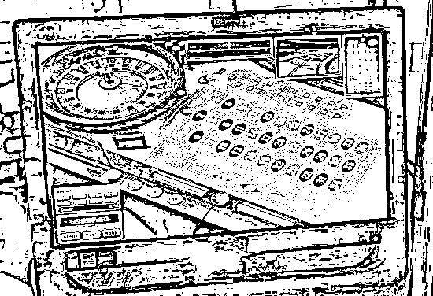
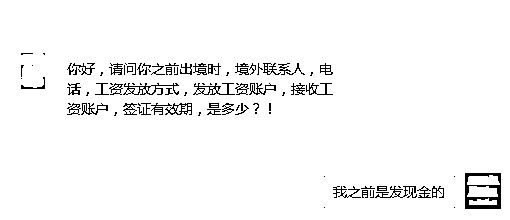
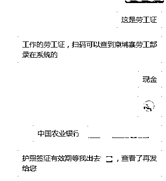

# “去趟柬埔寨被警察多次问候，快赶上相亲次数了”

> 原文：[`mp.weixin.qq.com/s?__biz=MzIyMDYwMTk0Mw==&mid=2247521589&idx=3&sn=676be090eb01568078d45164ba777217&chksm=97cb5e0da0bcd71b5fb81d4cf36a904e9998d1cb2548b145b3f52c1b6f5fbd48e8d10ee60e9a&scene=27#wechat_redirect`](http://mp.weixin.qq.com/s?__biz=MzIyMDYwMTk0Mw==&mid=2247521589&idx=3&sn=676be090eb01568078d45164ba777217&chksm=97cb5e0da0bcd71b5fb81d4cf36a904e9998d1cb2548b145b3f52c1b6f5fbd48e8d10ee60e9a&scene=27#wechat_redirect)

近日，一名网友向**柬埔寨头条**记者爆料，称去趟柬埔寨被警察多次问候，快赶上相亲次数了。

她说，从今年二月份至今，警察已经调查了她三次，一次比一次严格，堪比查户口。 

被怀疑从事网赌、诈骗

警察突然上门调查

这名网友表示，2 月份的时候，她还在柬埔寨工作。一天下午，国内的一名警察突然去她家里并问其家人，她在柬埔寨干什么，是否是从事网络赌博、电信诈骗工作之类的问题。

**她说，家里的母亲没什么文化，警察突然到家里去，差点把老人吓着了。**

“在我们村，警察找上门可是大事。我妈妈非常担心，她害怕我是不是真的在柬埔寨‘犯事’了，于是急忙给我打微信语音，让我直接和警察对话。我虽然在柬埔寨从事正当行业，但胆子较小，被警察问话的时候内心一开始都是颤抖的”，这名网友说道。

她说，接过语音后，警察开口便直接问她在柬埔寨做什么，她解释自己从事的是正当行业，并非违法行业，而且持有柬埔寨劳工证，是正当务工人员。然而，警方却一再追问，对她的回答充满质疑。

*图片来源网络

于是，她激动的对警察说：“我不是做网络赌博和电信诈骗的，那些从事这些黑灰产业的人，上班的时候是不允许带私人手机的，而且他们也没有人身自由，我现在能和您直接通话，说明我在柬埔寨做正经工作，如果您不相信的话，我可以和您视频”。

网友说，被警察怀疑是菠菜、电信诈骗分子，感到特别冤枉。

好在，警察后面相信了她说的话，问她什么时候回国，登记完后就走了。

她还说，原以为自己解释的够清楚了，没想到回国后又被调查了两次。

回国后又被“问候”2 次

被怀疑涉及偷渡；调查比查户口还严

网友说，她于 5 月份辞职回国，在广州集中隔离 14 天，回到老家又隔离了 7 天。6 月份才开启国内正常生活。 

**8 月中旬一天下午，她又接到派出所的电话。警方上来就问：你是不是在柬埔寨？什么学历？是否为正常出入境等诸如此类的问题。**

她告诉警察，几个月前就已回到国内，一一回答相关问题后，她向警察再次强调，她是正常出入境柬埔寨的，护照上都有记录可以查询，她并没有偷渡到柬埔寨从事黑灰产业，之前在柬从事的都正当行业。

那名警察告诉她，因为近期有人从国内偷渡过去柬埔寨、缅北地区从事网络赌博和电信诈骗，所以才要进行调查，以打击非法出境行为。

*图片来源网络

**9 月 17 日下午，网友再次接到另一名年轻女警察的调查电话。这名女警问的问题非常详细，比查户口还严。**

**她说，警察一直问她之前在柬埔寨什么地方工作、工资发放方式、境外联系人、电话、工资发放方式、发放工资账户、接收工资账户、签证有效期等问题。**

由于当时她还在上班，所以主动添加警察微信，等下班后再回答这一系列问题。

对于警察三番五次的调查，这名网友表示，她非常支持和配合警察的调查工作。因为这样可以清除那些从事网赌、诈骗的不法分子，维护社会稳定。

但她认为，警方若进行排查就一次性调查完存档，把偷渡、从事网赌、诈骗嫌疑人员与正常出入境经商务工的正经群体区分开来，以进行重点打击。而不是一刀切，一个调查完另一个又来，一方面显得工作效率低，另一方面也给广大普通群体带来一定困扰。

最后，她还自我调侃，“去一趟柬埔寨被警察多次调查，这次数比我相亲次数还多。希望这是警察最后一次找我”。

来源：柬埔寨头条

← 向右滑动与灰产圈互动交流 →

