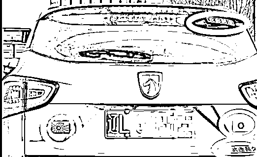
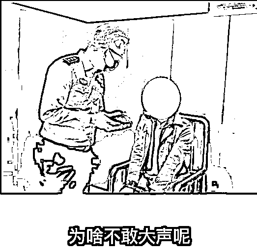
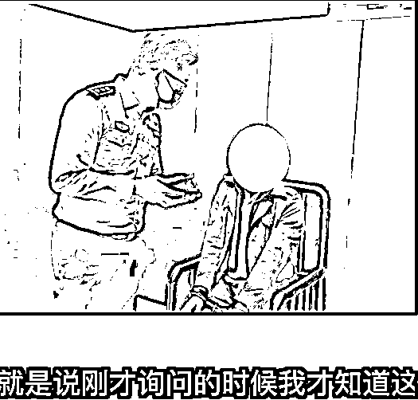
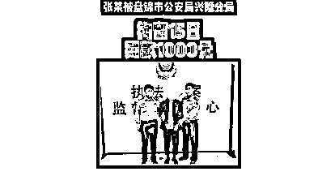
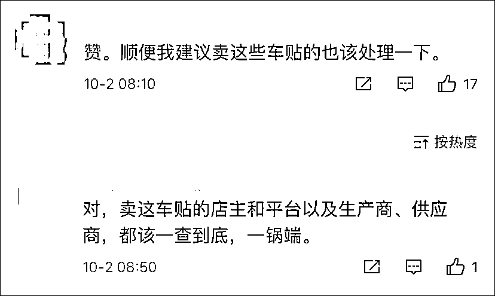
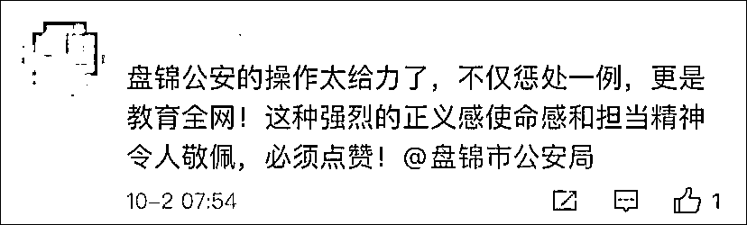
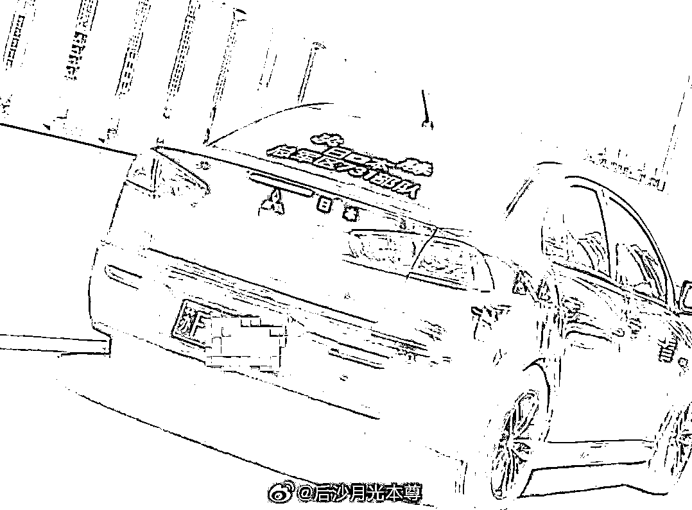
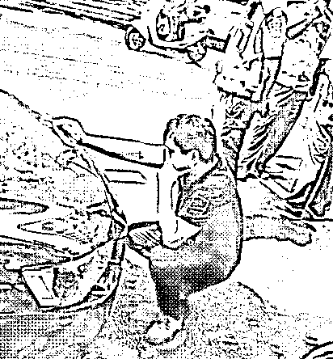
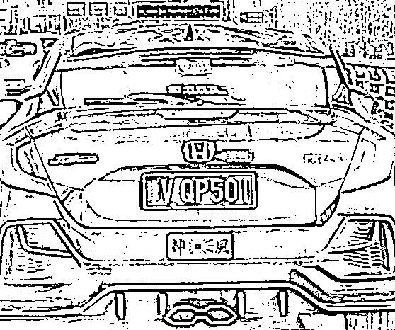

# “不抓你，对不起牺牲的烈士”

> 原文：[`mp.weixin.qq.com/s?__biz=MzIyMDYwMTk0Mw==&mid=2247521589&idx=4&sn=1dcab47f10c7402b46a560b04381b51a&chksm=97cb5e0da0bcd71be3d639b326463099d3b6ad492db2a6b91dedb2c26935b9d9d1c91a8bc16f&scene=27#wechat_redirect`](http://mp.weixin.qq.com/s?__biz=MzIyMDYwMTk0Mw==&mid=2247521589&idx=4&sn=1dcab47f10c7402b46a560b04381b51a&chksm=97cb5e0da0bcd71be3d639b326463099d3b6ad492db2a6b91dedb2c26935b9d9d1c91a8bc16f&scene=27#wechat_redirect)

## 

****盘锦市公安局兴盛分局近日处理了一起私家车使用日本军旗等辱华贴纸的案件。****

**10 月 2 日，@盘锦网警 在网络上发布了一则视频，系该盘锦市公安局兴盛分局近日处理的一起私家车使用日本军旗等辱华贴纸的案件。**

**涉事男子被处以拘留 15 日，罚款 1000 元。**

 **[`v.qq.com/iframe/preview.html?width=500&height=375&auto=0&vid=f32801f1lwc`](https://v.qq.com/iframe/preview.html?width=500&height=375&auto=0&vid=f32801f1lwc)** 

**视频来源：盘锦网警**

**从视频中可以看到，涉案车辆的后方贴着日本国旗、日本军旗、“支那制造”和“武运长久”的贴纸。公安民警发现后，第一时间对其进行传唤。**

****

**审讯室中，私家车车主声称自己是在民警告知后，才知道这些侮辱性标语的含义。**

****

****

**随后，民警再一次对其进行了严肃教育，同时也恰好通过该视频，在全网起到警示作用。**

**“我给你解释一下，‘支那’是对中国人的一种极具侮辱性的词汇，明白吗？”民警说道，“‘武运长久’，他的意思是对外扩张的道路永远幸运，永远平安，知道了？你伤害的是所有 14 亿中国人，盘锦公安不抓你，对不起全国人民，对不起所有牺牲的烈士。”**

**最终，该男子被盘锦市公安局兴隆分局处以拘留 15 日、罚款 1000 元。**

****

**看到这里，有网友点赞盘锦市公安，“处罚一例，教育全网”。**

**有网友表示，除了涉事车主，贴纸的生产商等相关单位也难辞其咎。**

****

****

**事实上，类似事件近期频发。**

**9 月 27 日，有网友举报江苏南通一黑色轿车上贴有“必胜、日本、总军区 731 部队”等字样。**

****

**警方调查后发现，车主尹某“出于猎奇心理，网购不当字样贴在车上进行炫耀”。目前，该男子已被处以拘留 15 日的处罚，相关车贴也被责令清除。**

****

**9 月 29 日，郑州一私家车被发现贴有日本军旗图案。交警发现后，第一时间将车辆查扣并移交于派出所处理。**

****

**对于该现象，《法制日报》评论称，“这种贴着精日标语招摇过市的做法，无疑是把民族尊严和法律底线，公然踩在脚下，不仅严重践踏了公德底线，败坏了社会风气，伤害了同胞感情，也是对我国法律赤裸裸的挑衅。”**

**该媒体指出，2018 年 12 月 13 日，《南京市国家公祭保障条例》正式实施。《条例》规定，侮辱、诽谤他人，寻衅滋事、扰乱公共秩序，宣扬、美化侵略战争和侵略行为，构成违反治安管理行为的，由公安机关依法给予治安管理处罚；构成犯罪的，依法追究刑事责任。**

**此外，作为我国首部英雄烈士保护的专门立法，英雄烈士保护法也明确规定，亵渎、否定英雄烈士事迹和精神，宣扬、美化侵略战争和侵略行为，寻衅滋事，扰乱公共秩序，构成违反治安管理行为的，由公安机关依法给予治安管理处罚；构成犯罪的，依法追究刑事责任。**

**来源：中国基金报，巴蜀反诈**

****

**← 向右滑动与灰产圈互动交流 →**

****