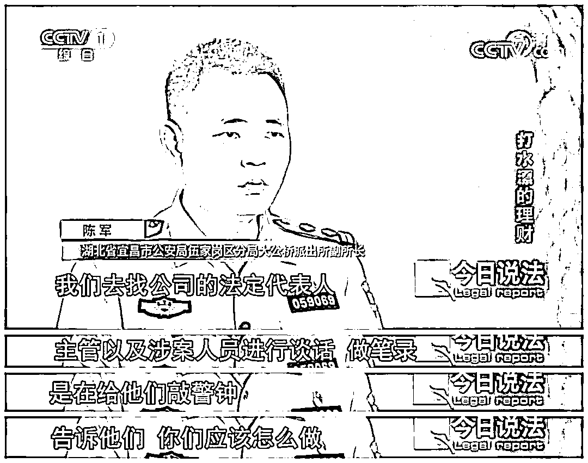

# 涉案资金 3 亿元！特大虚假投资理财诈骗案告破！

> 原文：[`mp.weixin.qq.com/s?__biz=MzIyMDYwMTk0Mw==&mid=2247521589&idx=5&sn=75f8218d37efa1fa03005f54321470e8&chksm=97cb5e0da0bcd71b9ed5ef8a662ec73ec8120c86348f22f09feefa7df44a74d15e4f1f0474a6&scene=27#wechat_redirect`](http://mp.weixin.qq.com/s?__biz=MzIyMDYwMTk0Mw==&mid=2247521589&idx=5&sn=75f8218d37efa1fa03005f54321470e8&chksm=97cb5e0da0bcd71b9ed5ef8a662ec73ec8120c86348f22f09feefa7df44a74d15e4f1f0474a6&scene=27#wechat_redirect)

他在朋友拉拢下 

把全部积蓄投入 

…… 

精心布局

5 万多人被引诱 

…… 

3 亿元涉案资金被收割

新的骗局又卷土重来 

看宜昌警方如何

悉数斩断电诈犯罪全链条

**精心布局**

**步步引诱**

自从早年下岗后，湖北宜昌的郭先生就一直在找各种挣钱门路，2021 年的年初，朋友推荐在一款投资理财软件上购买基金，说是能稳赚不赔，郭先生就决定试试。

前期投资不大，收益也陆续到账，郭先生觉得遇到了一个好的赚钱路子，为了不错失良机，他接着把 20 多万元的积蓄全部投了进去。就在满心期待更大收益时，有一天，郭先生发现手机上的这款理财软件突然打不开了。 

郭先生顿时傻眼，他立马意识到可能被骗了，赶紧去报案。

郭先生使用的这款理财软件叫柏 R，对外宣称是由一家境外投资集团推出的金融理财平台，但警方认为这类通过网络上推广的所谓投资理财活动，很可能涉嫌违法犯罪。

很快宜昌警方查明，所谓的境外投资集团只是一个幌子，这款名为柏 R 的理财软件就是诈骗分子用于骗钱的工具。郭先生不过是众多被害人中的一个，上线运营仅仅两个月时间，这款名为柏 R 的理财软件就吸引了全国 5 万多人使用。

办案人员查实，除了四处打广告，诈骗份子会鼓励前期投资者层层发展下线，导致被害人数量形成了传销式增长。郭先生就是经朋友竭力拉拢，说在这款理财软件上购买基金，投资周期短，收益率高，还不存在风险。

为了彻底打消郭先生的疑虑，朋友当时还把他拉进了一个理财微信群，群里的成员都在用这款柏 R 理财软件，不少人还在群里晒每天的盈利截图。

即便这样，郭先生还是很谨慎，前期只投入了 800 元。警方注意到其他被害人大都也是同样的心理，随着前期投资收益陆续到账，众多被害人逐渐信以为真，纷纷开始加大投资力度。有的人掏出了多年积蓄，有的人甚至不惜借款投资。

当众多被害人越陷越深，投入的资金额度也越来越大，诈骗分子随即关闭了所谓的柏 R 理财软件，郭先生投入的 20 多万元就这样打了水漂。

初步查明在关闭柏 R 理财软件前，众多被害人总计已投入资金达 3 亿元，第一次诈骗得手后，这伙诈骗分子没有善罢甘休，立马就又推出了一款新的名为德 X 的理财软件，试图骗取第二批被害人资金，这引起宜昌警方高度重视。

在湖北省公安厅指挥下，宜昌市公安局抽调精干力量组成专案组，对这起特大金融理财骗局展开深入调查。调查显示，涉嫌操纵这场骗局的幕后主谋是潜藏在境外某地的诈骗集团，受疫情影响和跨境执法的制约，办案人员暂时无法出境打击……

**查清犯罪链条**

**捣毁犯罪团伙**

根据以往办案经验，类似的金融理财骗局之所以能屡屡得逞，除了境外诈骗集团主导操纵实施外，也离不开国内相关“黑灰产业”的配合。宜昌警方决定立足国内，先全面铲除这个特大金融理财骗局在境内的犯罪链条。

宜昌警方争分夺秒迅速查清了这场特大金融理财骗局在境内的犯罪链条，共计有 9 个作案环节，涉及 13 个犯罪团伙。

在 9 个涉案环节中，为境外诈骗集团提供技术支持和财务支持的是关键两环，而提供技术支持的涉案人员又是警方此次打击的重中之重。

顺线追查发现，为涉案理财软件提供技术支持的主要嫌疑人叫袁某，袁某长期在重庆活动。

事不宜迟，宜昌警方立即派出一组警力奔赴重庆实施抓捕，侦查发现袁某已从原公司离职和几个同事合伙创办了一家新公司，袁某创办的新公司就租住在一栋商业大厦内。

在当地警察配合下，宜昌警方冲进这间办公室，将屋内所有人员暂时控制。主要犯罪嫌疑人袁某当天被抓获到案，相关涉案人员全部被带回湖北宜昌。

接下来宜昌警方把侦查重点转向为境外诈骗集团提供财务支持的犯罪团伙。经查这伙人员在福建省的龙岩市活动，一组侦查力量先期赶赴龙岩展开调查。

在当地警方配合下，办案人员很快查实，境内提供财务支持的主要嫌疑人是陈某，他的妻子也参与作案，陈某夫妇与境外诈骗集团保持直接联系。

根据境外诈骗集团指令，陈某夫妇及团伙成员的主要任务就是转账支出各种费用，后期每天支出的资金流水都在 60 万元左右。

外围侦查发现，嫌疑人陈某平时就在龙岩本地活动，但他非常谨慎，不管白天外出多远，晚上都一定会回到所住的村子。

由于陈某夫妇和团伙成员大都沾亲带故，彼此住的地方也很近，抓捕前，宜昌警方进行了周密部署，主要嫌疑人陈某是重点抓捕对象。

2021 年 4 月 25 日，龙岩的抓捕行动展开了，当身着便衣的警察赶到陈家门口时，陈某的母亲当时谎称儿子不在家，抓捕警察并没有理会，径直冲进陈某房间将其成功控制。

陈某被控制后，他的妻子和另外同伙也接连被抓获。

与此同时，宜昌警方也兵分多路奔赴全国多省市，对其他作案环节涉及的犯罪嫌疑人展开统一抓捕。

位于天津的宫某为境外诈骗团伙使用的大量微信号提供解封支持和代支付，将宫某控制后，办案人员在其家中查获大量现金多部手机和多张银行卡。 

▲抓捕宫某时的情形

在深圳抓捕引流推广团伙时，将犯罪嫌疑人带进房间后，抓捕警察发现屋里摆满了手机，全部处于开机运行状态。嫌疑人交代，这些手机是用来做引流推广的，他们掌握了大量微信群，会定时在这些群内发布广告，还自称做的都是正规业务。

嫌疑男子交代，他们并没有跟境外的诈骗集团直接联系，而是通过中介接下的为涉案理财软件进行推广的业务。

此外警方还查明，境外诈骗集团还雇佣了国内相关技术人员，为涉案的理财软件提供网络安全防护服务。而为涉案理财软件提供网络安防服务的犯罪嫌疑人，竟然是深圳两家知名网络公司的工作人员，他们正是利用工作之便为境外诈骗集团服务，对嫌疑人所在公司相关管理人员宜昌警方也进行了正式通报。

经过两周时间集中抓捕，这场特大理财骗局，在境内的 9 个作案环节，13 个犯罪团伙被全部摧毁。宜昌警方先后共抓获犯罪嫌疑人 47 名，冻结 400 多个涉案账户，冻结涉案资金 525 万元，查获大量涉案银行卡、电话卡、手机、电脑等物品。

**为何沦为境外诈骗团伙的帮凶？**

经审讯嫌疑人袁某交代他原本有正经工作，但也经常做兼职，在做兼职的时候，通过中介接下了为涉案理财软件做技术支持的任务。按照袁某的说法，他为涉案理财软件提供技术支持，收取的费用不算高，一次能赚几千块钱，活也不重，在空闲时间就能完成。

袁某交代从一开始他就很清楚为涉案的所谓理财软件提供技术支持，存在违法风险，但因为**侥幸心理**，才打算继续做下去。

警方查明，境外诈骗集团为境内涉案各犯罪团伙支付报酬，都是通过福建龙岩的犯罪嫌疑人陈某完成。到案后陈某交代他每天所要做的就是通过手机不停转账。

陈某说为境外诈骗团伙提供财务支持，也是为了多赚钱。据警方查证，陈某最多一天就能挣到 8000 块钱，后期随着工作量增大，陈某首先发展了妻子当帮手。

见来钱快，陈某的妻子还把自己的亲姐姐和亲妹妹全部拉下水。

尽管到案的境内犯罪嫌疑人没有直接参与诈骗活动，但正是在他们的协助配合下，境外诈骗集团操纵的这场特大理财骗局才能得逞。

**眼下境内涉案各环节上的**

**犯罪嫌疑人全部到案了**

**但这起特大金融理财骗局**

**的侦办工作并没有终结**

**对境外诈骗集团的主要成员**

**宜昌警方正时刻密切关注他们的动向**

来源：三峡晚报全媒记者王献科、伍家公安、利箭在出击

← 向右滑动与灰产圈互动交流 →

