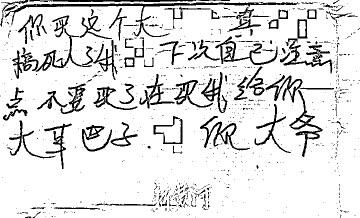
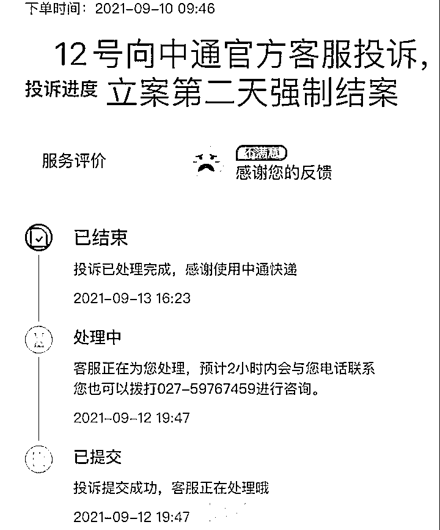
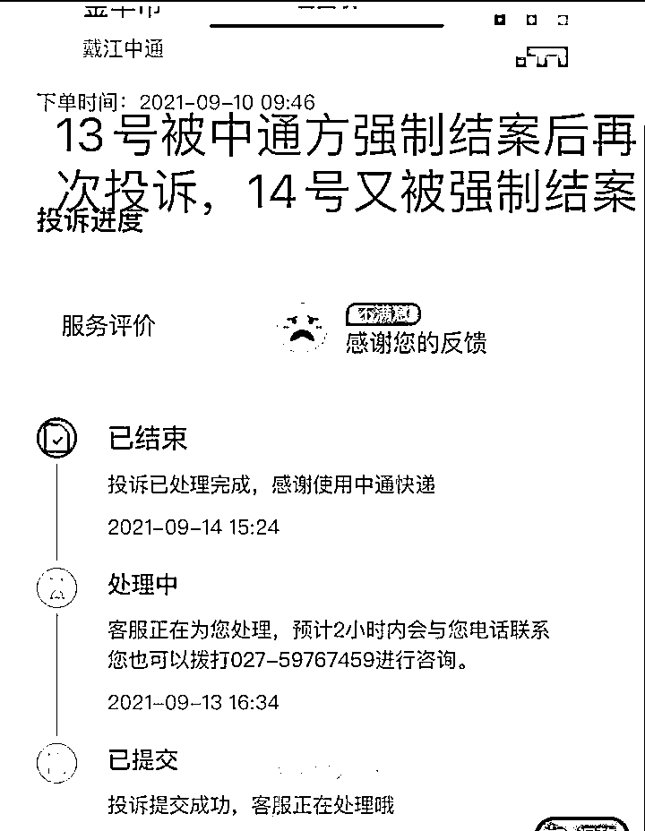
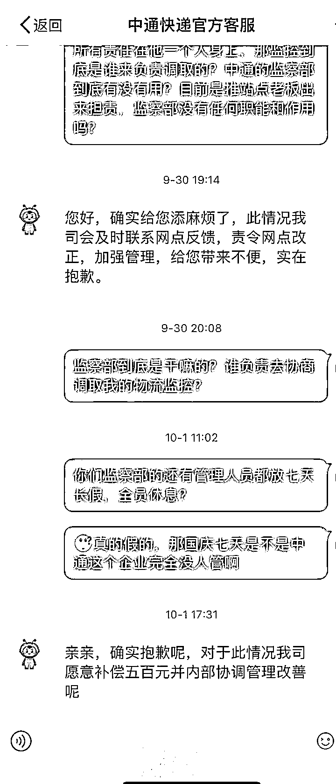

# 女子网购筋膜枪被误认性用品荡妇羞辱！包裹上被写不堪入目的侮辱字眼！

> 原文：[`mp.weixin.qq.com/s?__biz=MzIyMDYwMTk0Mw==&mid=2247521642&idx=1&sn=7027f8d975afbc9e3858c6f0b415a7ac&chksm=97cb5e52a0bcd744f65ef70811d84c868f44e41b342e21bfd960161d13cf0b3595b38583e666&scene=27#wechat_redirect`](http://mp.weixin.qq.com/s?__biz=MzIyMDYwMTk0Mw==&mid=2247521642&idx=1&sn=7027f8d975afbc9e3858c6f0b415a7ac&chksm=97cb5e52a0bcd744f65ef70811d84c868f44e41b342e21bfd960161d13cf0b3595b38583e666&scene=27#wechat_redirect)

## 

9 月 30 日，武汉网友张华女士（化名）发微博称，9 月中旬自己网购了一款用于按摩肌肉的筋膜枪。时隔两天收到快递时，却发现快递包裹上被人书写了带有侮辱性质的文字。 

随后张华女士多次向中通快递公司及 12305 投诉。快递公司相关负责人回应记者称，接到客户投诉后，中通快递安监部、客服部已开始调查，正在积极处理中，目前无法确定为己方员工所为，会积极配合警方调查。

**律师表示：公然侮辱他人或者捏造事实诽谤他人的，应承担相应的法律责任。 **

[`v.qq.com/iframe/preview.html?width=500&height=375&auto=0&vid=e3280oykz2b`](https://v.qq.com/iframe/preview.html?width=500&height=375&auto=0&vid=e3280oykz2b)

“我看到包裹上的这段话时，整个人都蒙了。”张华对记者表示。

**根据张华提供的图片显示，在快递盒的外侧，用黑色马克笔写着一段 40 字左右的侮辱性文字。**

发现这一情况后，张华马上联系了快递点老板。“老板帮我找到分拣站的监控视频并发给了我。”根据监控视频显示，9 月 12 日 6 时 59 分 39 秒，一名男性分拣员在整理快递时，发现了疑似张女士的快递包裹。

在他拿起包裹观察约 24 秒后，于 7 时 0 分 03 秒，将包裹递给对面的女性分拣员，女分拣员拿起看了一段时间后，又将包裹放回到传送带上。

张华在 9 月 12 日、9 月 13 日，先后两次向中通快递公司客服投诉此事，但她发现自己的两次投诉在均未得到回应时，却都显示已经处理完成。

随后她又通过 12305 申诉小程序反映，但依然未收到中通快递的正面回复。9 月 29 日下午，张华再次联系了中通快递客服，客服回应“仍在调查核实”。

事情发生后，由于一直没有收到中通快递的回应，张华通过微博发布了多条关于此事的帖子，并引发广泛关注。

在其中一条微博的评论区内，中通快递公司官方微博评论：“给您带来这样的麻烦实在是太抱歉了，为了更快处理好您的问题，我们已经私信联系您，请您回复一下相关单号，以便我们跟进处理，感谢您的理解与配合。”

10 月 1 日 17 时 31 分，中通快递客服微博联系张华女士，表示愿意补偿 500 元并将进一步加强内部管理。“无论是快递公司提的 500 元赔偿，还是站点老板要给我 1000 元精神补偿费，我都拒绝了。”张华女士说，**“快递公司应该严查此事，我不是为了赔偿，而是包裹上的侮辱性文字实在无法容忍。”**

张华对记者表示，**“我的诉求很明确，一是中通调取我包裹的物流监控给我，找到写字的人。二是要求写字的人向我道歉并给予相应赔偿。三是中通对这名员工进行相应的处罚并对客户投诉的处理方式进行改进。” **

10 月 3 日，记者就此事联系到涉事快递公司总部，相关负责人称在接到客户对此次事件的投诉后，中通快递安监部、客服部已经开始调查。“正在和发件商家客户、发件网点、义乌分拨中心、鄂州分拨中心和派件网点等多方进行核实，目前无法确定是中通员工所为。”

经核实该包裹 9 月 10 日由义乌网点揽收，途经义乌和湖北鄂州两地中转分拣，9 月 12 日下午 4 时武汉体院网点派件，随后被投诉人签收。“根据投诉人提供给媒体的视频，该包裹在武汉网点装卸时就已被涂鸦。” 该负责人表示，“由于快递途经多个网点，工作人员正进行人员问询与视频监控调查，而且包裹运输涉及环节较多，调查仍需要时间。投诉人已经报警，我们也会积极配合警方调查。”该负责人表示，“我们一直在积极处理中，但何时调查结束，还无法承诺给出确切的时间。

对于此类行为，中通一贯明令禁止，零容忍 。如经查实，将对相关人员严肃处理。”张华购买商品的涉事网店在接受媒体采访时表示，快递公司已经和店家联系过，并调取了监控。“我们的店员工不会做这种事，不知道是谁在恶作剧。” **对于此事，山东争渡律师事务所的律师黄西文表示，快递方面负责承运快件，在运输过程中快件出现任何情况，应当及时向收件方反馈，并且及时处理。**

根据《中华人民共和国治安管理处罚法》第四十二条：写恐吓信或者以其他方法威胁他人人身安全的；公然侮辱他人或者捏造事实诽谤他人的；捏造事实诬告陷害他人，企图使他人受到刑事追究或者受到治安管理处罚的；对证人及其近亲属进行威胁、侮辱、殴打或者打击报复的；多次发送淫秽、侮辱、恐吓或者其他信息，干扰他人正常生活的；偷窥、偷拍、窃听、散布他人隐私的。有以上行为之一的，处 5 日以下拘留或者 500 元以下罚款；情节较重的，处 5 日以上 10 日以下拘留，可以并处 500 元以下罚款。

来源：澎湃新闻、新黄河客户端

← 向右滑动与灰产圈互动交流 →

