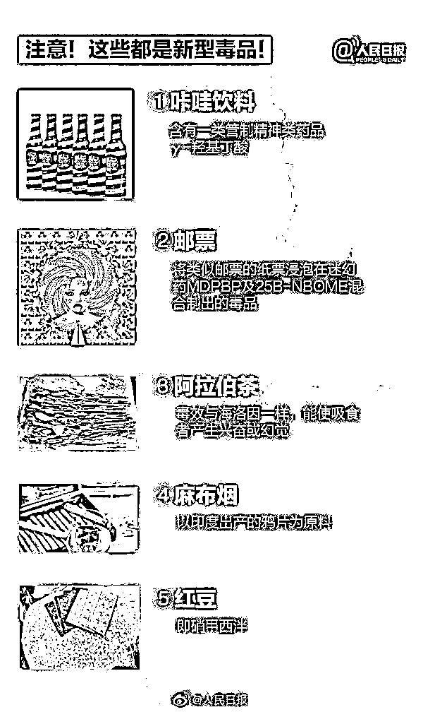

# 警惕！多名 95 后、00 后因为这个东西被抓！

> 原文：[`mp.weixin.qq.com/s?__biz=MzIyMDYwMTk0Mw==&mid=2247521642&idx=3&sn=ddd9d200a2f995a2b170d5496ebd9419&chksm=97cb5e52a0bcd74455cf9e0bb83dc9d2b94402fe6b6eb1cf7d1890399d6b10315ccc97ea4f63&scene=27#wechat_redirect`](http://mp.weixin.qq.com/s?__biz=MzIyMDYwMTk0Mw==&mid=2247521642&idx=3&sn=ddd9d200a2f995a2b170d5496ebd9419&chksm=97cb5e52a0bcd74455cf9e0bb83dc9d2b94402fe6b6eb1cf7d1890399d6b10315ccc97ea4f63&scene=27#wechat_redirect)

**提起****毒品**

很多人都觉得是离我们很远的东西

然而近些年出现的各类新型毒品

却让人防不胜防

**他们伪装成饼干、邮票、饮料等**

藏在我们生活的角角落落

就在最近，又出现了一类毒品

那就是——**“上头电子烟”**

近日

深圳龙岗警方捣毁

**一****“上头电子烟”吸贩网络**

**抓获 21 名嫌疑人**

其中 7 人涉嫌贩毒罪被追刑责

14 人因吸食毒品被行政处罚

警方摧毁犯罪网络涉毒者

多为 95 后甚至 00 后

今年 9 月，龙岗警方根据线索，在广州、深圳多地同时收网，缴获一批含合成大麻素的电子烟，并将涉毒人员一网打尽。

 抓捕现场

被抓获的 21 名嫌疑人大部分是 95 后

甚至 00 后的年轻人

现场缴获的烟弹和烟油

“上头电子烟”外表与普通电子烟相似，但烟油里却**添加了合成大麻素**。有嫌疑人称“抽了之后，会有上头感，轻飘飘的”。

**今年 7 月 1 日起，我国正式整类列管合成大麻素类新精神活性物质****。**这意味着所有品种的合成大麻素类物质，都属于我国法律意义上的毒品。

现场缴获的“上头电子烟”

据嫌疑人交代，从“上家”拿货后通过网络贩卖给吸食者，甚至发展下线，层层加价卖出。原本只卖几十元的普通烟油，掺了“料”就能翻好几倍甚至十几倍，售价高达三五百，乃至上千元。

嫌疑人中，有人吸食上瘾，只能以贩养吸；有人为牟高利，拖亲戚朋友下水；更有甚者就在朋友圈中熟练买卖。

新型毒品披着电子烟的外衣，以合法上头、安全飞行、不会上瘾等“黑话”，诱惑 95、00 后迈出涉毒第一步。

警方提醒：

新型毒品多出现在夜场酒吧

比起传统香烟，“新潮”的电子烟，更受年轻人追捧。**“上头电子烟”趁机鱼目混珠，酒吧、KTV 成为吸食和贩卖的主要场所。**

个别员工利用工作之便哄骗兜售，经常混迹夜场的无知年轻人顺势入坑。

其实，这类“上头电子烟”央视也曾曝光过。此前，央视《焦点访谈》节目曝光了一款名叫**“上头电子烟”**的违禁产品，据报道，“上头电子烟”是一种“类似电子烟的产品”，内含人工合成的大麻素，**属于新型毒品。**

[`v.qq.com/iframe/preview.html?width=500&height=375&auto=0&vid=x3246uvkimd`](https://v.qq.com/iframe/preview.html?width=500&height=375&auto=0&vid=x3246uvkimd)

多地官方提醒：

切勿因好奇而尝试，应及时报警

这种新型毒品假借电子烟的名号出现在大众面前，也迅速引起了各地禁毒委员会的关注。

广州禁毒、新疆禁毒、北京禁毒、湖南禁毒、南京禁毒等多地禁毒委员会陆续发声。

目前，各地公安机关已陆续展开对非法网络贩卖“上头电子烟”的相关生产者和销售者的打击。

提醒消费者在看到**“上头电子烟”字眼时，应第一时间联想到新型毒品**，少去人员混杂、管理混乱的娱乐场所，避免陷入毒渊。

**如何辨别“上头电子烟”？** 

由于“上头电子烟”

穿上了电子烟的“马甲”

极具隐蔽性和迷惑性

该如何区分二者？

湖南禁毒在官方微信公众号中

科普了两者的区别

↓↓

首先是外形，“上头电子烟”通常呈笔状，长度大概 30cm 左右，含有为无色、黄色至褐色黏稠液体。这种形态的产品，与市面上常见的正规电子烟外观明显不同。

其次是成分，据湖南禁毒介绍，普通电子烟的主要成分是水、丙二醇、甘油、尼古丁和调味剂等，这些添加物都是较为常见的食品或者药品添加物。

而“上头电子烟”却被不法分子掺入了四氢大麻酚或合成大麻素类新精神活性物质，对人体危害极大。

毒品大麻（来源：中国禁毒）

其中四氢大麻酚（THC）是毒品大麻的有害成分，滥用者在吸食后影响中枢神经系统功能，常出现幻视、焦虑、抑郁、情绪突变、妄想狂躁、意识不清等反应，长期吸食会导致免疫力低下，诱发精神错乱和自杀倾向。

人工合成大麻素的 AMB-FUBINACA（或 MDMB-CHMICA）成分甚至比 THC 危害更大，同样的剂量下，毒性甚至比海洛因还大，1 克相当于 5.5 克海洛因，这导致很多大麻滥用者在不知情的情况下，很容易出现“坠机”症状，即过量吸食而导致的中毒现象。

现今毒品的伪装性越来越强

除了这种“上头电子烟”

在日常生活中

也有一些东西，可能是毒品！

平时常见的这些东西

可能是毒品伪装的

这些伪装你能看出来吗？

**请警惕，千万别碰！**

**警方提醒**

《中华人民共和国刑法》第三百四十七条规定，走私、贩卖、运输、制造毒品，无论数量多少，都应当追究刑事责任，予以刑事处罚。

当你处于复杂的环境中，你不知道或不确定能信任谁时，记住，请不要吃任何人给您的食品、饮料、药片、药丸，尤其是那些所谓的“朋友”！

吸食毒品，早晚会被发现、惩戒。要珍惜宝贵青春，远离毒品，别毁了自己美好一生！

**新型毒品不是时尚潮流**

**年轻人应警惕骗局**

**培养健康的兴趣爱好**

**严守法律法规，坚决远离毒品**

**切莫因小失大，蹉跎青春年华**

来源：人民日报、深圳龙岗公安、中国禁毒、湖南禁毒、南方都市报、青春山东，利箭在行动

← 向右滑动与灰产圈互动交流 →

