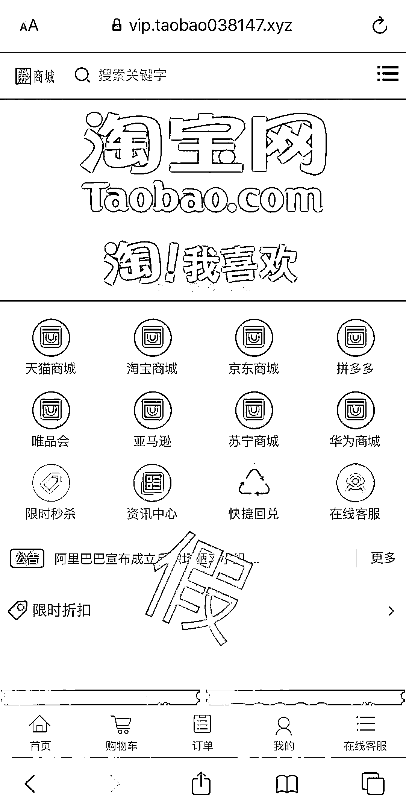
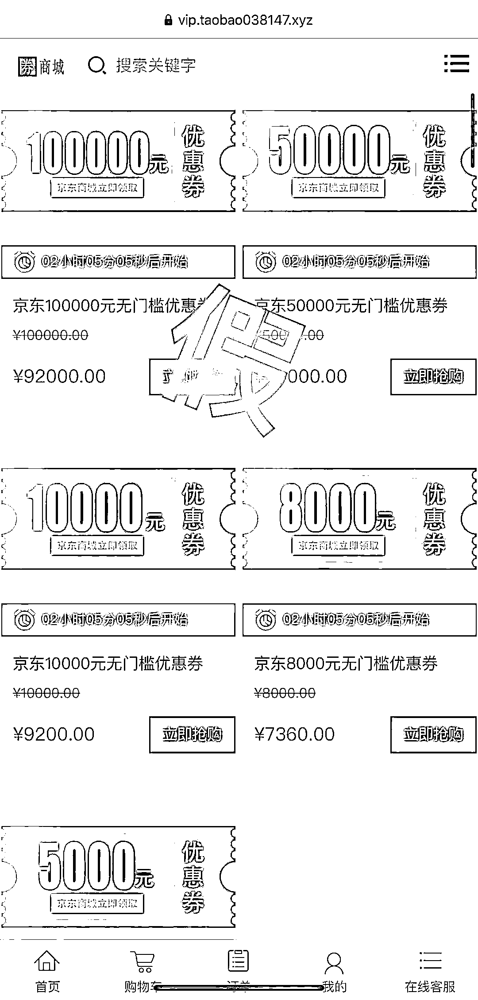
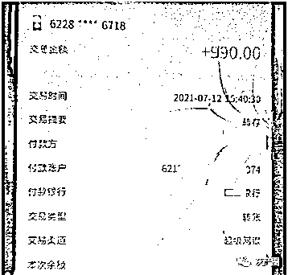
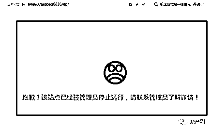
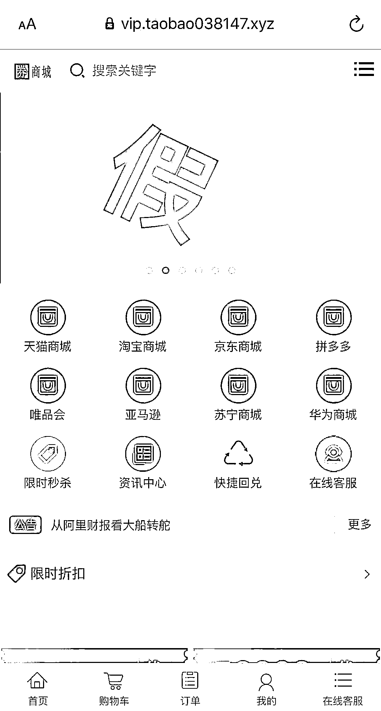
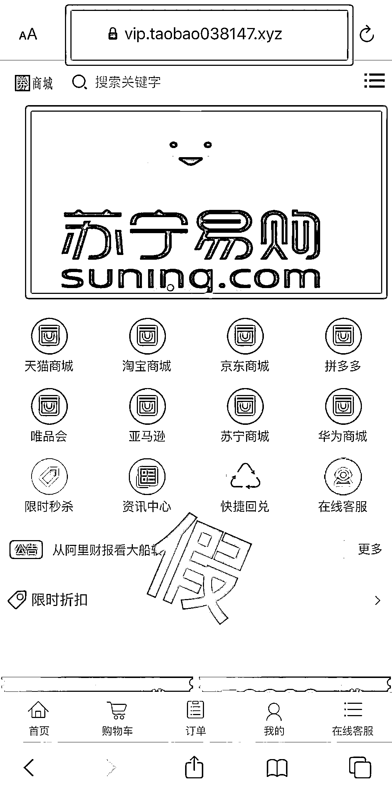

# 电商平台推出优惠券,返利高达 10%,你抢购了么？

> 原文：[`mp.weixin.qq.com/s?__biz=MzIyMDYwMTk0Mw==&mid=2247521642&idx=5&sn=c57492b7e52033bd8c3d06f0b224dbd5&chksm=97cb5e52a0bcd7447edcdebb02daec374f3707cd4d17838e28312949f5177fd118753f7c447f&scene=27#wechat_redirect`](http://mp.weixin.qq.com/s?__biz=MzIyMDYwMTk0Mw==&mid=2247521642&idx=5&sn=c57492b7e52033bd8c3d06f0b224dbd5&chksm=97cb5e52a0bcd7447edcdebb02daec374f3707cd4d17838e28312949f5177fd118753f7c447f&scene=27#wechat_redirect)

**“阿里员工”推荐“抢券”**

**买 5 万元，返现 5000 元！** 

**“京东”平台 10000 元现金优惠劵** 

**9.2 折抢购再返 500 现金**

**这种“捡钱”一样的好事**

**你遇到过吗？** 

大家在网购的时候

都用过各种优惠券 

有的优惠券优惠力度非常之大

近日

有人就在网上认识了这样的陌生网友

本想跟着“好友”赚点小钱

没想到却自己搭进去一百多万元

到底是怎么一回事呢？

网友自称“阿里员工”

推荐低价抢券平台

近日，市民李女士在某社交平台上认识了一个自称是“阿里巴巴”公司员工的网友，双方在微信上聊了几天后，这名“员工”让李女士下载了另外一款聊天软件（为什么还要在其他社交软件聊天呢？还嫌弃微信功能不够强大？）

两人又聊了两天后，这名“员工”表示知道**有个网站可以抢京东、淘宝和拼多多等电商平台的优惠劵**。该网站的“规则”是——低价抢购优惠券后，网站里会再高价回收，并将有 15%的丰厚利润。并自称，由于自己是阿里的员工不能抢购，想让李女士帮其抢购。

李女士点击了对方发来的网站链接，登录后在网站上注册了账号，随后联系网站客服索要银行账号，直接往客服提供的账号转账，**李女士第一次找客服充值了 2000 元进行优惠劵抢购，不到十分钟的时间，系统显示“回收优惠劵成功”，利润是 300 元**。李女士便进行了提现，扣除 10 元的手续费，实际到账 290 元。

短暂尝到甜头

女子追加投资

李女士一看，短短 10 分钟的时间就赚了 290 元。于是第二天，李女士又“故技重施”，成功赚了 990 元。

通过两天的“实践”，李女士把这个平台当成了一个自己“致富”的“宝矿”，开始陆续加大投资。一周时间内，她**陆续向网站“客服”提供的账号转账十余次共计一百多万元**。

据李女士报警时回忆，自己之所以在此期间多次转账却没有提现，是因为“客服”告诉她，“多次累计在网站充值抢购优惠券，回收的成功率更高”。同时，“阿里员工”也一再向李女士表示，该网站“安全、可靠”“按客服说的做就会赚钱”，让她放心。

可到了 10 月 2 日，李女士发现无法提现了，这才意识到自己被骗了。 

警惕！

**这就是“低配”版的****投资返利诈骗**

**“简单操作”更易上当**

不同于以往的股票、外汇、虚拟币等“高端盘口”投资，李女士遭遇的是“优惠券返利”，相对较为“低端”。警方分析，其实此次骗子是特别针对像李女士这样的女性，编造出更容易“上手操作”的“赚钱项目”。“内部渠道抢优惠券，赚取高额利润”的谎言，在常网上购物的女性群体中较为容易被接受。

警方提醒广大市民群众

牢记“天上不会掉馅饼”，凡是陌生人诱导在虚假网站、私发链接上进行投资获取回报的一定是诈骗，一定要擦亮眼睛，不要被各种花言巧语和高额收益所蒙蔽，以免上当受骗。一旦发现自己被骗，第一时间拨打 110 报警！

来源：沈阳公安电信网络诈骗查控中心，厦门市反电诈中心，阻击诈骗

← 向右滑动与灰产圈互动交流 →

