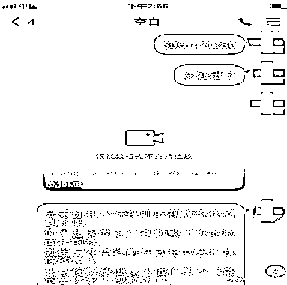

# 先别脱！想想那“姑娘”为啥让你饱眼福？

> 原文：[`mp.weixin.qq.com/s?__biz=MzIyMDYwMTk0Mw==&mid=2247521642&idx=7&sn=2dcc8575520ca13adad562897be39722&chksm=97cb5e52a0bcd7449942ba7c2d1db8d8b4cdad7a4719cf384d114c9ad1ef8af3ab1d7ec7f829&scene=27#wechat_redirect`](http://mp.weixin.qq.com/s?__biz=MzIyMDYwMTk0Mw==&mid=2247521642&idx=7&sn=2dcc8575520ca13adad562897be39722&chksm=97cb5e52a0bcd7449942ba7c2d1db8d8b4cdad7a4719cf384d114c9ad1ef8af3ab1d7ec7f829&scene=27#wechat_redirect)

    网络裸聊敲诈类诈骗，是指诈骗分子通过技术手段获取受害人手机通讯录信息，诱使受害人通过裸露身体进行视频聊天，录制或伪造受害人裸聊过程的视频、照片，以此威胁进行敲诈勒索的犯罪行为。

网络裸聊敲诈类诈骗案件的受害人绝大多数为**男性**，年龄主要集中在**20 岁至 40 岁**之间，生活背景主要为**单身未婚、离婚丧偶、经常出差**的男性。

**王先生出差期间，有一个使用美女照片为头像的陌生 QQ 要求添加好友。加好友后对方称可进行裸聊，但需要王先生下载一个 APP，通过该 APP 点赞刷好评。**

王先生当即答应，并下载安装 APP，后通过 QQ 与对方视频聊天，对方给其播放一段黄色录像......

**事后，对方发送王先生的手机通讯录截图，以及 PS 王先生的色情图像，称需要花 2 万元才会删除通讯录及色情视频。王先生打款 2 万元后，对方又称需要支付 3 万元封口费，王先生随即报警。**

**诈骗步骤**

**第一步：制造艳遇。**诈骗分子使用美女头像，在微信、QQ、探探等常用的网络社交软件注册账号，以男性网友为目标，通过搜索附近人、发布小广告等方式添加好友，制造艳遇。

**第二步：言语诱惑。**诈骗分子通过朋友圈、QQ 空间等平台，展示穿着暴露、行为火辣的照片、视频，包装成年轻时尚、热情开放的美女形象，不断发送挑逗话语，例如“小哥哥在干嘛”“交个朋友吧”“聊天吗？很开放的那种”等进行勾引。

**第三步：开始裸聊。**诈骗分子发送事先准备好的裸聊视频，或者假份女性进行裸聊， 诱惑受害人也裸露身体进行裸聊。

**第四步：下载软件。**诈骗分子以各种理由诱导受害人下载安装来源不明的陌生 APP。理由包括自己正在该 APP 开直播，需要点赞刷好评。通过该 APP 裸聊更高清。该 APP 可以玩更刺激的项目等。

**第五步：获取信息。**来源不明的陌生 APP 会主动要求获取事主手机通讯录的访问权限，或暗中抓取事主手机通讯录信息。这是诈骗分子实施该类犯罪最重要、最关键的一个步骤。

**第六步：发送影像。**诈骗分子发送受害人裸聊视频或照片，以及受害人手机通讯录号码截图。即使受害人没有裸聊，诈骗人员也会通过 PS 等方式伪造受害人的裸聊视频或照片。

**第七步：敲诈勒索。**诈骗分子以将裸聊影像照片发送至通讯录亲朋为由进行敲诈，承诺收到钱会删除资料。发送收款二维码或者银行账号，要求受害人转账。

**第八步：连环敲诈**。多数受害人为了不让“丑事”外传，会选择破财消灾，并不报警。诈骗人员并不删除资料，继续敲诈，逼迫转钱，直至把受害人支付宝、借呗、银行卡内的钱财敲诈干净。

**友情提醒** 

**不加**：不要轻易添加网络陌生人为好友。打拼的单身青年通常工作忙碌，无时间谈恋爱，在加紧时间找对象成家立业时，要注意方式方法，现实中真爱可遇不可求，更别说在网络虚拟空间里，遇到真爱概率更小。

**    不装**：不随意安装来源不明的 APP 软件。日常网上社交活动中，首先要自觉提高警惕，以免不法分子有可乘之机。不要轻易相信对方的谎言，也不要随意安装陌生人发来的 APP 链接。通过 APP 软件抓取手机通讯录信息是该类案件实施过程中最为关键的一步，一旦遇到类似的“裸聊”诈骗事件，一定要冷静分析，坚决不安装陌生来电的 APP 软件。

**不聊**：不要随意跟陌生网友聊天，尤其是视频聊天。遇有声称能够视频聊天甚至是视频裸聊的，更是远离。要提高自己的思想品质修养，洁身自好，主动远离网络裸聊。

**不删**：不要轻易删除手机数据，冷静保留证据。以“裸聊”等方式进行敲诈勒索的嫌疑人不会留给事主太多思考和判断的时间，通常是连环出招，事主很容易被套路，在极度恐慌状态下向对方转账。事后越想越怕，极易删除手机内的聊天记录、APP 软件安装包、手机通话记录等数据线索。一旦出现被裸聊诈骗的情况，要冷静保存好所有相关聊天记录，不冲动，不隐藏，不删除，立即打 110 电话报警，将相关证据交予警方处理，便于警方及时掌握开展打击，要相信公安部门一定会严密保护公民的个人隐私。

来源：南通反诈，阻击诈骗

← 向右滑动与灰产圈互动交流 →

