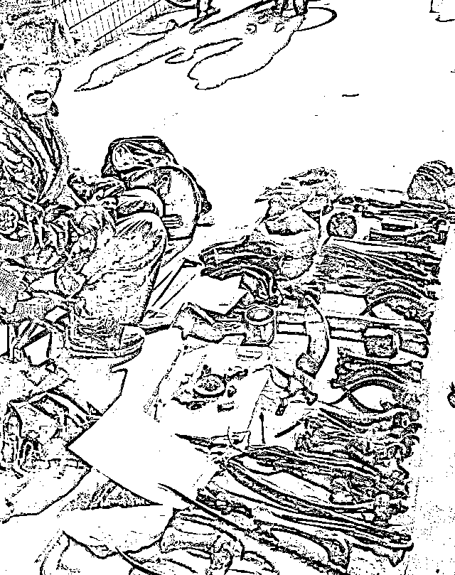
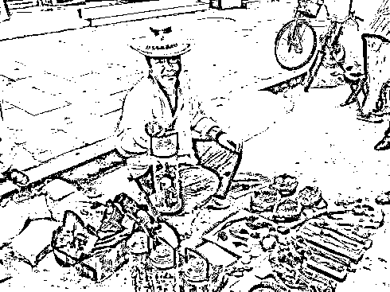
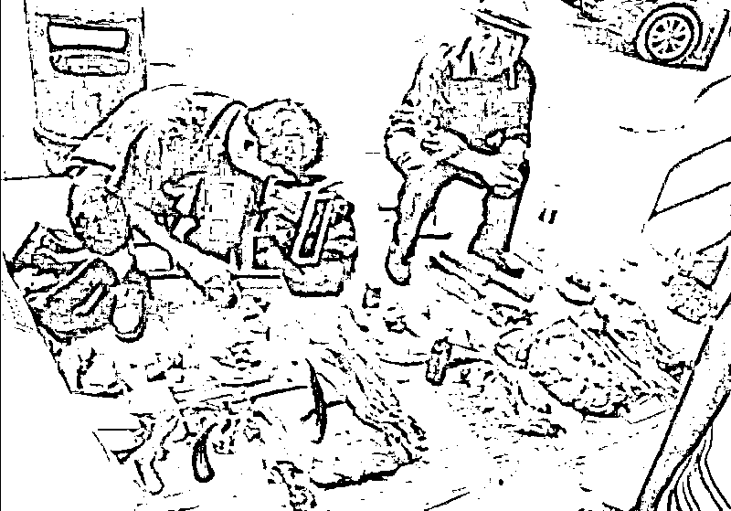
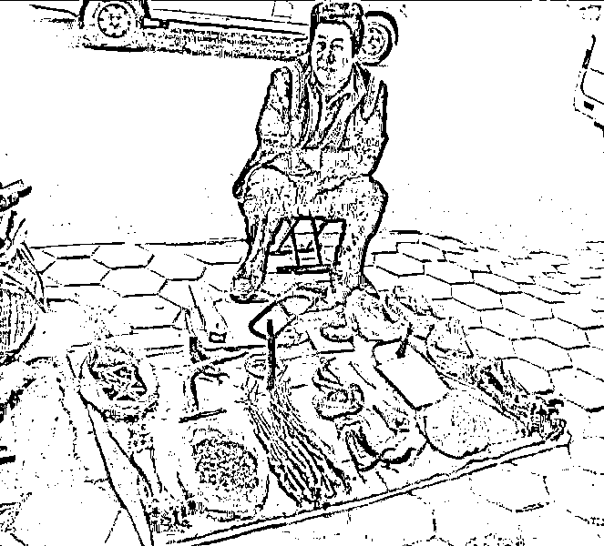
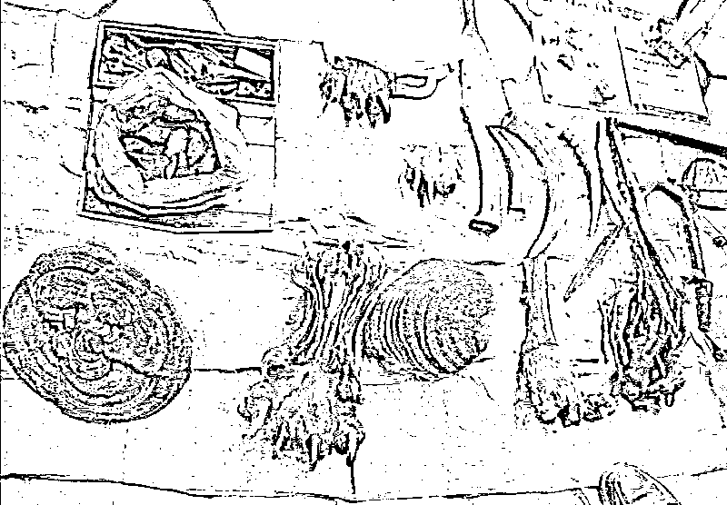
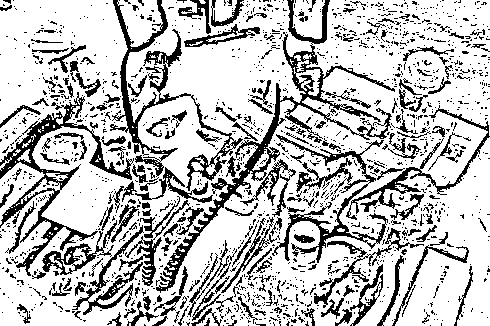
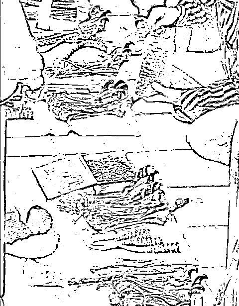
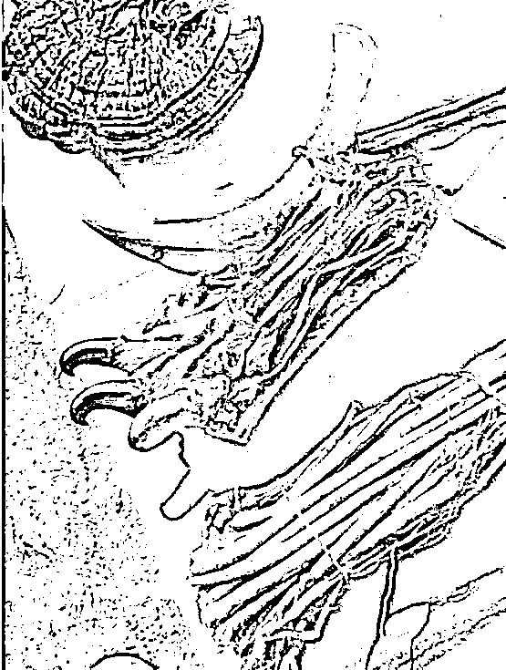

# 揭秘江湖中卖假虎骨、假羚羊角、假虎鞭骗术，以及它的制作方法

> 原文：[`mp.weixin.qq.com/s?__biz=MzIyMDYwMTk0Mw==&mid=2247521693&idx=4&sn=2b4cc195ee43dbd0cfab01fd2c82bb73&chksm=97cb5ea5a0bcd7b396d2cba25d0ec403ff0a4e209851bab9863e29d688898b80241cd7856c97&scene=27#wechat_redirect`](http://mp.weixin.qq.com/s?__biz=MzIyMDYwMTk0Mw==&mid=2247521693&idx=4&sn=2b4cc195ee43dbd0cfab01fd2c82bb73&chksm=97cb5ea5a0bcd7b396d2cba25d0ec403ff0a4e209851bab9863e29d688898b80241cd7856c97&scene=27#wechat_redirect)

在上世纪八九十年代，经常可以在街头看到一些“藏民”打扮的男子，腰胯“藏刀”，卖“虎骨”、“虎鞭”和“羚羊角”，有些还代卖其他“药材”。“卖虎骨”的人，大都席地而坐，面前铺着一块布，“虎骨”及其他“药材”放在布上。

图片来自网络

这些卖“虎鞭”、“虎骨”的“藏民”，少则二三人，多则四五人一群。他们在叫卖时，用“藏刀”不住的在人眼前晃，怪吓人的。他们自己好像也以此取乐，笑着用生硬的语调说：“这是我们藏民防身用的，不会伤害你们，我们藏民和你们汉民是一家人”这话听着到是一家人说的话。

“藏民”当然是假的，他们的“藏民装束”按江湖话说是“样色”，而他们卖的“虎骨”、“虎鞭”、“羚羊角”也绝不会是真的，这类人在江湖中欺骗性很大，上当受骗的人也非常多。下面我就揭秘他们骗人的“把戏”，和假“虎骨”、“虎鞭”、“羚羊角”的制作方法。

图片来自网络

看，卖假“虎骨”的人开始“叫卖”了：

他剪有一篇不知何年何月《人民日报》上的文章，题目是《重视对藏医藏药的经验总结》。他自己身着“藏装”，腰配“藏刀”，很快就形成了热闹的围观场面。“卖虎骨”的人就以《人民日报》文章的话题，宣传他的“虎骨”和“虎鞭”。

“以前只有你们汉民到我们家乡去收虎骨、虎鞭和羚羊角。我们不敢到你们汉人的地方来卖，怕你们人多欺负我们，现在政策好，各民族一律平等，还要向我们藏医、藏药学习。你们要学，我们就把经验讲给你们听，我们西藏老虎多，老虎喜欢吃羊，大草原老虎多，你们这里没有老虎，没有羊老虎，全饿死了。现在，就连你们的药店里，也没有虎骨卖。”（西藏没有虎，笔者只是述说卖假虎骨人的销售方式，朋友们不要较真）

图片来自网络

有些围观的人还真的以为他不了解内地的情况，特地告诉他：“我们这里连死老虎也没有。”“卖虎骨”的人说：“死老虎也没有，怪不得虎骨贵。我们卖的便宜，你给我 20 元，我给你这么多。和收购的价钱一样，我们不是为了赚钱，是向你们讲经验。”

说了“老虎”又接着说“藏羚羊”：

“我们那里羚羊多，大草原，羊群多，羚羊和羊群混在一起，和母羊交配，生下的羊羔不好，肉不好吃。我们捉羚羊，你们捉不到，羚羊跑得快，骑着马也追不上，我们用绳子套，一套就套到。羚羊的角是宝贝，别的东西都没用，肉不好吃，喂狗。羚羊角是宝贝，发高烧，磨点水，喝下就好，我们藏民发烧不打针，吃羚羊角，喝点水就好。”

其实，他卖的“羚羊角”至多是“黄羊角”，说不定就是普通的“山羊角”或“绵羊角”。

图片来自网络

经“卖虎骨”的人这么一说，有几个贪便宜的人已经要买了。他却故意卖起了“关子”。“现在卖假货的人很多，我要试验给你们看，是真的，我才卖，没有试验过，我不卖给多少钱，我也不卖，我们藏民不骗人。”

眼看送上去手的钱他不急于拿，正如江湖经所说：“是生意跑不了，不是生意招不来。”变成“江湖话”就是：“正点跑不了，花点招不来。”

先试验“虎鞭”，他拿起一根“虎鞭”，剥去一些“表皮”，露出“虎鞭”上一个个倒刺。他对大家说：“只有虎鞭上有倒刺，别的什么鞭也没有。老虎交配，母老虎很舒服。完事拔出来，母老虎很疼，有倒刺，母老虎咬雄老虎，雄老虎吓得跑。我们藏民把凶的女人叫母老虎。”他把在生活中广为流传的俗语，用生硬的语调讲出来，就变成了藏族的风土人情，逗着听的人直乐。还有的人特地告诉他，我们这里叫“雌老虎”。“卖虎骨”的人说：“母老虎和雌老虎一样，我们藏民和你们汉民一样。”

图片来自网络

“虎鞭”上有到刺，这是真的，这是“猫科动物”普遍的现象。

这时“卖虎骨”的人，拿出一瓶白酒，自己先喝一口，再给围观的人看，证明是普通白酒。在一只小酒杯里倒半杯白酒，切下一小片“虎鞭”，轻轻的在酒杯里蘸一下，只见从“虎鞭”上垂下一条“红线”，一直通到杯底，经久不散。

“卖虎骨”的人开口了：“这就是真虎鞭，我卖的可不是假货，请大家拍个手。”大家，果然听他的话鼓掌。“为什么会有一条红线？精血、精血，精就是血，血就是精，老虎的精血壮，虎死了，虎鞭里的精血还不散，所以虎鞭能壮阳、治阳痿。没有病的人可以补精血，不信请再闻闻这酒，一股虎鞭的香气。”

图片来自网络

很多人闻后都点头，表示有“虎鞭”的“香气”。

“卖虎骨”的人接着说：“这酒只能闻，我不请诸位喝。不是我小家子气，舍不得这点虎鞭酒，哪位要带回去喝，我奉送。为什么在这里不能喝？这玩意壮阳。热天衣服穿的单薄，怕你喝过回不了家。不是喝醉，是难看，警察把你抓住搜查，说你裤子里藏着手枪。”

试验过“虎鞭”再试验“羚羊角”。切下两片“羚羊角”，放入酒杯里，过一会儿酒就变成了红色。酒是白酒，“羚羊角”是黄色的，酒怎么会变成红色的呢？“卖虎骨”的人这样解释：

图片来自网络

“羚羊是西藏草原上跑的最快的动物，跑得快，身体的热度高，人跑得快出汗，热度跟汗跑了。羚羊这家伙不出汗，他身上的热全从两个犄角上冒，所以羚羊角能退热。”

这是任何科学家、医学家都没有发现的理论，全被“卖虎骨”的人发现了。不得不佩服他说谎的能力，尤其是佩服他那理直气壮的说谎的勇气。一般人说谎总有点胆怯，“卖虎骨”的人却说的谎毫无荏色。大概说的次数多了，从他“师傅”口中接下来说，重复了千万次，连他自己也以为是真话了。

不过，这只说了“羚羊角”怎么会退烧，还没说明“羚羊角”为什么放在白酒里会发红。别急，他还在说下去：

图片来自网络

“羚羊这家伙很凶，连老虎都伤不了，他主要靠一双角。老虎要吃他，他就用头猛的往山上一撞，再硬的石头也能被他撞出两个洞。老虎一看，我的妈呀！我这虎皮没有石头硬，趁早走，这块肉不是我吃的！羚羊的角怎么会有这么大的劲？因为羚羊从小到大吃的营养，大部分长到角上了。羚羊没事还喜欢互相舔角，你替我舔，我替你舔，这叫互相帮助，把自己身体里的营养往对方角上舔（亏他没说羚羊是自己舔自己的角）。羚羊角泡酒，为什么发红？是营养多、血气旺，所以羚羊角能补身子。”

最后试验“虎骨”，“虎骨”白色的，泡酒也能发红，自然也是因为“虎骨”的“血气旺”，所以能舒筋活血。

图片来自网络

“这些东西在你们这里全是宝贝，我们大草原上多，老虎自己打的，羚羊自己套的，卖的便宜。便宜，多少钱一两？我没有秤，你给我二十元，我锯一段给你。虎骨、虎鞭都可以。你给我十元钱，我就少给你一点。买十元比买二十元给的多，我又不是傻子。买五元？买五元不卖，太少了，给你治不好病，补不了身子，浪费。”

“有人说我全买下，给多少钱不卖。你买去卖高价，发财。我要卖给很多人，多交朋友，藏民、汉民是一家。有人说，你自己想发财。发不了财，我们全家一年才打一只虎，几个羚羊，买四五千块钱。我住旅馆要钱，吃饭要钱，我们藏民喜欢喝酒、吃肉，你们这里东西贵，一天要花 100 多元，还有路费，回家带不了多少钱回家。我这个人喜欢玩，各处去玩，吃光用光，要钱没有用。”

图片来自网络

就这样，“卖虎骨”的人一个上午在一个地方，一边说一边卖，就能卖几百元，这在八九十年代可是一笔不小的钱呀。与其说他是在“卖虎鞭”、“虎骨”、“羚羊角”，倒不如说他卖的是“谎言”，怪不得他不用“称秤”，谎话是不能用“秤称”的。

“假虎骨”的制作方法

其实，“卖虎骨”的人卖的是“骆驼腿骨”，因为“虎腿”是“三节骨”，而牛、马、驴、骡的腿骨只有两节，唯独“骆驼”的后腿骨，也是三节。“老虎爪子”是用牛角刻成的，之后，用万能胶把“牛筋”和“骆驼骨”粘牢，再用一张“黄狗皮”或者“黄猫皮”将连接处裹住，用胶粘上，这就是“虎骨”。一定要有“虎爪子”，不然人家不相信是“虎骨”。要想加工的再像一些，还可以用染发水染出虎纹。

图片来自网络

之后备好炭火，慢慢的熏烤，烤出骨内的油，把“牛筋”和“骆驼骨”、“虎爪”烤在一起，这样“虎骨”便做成了。

“假羚羊角”的制作方法

这个就不用多说了，就是用普通的“山羊角”，再用锉刀锉成奇形怪状，这就成了“羚羊角”。

“假虎鞭”的制作方法

“虎鞭”就是“牛鞭”，“牛鞭”本不稀奇，但加工工艺复杂，所以要卖的贵，一根“虎鞭”在当时至少要卖五六百元。而且也不能卖的便宜，这么珍贵的东西，不卖大价钱，买的人反而怀疑。

图片来自网络

将新鲜“牛鞭”买来后先晒干，然后将表皮剥离，再剥掉表皮的干海绵体上，用雕刻刀，刻出无数个排列整齐的“倒刺”，再把剥下的表皮裹上，用胶水粘牢。这样一根价五六百元的“虎鞭”，就制作成功了。

“假虎鞭”、“虎骨”、“羚羊角”会使白酒变红，特别是“虎鞭”，在白酒中一蘸，就能在酒中垂下一条“红线”，经久不散，这些神奇又是怎么回事儿呢？

“白酒变红”，“垂下红线”，在江湖中称为“红彩”，都穿了是一件极其简单的“伎俩”。用“大黄苏打”和“油”，涂在“虎鞭”上，蘸水蘸酒都会垂下一条“红线”。往“羚羊角”中塞入“竹簧”，入酒就会变红。“虎骨”里面也是加入了“竹簧”。除此以外，江湖中“红彩”的伎俩，少说也有十几种。朋友们知道这些“卖虎骨”、“羚羊角”的人的作假手段，就可以了。至于其他的“红彩”伎俩，我就不一一述说了。

来源：吟啸独行人 1N3q，利箭在行动

← 向右滑动与灰产圈互动交流 →

